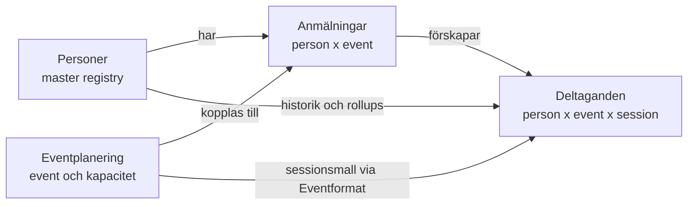

# 04 — Worldclass Research

> **Status:** Fas 1 (Baseline) klar. Fas 2 (Research) klar för Gate 2.
>
> **Källprincip:** Detta är en designbar sammanfattning av frusen baseline, inte ny live-extraktion. Vid konflikt gäller live-state och arbetsdokumentets 2026-04-29-korrigeringar före äldre dokumentation.

## Del 0 — Baseline & Constraint Map (Fas 1)

### B1 — Domänkarta

#### Kärndomäner

**Personer** finns för identitet, relation och historik. En rad representerar en unik person, matchad primärt via e-post, och samlar anmälningar, deltaganden, touchpoints, hämtade erbjudanden och rollups. Viktiga fält är namn, e-post, telefon, Anmälningar, Deltaganden, RIM 1/2/3-räknare, Fjärrskådning, Antal genomförda event, Återkommande?, Har en aktiv anmälan?, AI-flagga och mailutskicksflaggor. Källa: `docs/data-model.md:63`, `docs/data-model.md:96`, `docs/data-model.md:243`, `docs/data-model.md:285`, `docs/data-model.md:367`, `docs/data-model.md:522`, `docs/hur-systemet-funkar.md:65`, `docs/hur-systemet-funkar.md:177`.

**Anmälningar** finns för bokningen: vem som har anmält sig till vad, status, betalning, källa, mailhistorik, antal platser, EventKey, Person-länk och Event-länk. En rad är person x event, inte bevis på faktisk närvaro. Viktiga relationer är Person, Event, Deltaganden och self-linken Medföljande till. Källa: `docs/data-model.md:63`, `docs/data-model.md:90`, `docs/data-model.md:173`, `docs/data-model.md:522`, `docs/hur-systemet-funkar.md:65`.

**Deltaganden** finns för faktisk närvaro. En rad är person x event x session, och `Status` driver `Närvaropoäng`, kursräknare, genomförd-historik och badges upp till Personer. Viktiga fält är Anmälan, Event, Person, Session, Status, Avstämt, Närvaropoäng och eventkey-formlerna för RIM 1/2/3 och Fjärrskådning. Källa: `docs/data-model.md:65`, `docs/data-model.md:102`, `docs/data-model.md:233`, `docs/data-model.md:415`, `docs/data-model.md:461`, `docs/hur-systemet-funkar.md:107`.

**Eventplanering** finns för event, kapacitet, status, datum, plats, sessionsmall och operativa knappar för närvaro. Viktiga fält är Eventlabel, EventKey, Status, Max antal platser, Manuella/Extra/Arrangörsplatser, beläggning, Eventtyp, Sessionsmall, Check-in session och Markera alla närvarande. MK-eventet är `recQ2TPsY69fQXA8a`, 1–3 maj 2026, max 88 platser. Källa: `docs/data-model.md:61`, `docs/data-model.md:82`, `docs/data-model.md:217`, `docs/data-model.md:336`, `analys/02-live-state.md:73`, `docs/hur-systemet-funkar.md:97`.

#### Stöddomäner

| Domän | Tabeller | Varför den finns | Viktiga relationer / fält |
|---|---|---|---|
| Eventformat | Eventformat | Definierar sessionsmallar som Eventplanering slår upp och A3 använder när Deltaganden förskapas. | Eventplanering.Eventtyp -> Eventformat.Format. Källa: `analys/02-live-state.md:330`, `docs/data-model.md:217`. |
| Väntelista | Väntelista | Tar emot personer när event är fullt eller när de ska vänta före anmälan. Raden ligger kvar som historik efter flytt. | `Flyttad till anmälan`, `Informationsmail 1 skickad`, UTM-fält, `create-waitlist-entry`, `get-waitlist`. Källa: `docs/data-model.md:202`, `docs/data-model.md:873`, `docs/data-model.md:1192`, `docs/hur-systemet-funkar.md:246`. |
| Lead magnets | Erbjudanden, Hämtade erbjudanden, Engagemang | Fångar gratismaterial och intresse innan kursanmälan. | A4 kopplar Hämtade erbjudanden till Personer och Erbjudanden; A5 uppdaterar Engagemang. Källa: `docs/data-model.md:289`, `docs/data-model.md:718`, `docs/hur-systemet-funkar.md:163`. |
| CRM/kontakt | Touchpoints, Kontaktlogg (rådata) | Loggar händelser och kontaktpunkter kring personer. | A2 och A4 skapar Touchpoints; Personer länkar till Touchpoints och Kontaktlogg. Källa: `docs/data-model.md:289`, `analys/02-live-state.md:358`, `analys/02-live-state.md:378`. |
| Bulkmail | Bulkutskick, Segment, Utskickslogg, Email Opens | Segmentering, utskick, öppningsgrad och historik. | Segmentformel, Utskickslogg, Email Opens, Bulkutskick.Status. Källa: `docs/data-model.md:289`, `analys/02-live-state.md:381`, `analys/02-live-state.md:390`, `analys/02-live-state.md:396`. |
| Systemstöd | Error-log, Path to Conversion, Instagram Posts | Felspårning och två tomma strukturella behållare. | A2 skriver Error-log vid dubblettfall. Path to Conversion och Instagram Posts har bara `Name`. Källa: `docs/data-model.md:72`, `docs/data-model.md:77`, `docs/data-model.md:298`, `analys/02-live-state.md:393`. |

### B2 — Driftkarta

| # | Constraint | Varför hård | Vad händer vid brott | Källa |
|---:|---|---|---|---|
| C1 | MK-eventet 1–3 maj 2026 är skarp drift; inga schemaändringar i Airtable under MK. | Eventet ligger i närtid och är produktionskritisk drift. | Rapportering, väntelista, mail och närvaro kan brytas mitt under eventet. | `tasks/datamodell-research-direktiv.md:38`, `tasks/datamodell-research-plan.md:69`, `tasks/datamodell-research-plan.md:639` |
| C2 | MK-recordet `recQ2TPsY69fQXA8a` och dess Deltaganden ska behandlas som skyddade data. | Backfillen använde explicit spärr för MK och verifierade att den höll. | Cleanup/migration riskerar att ändra framtida eventdata som ännu inte ska markeras. | `docs/data-model.md:84`, `docs/data-model.md:402`, `docs/data-model.md:1258` |
| C3 | Lottas fem huvudworkflows måste bevaras: anmälan, fullbokat/väntelista, närvaro, kurshistorik och lead-magnet. | `hur-systemet-funkar.md` är affärslogiken som ska fortsätta fungera efter redesign. | En tekniskt elegant modell kan ändå förstöra vardagsdriften. | `docs/hur-systemet-funkar.md:77`, `docs/hur-systemet-funkar.md:97`, `docs/hur-systemet-funkar.md:107`, `docs/hur-systemet-funkar.md:151`, `docs/hur-systemet-funkar.md:163` |
| C4 | A1-A3-kedjan måste skapa komplett ny anmälan: Event-länk, Person-länk, Deltaganden. | Detta är grundflödet för alla nya bokningar. | Föräldralösa Anmälningar, inga Deltaganden, tom kurshistorik och manuellt reparationsarbete. | `docs/data-model.md:683`, `analys/01-extraction.md:179`, `analys/01-extraction.md:199`, `analys/01-extraction.md:235` |
| C5 | A2:s grenordning är en öppen hypotes och får inte antas vara säker i reverse-flow. | Namnlös lead-Person kan trigga Gren 1 och lämna Anmälan.Person tom. | A3 triggas inte, Deltaganden skapas inte, A11 kedjar inte. | `docs/data-model.md:557`, `docs/data-model.md:597`, `docs/data-model.md:1319` |
| C6 | A4-A5 lead-magnet-kedjan måste bevara namnlösa Personer som normalt lead-state. | Namnlösa Personer är leads, inte skräp. | Radering eller placeholders bryter framtida matchning och A2:s namnkomplettering. | `docs/hur-systemet-funkar.md:177`, `docs/data-model.md:718`, `docs/data-model.md:1110` |
| C7 | A6 fullbokat-notis beror på beläggningslogiken. | Roger/Lotta behöver få signal när event når 100% beläggning. | Nya anmälningar kan fortsätta trots fullbokat läge utan operativ varning. | `docs/hur-systemet-funkar.md:97`, `docs/data-model.md:742` |
| C8 | A7 triggar vid varje Anmälningar-uppdatering, inte bara betalning. | Massuppdateringar kan få breda sidoeffekter. | Prestanda-/rate-limit-risk och oavsiktlig omsynk av ej betalda-records. | `docs/data-model.md:750`, `docs/data-model.md:1088` |
| C9 | A8-A10 närvaroflödet måste fortsätta sätta Status och Avstämt på Deltaganden. | Kurshistorik och rapporter bygger på Deltaganden.Status. | Personer visar 0 genomförda event, fel erfarenhetsnivå och tomma rapporter. | `docs/hur-systemet-funkar.md:107`, `docs/hur-systemet-funkar.md:231`, `docs/data-model.md:756`, `docs/data-model.md:786` |
| C10 | A11 kopierar Anmälan.Person till Deltaganden.Person. | Deltaganden behöver en explicit Person-länk för downstream-historik. | Deltaganden blir svåra att koppla tillbaka till person och rollups/insikter riskerar att bli fel. | `docs/data-model.md:778`, `analys/01-extraction.md:331` |
| C11 | Edge Functions för MK är delvis hårdkodade till Event-17/MK. | `create-registration` och `create-waitlist-entry` är produktionsflöden för detta event. | Parameterisering eller schemaändring kan flytta anmälningar till fel event eller dubblettskydda fel nyckel. | `docs/data-model.md:832`, `docs/data-model.md:873`, `analys/01-extraction.md:656`, `analys/01-extraction.md:693` |
| C12 | `send-email` + Resend + PATCH måste särskilja "mail skickat" från "Airtable uppdaterad". | DQ8 är ett tyst fail-mode. | Lotta kan skicka om mail i tron att första försöket misslyckades. | `docs/data-model.md:940`, `docs/data-model.md:993`, `docs/data-model.md:1186`, `docs/hur-systemet-funkar.md:224` |
| C13 | Väntelista -> Anmälningar är inte transactional. | Flytten är POST create-registration följt av PATCH på Väntelista. | Personen kan bli både anmäld och kvar på väntelistan. | `docs/data-model.md:651`, `docs/data-model.md:1192`, `docs/hur-systemet-funkar.md:246` |
| C14 | Zapier-kedjan är primär extern write-path för formulär: 10 Zaps totalt, 6 aktiva skriver till Airtable. | Arbetsdokumentet korrigerar äldre hypoteser: 0 native Airtable-webhooks, Make.com reaktivt. | Migration/design missar Elfsight -> Zapier -> Airtable och bygger ofullständig ingest-modell. | `tasks/sessions/2026-04-28-datamodell-research-projekt.md:52`, `tasks/sessions/2026-04-28-datamodell-research-projekt.md:71`, `tasks/sessions/2026-04-28-datamodell-research-projekt.md:326` |
| C15 | DQ4 är Zapier-config-skuld, inte formulärdata-skuld. | Hasharna är verifierat hårdkodade i Zap 5 och Zap 6 enligt arbetsdokumentet. | Fel åtgärd riktas mot formulär/export i stället för Zapier-konfig och migrationstransform. | `tasks/sessions/2026-04-28-datamodell-research-projekt.md:52`, `tasks/sessions/2026-04-28-datamodell-research-projekt.md:110`, `tasks/sessions/2026-04-28-datamodell-research-projekt.md:326` |
| C16 | Airtable basen får inte skrivas till i detta projekt. | Projektet är research/design/plan, inte implementation. | Förändringar kan påverka MK och bryta frusen baseline. | `tasks/datamodell-research-direktiv.md:23`, `tasks/datamodell-research-direktiv.md:34`, `tasks/datamodell-research-plan.md:30` |

**Preliminär off-limits-lista före MK:** schemaändringar i alla tabeller; ändringar i A1-A11; ändringar i Zapier/Elfsight ingest; ändringar i Resend-mallar och `send-email`; massuppdateringar/cleanup av Personer, Anmälningar, Deltaganden, Eventplanering och Väntelista; radering av gamla `Antal genomförda event`-fält; ändringar i MK-recordet eller dess Deltaganden. Detta är en Gate 1-bedömning, inte ett Marcus-beslut.

### B3 — Skuldregister

| ID | Beskrivning | Källa | Preliminär klass | Kommentar |
|---|---|---|---|---|
| DS1 | `Är aktiv (1/0)` exkluderar inte Inställt. | `tasks/sessions/2026-04-28-datamodell-research-projekt.md:95`; `docs/data-model.md:1170` | Airtable fix | Driftkritisk rapportskuld. |
| DS2 | `Återkommande?` betyder inte "har gått kurs tidigare". | `tasks/sessions/2026-04-28-datamodell-research-projekt.md:96`; `docs/data-model.md:574` | Airtable preserve + rename | Fältet kan vara användbart men namnet vilseleder. |
| DS3 | Dead branches i Erfarenhetsbadge. | `tasks/sessions/2026-04-28-datamodell-research-projekt.md:97`; `docs/data-model.md:510` | Airtable fix eller Supabase target | Beror på hur erfarenhetsmodell designas. |
| DS4 | Gammal total missar RIM 3. | `tasks/sessions/2026-04-28-datamodell-research-projekt.md:98`; `analys/02-live-state.md:246` | Airtable cleanup | Ska inte ligga kvar som aktiv sanning. |
| DS5 | Parallella `Antal genomförda event`-fält. | `tasks/sessions/2026-04-28-datamodell-research-projekt.md:99`; `docs/data-model.md:1176` | Airtable cleanup | Konsumentsök behövs efter MK. |
| DS6 | RECORD_ID-bug i Deltaganden. | `tasks/sessions/2026-04-28-datamodell-research-projekt.md:100`; `analys/01-extraction.md:364` | Supabase target | Formel-bug/döda fält i Airtable. |
| DS7 | A1-A11-versionerna är höga trots oförändrat antal automationer. | `tasks/sessions/2026-04-28-datamodell-research-projekt.md:101` | Defer till Fas 5 | Kräver diff mot automations-export. |
| DQ1 | Case-dubletter i `Vill anmäla sig till`. | `tasks/sessions/2026-04-28-datamodell-research-projekt.md:107`; `docs/data-model.md:1142` | Airtable cleanup + Migration transform | Kanonisering före export. |
| DQ2 | `Manuella flagga` har tomma choices. | `tasks/sessions/2026-04-28-datamodell-research-projekt.md:108`; `docs/data-model.md:1154` | Airtable fix | Trivial strukturrensning efter verifiering. |
| DQ3 | `Systemkälla` har tomma choices. | `tasks/sessions/2026-04-28-datamodell-research-projekt.md:109`; `docs/data-model.md:1154` | Airtable fix | Samma mönster som DQ2. |
| DQ4 | SHA256-hashar i `Källa (formulärkälla)`. | `tasks/sessions/2026-04-28-datamodell-research-projekt.md:110`; `docs/data-model.md:1160` | Zapier-config-fix + Migration transform | Arbetsdokumentet omklassar till hårdkodade Zapier-värden. |
| DQ5 | E-post på Personer är multilineText. | `tasks/sessions/2026-04-28-datamodell-research-projekt.md:111`; `analys/02-live-state.md:193` | Airtable fix eller Migration transform | Typ-skuld med valideringsrisk. |
| DQ6 | Namnlösa Personer som lead-state. | `tasks/sessions/2026-04-28-datamodell-research-projekt.md:112`; `docs/hur-systemet-funkar.md:177` | Airtable preserve + Supabase target | Ska formaliseras, inte raderas. |
| DQ7 | RECORD_ID-bug som datakvalitetsrisk. | `tasks/sessions/2026-04-28-datamodell-research-projekt.md:113`; `docs/data-model.md:1127` | Supabase target | Samma grund som DS6, men risk för export/debug. |
| DQ8 | Mail skickat men PATCH misslyckas tyst. | `tasks/sessions/2026-04-28-datamodell-research-projekt.md:114`; `docs/data-model.md:1186` | Airtable/app fix eller Supabase communication log | Driftkritisk observability. |
| DQ9 | Väntelista -> Anmälningar-flytt ej transactional. | `tasks/sessions/2026-04-28-datamodell-research-projekt.md:115`; `docs/data-model.md:1192` | App/Edge Function fix, Supabase transaction senare | Bör designas bort i target. |
| H1 | A2-grenordning korrekt vid betalning. | `tasks/sessions/2026-04-28-datamodell-research-projekt.md:65` | Verifiera eller lös via redesign | OPEN. Sandbox/test krävs om den ska avgöras empiriskt. |
| H2 | Personer 87 fält behöver splittras. | `tasks/sessions/2026-04-28-datamodell-research-projekt.md:66` | Beslut i S-track-gate | OPEN. Kärnfråga för Supabase target. |
| H3 | EventKey-bug är formel-symptom, inte data-skuld. | `tasks/sessions/2026-04-28-datamodell-research-projekt.md:67` | Supabase target / designa bort | DECIDED (förbi), men H13 preciserar källa. |
| H4 | RECORD_ID()-bug i Deltaganden är formel-bug. | `tasks/sessions/2026-04-28-datamodell-research-projekt.md:68` | Supabase target | DECIDED. |
| H5 | A2 sätter `Person?` på Anmälan i alla 4 grenar. | `tasks/sessions/2026-04-28-datamodell-research-projekt.md:69` | Verifiera i Fas 3 | SUPPORTED men inte bevisad. |
| H6 | SHA256-hashar är form-input-data. | `tasks/sessions/2026-04-28-datamodell-research-projekt.md:70` | REJECTED — ersatt av DQ4-omklassning | Stängd 2026-04-29: hasharna är hårdkodade i Zap 5+6 enligt arbetsdokumentets beslutslogg. Cleanup hanteras via DQ4. |
| H7 | Zapier är primär extern write-path. | `tasks/sessions/2026-04-28-datamodell-research-projekt.md:71` | Kartlägg i Fas 5 | DECIDED (omdefinierad). |
| H8 | `Antal genomförda event (gammal)` kan tas bort. | `tasks/sessions/2026-04-28-datamodell-research-projekt.md:72` | Airtable cleanup post-MK | Kräver konsumentsök. |
| H9 | `RIM 3 ×` ska vara rollup, inte formula. | `tasks/sessions/2026-04-28-datamodell-research-projekt.md:73` | Beslut i Fas 4 | OPEN. |
| H10 | `Manuella flagga` med choices=[] är tom-default-skuld. | `tasks/sessions/2026-04-28-datamodell-research-projekt.md:74` | Airtable fix | Samma område som DQ2. |
| H11 | `Systemkälla` med choices=[] är tom-default-skuld. | `tasks/sessions/2026-04-28-datamodell-research-projekt.md:75` | Airtable fix | Samma område som DQ3. |
| H12 | E-post som multilineText är typ-skuld från tidig design. | `tasks/sessions/2026-04-28-datamodell-research-projekt.md:76` | Airtable fix eller Migration transform | Samma område som DQ5. |
| H13 | EventKey-bug källa är HTML-formulärets URL-template, inte Zap 4. | `tasks/sessions/2026-04-28-datamodell-research-projekt.md:82` | Verifiera template eller designa bort | OPEN. Påverkar ingest/migration. |

## Del 1 — Research (Fas 2)

### R0 — Metod och scope

Detta är principresearch för designfasen, inte en ny Airtable-extraktion. Källorna är valda för att täcka både nuvarande Airtable/no-code-drift och möjlig Supabase/Postgres-target. Vid konflikt gäller live-state och arbetsdokumentets 2026-04-29-korrigeringar före äldre docs. H6 behandlas som **REJECTED**. DQ4 behandlas därför som **config-as-data drift i Zapier-ingest**, inte som form-input-dedup.

Källbredden är medvetet klustrad: officiella Airtable-källor för operativ no-code-modell, officiella Supabase/Postgres-källor för relationsdatabas/target, webhook/idempotency-källor för integrationskanter, observability/audit-källor för driftbarhet, och öppna produktrepoexempel för hur etablerade system modellerar liknande relationer.

### R1 — Principregister

| ID | Princip | Kort definition | Airtable-tillämpning | Supabase/Postgres-tillämpning | Styrande DS/DQ/H |
|---|---|---|---|---|---|
| P1 | Lifecycle-first domain model | Modellera Person, Anmälan, Deltagande, Event och Väntelista utifrån livscykel och ansvar, inte bara efter tabell-/fältvolym. | Bevara Lottas workflows och namnlös lead-state; undvik att "städa" bort normala mellanlägen. | Separera entities/aggregates när invariants kräver det, men splittra inte Personer mekaniskt utan domain-skäl. | H2, DQ6, DS2 |
| P2 | Identity resolution as subsystem | E-postmatchning, normaliserad e-post, alias/merge och ofullständig lead-identitet är ett eget styrt område. | Canonical email och namnlösa Personer ska hanteras med views/automationer som gör matchningsstatus synlig. | Unique/partial indexes, normaliserade kontaktvärden, merge-logg och validerade kontaktfält ersätter ad hoc-matchning. | DQ1, DQ5, DQ6, H1, H5, H12 |
| P3 | Explicit state machines | Statusfält ska ha tydliga tillåtna värden, transitions och konsekvenser; "aktiv", "inställt", "betald", "närvarande" får inte blandas. | Namnge och dokumentera statussemantik i vyer/fält; undvik formler vars namn lovar mer än de gör. | CHECK/enum/reference tables och transition-logik i transaktioner där status driver downstream-effekter. | DS1, DS2, H2 |
| P4 | Derived data as read model | Rollups/formler/caches är läsmodeller, inte primär sanning; varje parallell härledning behöver ägare och konsument. | Rollup/lookup/count används för operativ läsbarhet men får inte bli dolda sanningskällor utan konsumentsök. | Materialized/read models, views eller generated data ska kunna återskapas från kanoniska tabeller. | DS3, DS4, DS5, DS6, DQ7, H4, H8, H9 |
| P5 | Audit before event sourcing | Logga actor/source/time/result för kritiska ändringar och side effects; full event sourcing är övervikt om replay inte är ett konkret krav. | Lägg fokus på förståelig historik för Lotta/Roger, inte abstrakt event-store. | Audit/communication tables i samma transaktion som state change där möjligt; event sourcing bara om Fas 3 visar behov. | DQ8, DQ9, DS7 |
| P6 | Integration edges are products | Varje Zapier/Edge Function/webhook-kant behöver idempotency, source, version, retries, config och dedupe som designobjekt. | Zapier-statiska värden ska behandlas som config-as-data med ägare, inte som "skräpdata" i formulärfält. | Inbox/outbox, idempotency keys, webhook signature checks, retry-logg och transactional boundaries. | DQ4, DQ8, DQ9, H3, H7, H13 |
| P7 | Operational observability | Systemet måste visa vad som hände, var det brast och om side effects är delvis klara. | Error-log/views/statusflaggor ska skilja mail skickat, Airtable PATCH, flyttad väntelista och dubblettfall. | Traces/logs/metrics med correlation ids över frontend, Edge Function, Zapier/webhook och DB-operationer. | DQ8, DQ9, DS7, H7 |
| P8 | Airtable-native ergonomics | Airtable ska designas som ett operativt verktyg för människor: linked records, views, rollups och automations ska vara läsbara och säkra. | Fältstädning, val-listor, views och rollups görs post-MK med låg blast radius. | Migrationen ska inte kopiera Airtable-magi 1:1; den ska bevara vad Airtable gör bra som explicit UX/read models. | DQ2, DQ3, DS5, H10, H11 |
| P9 | Constraint-backed relational target | Supabase-target ska låta databasen äga integritet där det är rimligt: PK/FK/unique/check/RLS/transactions. | Airtable kan dokumentera target-invariants men ska inte tvingas bära allt före MK. | Constraints och RLS är förstaklassdesign, särskilt för Person/Anmälan/Deltagande/Event och framtida multi-tenant. | DS1, DS6, DQ5, DQ7, DQ9, H12 |
| P10 | Tenant/readiness is a gate, not a guess | Multi-tenant-readiness ska bedömas explicit med tenant boundary, RLS och driftmodell; inte smygas in i alla tabeller utan beslut. | Nuvarande Airtable-bas är en operativ single-base reality; inför inte tenant-abstraktion i Airtable före behov/beslut. | Om Supabase ska bära flera kunder/workspaces krävs tenant_id + RLS-policyer + testbar isolation från start. | H2, H7, strategiska G0 |

### R2 — Airtable/no-code-principer

Officiell Airtable-dokumentation stöder att relationer bör modelleras som separata tabeller med linked records när ett workflow har egna objekt och detaljer. Det passar nuvarande kärna: Personer, Anmälningar, Deltaganden och Eventplanering är inte bara olika vyer av samma rad, utan olika operativa objekt. Airtable rollups/lookups/counts är samtidigt uttryckligen beroende av linked records och kan filtreras. Slutsats: i Airtable ska härledd data behållas som operativ läsbarhet, men konsumenter och villkor måste vara synliga innan cleanup.

Viktiga konsekvenser:
- DS3/DS4/DS5/H8/H9 ska bedömas som read-model/fälthygien, inte som skäl att ändra grunddomänen före MK.
- DQ2/DQ3/H10/H11 är lågrisk efter MK om de är bekräftat okonsumerade, men de ska inte blandas ihop med DQ4.
- Airtable API har 5 requests/second/base och returnerar inte tomma fält i API-svar; export/migration måste därför behandla "saknas" och "tomt" försiktigt.

Källor:
- https://support.airtable.com/docs/linking-records-in-airtable
- https://support.airtable.com/docs/rollup-field-overview
- https://support.airtable.com/docs/en/conditional-counts-lookups-and-rollups
- https://support.airtable.com/docs/getting-started-with-airtables-web-api
- https://support.airtable.com/docs/airtable-webhooks-api-overview
- https://airtable.com/developers/web/api/get-base-schema

### R3 — Supabase/Postgres-principer

Postgres-dokumentationen gör constraints till datamodellens integritetslager: primary keys, foreign keys, unique, check och exclusion constraints ska användas när de uttrycker invariant bättre än applikationskod. Supabase bygger vidare på Postgres RLS och säger att RLS ska vara på för tabeller i exponerade schema. RLS är därmed inte en UI-behörighet utan en dataåtkomstmodell. Database Webhooks i Supabase är en bekvämlighetswrapper runt Postgres triggers via pg_net och är asynkrona, vilket gör dem användbara för side effects men inte till ersättning för transaktionsintegritet.

Viktiga konsekvenser:
- DQ9 ska lösas i target som en transaktions-/boundary-fråga, inte som "kom ihåg att patcha väntelistan".
- DQ5/H12 ska bli typed contact/invariant-fråga i target, inte bara Airtable field-type cleanup.
- DS6/DQ7/H4 är tydligt target-bortdesign: RECORD_ID-formelbuggen ska inte migreras som semantik.
- Multi-tenant ska inte antas, men om den väljs kräver den explicit tenant boundary och RLS-testning.

Källor:
- https://www.postgresql.org/docs/current/ddl-constraints.html
- https://www.postgresql.org/docs/current/ddl-rowsecurity.html
- https://www.postgresql.org/docs/current/triggers.html
- https://supabase.com/docs/guides/database/postgres/row-level-security
- https://supabase.com/docs/guides/database/webhooks
- https://supabase.com/docs/guides/database/joins-and-nesting

### R4 — Integration, idempotency och config-as-data

Stripe visar den etablerade retry-principen: klienten skickar idempotency key så samma operation kan upprepas utan dubbel side effect. GitHub webhook-dokumentation betonar secret/signature-validering och tydlig hantering av deliveries. Supabase Database Webhooks och Postgres triggers visar samtidigt att externa side effects ofta ligger utanför huvudtransaktionen. För Miranon betyder det att integrationer behöver egna dataobjekt: event/source, config version, payload, idempotency key, processing status, retry count, last error och resultat.

DQ4 hör hemma här. Hashvärdena i `Källa (formulärkälla)` är enligt arbetsdokumentets 2026-04-29-korrigering hårdkodad Zapier-config i Zap 5+6. Rätt researchfråga är därför config-as-data drift: hur statisk integration-config blir data och hur migrationen kan kanonisera den utan att skylla på formulär-input.

Viktiga konsekvenser:
- H7/Zapier ska modelleras som primär extern write-path tills Fas 5 säger annat.
- H3/H13 ska behandlas som ingest-template/config-frågor, inte som allmän datahygien.
- DQ8/DQ9 kräver side-effect-status och transaction/retry-design.

Källor:
- https://docs.stripe.com/api/idempotent_requests
- https://docs.github.com/en/webhooks/using-webhooks/validating-webhook-deliveries
- https://docs.github.com/en/webhooks/using-webhooks/handling-webhook-deliveries
- https://supabase.com/docs/guides/database/webhooks
- https://www.postgresql.org/docs/current/trigger-definition.html
- https://airtable.com/developers/web/api/webhooks-overview

### R5 — Audit, historik och observability

Fowler skiljer enkel Audit Log från tyngre temporal/event sourcing-mönster: audit log är enkelt och nyttigt men blir svårare att fråga när historiken blir central affärslogik. Event sourcing ger replay och djup felsökning men ska bara väljas om systemet faktiskt behöver att state härleds från events. OpenTelemetrys observability-primer ger rätt driftkrav: traces, metrics och logs ska göra systemet felsökningsbart utan ny instrumentation.

Viktiga konsekvenser:
- Miranon behöver audit/communication log för mail, betalning, väntelista, Zapier-ingest och personmatchning.
- Full event sourcing/CQRS är ett anti-pattern här tills Fas 3 hittar ett konkret replay-behov.
- DQ8 är inte bara en buggrisk; det är frånvaro av state för en delvis lyckad side effect.

Källor:
- https://martinfowler.com/eaaDev/AuditLog.html
- https://martinfowler.com/eaaDev/EventSourcing.html
- https://opentelemetry.io/docs/concepts/observability-primer/
- https://opentelemetry.io/docs/what-is-opentelemetry/
- https://docs.sentry.io/product/sentry-basics/tracing/

### R6 — Domain modelling och identity

DDD-källorna används här pragmatiskt, inte dogmatiskt: entities har identity, value objects saknar egen identity, och aggregates ska skydda invariants. För Miranon pekar det på att Personer inte ska splittras bara för att tabellen har 87 fält. Split ska bara ske där livscykel, access, historik eller invariant skiljer sig. Däremot är Person identity resolution sannolikt ett eget subsystem eftersom namnlösa leads, normaliserad e-post, case-dubletter och A2-grenordning styr om anmälningar får korrekt Person-länk.

Viktiga konsekvenser:
- H2 är fortfarande OPEN till Fas 3, men "87 fält" räcker inte som designargument.
- DQ6 ska preserve/formaliseras som lead lifecycle.
- DQ1/DQ5/H1/H5/H12 hör ihop i en identity-resolution cluster.

Källor:
- https://learn.microsoft.com/en-us/dotnet/architecture/microservices/microservice-ddd-cqrs-patterns/net-core-microservice-domain-model
- https://learn.microsoft.com/en-us/dotnet/architecture/microservices/microservice-ddd-cqrs-patterns/implement-value-objects
- https://learn.microsoft.com/en-us/archive/msdn-magazine/2009/february/best-practice-an-introduction-to-domain-driven-design
- https://support.airtable.com/docs/linking-records-in-airtable
- https://www.postgresql.org/docs/current/ddl-constraints.html

### R7 — Öppna repoexempel

Cal.com modellerar bokning som egen entity med `BookingStatus`, relationer till EventType och Attendee, unik `uid`, optional unik `idempotencyKey`, index på status/tid/eventType/user och webhook-config kopplad till user/team/eventType. Detta är relevant för Anmälningar/Deltaganden/Eventplanering: status, deltagare, eventtyp och idempotency ligger inte som obestämd text runt samma rad.

Källa: https://github.com/calcom/cal.com/blob/c2c95b371a691a5db042db7705f7708dbe62ce96/packages/prisma/schema.prisma

Plane modellerar issues med project/workspace, state, assignees via join table, activity/version-historik och webhook/webhook-log med uniqueness constraints per workspace/url. Detta är relevant för state machines, historik och webhook-operabilitet.

Källor:
- https://github.com/makeplane/plane/blob/db1c5b95138e8bf641208bfae00e9e07e1cc0295/apps/api/plane/db/models/issue.py
- https://github.com/makeplane/plane/blob/db1c5b95138e8bf641208bfae00e9e07e1cc0295/apps/api/plane/db/models/state.py
- https://github.com/makeplane/plane/blob/db1c5b95138e8bf641208bfae00e9e07e1cc0295/apps/api/plane/db/models/webhook.py

NocoDB modellerar Airtable-liknande metadata som data: model/table har `base_id`, `source_id`, columns, views och display value; columns har typed `uidt`, select options och link/lookup/rollup-relaterad metadata. Detta stöder principen att Airtable-liknande schema/config inte ska vara osynlig magi i target.

Källor:
- https://github.com/nocodb/nocodb/blob/ee146551d86dc8191cf81dfc1333df1f43575c2f/packages/nocodb/src/models/Model.ts
- https://github.com/nocodb/nocodb/blob/ee146551d86dc8191cf81dfc1333df1f43575c2f/packages/nocodb/src/models/Column.ts

### R8 — Gate 2-slutsats för Fas 3

Principerna är relevanta för både Airtable och Supabase, men de ska användas olika. Airtable-principerna skyddar operativ ergonomi och post-MK cleanup. Supabase/Postgres-principerna styr target-invariants, transactions, RLS och migration. Integrationsprinciperna är den tydligaste bron mellan båda världar, särskilt DQ4, DQ8, DQ9, H7 och H13.

Fas 3 bör därför klassificera varje skuldpunkt mot minst en av dessa principer och markera om åtgärden hör hemma i Airtable-fix, Supabase target, migration transform, integration-config eller preserve/defer. En Fas 3-design som inte kan peka tillbaka till P1-P10 ska betraktas som för lös.
