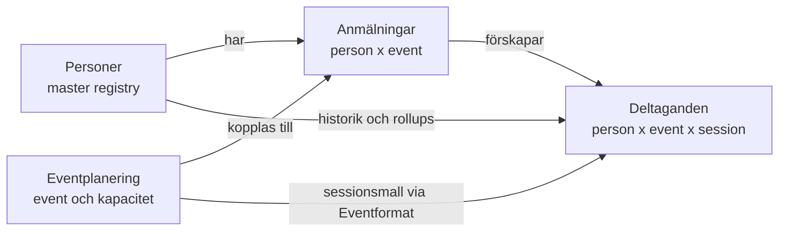

# 04 — Worldclass Research

> **Status:** Fas 1 (Baseline) klar. Fas 2 (Research) ej påbörjad.
>
> **Källprincip:** Detta är en designbar sammanfattning av frusen baseline, inte ny live-extraktion. Vid konflikt gäller live-state och arbetsdokumentets 2026-04-29-korrigeringar före äldre dokumentation.

## Del 0 — Baseline & Constraint Map (Fas 1)

### B1 — Domänkarta

#### Kärndomäner

**Personer** finns för identitet, relation och historik. En rad representerar en unik person, matchad primärt via e-post, och samlar anmälningar, deltaganden, touchpoints, hämtade erbjudanden och rollups. Viktiga fält är namn, e-post, telefon, Anmälningar, Deltaganden, RIM 1/2/3-räknare, Fjärrskådning, Antal genomförda event, Återkommande?, Har en aktiv anmälan?, AI-flagga och mailutskicksflaggor. Källa: `docs/data-model.md:63`, `docs/data-model.md:96`, `docs/data-model.md:243`, `docs/data-model.md:285`, `docs/data-model.md:367`, `docs/data-model.md:522`, `docs/hur-systemet-funkar.md:65`, `docs/hur-systemet-funkar.md:177`.

**Anmälningar** finns för bokningen: vem som har anmält sig till vad, status, betalning, källa, mailhistorik, antal platser, EventKey, Person-länk och Event-länk. En rad är person x event, inte bevis på faktisk närvaro. Viktiga relationer är Person, Event, Deltaganden och self-linken Medföljande till. Källa: `docs/data-model.md:63`, `docs/data-model.md:90`, `docs/data-model.md:173`, `docs/data-model.md:522`, `docs/hur-systemet-funkar.md:65`.

**Deltaganden** finns för faktisk närvaro. En rad är person x event x session, och `Status` driver `Närvaropoäng`, kursräknare, genomförd-historik och badges upp till Personer. Viktiga fält är Anmälan, Event, Person, Session, Status, Avstämt, Närvaropoäng och eventkey-formlerna för RIM 1/2/3 och Fjärrskådning. Källa: `docs/data-model.md:65`, `docs/data-model.md:102`, `docs/data-model.md:233`, `docs/data-model.md:415`, `docs/data-model.md:461`, `docs/hur-systemet-funkar.md:107`.

**Eventplanering** finns för event, kapacitet, status, datum, plats, sessionsmall och operativa knappar för närvaro. Viktiga fält är Eventlabel, EventKey, Status, Max antal platser, Manuella/Extra/Arrangörsplatser, beläggning, Eventtyp, Sessionsmall, Check-in session och Markera alla närvarande. MK-eventet är `recQ2TPsY69fQXA8a`, 1–3 maj 2026, max 88 platser. Källa: `docs/data-model.md:61`, `docs/data-model.md:82`, `docs/data-model.md:217`, `docs/data-model.md:336`, `analys/02-live-state.md:73`, `docs/hur-systemet-funkar.md:97`.

#### Stöddomäner

| Domän | Tabeller | Varför den finns | Viktiga relationer / fält |
|---|---|---|---|
| Eventformat | Eventformat | Definierar sessionsmallar som Eventplanering slår upp och A3 använder när Deltaganden förskapas. | Eventplanering.Eventtyp -> Eventformat.Format. Källa: `analys/02-live-state.md:330`, `docs/data-model.md:217`. |
| Väntelista | Väntelista | Tar emot personer när event är fullt eller när de ska vänta före anmälan. Raden ligger kvar som historik efter flytt. | `Flyttad till anmälan`, `Informationsmail 1 skickad`, UTM-fält, `create-waitlist-entry`, `get-waitlist`. Källa: `docs/data-model.md:202`, `docs/data-model.md:873`, `docs/data-model.md:1192`, `docs/hur-systemet-funkar.md:246`. |
| Lead magnets | Erbjudanden, Hämtade erbjudanden, Engagemang | Fångar gratismaterial och intresse innan kursanmälan. | A4 kopplar Hämtade erbjudanden till Personer och Erbjudanden; A5 uppdaterar Engagemang. Källa: `docs/data-model.md:289`, `docs/data-model.md:718`, `docs/hur-systemet-funkar.md:163`. |
| CRM/kontakt | Touchpoints, Kontaktlogg (rådata) | Loggar händelser och kontaktpunkter kring personer. | A2 och A4 skapar Touchpoints; Personer länkar till Touchpoints och Kontaktlogg. Källa: `docs/data-model.md:289`, `analys/02-live-state.md:358`, `analys/02-live-state.md:378`. |
| Bulkmail | Bulkutskick, Segment, Utskickslogg, Email Opens | Segmentering, utskick, öppningsgrad och historik. | Segmentformel, Utskickslogg, Email Opens, Bulkutskick.Status. Källa: `docs/data-model.md:289`, `analys/02-live-state.md:381`, `analys/02-live-state.md:390`, `analys/02-live-state.md:396`. |
| Systemstöd | Error-log, Path to Conversion, Instagram Posts | Felspårning och två tomma strukturella behållare. | A2 skriver Error-log vid dubblettfall. Path to Conversion och Instagram Posts har bara `Name`. Källa: `docs/data-model.md:72`, `docs/data-model.md:77`, `docs/data-model.md:298`, `analys/02-live-state.md:393`. |

### B2 — Driftkarta

| # | Constraint | Varför hård | Vad händer vid brott | Källa |
|---:|---|---|---|---|
| C1 | MK-eventet 1–3 maj 2026 är skarp drift; inga schemaändringar i Airtable under MK. | Eventet ligger i närtid och är produktionskritisk drift. | Rapportering, väntelista, mail och närvaro kan brytas mitt under eventet. | `tasks/datamodell-research-direktiv.md:38`, `tasks/datamodell-research-plan.md:69`, `tasks/datamodell-research-plan.md:639` |
| C2 | MK-recordet `recQ2TPsY69fQXA8a` och dess Deltaganden ska behandlas som skyddade data. | Backfillen använde explicit spärr för MK och verifierade att den höll. | Cleanup/migration riskerar att ändra framtida eventdata som ännu inte ska markeras. | `docs/data-model.md:84`, `docs/data-model.md:402`, `docs/data-model.md:1258` |
| C3 | Lottas fem huvudworkflows måste bevaras: anmälan, fullbokat/väntelista, närvaro, kurshistorik och lead-magnet. | `hur-systemet-funkar.md` är affärslogiken som ska fortsätta fungera efter redesign. | En tekniskt elegant modell kan ändå förstöra vardagsdriften. | `docs/hur-systemet-funkar.md:77`, `docs/hur-systemet-funkar.md:97`, `docs/hur-systemet-funkar.md:107`, `docs/hur-systemet-funkar.md:151`, `docs/hur-systemet-funkar.md:163` |
| C4 | A1-A3-kedjan måste skapa komplett ny anmälan: Event-länk, Person-länk, Deltaganden. | Detta är grundflödet för alla nya bokningar. | Föräldralösa Anmälningar, inga Deltaganden, tom kurshistorik och manuellt reparationsarbete. | `docs/data-model.md:683`, `analys/01-extraction.md:179`, `analys/01-extraction.md:199`, `analys/01-extraction.md:235` |
| C5 | A2:s grenordning är en öppen hypotes och får inte antas vara säker i reverse-flow. | Namnlös lead-Person kan trigga Gren 1 och lämna Anmälan.Person tom. | A3 triggas inte, Deltaganden skapas inte, A11 kedjar inte. | `docs/data-model.md:557`, `docs/data-model.md:597`, `docs/data-model.md:1319` |
| C6 | A4-A5 lead-magnet-kedjan måste bevara namnlösa Personer som normalt lead-state. | Namnlösa Personer är leads, inte skräp. | Radering eller placeholders bryter framtida matchning och A2:s namnkomplettering. | `docs/hur-systemet-funkar.md:177`, `docs/data-model.md:718`, `docs/data-model.md:1110` |
| C7 | A6 fullbokat-notis beror på beläggningslogiken. | Roger/Lotta behöver få signal när event når 100% beläggning. | Nya anmälningar kan fortsätta trots fullbokat läge utan operativ varning. | `docs/hur-systemet-funkar.md:97`, `docs/data-model.md:742` |
| C8 | A7 triggar vid varje Anmälningar-uppdatering, inte bara betalning. | Massuppdateringar kan få breda sidoeffekter. | Prestanda-/rate-limit-risk och oavsiktlig omsynk av ej betalda-records. | `docs/data-model.md:750`, `docs/data-model.md:1088` |
| C9 | A8-A10 närvaroflödet måste fortsätta sätta Status och Avstämt på Deltaganden. | Kurshistorik och rapporter bygger på Deltaganden.Status. | Personer visar 0 genomförda event, fel erfarenhetsnivå och tomma rapporter. | `docs/hur-systemet-funkar.md:107`, `docs/hur-systemet-funkar.md:231`, `docs/data-model.md:756`, `docs/data-model.md:786` |
| C10 | A11 kopierar Anmälan.Person till Deltaganden.Person. | Deltaganden behöver en explicit Person-länk för downstream-historik. | Deltaganden blir svåra att koppla tillbaka till person och rollups/insikter riskerar att bli fel. | `docs/data-model.md:778`, `analys/01-extraction.md:331` |
| C11 | Edge Functions för MK är delvis hårdkodade till Event-17/MK. | `create-registration` och `create-waitlist-entry` är produktionsflöden för detta event. | Parameterisering eller schemaändring kan flytta anmälningar till fel event eller dubblettskydda fel nyckel. | `docs/data-model.md:832`, `docs/data-model.md:873`, `analys/01-extraction.md:656`, `analys/01-extraction.md:693` |
| C12 | `send-email` + Resend + PATCH måste särskilja "mail skickat" från "Airtable uppdaterad". | DQ8 är ett tyst fail-mode. | Lotta kan skicka om mail i tron att första försöket misslyckades. | `docs/data-model.md:940`, `docs/data-model.md:993`, `docs/data-model.md:1186`, `docs/hur-systemet-funkar.md:224` |
| C13 | Väntelista -> Anmälningar är inte transactional. | Flytten är POST create-registration följt av PATCH på Väntelista. | Personen kan bli både anmäld och kvar på väntelistan. | `docs/data-model.md:651`, `docs/data-model.md:1192`, `docs/hur-systemet-funkar.md:246` |
| C14 | Zapier-kedjan är primär extern write-path för formulär: 10 Zaps totalt, 6 aktiva skriver till Airtable. | Arbetsdokumentet korrigerar äldre hypoteser: 0 native Airtable-webhooks, Make.com reaktivt. | Migration/design missar Elfsight -> Zapier -> Airtable och bygger ofullständig ingest-modell. | `tasks/sessions/2026-04-28-datamodell-research-projekt.md:52`, `tasks/sessions/2026-04-28-datamodell-research-projekt.md:71`, `tasks/sessions/2026-04-28-datamodell-research-projekt.md:326` |
| C15 | DQ4 är Zapier-config-skuld, inte formulärdata-skuld. | Hasharna är verifierat hårdkodade i Zap 5 och Zap 6 enligt arbetsdokumentet. | Fel åtgärd riktas mot formulär/export i stället för Zapier-konfig och migrationstransform. | `tasks/sessions/2026-04-28-datamodell-research-projekt.md:52`, `tasks/sessions/2026-04-28-datamodell-research-projekt.md:110`, `tasks/sessions/2026-04-28-datamodell-research-projekt.md:326` |
| C16 | Airtable basen får inte skrivas till i detta projekt. | Projektet är research/design/plan, inte implementation. | Förändringar kan påverka MK och bryta frusen baseline. | `tasks/datamodell-research-direktiv.md:23`, `tasks/datamodell-research-direktiv.md:34`, `tasks/datamodell-research-plan.md:30` |

**Preliminär off-limits-lista före MK:** schemaändringar i alla tabeller; ändringar i A1-A11; ändringar i Zapier/Elfsight ingest; ändringar i Resend-mallar och `send-email`; massuppdateringar/cleanup av Personer, Anmälningar, Deltaganden, Eventplanering och Väntelista; radering av gamla `Antal genomförda event`-fält; ändringar i MK-recordet eller dess Deltaganden. Detta är en Gate 1-bedömning, inte ett Marcus-beslut.

### B3 — Skuldregister

| ID | Beskrivning | Källa | Preliminär klass | Kommentar |
|---|---|---|---|---|
| DS1 | `Är aktiv (1/0)` exkluderar inte Inställt. | `tasks/sessions/2026-04-28-datamodell-research-projekt.md:95`; `docs/data-model.md:1170` | Airtable fix | Driftkritisk rapportskuld. |
| DS2 | `Återkommande?` betyder inte "har gått kurs tidigare". | `tasks/sessions/2026-04-28-datamodell-research-projekt.md:96`; `docs/data-model.md:574` | Airtable preserve + rename | Fältet kan vara användbart men namnet vilseleder. |
| DS3 | Dead branches i Erfarenhetsbadge. | `tasks/sessions/2026-04-28-datamodell-research-projekt.md:97`; `docs/data-model.md:510` | Airtable fix eller Supabase target | Beror på hur erfarenhetsmodell designas. |
| DS4 | Gammal total missar RIM 3. | `tasks/sessions/2026-04-28-datamodell-research-projekt.md:98`; `analys/02-live-state.md:246` | Airtable cleanup | Ska inte ligga kvar som aktiv sanning. |
| DS5 | Parallella `Antal genomförda event`-fält. | `tasks/sessions/2026-04-28-datamodell-research-projekt.md:99`; `docs/data-model.md:1176` | Airtable cleanup | Konsumentsök behövs efter MK. |
| DS6 | RECORD_ID-bug i Deltaganden. | `tasks/sessions/2026-04-28-datamodell-research-projekt.md:100`; `analys/01-extraction.md:364` | Supabase target | Formel-bug/döda fält i Airtable. |
| DS7 | A1-A11-versionerna är höga trots oförändrat antal automationer. | `tasks/sessions/2026-04-28-datamodell-research-projekt.md:101` | Defer till Fas 5 | Kräver diff mot automations-export. |
| DQ1 | Case-dubletter i `Vill anmäla sig till`. | `tasks/sessions/2026-04-28-datamodell-research-projekt.md:107`; `docs/data-model.md:1142` | Airtable cleanup + Migration transform | Kanonisering före export. |
| DQ2 | `Manuella flagga` har tomma choices. | `tasks/sessions/2026-04-28-datamodell-research-projekt.md:108`; `docs/data-model.md:1154` | Airtable fix | Trivial strukturrensning efter verifiering. |
| DQ3 | `Systemkälla` har tomma choices. | `tasks/sessions/2026-04-28-datamodell-research-projekt.md:109`; `docs/data-model.md:1154` | Airtable fix | Samma mönster som DQ2. |
| DQ4 | SHA256-hashar i `Källa (formulärkälla)`. | `tasks/sessions/2026-04-28-datamodell-research-projekt.md:110`; `docs/data-model.md:1160` | Zapier-config-fix + Migration transform | Arbetsdokumentet omklassar till hårdkodade Zapier-värden. |
| DQ5 | E-post på Personer är multilineText. | `tasks/sessions/2026-04-28-datamodell-research-projekt.md:111`; `analys/02-live-state.md:193` | Airtable fix eller Migration transform | Typ-skuld med valideringsrisk. |
| DQ6 | Namnlösa Personer som lead-state. | `tasks/sessions/2026-04-28-datamodell-research-projekt.md:112`; `docs/hur-systemet-funkar.md:177` | Airtable preserve + Supabase target | Ska formaliseras, inte raderas. |
| DQ7 | RECORD_ID-bug som datakvalitetsrisk. | `tasks/sessions/2026-04-28-datamodell-research-projekt.md:113`; `docs/data-model.md:1127` | Supabase target | Samma grund som DS6, men risk för export/debug. |
| DQ8 | Mail skickat men PATCH misslyckas tyst. | `tasks/sessions/2026-04-28-datamodell-research-projekt.md:114`; `docs/data-model.md:1186` | Airtable/app fix eller Supabase communication log | Driftkritisk observability. |
| DQ9 | Väntelista -> Anmälningar-flytt ej transactional. | `tasks/sessions/2026-04-28-datamodell-research-projekt.md:115`; `docs/data-model.md:1192` | App/Edge Function fix, Supabase transaction senare | Bör designas bort i target. |
| H1 | A2-grenordning korrekt vid betalning. | `tasks/sessions/2026-04-28-datamodell-research-projekt.md:65` | Verifiera eller lös via redesign | OPEN. Sandbox/test krävs om den ska avgöras empiriskt. |
| H2 | Personer 87 fält behöver splittras. | `tasks/sessions/2026-04-28-datamodell-research-projekt.md:66` | Beslut i S-track-gate | OPEN. Kärnfråga för Supabase target. |
| H3 | EventKey-bug är formel-symptom, inte data-skuld. | `tasks/sessions/2026-04-28-datamodell-research-projekt.md:67` | Supabase target / designa bort | DECIDED (förbi), men H13 preciserar källa. |
| H4 | RECORD_ID()-bug i Deltaganden är formel-bug. | `tasks/sessions/2026-04-28-datamodell-research-projekt.md:68` | Supabase target | DECIDED. |
| H5 | A2 sätter `Person?` på Anmälan i alla 4 grenar. | `tasks/sessions/2026-04-28-datamodell-research-projekt.md:69` | Verifiera i Fas 3 | SUPPORTED men inte bevisad. |
| H6 | SHA256-hashar är form-input-data. | `tasks/sessions/2026-04-28-datamodell-research-projekt.md:70` | Revidera mot DQ4 | OPEN men kolliderar med 2026-04-29 DQ4-omklassning; bör stängas/reformuleras i Fas 3. |
| H7 | Zapier är primär extern write-path. | `tasks/sessions/2026-04-28-datamodell-research-projekt.md:71` | Kartlägg i Fas 5 | DECIDED (omdefinierad). |
| H8 | `Antal genomförda event (gammal)` kan tas bort. | `tasks/sessions/2026-04-28-datamodell-research-projekt.md:72` | Airtable cleanup post-MK | Kräver konsumentsök. |
| H9 | `RIM 3 ×` ska vara rollup, inte formula. | `tasks/sessions/2026-04-28-datamodell-research-projekt.md:73` | Beslut i Fas 4 | OPEN. |
| H10 | `Manuella flagga` med choices=[] är tom-default-skuld. | `tasks/sessions/2026-04-28-datamodell-research-projekt.md:74` | Airtable fix | Samma område som DQ2. |
| H11 | `Systemkälla` med choices=[] är tom-default-skuld. | `tasks/sessions/2026-04-28-datamodell-research-projekt.md:75` | Airtable fix | Samma område som DQ3. |
| H12 | E-post som multilineText är typ-skuld från tidig design. | `tasks/sessions/2026-04-28-datamodell-research-projekt.md:76` | Airtable fix eller Migration transform | Samma område som DQ5. |
| H13 | EventKey-bug källa är HTML-formulärets URL-template, inte Zap 4. | `tasks/sessions/2026-04-28-datamodell-research-projekt.md:82` | Verifiera template eller designa bort | OPEN. Påverkar ingest/migration. |

## Del 1 — Research (Fas 2)

*(tom — Fas 2-leverans)*
