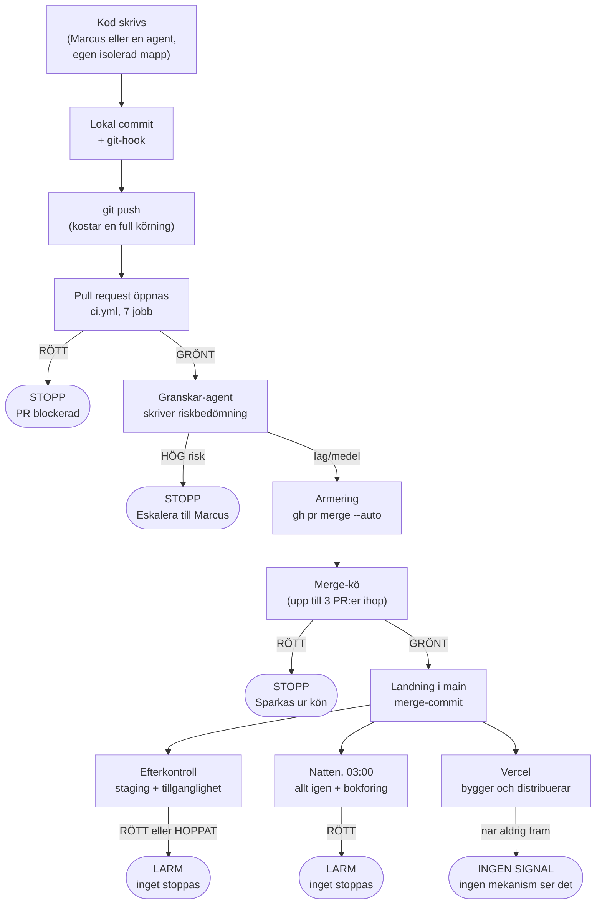

# Leverabel 1 av 12 — Huvudrapport och exekutiv sammanfattning

> **Proveniens.** Skriven 2026-09-17 av agenten D1 i CI-djupgranskningens
> tredje våg (Session 126, `miranon-media-admin`). Modell: Sonnet 5
> (`claude-sonnet-5`) — en bokförd avvikelse mot tier-policyn: detta
> omdömespass var avsett för Opus, men två Opus-pass stod still i
> lågprioritetsläget efter att sessionskvoten slog i. Orkestreraren (Claude
> Fable 5.1) har därför läst filen i sin helhet och rättat två sakfel (märkta
> på plats) och ett antal preciseringar; samtliga är bokförda i
> sessionsdokets Del 6 (`tasks/sessions/2026-09-17-session-126.md`).
> Ögonblicksbild av
> koden: `origin/main` på `eeca8c72` (2026-09-08), läst i worktreen
> `s126-ci-djupgranskning`. Denna fil är ingången till elva underdokument —
> den destillerar dem och länkar till beviset. Den lägger inget nytt utöver
> det de redan bär.

**Vad jag läste, i den ordning uppdraget gav mig:** kontraktet
(`underlag/00-agentkontrakt.md`) och uppdraget
(`underlag/02-uppdrag-vag-3.md`); stickprovsloggen
(`underlag/01-orkestrerarens-stickprov.md`) S1–S33, med S30, S31 och S33
lästa först; leverabel 11 (åtgärdsplanen) i sin ordning, K1/K2 och
sluttabellen; leverabel 12 (evidensregistret), dess gällande tal, dess
"föll eller skärptes"-lista och dess motsägelser; leverabel 9 (risk och
domen), särskilt Del 4 och Del 5; leverabel 6 (branschjämförelsen) och dess
§ 14; leverabel 3 (arkitekturkartan) och leverabel 5 (branch/push-flödet) för
den guidade genomgången; och Kort svar i leverabel 2, 4, 7, 8, 10 samt
korsgranskningen KG1. Jag har inte gjort en ny mätning — varje tal nedan är
ärvt, med en pekare till var det mättes.

## 1. Läs detta först

**Domen, i två meningar.** Det här är en välmotiverad kvalitetsplattform,
inte en maskin som byggts för sin egen skull — nästan varje del svarar på
ett verkligt, daterat fel. Men den är fel fördelad: tyngst där den skyddar
**sig själv**, tunnast där produkten faktiskt möter Lotta.

**Tre tal som bär domen:**

1. En kodändring väntar **cirka 25 minuter** ren maskintid innan den får
   landa, och **92–98 procent** av den väntan är ETT jobb — ett test som
   kontrollerar att de andra testerna är ärliga, inte att produkten fungerar
   (leverabel 9 § Del 5.1).
2. Nattkontrollen — det enda nät som regelbundet prövar en riktig databas
   och en riktig inloggning — har varit röd **51 av 52 nätter** sedan slutet
   av juli. Av dem bar **25 nätter (48 procent)** en äkta, produktskyddande
   varning, gömd bakom tre bokföringsgrindar som alla delar samma röda lampa
   (stickprov S7, S12, S30; korsgranskningen KG1).
3. Pengarna är noll — repot är publikt och GitHub fakturerar aldrig
   Actions-minuter för det (stickprov S14) — men **60 kodändringar på
   nitton dagar** fick aldrig den enda kontroll som sker efter landning
   (staging och tillgänglighet), eftersom efterkontrollen bara läser den
   ÖVERSTA ändringen när flera landar i samma leverans — en enda rad skickar
   vidare en enda commit (stickprov S18, S30, S31; leverabel 11 § N3).

**Tre saker att göra först** (den fullständiga listan står i § 7):

1. **Ge nattens larm en egen kanal för bokföring**, skild från produktskydd,
   så att "rött" betyder en enda sak igen (leverabel 11 § N2).
2. **Låt efterkontrollen se hela den landade högen**, inte bara det översta
   brevet i den — det är den mätta orsaken till punkt 3 ovan (leverabel 11
   § N3).
3. **Dela det dyraste testet i tre**, precis som testerna det bevakar redan
   är delade — det halverar väntetiden utan att ta bort något skydd
   (leverabel 11 § N6).

**Och ett handgrepp utanför CI, som bara du kan göra — helst i dag:** fyll
på listan "Månad/år" i produktionsdatabasen med 2027 års månader. Den slutar
vid december 2026 (mätt live), och appen ger ett tekniskt fel första gången
någon lägger in ett event i januari 2027 (stickprov S26; leverabel 11 § N7).

Den åtgärd som såg ut att vara viktigast av alla — att få huvudgrenen att
röra sig igen — **löstes samma dag denna granskning pågick**, av en
parallell session (`#2491`, 10:52Z). Jag har verifierat det själv: `git log
origin/main --first-parent` visar flera landningar efter klockan 11:23Z i
dag, senast `319be9d7` klockan 12:12:47Z. Kön står inte still. Frågan
bakom stilleståndet — ska en säkerhetsvarning i ett lånat paket få stoppa
en ren textändring? — lever kvar som ägarens beslut K1 (§ 8).

## 2. Så fungerar det — följ en ändring från tangentbord till användare

**Nyckelinsikten, och den ska inte gå att missa:** **före `main` är allt en
spärr — efter `main` är allt ett rop som någon måste höra** (leverabel 3
§ Kort svar). Fram till att en ändring läggs in i den delade huvudboken kan
den mekaniskt STOPPAS. Efter det kan ingenting stoppa den längre — det
enda som återstår är ett larm, en lapp på en anslagstavla, som väntar på att
en människa går förbi och läser den.

Tänk på hela kedjan som en fabrik med en port och en utlastning
(leverabel 6 § Kort svar). Porten — allt som avgör vad som får komma in — är
byggd som branschens bästa bygger den. Utlastningen, vägen från den färdiga
varan till Lotta, är en helt annan historia.

**Steg för steg, med vad varje del kostar och vad som kan gå fel:**

| Steg | Vad händer | Varför steget finns | Kostar i väntan | Vad kan gå fel här | Så ser du det själv |
|---|---|---|---|---|---|
| 1. Skriva | En agent (eller Marcus) skriver kod i sin egen mapp på disken — en "worktree", en separat kopia av hela projektet | Flera agenter kan jobba samtidigt utan att trampa på varandra | Ingen | En agent kan inte se en annan sessions ändringar förrän de pushats | `git worktree list` |
| 2. Lokal commit | Ändringen sparas som en namngiven ögonblicksbild; en liten vakt (en "git-hook") kontrollerar automatiskt att inget uppenbart trasigt sparas | En tidigare trasig koppling till teststället fick aldrig committas igen | Sekunder | Vakten själv kan bli inaktuell utan att någon märker det | `cat .githooks/pre-commit` |
| 3. Push | Ändringen skickas till GitHub | "Commit är gratis, push kostar" — en medveten regel sedan `ADR-097`, delvis mekaniserad | En full testkörning startar | En push under ett uttryckligt "pågår fortfarande"-läge nekas av en egen vakt | `git log --oneline -5` |
| 4. Pull request | En formell begäran att lägga in ändringen i huvudboken (`main`); sju automatiska kontroller kör, bland dem det dyraste testet | Grinden ska vara den enda instans som läser en hel ändring, eftersom ingen människa granskar per PR | Cirka 12,5 minuter median | Om en säkerhetsvarning i ett lånat paket är öppen fälls VARJE PR, även en ren textändring (så såg det ut fram till i dag, § 1) | Fliken "Checks" på PR:en i GitHub |
| 5. Granskning | En AI-agent i färsk kontext läser hela ändringen och skriver en riskbedömning direkt i PR:en | Ersätter den mänskliga granskare som saknas i detta arbetssätt (`ADR-105`) | Ingen extra maskintid | 42 procent av rundorna eskalerar till Marcus — grinden vet inte själv hur ofta den har rätt (stickprov S28) | Sök "Riskbedömnings-sektion" i PR-kroppen |
| 6. Merge-kö | Upp till tre godkända ändringar testas tillsammans mot den senaste versionen av `main`, i turordning | Löser att flera agenter landar samtidigt utan att krocka osynligt | Ytterligare cirka 12,5 minuter, i sekvens efter steg 4 | En röd kö-körning sparkar ut ändringen och gör klart att den måste armeras om — ingen automatik gör det åt en | Grennamnet `gh-readonly-queue/main/pr-…` i Actions-fliken |
| 7. Landning | Ändringen läggs in i `main`. Från denna punkt kan INGET stoppa den längre | Detta är den sista spärren i hela kedjan | — | — | `git log origin/main --first-parent` |
| 8. Efterkontroll | En körning direkt efter landning provar mot en riktig databas och gör en tillgänglighetsgranskning — de två prov som ALDRIG körs före landning | Ett globalt hastighetstak på testdatakällan gör det för dyrt att köra detta på varje ändringsförslag (`ADR-077`) | Cirka 16 minuter, men BLOCKERAR ingenting | Om flera ändringar landar i en klump och den ÖVERSTA är en ren textändring, hoppas hela provet över — även för koden under den (§ 6, hål 1) | `gh run list --workflow post-merge.yml --limit 5` |
| 9. Natten | Klockan 03:00 körs allt igen, plus fyra kontroller av projektets EGEN bokföring | Det ska vara det nät som gör det säkert att hoppa tester tidigare i kedjan (`ADR-077`) | Ingen — sker medan alla sover | Rött här skapar ett larm, aldrig ett stopp — och larmet har varit rött 51 av 52 nätter (§ 6) | Etiketten `ci-natt` i GitHub Issues |
| 10. Fram till användaren | En separat tjänst (Vercel) bygger och distribuerar den nya versionen till Lotta, helt vid sidan av allt ovan | Snabb, automatisk driftsättning | Ingen | Ingenting i hela kedjan kontrollerar att distributionen faktiskt lyckades (§ 6, hål 3) | Jämför senaste `main`-commit med den som faktiskt körs i produktion |

**Så här såg det ut i dag, medan denna granskning pågick.** Steg 6–8 är
inte teori. Klockan 11:22–11:25Z i dag landade merge-kön tre väntande
ändringar i EN enda leverans till `main`: en kodfix i fyra tester
(`#2500`), en textändring (`#2493`) och — överst av alla, alltså den som
avgjorde vad efterkontrollen skulle tro om HELA leveransen — den här
sessionens eget första dokument, `#2496`, ren text. Efterkontrollen läste
bara toppen, drog slutsatsen "inget att testa" och hoppade över sitt
tyngsta prov. Kodfixen under fick alltså aldrig den kontroll som bara
finns efter landning — inte på grund av att någon gjorde ett misstag, utan
på grund av precis den mekaniska regel § 6 beskriver. Jag har verifierat
sekvensen själv i dag: `git log origin/main --first-parent --format='%h
%ad %s' --date=iso-strict` visar de tre commiten i exakt den ordningen —
`0c8d3edc` (`#2500`) klockan 11:22:58Z, `a207644c` (`#2493`) klockan
11:23:42Z, och `4567a053` (`#2496`, "docs/s126-fodelse") klockan
11:24:53Z som toppen. Detaljerna och de exakta körnings-ID:na står i
stickprov S31.

## 3. Gjorde jag rätt som byggde detta så tidigt?

Marcus egna ord styr detta avsnitt: *"Jag har länge funderat på om jag
gjort rätt eller fel genom att bygga upp en sådan här test-arkitektur så
tidigt i projektet ... vi har ju ganska stor fast overhead som tar mycket
resurser, och ganska lång ledtid."* Svaret, hämtat direkt ur leverabel 9
§ Del 5 och leverabel 6 § 14, är delat och ska hållas delat.

**Rätt att bygga grinden tidigt. Fel proportioner i vad som lades bakom
den.** Det var rättare än det känns att bygga en mekanisk grind från
början. Skälet är inte produktens mognad — det är **parallellitet**. Ett
arbetssätt där 5–15 AI-agenter tillsammans landar omkring 2 200 PR:er
(varav omkring 2 100 mergade, rättat i stickprov S27) på fyra månader, med
**noll mänskliga godkännanden per ändring**, har ingen annan instans som
läser en hel ändring mot hela systemet. Grinden ÄR granskaren — den är
inte, som hos "proffs som kör direkt-PR", ett extra skyddsnät under en
förståelse en människa redan har. Jämförelsen med dem mäter fel storhet: de
har en person som vet vad hon ändrade och varför. Här finns ingen sådan
person i loopen, per konstruktion (leverabel 9 § Del 5.2).

Den branschforskning som finns säger samma sak från tre olika håll, och
alla tre pekar åt samma håll: Anthropic skriver om ett bygge med sexton
parallella agenter att *"it's important that the task verifier is nearly
perfect, otherwise Claude will solve the wrong problem"*; GitHub skriver att
*"Any CI weakening is a hard stop"*; Meta byggde en BLOCKERANDE
AI-granskningstratt som svar på samma agentvolym vi har. **Ingen publicerad
källa säger att man ska grinda lättare för att en agent skriver koden**
(leverabel 6 § 14.2).

**Två mått för "ledtid", och båda är sanna på samma gång.** Detta är
inte en motsägelse — det är två linjaler som mäter olika sträckor
(evidensregistret § M-D).

- **Branschens mått (DORA:s Change Lead Time — tiden från att en ändring
  sparas till att den körs i produktion):** vårt närmaste mätta tal är
  öppnad PR → landad i `main`, median **28,9 minuter** (sista biten, från
  `main` till produktion, är omätt — se hål 3 i § 6). Det ligger långt under
  DORA:s högsta kategori, som enligt leverabel 6 ligger kring "under ett
  dygn" (tröskeln vilar på sekundära sammanställningar). Mätt med det måttet är
  ledtiden **inte** vårt problem, och DORA:s egen forskning säger rakt ut
  att snabbhet och stabilitet inte är ett motsatspar (leverabel 6 § 14.3).
- **Den upplevda väntan — den raka maskintiden en enda kodändring betalar,
  oavsett hur liten den är:** cirka 13–25 minuter, dominerat av ETT jobb.
  Mätt med det måttet är Marcus känsla **korrekt, och underskattad**
  (leverabel 9 § Del 5.1).

Skillnaden är vad de mäter: DORA mäter tiden till produktion för HELA
processen. Den upplevda väntan mäter den maskintid varje enskild ändring
tvingas betala innan den ens får försöka landa — oberoende av hur liten
den är.

**Var overheaden faktiskt sitter, i tre högar** (leverabel 6 § 14.4,
leverabel 9 § Del 5.3):

| Hög | Vad den innehåller | Kostnad | Bedömning |
|---|---|---|---|
| **A — nödvändig kärna** | Merge-kö, en fail-closed obligatorisk kontroll, lint/typkontroll, beroendegranskning, de hermetiska testerna, review-grinden, prod-låsen | Det som faktiskt kör på en PR i dag, minus självtestet | Byggdes vid rätt tidpunkt. Utlösaren var parallellitet, inte en produktmilstolpe |
| **B — betalar sig, men sitter fel** | Hermetik-självtestet i kritiska vägen, den fjärde körningen av samma träd, beroendegranskning på varje textändring, dedupens onödigt snäva fråga | 92–98 % av väntetiden | Byggdes rätt men växte in i fel position. Kortat med hög prioritet 2026-09-02, fortfarande oöppnat femton dagar senare (`TASK-366`) |
| **C — arbetsformens egen bokföring** | Fyra processgrindar i nattnätet, sessionsdok-fönstret, sanningsavstämningen, 34 582 rader tester som skyddar grindarnas EGEN logik | Syns inte i en enda PR:s väntetid | Byggdes för tidigt och växer av egen kraft — med antalet sessioner, inte med produktens ålder |

**Slutsatsen, ärvd ur leverabel 9 och 6 — och den har två halvor, en för
vart och ett av de två saker du beskriver** *(omskriven i orkestrerarens
granskningspass: första versionen lade väntetiden i hög C, vilket tabellen
ovan motsäger)*:

- **Väntan** — *"det enda jag ser och märker av är ju väntan"* — sitter i
  **hög B**, och nästan helt i ETT jobb. Den lagas genom att FLYTTA, inte
  riva: dela självtestet i tre (N6). Skyddet blir kvar, väntan före landning
  faller från omkring 25 minuter till omkring 12 (leverabel 9 § Del 5.3).
- **Den fasta overheaden** — *"som tar mycket resurser"* — sitter till
  största delen i **hög C**, och den syns inte i någon PR:s väntetid alls.
  Den syns i sessionstid, i uppmärksamhet, i att var femte PR rör maskinen i
  stället för produkten, och i en natt som är röd av bokföring. Den lagas
  genom att ge bokföringen en egen kanal (N2) och verkställa det
  rivningsbeslut som redan är fattat (`ADR-131`, beslut B1 i § 8).
- **Hög A rörs inte.** Att skära i de hermetiska testerna eller i
  grindlogiken skulle kosta säkerhet utan att ge tillbaka vare sig väntan
  eller overhead — känslan är riktig, men den är riktad mot fel hög
  (leverabel 6 § 14.4).

## 4. De fem viktigaste frågorna

Fem fristående svar, ärvda ur leverabel 9 § Del 4. Var och en går att läsa
utan resten av denna rapport.

**Fråga 1 — Vilket verkligt produktionsfel skyddar varje jobb mot?**
Av omkring 35 automatiska kontroller kan **fyra** peka på ett namngivet fel
de faktiskt stoppade (starkast: beroendegranskningen, som stoppade ett
publicerat skadligt paket i maj 2026 och fyra säkerhetsvarningar sedan
dess). **Nio** skyddar mot ett rimligt men aldrig inträffat fel. **Sexton**
skyddar aldrig produkten — de skyddar repots EGEN bokföring, vilket är
legitimt men en annan sak. **Sex** har jag inget belägg för åt något håll.
**Märkning: verifierad** (leverabel 9 § Fråga 1).

**Fråga 2 — Vilken unik information ger de hermetiska testerna respektive
staging/E2E?** De svarar på två olika frågor som inte kan ersätta varandra:
"beter appen sig rätt givet ett visst svar?" mot "kommer svaret faktiskt i
den formen?". Skarvet mellan dem — kontraktsvakten som ska visa att
antagandet håller — bevakar bara **7 av 18** av de tjänster testerna låtsas
vara. **Märkning: verifierad** (leverabel 9 § Fråga 2; stickprov S10).

**Fråga 3 — Kan CI bli grönt trots att ett relevant test hoppats över?**
**Före landning: nej.** Det är den bäst belagda slutsatsen i hela
granskningen — fyra oberoende angreppsvägar och 46 konstruerade scenarier
gav samma svar. **Efter landning: ja**, mätt: 60 kodändringar på nitton
dagar fick aldrig den enda kontroll som körs mot en riktig databas, av en
mekanisk orsak som denna granskning identifierat och som redan har ett
förslag till lagning (§ 6, § 7). **Märkning: verifierad** (leverabel 9
§ Fråga 3; stickprov S18, S30).

**Fråga 4 — Hur ofta orsakar testflödet falska stopp eller kräver eget
underhåll?** Falska stopp i klassisk mening är **ovanliga**: **0 av 100**
mätta körningar var bevisat nyckfulla. Men just nu säger portvakten nej
till nästan allt av två KÄNDA, små skäl (en säkerhetsvarning, en klockbugg)
— löst samma dag som detta skrivs. Den verkliga kostnaden är iteration: 34
procent av alla grenar fick mer än en körning, en gren fick fjorton på
knappt sex timmar. **Märkning: verifierad** (leverabel 9 § Fråga 4).

**Fråga 5 — Vilka delar är en generell CI-produkt och vilka är specifika
för just denna app?** Av ett stickprov på tjugo komponenter: **cirka
nio** generella (skulle fungera i vilket projekt som helst), **cirka sex**
bundna till just denna produkt (Airtable, betalningar, utskick), och
**cirka elva** bundna till ARBETSSÄTTET — hur Marcus och agenterna
samarbetar, inte till CI som sådant. Den sista gruppen har redan ett hem:
det delade pluginet som laddas i varje session. **Märkning: starkt
indikerad** (leverabel 9 § Fråga 5; leverabel 10 § Kort svar).

## 5. Vad som är starkt

Detta avsnitt ska inte vara tunnare än nästa. Sju punkter, var och en
belagd (leverabel 6 § "Det här gör vi starkt"; leverabel 9 § Del 5, FÖR-
kolumnen):

1. **Grinden fram till `main` är den bäst byggda delen av hela systemet.**
   En enda obligatorisk kontroll, fail-closed, mätt tre gånger oberoende med
   identiskt resultat, tom lista över vem som får kringgå den, noll drift på
   sex veckor (stickprov S5).
2. **Ändringarna är ovanligt små och kortlivade.** Median 214 rader, 22
   minuter från öppning till landning över 300 PR:er — exakt det motmedel
   2025 års forskning pekar ut mot riskerna med AI-skriven kod.
3. **Riskklassningen — vad som får hoppas över och vad som måste köras —
   är en tillåtelselista, inte en förbudslista.** Allt nytt och okänt hamnar
   automatiskt i den försiktiga högen. 46 konstruerade scenarier prövades
   utan ett enda hål.
4. **Vi bevisar att våra isolerade tester faktiskt är isolerade,** i
   stället för att bara anta det — ett test kör om alla 524 andra tester UTAN
   sin låtsasvärld och kräver att de då går sönder. Ingen publicerad
   motsvarighet hittades i branschjämförelsen.
5. **Flakighetsbilden är ovanligt ren:** 0 bevisat nyckfulla körningar av
   100, mätt med en rigg som växlar A och B i följd i stället för i block —
   metodologiskt strängare än vad ett projekt av vår storlek brukar bygga.
6. **Den styrande texten är ärlig om sina egna svagheter.** En motivering
   som inte längre håller skrivs ut i klartext i stället för att tystas. Det
   är den egenskapen som gjorde HELA denna granskning möjlig — utan den
   ärligheten fanns ingen spår att följa.
7. **Merge-dedupen fungerar, och bättre än den först såg ut att göra.**
   Korsgranskningen KG1 mätte alla tillfällen där den kunde göra nytta:
   **32 av 32**. "Riv den" är helt uteslutet (stickprov S20, S30).

Och en åttonde, mätt i praktiken snarare än i teorin: **grindarna har
bevisligen stoppat verkliga fel** — ett publicerat skadligt npm-paket i maj
2026 innan det installerades, fyra äkta säkerhetsvarningar, en röd PR som
mergades och lagades samma dag, och 151 kvarliggande testevent som annars
hade synts som riktiga kommande event i Lottas eventväljare.

## 6. Var det läcker

Tre platser, och en gemensam nämnare: alla tre sitter **efter** att en
ändring redan är godkänd — där grinden i § 2 slutar och larmet tar över.

**Hål 1 — Nätet efter landning ser inte hela leveransen** (stickprov S1,
S18, S30, S31; leverabel 11 § N3). Merge-kön kan lägga upp till tre
väntande ändringar i EN leverans. Efterkontrollen läser bara den översta.
Är den en ren textändring hoppas hela provet — inklusive för koden som låg
under. Mätt: **60 verkliga hål på nitton dagar**. Det som uteblir är
provet mot en riktig databas och tillgänglighetsgranskningen — de snabba
testerna körs ändå, av den körning av `ci.yml` som startar vid själva
landningen och som klassar HELA leveransen (sett live i dag, stickprov
S31). Mekanismen var redan diagnostiserad i en pausad tråd
(`T166`, 2026-08-21) fyra veckor innan denna granskning återupptäckte den;
ett öppet kort med hög prioritet (`TASK-365`) bär en annan, delvis felaktig
förklaring för samma symptom, och de två pekar inte på varandra.

**Hål 2 — Nattens larm har normaliserat rött** (stickprov S7, S12, S19,
S30; leverabel 11 § N2). Åtta olika kontroller — fyra som skyddar
produkten, fyra som skyddar projektets EGEN bokföring — delar en och samma
röda lampa, och larmet skapar ett nytt ärende varje natt i stället för att
uppdatera ett stående. Resultatet: **21 identiska, obesvarade larm i
följd**, och ett kort som krävde "tre gröna nätter i rad" fick **31** utan
att kunna bockas av, eftersom ingen kunde se dem för bruset. Över alla 52
nätter var ett äkta produktskyddande jobb rött **25 gånger (48 procent)** —
inte "nästan aldrig", vilket en tidigare läsning i granskningen själv trodde
innan alla nätter räknades.

**Hål 3 — Ingen mekanism ser att `main` faktiskt når Lotta**
(stickprov S6, S22; leverabel 11 § SE3). Hela apparaten i § 2 bevakar vägen
FRAM till huvudgrenen. Att huvudgrenen sedan blir den app Lotta öppnar är
helt obevakat — produktionswebbplatsen stod minst tjugo timmar gammal en
gång utan att något märkte det; en människa gjorde det. Kortet (`TASK-199`)
är fortfarande öppet, och dess EGEN utredning avvisar redan en enkel
lösning (en nattlig vakt som pollar) med mätta skäl — falsklarm sju gånger
en enda natt tidigare. Frågan är olöst, inte obehandlad.

**Fem tunna punkter till, mindre men mätta och verkliga** (stickprov S9,
S10, S13, S16, S26):

- Skrivvägen mot datakällan saknar samma automatiska omförsök vid tillfällig
  överbelastning som läsvägen redan har, utan bokförd anledning.
- Kontraktsvakten som ska bevisa att testernas låtsas-svar fortfarande
  liknar verkligheten bevakar **7 av 18** — kommentaren i koden påstår
  fortfarande "alla sju", vilket var sant när det skrevs.
- Serverfunktionerna — appens ENDA skrivväg mot databaserna — körs i en
  annan miljö (Deno) än den som kontrollerar dem (Node): **24 av 135 filer**
  typkontrolleras via en genväg, **111 inte alls**, och de verktyg ett
  tidigare beslut (`ADR-010`) lovade — `deno check` och `deno lint` — är
  inte inkopplade någonstans (stickprov S13; *rättat i orkestrerarens
  granskningspass — första versionen hade vänt på talen*).
- Utskicken till verkliga deltagare (bekräftelse, påminnelse, eventinfo) —
  appens mest oåterkalleliga handling — har noll test genom den verkliga
  kedjan, på någon nivå.
- En lista i databasen tar slut vid december 2026. Appen kan i dag inte
  skapa ett event som startar i januari 2027, och felet upptäcks först den
  dagen någon försöker.

## 7. Nu, senare, inte alls

Full plan med alla tio fält per åtgärd: [leverabel 11](10-migrations-och-atgardsplan.md).
**Nio åtgärder nu, tjugoen senare, elva inte alls.** Ingenting nedan är
gjort — allt är förslag som väntar på ägarens beslut.

| # | Åtgärd | Varför | Läge | GO krävs |
|---|---|---|---|---|
| N1 | Höj beroendelåsen, laga klockbuggen | Låste upp kön efter nio dagars stillestånd | **LÖST** (`#2491`, samma dag) | — |
| N2 | Ge nattens bokföring en egen larmkanal | Gör ett 51-av-52-blint nät läsbart igen | nu | nej |
| N3 | Låt efterkontrollen se hela leveransen | Stänger de 60 verkliga hålen | nu | nej |
| N4 | Vakta paraplyets lista över vad den bryr sig om | Gör en tyst felklass omöjlig, ~30 rader kod | nu | nej |
| N5 | Rätta två motiveringar som inte längre håller | Nästa person ska inte bygga på ett villkor som föll 2026-08-05 | nu | nej |
| N6 | Dela det dyraste testet i tre, som klassen det speglar | Halverar väntan per landad ändring | nu | nej |
| N7 | Fyll på listan "Månad/år" i databasen med 2027 | Den enda risken i hela registret som är SÄKER att inträffa | nu | **ja** (databasen) |
| N8 | Rätta fyra falska påståenden, börja bokföra granskarens missar | Gör review-grindens träffsäkerhet mätbar | nu | nej |
| N9 | Skriv rollback-runbooken, med steget som saknas | Gör en oövad återställningsväg övad | nu | nej |
| SE1 | Byt dedupens fråga, EFTER N3 | ~225 färre sviter, ingen ledtidsvinst | senare | **ja** |
| SE2 | Flytta tio alltid-på dokumentgrindar till villkoret | Sekunder, rätt signal | senare | **ja** |
| SE3–SE21 | Nitton åtgärder till (produktrisker, underhåll, återanvändning) | Se planens fulla tabell | senare | blandat |
| I1 | Riv merge-dedupen | Den träffar 32 av 32 där den kan göra nytta — man river inte det som fungerar | **inte alls** | — |
| I2 | Ägarbunden granskning på `ci.yml` | Skulle fastna på sig själv; risken bärs redan | **inte alls** | — |
| I3–I11 | Nio förslag till (bland dem: sänk push-takten, flytta CI till egen dator, bygg en ny vakt mot inaktuell prosa) | Redan avvisat, mätt fel för oss, eller löser fel problem | **inte alls** | — |

**Kritiska vägen är N2 → N3** (N1 låg först, och är löst). Åtgärd 4–9 kan
köras parallellt med dem, eftersom de rör skilda filer. Fyra åtgärder kräver
ägarens uttryckliga GO innan en agent får landa dem: N7, SE1, SE2 och SE14 —
plus K1, om vägen "villkora" väljs där.

## 8. Beslut som är dina

Fyra beslut som mätning inte kan fatta åt dig — varje ett med alternativ,
konsekvens och en rekommendation, aldrig ett beslut (leverabel 11 §§ Två
vägval, Tre beslut).

**K1 — Ska beroendegranskningen fortsätta blockera även rena
textändringar?** I dag kör den villkorslöst, ett medvetet val sedan
2026-09-04 — vilket är exakt varför kön stod still i nio dagar. Alternativ
(a): behåll det, en ny varning fryser allt inom minuter. Alternativ (b):
kör den bara när beroendeträdet faktiskt ändrats, och låt natten (redan
bredare) fånga resten inom ett dygn. **Min rekommendation, ärvd från
leverabel 11: (b), men inte förrän N2 har landat** — annars lämnas ansvaret
till en kanal som i dag inte kan läsas.

**K2 — I vilken ordning ska nattens signal lagas?** Tre förslag: skilj
bokföring från produktskydd (ändrar VAD som räknas som rött); ge larmet en
dubblettspärr (ändrar HUR OFTA ett nytt ärende skapas); bygg en
veckosammanfattning (ändrar bara presentationen). **Rekommendation: det
första, med det andra inbyggt på köpet för bokföringskanalen — det tredje
inte alls.** Att bara presentera problemet snyggare löser inget.

**B1 — Brytdagen för `ADR-131`.** Detta redan fattade beslut river bland
annat den grind som ensam står för 44 av nattens 56 röda tillfällen — men
beslutet saknar ett datum, och grinden underhålls aktivt medan det väntar.
**Rekommendation: sätt ett datum.** Det är det billigaste beslutet i hela
granskningen.

**B2 — Listan "Månad/år".** Se sista punkten i § 6 och åtgärd N7. Detta är ägarens eget
handgrepp i databasen — agenter är mekaniskt spärrade från att göra det åt
dig. **Rekommendation: gör det i dag**, eftersom felet biter på eventets
startdatum, inte på dagens.

**B3 — Enterprise-planens syfte.** Fakta, inget förslag: merge-kön krävde
aldrig planen — GitHub ger den gratis på ett publikt organisationsägt repo,
oavsett plan (bekräftat ordagrant ur GitHubs egen dokumentation). Det
återstående, obevisade skälet att behålla den är ett högre tak för hur
många testkörningar som får gå samtidigt. **Rekommendation: behåll planen
tills det behovet är mätt** — kostnaden är liten, och att nedgradera för
tidigt är operativt värre än att betala för en marginal du inte vet om du
behöver.

## 9. Karta över granskningen

| Leverabel | Fil | Svarar på |
|---|---|---|
| 1 | *(denna fil)* | Ingången — domen, de fem frågorna, vad som görs nu/senare/inte alls |
| 2 | [`01-fil-och-komponentinventering.md`](01-fil-och-komponentinventering.md) + [`01-inventering.json`](01-inventering.json) | Vad finns, exakt räknat: 367 poster i hela CI-/grindvaktsytan |
| 3 | [`02-teknisk-arkitekturkarta.md`](02-teknisk-arkitekturkarta.md) | Hur allt hänger ihop mekaniskt, från commit till produktion |
| 4 | [`03-andringslogg.md`](03-andringslogg.md) | Hur arkitekturen växte och rättade sig själv över fyra månader |
| 5 | [`04-branch-worktree-commit-och-pushflode.md`](04-branch-worktree-commit-och-pushflode.md) | Vad som är teknisk spärr och vad som är arbetssätt i grenar, commits och push |
| 6 | [`05-branschjamforelse.md`](05-branschjamforelse.md) | Var vi ligger mot Google, Kubernetes, Next.js — och Marcus egen fråga (§ 14) |
| 7 | [`06-airtable-kompromisser-och-empiriska-fynd.md`](06-airtable-kompromisser-och-empiriska-fynd.md) | Vad som är Airtables plattformsvägg och vad som är eget val |
| 8 | [`07-hermetiska-tester-kontra-realistisk-e2e.md`](07-hermetiska-tester-kontra-realistisk-e2e.md) | Om Marcus princip ("mest snabbt och isolerat, lite genom hela kedjan") faktiskt hålls |
| 9 | [`08-risk-redundans-flakighet-tid-och-kostnad.md`](08-risk-redundans-flakighet-tid-och-kostnad.md) | Domen över slutfrågan, och "gjorde jag rätt?" |
| 10 | [`09-ci-som-ateranvandbar-djupmodul.md`](09-ci-som-ateranvandbar-djupmodul.md) | Vad som är generellt, vad som är produktspecifikt, och om det bör lyftas ut |
| 11 | [`10-migrations-och-atgardsplan.md`](10-migrations-och-atgardsplan.md) | Åtgärdslistan: nu, senare, inte alls, alla tio fält |
| 12 | [`11-evidens-och-osakerhetsregister.md`](11-evidens-och-osakerhetsregister.md) | Var varje bärande påstående i granskningen kommer ifrån |

**Underlagen** (`underlag/`) bär arbetsmaterialet bakom leverablerna: agentkontraktet, orkestrerarens 33 egna stickprov, uppdragstexterna och tre korsgranskningar (KG1 fyra CI-mekanismer på djupet, KG2 externa fakta ur leverantörernas egen dokumentation, KG3 konsistens mellan alla arton första-vågs-underlagen).

## 10. Hur granskningen gjordes, och vad den inte kunde belägga

**Metoden i tal.** Tre vågor, **31 agentpass** (18 i den första kartläggande
vågen, 9 i den andra, 4 i den tredje — Sonnet för kartläggning, Opus för
omdöme), **33 egna stickprov** av orkestreraren, tre korsgranskningar, och
en full dokumentationsgrind körd av orkestreraren när alla var klara. Inget
CI-beteende är ändrat under granskningen — varje agent, inklusive denna,
skrev exakt en fil och committade aldrig.

**Vad som föll under vägen, inklusive orkestrerarens egna fel** (full lista:
evidensregistret § Påståenden som föll eller skärptes):

- "Repot är privat" — en aldrig mätt premiss, skriven som fakta i två
  agenters uppdrag. Repot är publikt (stickprov S14).
- "Merge-dedupen träffar aldrig" — en enda mätt commit upphöjd till en
  absolut regel (stickprov S11, S20).
- "Nattnätet är rött av processgrindar" — sant för de två nätter som då var
  undersökta, falskt som generalisering över alla 52 (stickprov S12, S30).
- "Mekanismen bakom täckningsluckan hade ingen förklaring" — den stod redan
  nedskriven i en pausad tråd sedan 2026-08-21 (stickprov S18, S30).
- "Omkring 2 500 PR:er" — PR:er och GitHubs ärenden delar nummerserie; det
  högsta PR-numret lästes felaktigt som ett antal. Rätt tal: omkring 2 200,
  varav omkring 2 100 landade (stickprov S27).
- En lasttopp på 269 (på en maskin med 16 kärnor) uppstod när flera
  agenters lint-körningar kolliderade innan en flagga infördes för att
  undvika det.
- Uppskattade klockslag skrevs upprepade gånger som mätta, trots en
  uttalad regel om motsatsen.
- Orkestreraren skrev över en agents mätfil (1 000 poster) med en egen fil
  med samma namn i den delade arbetskatalogen; agenten upptäckte det via en
  självmotsägelse i en härledd siffra och mätte om (stickprov S30).
- "Bekräftat: hårt blanksteg" — orkestrerarens förklaring till att en agent
  missat fem förekomster av ett tal. Den var en omätt hypotes skriven som
  faktum; agenten mätte tecknen och fann vanliga mellanslag.
- Denna rapports första version bar två sakfel (väntetiden lagd i fel hög;
  typkontrollens tal omvända) som fångades i orkestrerarens genomläsning —
  ett skäl att läsa också DENNA fil mot leverablerna, inte i stället för dem.

Mönstret i den listan är detsamma som granskningen fann i själva repot: ett
litet mätfönster upphöjt till en allmän regel, och prosa som inte räcker
som spärr när ingen läser den om.

**Vad som inte kunde beläggas.** Fjorton konkreta åtkomstluckor står
uppräknade i evidensregistrets § Åtkomstluckor, var och en med exakt vad som
krävs för att fylla den — bland dem: om en agent kan skarpbevisa
Airtable-prod-låset (kräver en session startad efter att hooken
registrerades), om två Airtable-nycklar delar samma konto (kräver
leverantörens egen kontoadministration), och om fler numeriska glidningar
finns i styrande text bortom de redan hittade (kräver ett skript som ingen
har byggt än).

**Två "så ser du det själv"-kommandon i denna rapport har jag prövat
själv, i dag:** `git log origin/main --first-parent` (bekräftar att kön
rör sig och att `#2496` landade som beskrivet i § 2 och § 1) och `gh api
.../rulesets/19627609` (bekräftar ruleset-siffrorna i § 5, identiskt med
stickprov S5). Övriga rutor i denna rapport är kommandon som redan körts och
verifierats av agenterna bakom leverabel 3, 5, 9 och 11, eller av
orkestrerarens egna stickprov — jag har läst deras utfall men inte kört om
dem, i linje med kontraktets krav på sparsamhet mot ett delat GitHub-API.

## 11. Förslag på fortsättning

**Föreslås, byggs inte här.** En fristående, guidad wizard över hela denna
arkitektur — i det steg-för-steg-format Marcus lär sig bäst av — är en
möjlig nästa leverans. Den skulle kunna ta läsaren genom exakt samma resa
som § 2 ovan, men interaktivt: klicka på ett steg, se vad som hände senast
det gick sönder, se kommandot som visar det live. Ett sådant verktyg är
inte en del av denna granskning och inget beslut är fattat om att bygga
det.

## 12. Ordlista

Femton begrepp den här rapporten använder, på vardagssvenska.

- **Agent:** ett AI-program (byggt på en språkmodell) som självständigt kan
  läsa kod, skriva ändringar och köra kommandon — utan att en människa
  sitter bredvid och godkänner varje steg.
- **`main` (huvudgrenen):** den enda versionen av koden som räknas som "den
  skarpa, aktuella". Allt som ska bli en del av den riktiga appen måste till
  slut hamna här.
- **Gren (branch):** en egen kopia av kodens historik där någon kan ändra
  utan att röra huvudversionen — som ett separat kladdblock bredvid
  originalet.
- **Pull request (PR):** en formell begäran om att föra en grens ändringar
  in i `main`, öppen för granskning innan den godkänns.
- **Merge (sammanfogning):** själva handlingen att föra över en grens
  ändringar till en annan, oftast till `main`.
- **Merge-kö:** ett system som tar emot flera godkända ändringar och testar
  dem i turordning mot den senaste versionen av `main`, så att två
  ändringar aldrig krockar osynligt.
- **Ruleset:** GitHubs regelverk för en gren — vilka krav som måste vara
  uppfyllda innan något får landa där.
- **CI (Continuous Integration):** den samlade maskineriet av automatiska
  tester och kontroller som körs varje gång kod ändras.
- **Grind:** en kontroll som kan STOPPA en ändring om den fäller.
- **Larm:** en varning som skapas EFTER att något redan hänt — den stoppar
  ingenting, den väntar på att en människa läser den.
- **Hermetiskt test:** ett test som körs helt isolerat, med en låtsad
  version av databasen och servern, så att det går snabbt och alltid ger
  samma svar.
- **Staging:** en riktig, men separat, testversion av databasen och
  servrarna — inte samma som den verkliga produkten, men äkta nog för att
  visa om hela kedjan faktiskt hänger ihop.
- **Nattkontroll (`nightly`):** en körning som sker automatiskt varje natt
  och testar allt en gång till, mot riktiga tjänster.
- **Efterkontroll (post-merge):** den körning som sker direkt efter att en
  ändring landat i `main` — den enda punkten där ett prov mot en riktig
  databas sker regelbundet.
- **ADR (Architecture Decision Record):** ett skrivet, daterat dokument som
  förklarar ett viktigt beslut och varför det togs — så att nästa person
  inte behöver gissa.
- **Dedup (deduplicering):** ett steg som frågar "har vi redan testat exakt
  detta?" och hoppar över en dyr testkörning om svaret är ja.

## Källor

**Syskonfiler i denna granskning, lästa i sin helhet eller i de avsnitt som
anges** (samtliga 2026-09-17):

- [`underlag/00-agentkontrakt.md`](underlag/00-agentkontrakt.md) — hela
- [`underlag/02-uppdrag-vag-3.md`](underlag/02-uppdrag-vag-3.md) — § Gemensamt, § D1, § D1 lägesunderlag
- [`underlag/01-orkestrerarens-stickprov.md`](underlag/01-orkestrerarens-stickprov.md) — S1–S33, S30/S31/S33 lästa först
- [`02-teknisk-arkitekturkarta.md`](02-teknisk-arkitekturkarta.md) — § Kort svar, § 1, § 3, § 7
- [`04-branch-worktree-commit-och-pushflode.md`](04-branch-worktree-commit-och-pushflode.md) — § Kort svar, § Grundbegrepp, § Flödet steg för steg
- [`05-branschjamforelse.md`](05-branschjamforelse.md) — § Kort svar, § 14, § Det här gör vi starkt, § Det här bör förbättras
- [`08-risk-redundans-flakighet-tid-och-kostnad.md`](08-risk-redundans-flakighet-tid-och-kostnad.md) — § Kort svar, Del 4, Del 5
- [`10-migrations-och-atgardsplan.md`](10-migrations-och-atgardsplan.md) — hela
- [`11-evidens-och-osakerhetsregister.md`](11-evidens-och-osakerhetsregister.md) — hela
- [`01-fil-och-komponentinventering.md`](01-fil-och-komponentinventering.md), [`03-andringslogg.md`](03-andringslogg.md), [`06-airtable-kompromisser-och-empiriska-fynd.md`](06-airtable-kompromisser-och-empiriska-fynd.md), [`07-hermetiska-tester-kontra-realistisk-e2e.md`](07-hermetiska-tester-kontra-realistisk-e2e.md), [`09-ci-som-ateranvandbar-djupmodul.md`](09-ci-som-ateranvandbar-djupmodul.md) — § Kort svar i var och en
- [`underlag/kg1-korsgranskning-ci-mekanismer.md`](underlag/kg1-korsgranskning-ci-mekanismer.md) — § Kort svar

**Repo-verifiering gjord av mig i dag (2026-09-17):**

`git log origin/main --first-parent -8` (bekräftar att huvudgrenen rör sig
och att `#2496` landade som beskrivet i § 1 och § 2) · `gh api
repos/high-five-group/miranon-media-admin/rulesets/19627609` (bekräftar
ruleset-siffrorna i § 5, identiskt med stickprov S5).

**Marcus egna ord, citerade ordagrant** ur uppdragets underlag, 2026-09-17
(`underlag/02-uppdrag-vag-3.md` § "Ägarens styrning under granskningen").
