# D3 — Den tekniska arkitekturkartan: beroenden och dataflöden

> **Proveniens:** skriven av en `research-pass`-agent (modell: se § Rapport till
> orkestreraren) i CI-djupgranskningens våg 2, Session 126, 2026-09-17, i
> worktreen `docs/s126-ci-djupgranskning`. Ögonblicksbild: `origin/main` på
> `eeca8c72` (2026-09-08) för kod och filträd; GitHub-mätningar citerade från
> källfilerna är **live**, körda 2026-09-17, och nyare än filsnapshotten —
> markerat där det gör skillnad. Detta är en **karta**, inte en ny
> undersökning: den syntetiserar och visualiserar vad våg 1:s agenter redan
> grävt fram (`underlag/j1a`–`j1f`, `j8-4`, `j8-5`) och leverabel 04, korrigerat
> mot orkestrerarens stickprovslogg (`underlag/01-orkestrerarens-stickprov.md`)
> där de två skiljer sig åt. Jag har gjort ett fåtal egna, riktade
> verifieringar (se § Metod) men har INTE räknat om det källunderlaget redan
> räknat.

## Kort svar

Repots CI-arkitektur har **exakt en mekanisk grind före `main`**: GitHubs
ruleset `main-skydd`, som läser en enda samlad kontroll ("CI Passed or
Skipped"). Allt som händer **efter** att en ändring landat i `main` — natten,
efterkontrollen, produktions-deployen — är **larm, inte spärr**: ingenting
där kan stoppa något, bara berätta att något redan gått fel. Det är den enda
meningen som behövs för att förstå hela kartan: **före `main` är varje rad i
detta dokument en grind; efter `main` är varje rad ett rop som någon måste
höra.**

Grinden själv är välbyggd och fail-closed (verifierat, se § 2). Men tre
strukturella sanningar gör att löftet ändå läcker:

1. **Merge-kön kan landa flera väntande ändringar i EN enda `push`, och
   efterkontrollen tittar bara på toppen av den pushen.** Är toppen en
   dokumentationsändring hoppas hela efterkontrollen (staging + tillgänglighet)
   — och den kodändring som låg UNDER den får aldrig den kontroll som bara
   finns efter landning. Mätt: 85 av 686 landningar (12,4 %) fick aldrig en
   egen efterkontroll (§ 7, hål 1).
2. **Nattens kontrollnät — den enda regelbundna, fullständiga kontrollen — har
   varit rött i praktiken taget varje natt sedan slutet av juli.** Larmet för
   det saknar dessutom en spärr mot att skapa ett NYTT ärende varje natt, så
   listan av obesvarade larm bara växer (§ 4, § 7).
3. **Ingenting i hela kedjan verifierar att det som landar i `main` faktiskt
   når användaren.** Frontend-driften (Vercel) sker helt utanför denna
   arkitektur, och ett öppet, oåtgärdat kort (`TASK-199`) bevisar att en
   produktionswebbplats kunde stå still i minst 20 timmar utan att någon
   mekanism märkte det (§ 5, § 7).

Ingen av dessa tre är ett fel i den enskilda mekanismen — var och en gör precis
vad den är byggd för att göra. Det som saknas är inte fler grindar, utan att
kedjan EFTER grinden faktiskt läses av en människa i tid.

## Vad jag läste först

Jag har läst hela agentkontraktet (`underlag/00-agentkontrakt.md`) och hela
orkestrerarens stickprovslogg (`underlag/01-orkestrerarens-stickprov.md`,
arton stickprov S1–S18) innan jag öppnade något källunderlag. Loggens dom
gäller före agenternas egna filer där de skiljer sig åt — jag har tillämpat
den korrigeringen genomgående nedan, med källhänvisning till både
originalpåstående och rättelse där det är relevant (t.ex. frontend-rollbacken
i § 5a, som J1e beskrev fel och S8 rättade).

Jag har läst i sin helhet de tio filer uppdraget pekade ut:
`underlag/j1a-ci-yml-och-ci-suite.md`,
`underlag/j1b-ovriga-workflows-och-github-katalogen.md`,
`underlag/j1c-ci-wirade-skript-och-policyfiler.md`,
`underlag/j1d-lokala-hookar-och-agentmekanismer.md`,
`underlag/j1e-externa-installningar-och-deployvagar.md`,
`underlag/j1f-test-bygg-och-lintkonfiguration.md`,
`underlag/j8-4-staging-och-e2e.md`,
`underlag/j8-5-grindlogik-skip-och-gront.md`,
[04-branch-worktree-commit-och-pushflode.md](04-branch-worktree-commit-och-pushflode.md)
och [07-hermetiska-tester-kontra-realistisk-e2e.md](07-hermetiska-tester-kontra-realistisk-e2e.md).
Jag har läst `07` bara delvis (dess `kort svar` och paritetstabell, som
`j8-4` redan täcker i egen rätt) — se § Osäkerheter för vad det innebär för
tillförlitligheten i just den delen.

**Vad som redan var en fullständig karta och inte behövde göras om:**
`j1a` och `j1b` bär redan mermaid-diagram och kant-för-kant-tabeller över
`ci.yml`/`ci-suite.yml` respektive de sex övriga workflow-filerna. Jag har
INTE räknat om deras rader eller villkor på nytt — jag har återanvänt dem
verbatim där jag citerar exakt `fil:rad`, och byggt vidare med det som
saknades: en SAMMANHÅNGANDE resa över hela kedjan (lokal ändring →
produktion), en matris över de fem körytorna sida vid sida, en
signalvägs-karta för LARM kontra STOPP, och en samlad bild av de kända
hålen på en och samma resa. Det är det jag tillför som är nytt i detta
dokument; ingen annan fil i granskningen sätter ihop de delarna till en enda
karta.

**Ålder:** allt källunderlag är skrivet samma dag (2026-09-17) som denna fil.
Jag har inte bedömt något som föråldrat, men jag har flaggat två platser där
källunderlaget självt flaggar sin egen mätning som ett ögonblick i tiden
(nattnätets rödhet, § 4; täckningsluckans andel, § 7) — dessa tal rör sig
och bör mätas om innan de används som facit i en framtida session.

## Metod

Detta pass är i grunden en syntes: jag har inte kört om källunderlagets
mätningar. Jag har gjort fyra egna, riktade kontroller för att inte bara
lita på tredje hands citat:

1. **Filstruktur.** `ls docs/research/ci-djupgranskning-2026-09-17/` och
   `.../underlag/` för att verifiera att varje syskonfil jag länkar till
   faktiskt finns (se § Källor).
2. **Hemlighetsinventeringen i `ci.yml`.** `grep -n "PROD\|prod"
   .github/workflows/ci.yml | grep -i secret` gav **noll träffar** — inget
   `secrets.*`-uttryck i filen nämner något prod-relaterat namn. Det stärker
   (utan att ensamt bevisa) § 6:s påstående att inget CI-jobb når produktion:
   kombinerat med J1e:s live-läsning av de exakt åtta Actions-repo-secreterna
   (samtliga `STAGING_*`/`TEST_*`, noll `PROD*`) ger det en rimlig grund för
   **starkt indikerad**, inte fullt verifierad (se § Osäkerheter för vad som
   krävs för att stänga den sista luckan).
3. **Ett direkt, oplanerat empiriskt fynd:** jag försökte själv `grep` efter
   prod-Supabase-referensen i `.github/workflows/` för att komplettera punkt 2
   — kommandot **nekades av `scripts/deny-prod-ref.sh`** innan det ens körde,
   eftersom hooken matchar HELA kommandosträngen mot referensen, oavsett om
   kommandot bara läser. Det är en levande, oplanerad bekräftelse av precis
   den mekanism `underlag/j1d` och `CLAUDE.md` beskriver ("Låset sitter på
   KOMMANDOSTRÄNGEN, inte på kunskapen") — jag registrerar det som ett fynd i
   sig i § Osäkerheter i stället för att gissa mig runt det.
4. **Syskonlänkarnas giltighet.** Varje relativ länk i detta dokument pekar på
   en fil jag har bekräftat existerar i samma katalog (`ls`-kommandot ovan).

Källhierarkin är annars: den fil som gjorde den ursprungliga mätningen (t.ex.
en `gh api`/`gh run`-körning citerad i `j1a`/`j1e`/`j8-5`) väger tyngre än min
egen sammanfattning av den. Där stickprovsloggen uttryckligen rättar ett
underlag citerar jag rättelsen och skriver ut båda källorna.

## Fynd

### 1. Hela resan på en sida

**I klartext, för en läsare utan teknisk bakgrund:** tänk dig en ändring som
en bit post som ska levereras till Lotta. Innan brevet ens lämnar avsändarens
skrivbord finns lokala kontroller. Sedan går det igenom en sluss (en
"pull request", en formell begäran om att få lägga till brevet i den
gemensamma boken) där flera oberoende kontroller måste säga ja. Går allt bra
läggs brevet i en kö tillsammans med andra brev som väntar, kön testar dem i
tur och ordning, och till slut klistras brevet in i boken (`main`). **Allt
fram till den punkten kan stoppa brevet.** Efter den punkten finns bara
personer som senare bläddrar igenom boken och ropar om de ser något fel —
ingen kan längre vägra att brevet klistrades in.

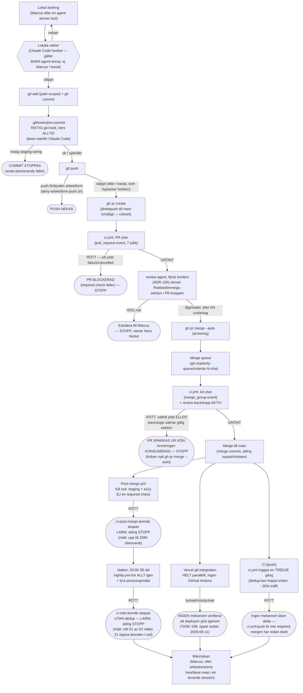

**Var en ändring kan STOPPAS, och var den bara kan LARMAS OM** (samma
information som diagrammet, som lista för den som vill slå upp det snabbt):

| Punkt i resan | STOPP eller LARM | Mekanism |
|---|---|---|
| `.githooks/pre-commit`, staging-wiring trasig | **STOPP** | Riktig git-hook, `exit 1` |
| `git push` under en push-förbjuden arbetsform | **STOPP** | `deny-arbetsform-push.sh` (bara agentens Bash-kanal) |
| `ci.yml` på PR-ytan, valfritt av 7 jobb rött | **STOPP** | Required check `CI Passed or Skipped` |
| `review-agent` bedömer risken HÖG | **STOPP** (eskalering) | `ADR-105` beslut 5, prosa-åtagande i orkestrerarrollen |
| `ci.yml` på kö-ytan, valfritt jobb rött ELLER `review-backstopp` saknar sektion | **STOPP** | Samma required check, kön sparkar ut posten |
| `ci.yml` triggas en tredje gång på `push`-eventet | Varken — resultatet är overksamt | Mergen har redan skett; detta är informativt brus |
| `post-merge.yml` rött | **LARM** | GitHub-ärende, etikett `ci-post-merge`, ingen spärr |
| Vercel-deployen misslyckas eller blir stale | **Ingen signal alls** | Ingen mekanism finns (`TASK-199`) |
| `nightly.yml` rött | **LARM** | GitHub-ärende, etikett `ci-natt`, INGEN dedup |

Källor för varje kant: `.github/workflows/ci.yml:4-24` (triggers),
`.github/workflows/ci.yml:2537-2566` (aggregatorn),
`docs/decisions/ADR-076-merge-grinden-ruleset-pr-flode.md` (rulesetet),
`docs/decisions/ADR-105-review-grinden-fyra-deltan-byggs-inte-adopteras.md`
(review-grinden), `.github/workflows/post-merge.yml:376-555` (larm-jobbet),
`.github/workflows/nightly.yml:697-869` (alarm-jobbet), samtliga citerade i
`underlag/j1a` och `underlag/j1b`.

### 2. Grindarna och deras beroenden

**Tre lager, och varje lager har en annan bindande kraft:**

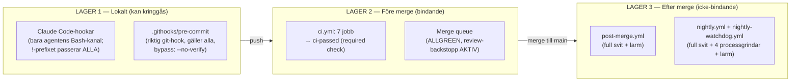

**Diagram: `ci.yml`s sju jobb och deras `needs`** (identiskt med
`underlag/j1a`s egen graf, återgivet här för sammanhanget):

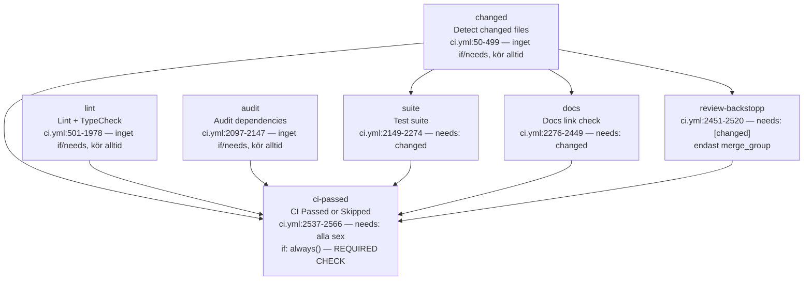

**Diagram: `ci-suite.yml`s åtta jobb, anropad av `suite`-jobbet ovan:**

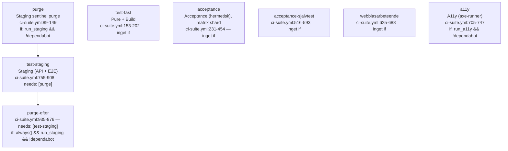

**Diagram: `post-merge.yml`s fem jobb** (körs på `push`-eventet mot `main`,
alltid EFTER att merge redan skett):

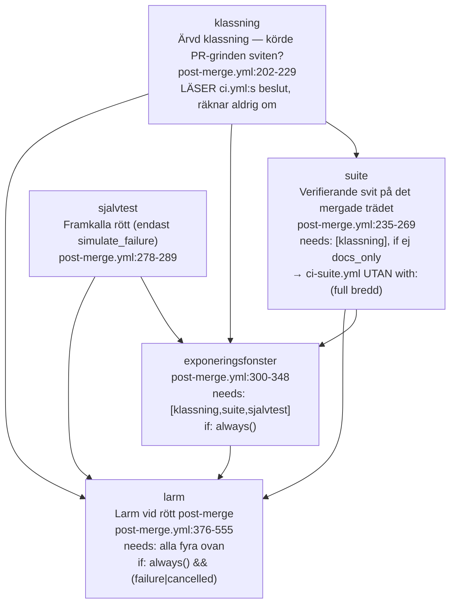

**Diagram: `nightly.yml`s tio jobb + `alarm`** (klockan 03:00 svensk tid,
ingen klassning — kör alltid allt):

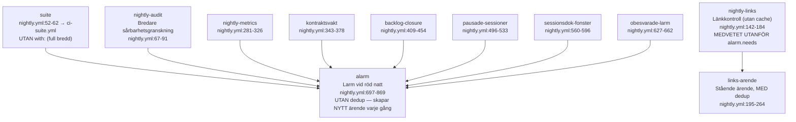

**Kant-för-kant-tabellen, för maskinen:**

| Från | Till | Villkor | Källa |
|---|---|---|---|
| `pull_request`/`push main`/`merge_group` | `changed` | inget (root) | `ci.yml:4-24,50` |
| `changed` | `suite` | `needs: changed`; `if: should_skip_tests!='true' && dedup_hit!='true'` | `ci.yml:2158,2163` |
| `changed` | `docs` | `needs: changed`; `if: docs_changed=='true'` | `ci.yml:2280-2281` |
| `changed` | `review-backstopp` | `needs: [changed]`; `if: event_name=='merge_group' && should_skip_tests!='true'` | `ci.yml:2485-2486` |
| `changed, lint, audit, docs, suite, review-backstopp` | `ci-passed` | `needs:` alla sex; `if: always()` | `ci.yml:2551,2539` |
| `suite` | `ci-suite.yml` (samtliga 8 jobb) | `uses:`; `with: run_staging:false, run_a11y:false, acceptance_selection: dynamisk` | `ci.yml:2174,2270-2273` |
| — | `purge` (i `ci-suite.yml`) | `if: inputs.run_staging && actor!='dependabot[bot]'` — **alltid falskt från `ci.yml`** | `ci-suite.yml:89-96` |
| `purge` | `test-staging` | `needs: [purge]`; `if: !cancelled() && run_staging && !dependabot && (purge success\|skipped)` | `ci-suite.yml:759,762` |
| `test-staging` | `purge-efter` | `needs: [test-staging]`; `if: always() && run_staging && !dependabot` | `ci-suite.yml:937-939` |
| `push main` | `post-merge.yml`s `klassning` | trigger, oberoende av `ci.yml` | `post-merge.yml:142-143,229` |
| `klassning` | `suite` (post-merge) | `needs: [klassning]`; `if: !simulate_failure && docs_only!='true'` | `post-merge.yml` (citerat i `underlag/j1b`) |
| `suite` (post-merge) | `ci-suite.yml` | `uses:` UTAN `with:` → full bredd | `post-merge.yml:248-249` |
| `klassning, suite, sjalvtest` | `exponeringsfonster` | `needs:` alla tre; `if: always()` | `post-merge.yml:300` |
| alla fyra | `larm` | `needs:` alla fyra; `if: always() && (contains(failure)\|\|contains(cancelled))` | `post-merge.yml:376` |
| `schedule 03:00`/dispatch | `nightly.yml`s `suite` | root, oberoende av `ci.yml`/post-merge | `nightly.yml:52-62` |
| `suite` (nightly) | `ci-suite.yml` | `uses:` UTAN `with:` → full bredd | `nightly.yml:61-62` |
| `nightly-links` | `links-arende` | `if: needs.nightly-links=='failure'`, MED dedup | `nightly.yml:195-232` |
| 7 av 8 nattjobb (EJ `nightly-links`) | `alarm` | `needs:` de sju; UTAN dedup | `nightly.yml:697-869` |
| `nightly.yml` (körresultat) | `nightly-watchdog.yml`s `watch` | LÄSER via `gh run list`, ingen kod-koppling | `nightly-watchdog.yml:91-239` |

**Vad "grönt eller aldrig kört" betyder — den viktigaste tekniska detaljen i
hela kartan:** `ci-passed` räknar bara `failure` och `cancelled` som dåligt;
`skipped` passerar tyst (`ci.yml:2556-2566`, citerat i sin helhet i
`underlag/j1a` § 5). Det är MEDVETET — annars hade varje dokumentationsändring
tvingats köra hela testsviten i onödan — men det betyder att grinden inte kan
skilja "det här behövdes inte" från "det här glömdes". Fail-closed-disciplinen
i klassningen (§ 3 nedan) är det som håller den skillnaden säker i praktiken,
inte aggregatorn själv.

**Ingen mekanism vaktar att aggregatorns `needs`-lista hänger med** om ett
nytt toppnivåjobb läggs till `ci.yml` — en glömd rad där skulle göra det nya
jobbet synligt i GitHubs gränssnitt men overksamt som grind (`underlag/j1a` §
Risker, punkt 1; bekräftat öppet i stickprovsloggen S2 som en olöst fråga för
våg 2 — jag har inte kunnat stänga den, se § Osäkerheter).

### 3. De fyra körytorna sida vid sida

**Läsanvisning innan tabellen:** rubriken talar om "fyra" körytor, men
källunderlaget beskriver fem tydligt skilda triggerhändelser — PR-ytan,
kö-ytan, `push`-ytan (`ci.yml` triggas en tredje gång på samma händelse som
efterkontrollen), post-merge (en helt annan workflow-fil,
`post-merge.yml`) och natten. Jag har valt att bevara alla fem som separata
kolumner i stället för att tvinga in `push`-ytan i post-merge-kolumnen: de
delar utlösande händelse (`push` mot `main`) men är TVÅ MASKINELLT SKILDA
mekanismer (en re-körning av `ci.yml`, en separat fil), och S11 i
stickprovsloggen visar att just den distinktionen är avgörande — `push`-ytans
körning tillför i praktiken NOLL ny information medan post-merge tillför
staging och tillgänglighet. Detta är alltså en avsiktlig avvikelse från
rubrikens ordval, registrerad öppet snarare än tyst rättad.

| Jobb / kontroll | PR-ytan | Kö-ytan (`merge_group`) | Push-ytan (`ci.yml`, tredje gången) | Post-merge (`post-merge.yml`) | Natten (`nightly.yml`) |
|---|---|---|---|---|---|
| `changed` (klassning) | ✔ kör | ✔ kör | ✔ kör (+ dedup-försök) | *(egen `klassning`, ärver — räknar aldrig om)* | ✗ finns ej — kör alltid allt |
| `lint` (~30 interna grindvakter) | ✔ kör | ✔ kör | ✔ kör | ✗ finns ej | ✗ finns ej |
| `audit` (npm-sårbarheter, `high`-tröskel) | ✔ kör | ✔ kör | ✔ kör | ✗ finns ej | `nightly-audit`, EGET jobb, `moderate`-tröskel (bredare) |
| `test-fast`, `acceptance`, `acceptance-sjalvtest`, `webblasarbeteende` (hermetiska klasser) | ✔ kör (om ej D0/dedup) | ✔ kör (om ej D0) | ✔/**skippad** (dedup, ~30 % träff) | ✔ kör (om ej `docs_only`) | ✔ kör alltid |
| `purge`, `a11y`, `test-staging`, `purge-efter` (skarp staging + tillgänglighet) | ✗ **ALDRIG** (`run_staging:false`/`run_a11y:false` tvingat) | ✗ **ALDRIG** (samma tvingning) | ✗ **ALDRIG** (samma tvingning) | ✔ kör (full default, om ej `docs_only`) | ✔ kör alltid |
| `docs` (intern länkkontroll, offline) | villkorat (`docs_changed`) | villkorat | villkorat | ✗ finns ej | `nightly-links`, ANNAT jobb, extern+intern, kallt |
| `review-backstopp` (granskningsutlåtande krävs) | ✗ alltid `skipped` (kräver `merge_group`) | ✔ AKTIV (om ej D0) | ✗ alltid `skipped` | ✗ finns ej | ✗ finns ej |
| `ci-passed` (aggregator, required check) | ✔ | ✔ | ✔ (men overksam — mergen redan skett) | *(motsvaras av `exponeringsfonster`+`larm`, ej en required check)* | *(motsvaras av `alarm`, ej en required check)* |
| Processgrindar (backlog-stängning, pausade sessioner, sessionsdok-fönster, obesvarade larm) | ✗ | ✗ | ✗ | ✗ | ✔ **bara här** |

**I klartext:** två rader i denna tabell bär hela uppdragets misstanke om
"testat för att det går, inte för att det behövs" på huvudet. Den skarpa
staging-kontrollen och tillgänglighetsscanningen — de kontroller som mest
liknar det riktiga systemet Lotta använder — körs **aldrig** före en ändring
tillåts landa. De körs bara EFTER, i post-merge och natten. Det är en medveten
avvägning (`ADR-077`, se § 5c i `underlag/j8-4`): en global stagingkö på
PR-ytan mätte en 25-minuters revert-blockering av en åtta-raders
textändring. Men avvägningen håller bara så länge efterkontrollen faktiskt
körs och faktiskt läses — och § 7 visar att båda villkoren har brustit.

### 4. Signalvägarna

**I klartext:** när något går sönder FÖRE `main` ser den som väntar på PR:en
det direkt — GitHub visar ett rött kryss, och inget mer händer förrän det är
löst. När något går sönder EFTER `main` skapas i stället ett ärende (en
notering i GitHubs ärendehanteringssystem, som en lapp på en anslagstavla) —
och lappen försvinner inte förrän en människa aktivt tar bort den. Frågan är
inte om lappen sätts upp. Den sätts upp varje gång. Frågan är om någon går
förbi anslagstavlan.

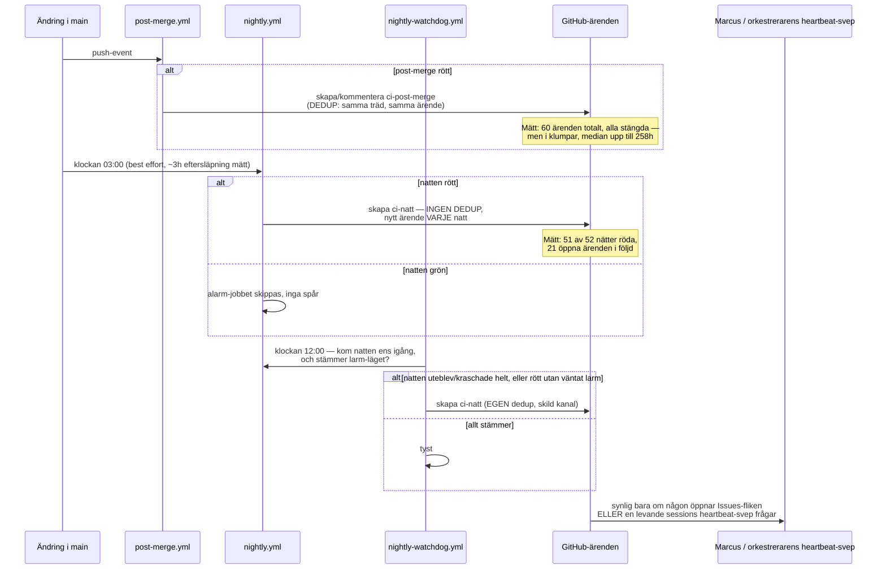

**Vem läser vilken kanal, mätt:**

| Kanal | Skapas av | Dedup? | Läses av | Mätt svarstid |
|---|---|---|---|---|
| Required check (PR/kö-ytan) | `ci-passed` | N/A — synlig direkt i PR-UI | PR:ens ägare, omedelbart | Omedelbar (blockerar) |
| Utsparkning ur kön | Merge queue-plattformen | N/A | Den som armerade, om de tittar | Varierar — kräver nytt `gh pr merge --auto` |
| `ci-post-merge`-ärende | `post-merge.yml`s `larm`-jobb | **Ja**, per landat träd | Vem som helst med Issues-åtkomst | Median 1–4h i bästa fönster, **upp till ~258h (10–11 dygn)** i sämsta mätta fönstret (`underlag/j8-4` § 8.4.9) |
| `ci-natt`-ärende | `nightly.yml`s `alarm`-jobb | **Nej** | Samma | Mätt: 21 öppna i följd, äldsta sedan 2026-08-28 (`underlag/01-orkestrerarens-stickprov.md` S7) |
| `ci-natt` via vakthunden | `nightly-watchdog.yml` | Ja, egen policy | Samma kanal, egen dedup | Sällan fyrar — bara när huvudlarmet TYST uteblivit; mätt: 30/30 senaste körningar `success` (tyst, korrekt) |
| `lankrota`-ärende | `nightly.yml`s `links-arende` | Ja, uttrycklig | Samma | Låg — egen, mildare kanal per `ADR-082` |
| Heartbeat-svep (`scripts/heartbeat-svep.sh`) | En LEVANDE Code-sessions bakgrundsprocess | Level-triggered (varje svep, inte bara vid övergång) | Orkestreraren i just DEN sessionen | Bara medan en session kör — noll täckning mellan sessioner |

**Döda eller överröstade kanaler, mätt (per uppdragets uttryckliga fråga):**

- **S7 — 21 obesvarade `ci-natt`-ärenden i följd.** Larmet fyrar korrekt varje
  gång, men mekanismen som skulle förhindra en "kyrkogård" av olästa larm
  (dedup) byggdes bara in i `links-arende` och `nightly-watchdog.yml`, inte i
  `nightly.yml`s eget `alarm`-jobb — en strukturell asymmetri utan bokförd
  motivering, till skillnad från varje annat designval i samma filer.
- **S12 — nattnätets rödhet är i praktiken en PROCESS-signal, inte en
  PRODUKT-signal.** Två oberoende körningar (2026-09-15, 2026-09-16) var
  röda på exakt fyra jobb: tre processgrindar (`Backlog-stängning`,
  `Sessionsdok-fönstret`, `Sannings-avstämning: obesvarade-larm`) plus
  `Bredare sårbarhetsgranskning` — noll testjobb var röda. Den 2026-09-17
  tillkom en genuin testregression (`Acceptance (hermetisk) (2)`) i samma
  larm som redan varit rött i femtio dygn av andra skäl — den nya, äkta
  signalen drunknade i bruset innan den ens hann synas som ny.

### 5. De fyra deployspåren

Gemensamt för alla fyra: **`main`-grinden (§ 2) är den enda mekaniska
kontroll som är gemensam för samtliga.** Ingen av de fyra har en egen
mekanisk merge-till-produktion-grind — allt som händer efter `main` är
antingen automatiskt men obevisat (frontend), eller helt manuellt.

#### (a) Frontend — Vercel

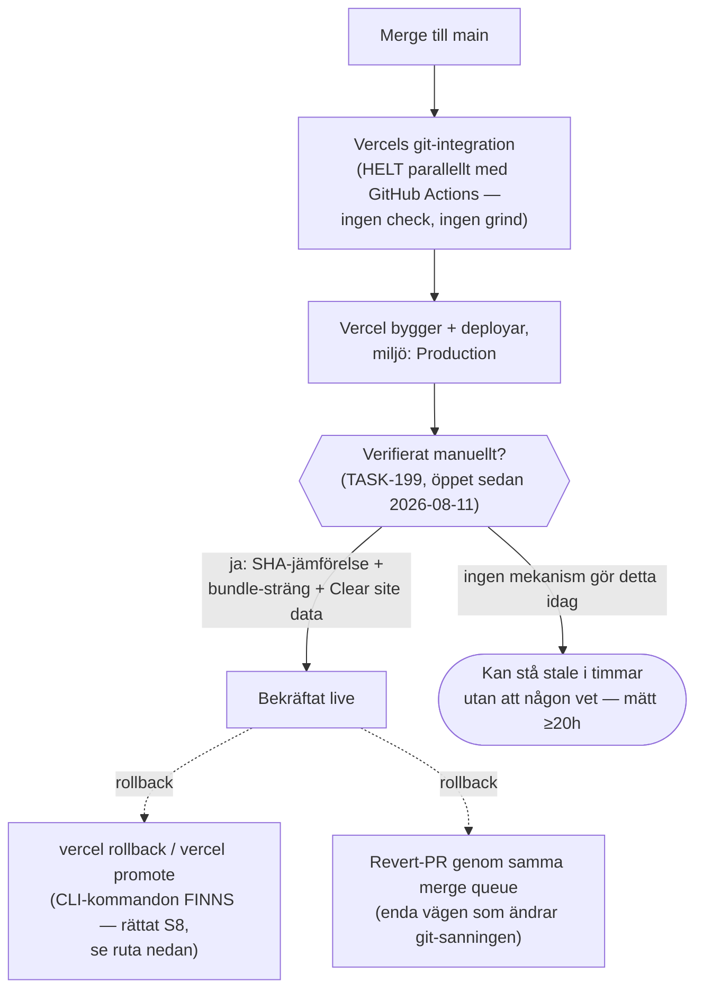

**Utlösare:** varje `push` till `main`, oberoende av CI. **Kontroll före:**
ingen. **Kontroll efter:** ingen mekanisk — bara en runbooks manuella
tre-stegs-metod (SHA-jämförelse, bundle-sträng, cache-rensning).
**Rollback:** **korrigerat läge, S8 mot J1e.** `underlag/j1e` skrev
ursprungligen "ingen kommandoväg" och listade bara dashboard/revert-PR.
Orkestrerarens stickprov S8 fann att en kommandoväg FINNS: `vercel rollback
[deployment-id]`, `vercel rollback status`
(`vercel.com/docs/cli/rollback`), `vercel promote <url>`
(`vercel.com/docs/deployments/promote-preview-to-production`), samt ett
REST/SDK-anrop `projects.requestRollback`. Vad som STÅR KVAR av J1e:s fynd:
ingen av dessa vägar är någonsin körd eller dokumenterad i en runbook hos
oss, och en öppen fråga (S8) kvarstår obesvarad: om en Vercel-rollback
stänger av den automatiska kopplingen mellan `main` och Production tills
man aktivt promotar igen — vilket i så fall gör rollbacken till en
bieffekt på hela landningsflödet, inte en isolerad åtgärd. **Var staging kan
glida:** irrelevant här — frontend har ingen separat staging-deploy-mekanism,
Vite dev-server används i testerna (§ 6).

#### (b) Edge Functions — manuellt, mekaniskt låst för agenter

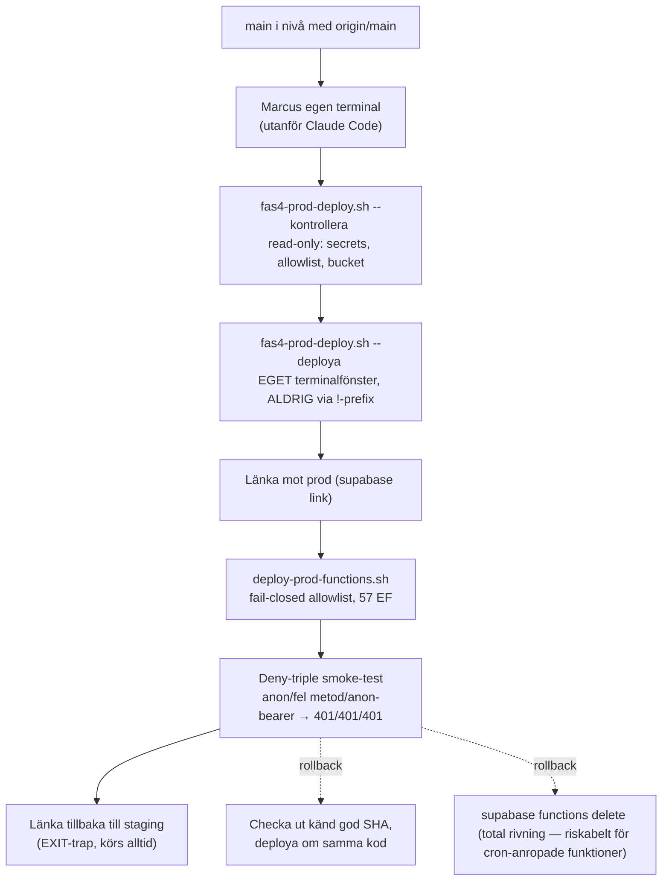

**Utlösare:** en människa (Marcus), aldrig automatiskt. **Kontroll före:**
`--kontrollera` (read-only). **Kontroll efter:** deny-triple smoke-test per
funktion, manuellt. **Rollback:** **verifierat att Supabase CLI:t saknar ett
`rollback`-subkommando helt** (`functions`-ytan har bara `list`, `delete`,
`download`, `deploy`, `new`, `serve`) — de två enda vägarna är att deploya om
en känd god commit, eller radera funktionen helt. **Var staging kan glida
från `main`:** **detta är det tydligaste svaret på uppdragets fråga.**
`grep` över samtliga workflow-filer gav **noll träffar** på `supabase
functions deploy` — CI deployar aldrig Edge Functions till staging heller.
Koden `test-staging`-jobbet anropar är alltså **vad någon senast deployade
för hand till staging, inte nödvändigtvis den commit som testas** (mätt av
J1e/J8.4 som en verklig, omätt drift-risk, inte en hypotes).

#### (c) Databasmigrationer — `db push`, applicerar allt väntande

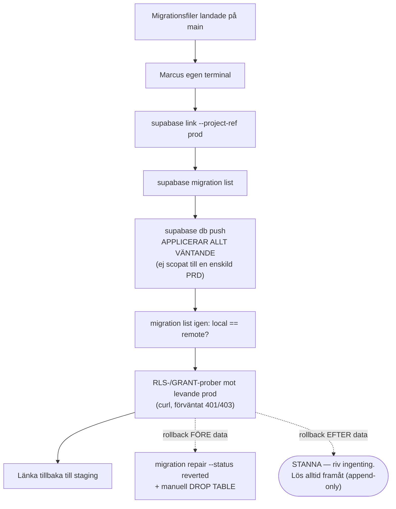

**Utlösare:** manuell körning. **Kontroll före:** `migration list`, diff mot
lokalt. **Kontroll efter:** `migration list` igen + RLS/GRANT-curl-prober,
förväntat 401/403 — en `200`/`201` stoppar driftsättningen omedelbart per
runbookens egen regel. **Rollback:** mekaniskt möjlig ENDAST innan verklig
data finns i tabellen; efter det är regeln uttryckligen "riv ingenting,
korrigera framåt" (bokföringsplikt, SFL 39 kap. 5 § för kvitton).

#### (d) Airtable-schemaändringar — skript-intern gate, ingen hook för schemat

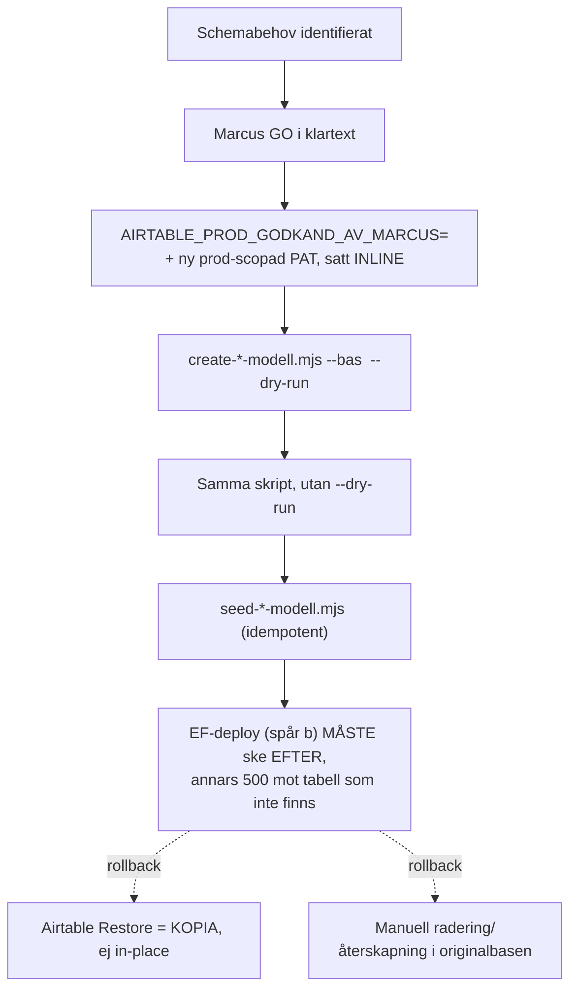

**Utlösare:** manuell körning. **Kontroll före/efter:** en miljövariabel
skriptet SJÄLVT läser — **ingen hook, inget deny-skript för schema-vägen**
(till skillnad från DATA-vägen: `scripts/deny-prod-airtable.sh`, `TASK-419`,
nekar mekaniskt varje `mcp__airtable__*`-anrop mot prod-basens ID oavsett
anropare — men det är en ANNAN yta, data snarare än schema). **Rollback:**
verifierat att Airtables Restore-funktion skapar en KOPIA, aldrig en
in-place-återställning — det finns ingen "ångra"-knapp för en delvis skriven
schemaändring.

### 6. Dataflöden och hemligheter

**I klartext:** vissa kontroller kör helt i en låst, isolerad låda utan
kontakt med omvärlden ("hermetiska") — de kan aldrig av misstag skriva till
en riktig databas. Andra kontroller når riktiga, delade tjänster med riktiga
inloggningsuppgifter. Ingen kontroll i hela kedjan når produktionsdata.

| Jobb / kontroll | Hermetisk? | Externa tjänster den når | Hemligheter (namn, aldrig värde) |
|---|---|---|---|
| `test-fast`, `acceptance`, `acceptance-sjalvtest`, `webblasarbeteende`, `a11y` | **Ja** — MSW-mockad fixturvärld, hermetiken bevisad tvåsidigt (`acceptance-sjalvtest`, `ADR-080` beslut 3) | Ingen | Inga |
| `lint`-jobbets ~63 interna gatekeeper-testsviter | **Starkt indikerad hermetisk** (mktemp-sandlådor, stubbade PATH-verktyg per egna filhuvuden — ej personligen verifierat av mig) | Ingen avsedd | Inga |
| `audit` | Nej | npm-registrets advisory-endpoint | Inga (publikt API) |
| `docs` (`lychee --offline`) | Ja, avsiktligt | Ingen (externa länkar körs INTE här, se `ADR-082`) | `GITHUB_TOKEN` (bara för rate limit, ej dataåtkomst) |
| `review-backstopp` | Ja (inga npm-beroenden installeras alls, medvetet) | GitHub API (`gh pr view`) | `GITHUB_TOKEN` |
| `test-staging`, `kontraktsvakt` | **Nej** — riktig Supabase Auth, riktig Postgres, riktig Airtable-STAGING | Supabase staging (`pqtshyierkdgwdnxuirz`), Airtable staging (`apphjj8Q7lkXCMsL4`), Resend (hård allowlist, 4 adresser), DocRaptor (leverantörens testläge) | `STAGING_AIRTABLE_TOKEN`, `TEST_ADMIN_EMAIL/PASSWORD`, `TEST_USER_EMAIL/PASSWORD`, `TEST_REGISTRATION_RECORD_ID`, `TEST_SUPABASE_URL/ANON_KEY` |
| `purge`, `purge-efter` | Nej — riktig Airtable-STAGING | Airtable staging | Samma `STAGING_AIRTABLE_TOKEN` |
| `nightly-links` | Nej, avsiktligt | Riktiga externa webbplatser (kallt, ingen cache) | `GITHUB_TOKEN` |
| `nightly-audit` | Nej | npm-registrets advisory-endpoint | Inga |
| `backlog-closure`, `pausade-sessioner`, `sessionsdok-fonster`, `obesvarade-larm` | Nej — läser repo-tillstånd/GitHub API | GitHub API (`gh issue list`, `gh api`) | `GITHUB_TOKEN` |
| Vercel-deployen | Nej — bygger och serverar riktig frontend | Vercel-plattformen, publika `VITE_*`-nycklar bakade in i klientbunten | `VITE_SUPABASE_URL`, `VITE_SUPABASE_ANON_KEY` (publika per design) |

**Ingen CI-yta når produktion.** Detta är **starkt indikerad, inte fullt
verifierad av mig**: J1e:s live-läsning av GitHubs Actions-secrets visade
exakt åtta repo-secrets, samtliga `STAGING_*`/`TEST_*`-namngivna, noll
`PROD*`. Jag körde själv `grep -n "PROD\|prod"
.github/workflows/ci.yml | grep -i secret` och fick noll träffar. Jag
försökte komplettera med en direkt `grep` efter den faktiska
prod-Supabase-referensen i samtliga workflow-filer — kommandot **nekades
mekaniskt av `scripts/deny-prod-ref.sh`** innan det körde, eftersom hooken
matchar hela kommandosträngen mot referensen oavsett avsikt (se § Metod,
punkt 3). Jag kunde alltså inte slutföra den sista, mest direkta
verifieringen själv inom detta pass. Vad som krävs för att stänga luckan helt:
Marcus egen körning av samma `grep`, utanför Claude Code, eller en
motsvarande sökning gjord av en agent utan hookens begränsning (om en sådan
finns).

### 7. Kända hål i kartan

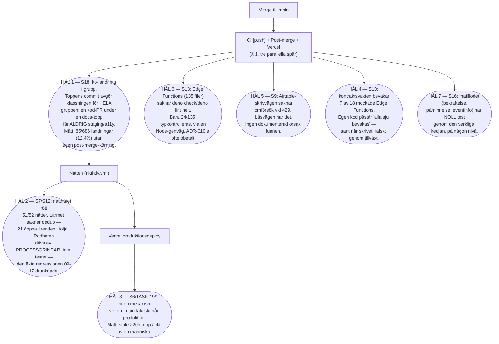

| # | Hålet | Var i kedjan | Evidens |
|---|---|---|---|
| 1 | Täckningslucka vid kö-landning i grupp | Post-merge, mellan merge och natt | `underlag/01-orkestrerarens-stickprov.md` S18: 85/686 (12,4 %) landningar utan post-merge-körning i ett fönster; `underlag/j8-4` mätte oberoende 31/230 (13,5 %) i ett annat fönster. Mekanism: `post-merge.yml`s `klassning`-jobb ärver bara TOPPENS commit-klassning i en flerpost-kö-landning. |
| 2 | Nattnätets överröstade signal | Natten, larmkedjan | S7 (51/52 röda nätter, 21 öppna `ci-natt`), S12 (rödheten är processgrindar + `nightly-audit`, inte testsviten, tills 2026-09-17) |
| 3 | Ingen vakt på att `main` når produktion | Efter merge, frontend-spåret | S6: `TASK-199`, öppet sedan 2026-08-11, `High`-prioritet, mätt stale ≥20h |
| 4 | Elva obundna mockar i kontraktsvakten | Nattens `kontraktsvakt`-jobb | S10: `handlers.ts` registrerar 18 EF-mockar, `kontraktsfall.ts` bevakar 7; egen kommentar påstår "alla sju bevakas" |
| 5 | Edge Functions utan Deno-kontroll | Kodkvalitet, oberoende av CI-ytan | S13: 24/135 filer typkontrolleras via Node-genväg; `deno check`/`deno lint` inkopplat ingenstans |
| 6 | Skrivvägen utan 429-omförsök | Data-lagret, `_shared/airtable-client.ts` | S9: läsfunktioner har `withAirtable429Retry`, sex skrivfunktioner saknar det |
| 7 | Mailflödet utan verklighetstest | Testpyramiden | S16: `send-action-email` har noll test genom verklig Resend/Airtable-kedja på någon nivå; testpyramiden själv har drivit (18→61 acceptance-filer, styrande text ouppdaterad) |

### 8. Djupmodul-läsningen

**Vad "djup modul" betyder, i klartext:** ett bra verktyg har ett litet,
enkelt gränssnitt utåt — några få saker du behöver veta — medan all
komplexitet är gömd inuti. En bra kaffebryggare har en knapp. Frågan här är:
vad måste en människa eller en agent FAKTISKT kunna, i huvudet, för att landa
en ändring i detta repo korrekt?

**Det uppmätta gränssnittet i dag** (räknat, inte uppskattat):

- `CLAUDE.md` § "Bygg, testa, linta" till och med § "Kortnummer" är
  **~600 rader prosa** en bidragsgivare i praktiken förväntas ha internaliserat
  (mätt av orkestreraren, citerat i uppdraget).
- Inom det spannet: fyra DoD-kommandon (konvention, inte spärr), tre namngivna
  lägen för när `verify:ci-parity` FÅR köras (annars förbjudet), sex distinkta
  exit-koder för review-loopens beslut (0/10/20/1/2/64), en fyrfältstabell för
  vad `autoMergeRequest: null` betyder beroende på sammanhang, en separat regel
  om att `isInMergeQueue` måste frågas via GraphQL (inte `gh pr view --json`),
  och ett helt eget avsnitt om varför en nyregistrerad hook inte kan förlitas
  på i samma session som skapade den.
- Utöver `CLAUDE.md`: minst sju ADR:er styr delar av samma yta direkt
  (`ADR-076`, `ADR-077`, `ADR-080`, `ADR-094`, `ADR-105`, `ADR-036`, `ADR-090`)
  plus nio egna PreToolUse-hookar vars exakta räckvidd (inklusive att
  `!`-prefixet passerar samtliga) inte står i någon enskild fil utan måste
  sättas ihop av läsaren själv.

**Jämfört med vad en djup modul borde kräva:** ett gränssnitt som är lika
stort som — eller större än — den mekanik det ska abstrahera är per
definition INTE en djup modul; det är precis den "grunda modul"-antimönster
litteraturen om mjukvaruarkitektur varnar för (komplexiteten flyttas till
GIVEN, inte GÖMS). Här är gränssnittet OCH implementationen båda stora, och
läsaren måste förstå merparten av implementationen för att undvika de mätta
fällorna (t.ex. `gh pr merge --auto`s tvetydiga exitkod, eller att en PR som
äter sig ur kön KONSUMERAR sin armering tyst). Detta är en beskrivning av
NULÄGET, inte en brist i sig — repot är byggt av en liten grupp som själva
skrivit varje rad och därför bär kunskapen i huvudet ändå. Men det är exakt
den sortens skuld en ny bidragsgivare (mänsklig eller agent) betalar i sin
helhet, på en gång, första gången de rör landningsflödet.

## Dom

Arkitekturen håller sitt eget löfte fram till `main` — grinden är
välkonstruerad, fail-closed genomgående, och varje mätning i källunderlaget
som prövat den (S1, S2, S3, S5, hela `underlag/j8-5`) bekräftar att den gör
precis vad den är byggd för att göra. Komplexiteten FÖRE `main` är stor men
motiverad: nästan varje tröskel bär en namngiven ADR eller ett mätt
incident bakom sig.

Det som brister är inte tekniken efter `main` — det är att "efter `main`" som
KATEGORI bara har en enda försvarsmekanism (ett larm) och att den mekanismen
saknar en garanterad läsare. Uppdragets fråga — är detta en välmotiverad
kvalitetsplattform eller en maskin vars komplexitet motiverar sig själv? —
får därför två olika svar beroende på var i kedjan man tittar: **före
`main`, ja, välmotiverad. Efter `main`, komplexiteten (tre separata
larmkanaler, fyra manuella deployspår, ingen dedup i den viktigaste av dem)
har vuxit snabbare än den mänskliga förmågan att svara på den.**

## Vad jag inte kunde belägga

- **Att aggregatorns `needs`-lista vaktas av en paritetsgrind.** Stickprovsloggens
  öppna fråga (S2 b) är oavgjord i mitt underlag — jag har inte själv läst
  `.listparitet-policy.conf`/`.ci-parity-policy.json` i den detalj som krävs
  för att svara. **Ej verifierbar inom detta pass**; kräver en riktad läsning
  av båda filerna mot `ci-passed`s exakta `needs`-lista.
- **Att inget CI-jobb når produktionen, i sista instans.** Se § 6 — min egen
  verifiering stoppades av `deny-prod-ref.sh` innan den kunde slutföras.
  **Starkt indikerad**, inte verifierad. Krävs: Marcus egen `grep` utanför
  Claude Code, eller motsvarande utan hookens räckvidd.
- **Om `.gitignore`de loggfiler (`hook-fallningar.jsonl`, kontraktsvaktens
  historiska svar) ändrar bilden i § 4 och § 6.** Jag har inte läst dem själv
  i detta pass — `underlag/j1d` gjorde det för hook-lagret specifikt, och
  jag återger dess siffror utan egen omprövning.
- **07:s fulla innehåll.** Jag läste bara `07-hermetiska-tester-kontra-
  realistisk-e2e.md`s kort svar och paritetstabell, inte hela filen, eftersom
  `underlag/j8-4` redan täcker samma paritetsfråga i egen rätt med mätningar
  jag har återgivit i § 5b och § 6. Om `07` bär en avvikande slutsats någon
  annanstans i sin text har jag inte sett den.
- **Talens rörlighet.** Nattnätets rödhet (§ 4, § 7) och täckningsluckans
  andel (§ 7) är ögonblicksmätningar från samma dag som detta dokument. Båda
  källorna flaggar själva att talen kan ha rört sig redan när nästa session
  läser detta — `review_by`-datumet i frontmatter är satt med det i åtanke.

## Rekommendationer

**Markerat som rekommendation, inte beslut — Marcus och orkestreraren väger
dessa mot resten av granskningens fynd.** Ingen av dem kräver att något rivs
för att fungera; samtliga är tillägg eller riktade fixar.

1. **Ge post-merge- och nattlarmen samma dedup-disciplin som redan finns i
   `links-arende` och `nightly-watchdog.yml`.** Mönstret är byggt och bevisat
   på två ställen — det saknas bara i `nightly.yml`s eget `alarm`-jobb, som är
   den kanal med flest obesvarade ärenden (§ 4, § 7 hål 2).
2. **Låt post-merge-klassningen läsa HELA det pushade spannet
   (`github.event.before` → `github.sha`), inte bara toppens commit**, så en
   kod-landning under en docs-topp inte tyst mister sin enda staging-kontroll
   (§ 7 hål 1). `underlag/01-orkestrerarens-stickprov.md` S18 pekar redan ut
   denna riktning som liten och reversibel.
3. **Bygg det verifikationskommando `TASK-199` redan efterfrågar** — en
   mekanisk jämförelse mellan senaste Vercel-`Production`-deployens
   commit-SHA (redan läsbar via `gh api .../deployments`) och `origin/main`,
   körbar som en nightly-vakt (§ 5a, § 7 hål 3). Detta är den högst
   prioriterade luckan av de fyra deployspåren, eftersom den är den enda utan
   NÅGON mekanism alls i dag.
4. **Betrakta grindarna före `main` som klara att lämna i fred**, och rikta
   nästa arbetspuls mot läsningen av det som redan larmar — inte mot fler
   mekanismer. Domen (ovan) pekar entydigt åt det hållet: teknikens täthet
   före `main` är redan hög; det som saknas är en mänsklig eller
   orkestrerad rutin som faktiskt arbetar av larmkön i takt med att den
   fylls.

## Källor

**Skrivna av andra agenter i denna granskning, lästa i sin helhet av mig
(utom där annat anges):**

- `underlag/00-agentkontrakt.md`
- `underlag/01-orkestrerarens-stickprov.md`
- `underlag/j1a-ci-yml-och-ci-suite.md`
- `underlag/j1b-ovriga-workflows-och-github-katalogen.md`
- `underlag/j1c-ci-wirade-skript-och-policyfiler.md`
- `underlag/j1d-lokala-hookar-och-agentmekanismer.md`
- `underlag/j1e-externa-installningar-och-deployvagar.md`
- `underlag/j1f-test-bygg-och-lintkonfiguration.md`
- `underlag/j8-4-staging-och-e2e.md`
- `underlag/j8-5-grindlogik-skip-och-gront.md`
- [04-branch-worktree-commit-och-pushflode.md](04-branch-worktree-commit-och-pushflode.md)
  (läst i sin helhet)
- [07-hermetiska-tester-kontra-realistisk-e2e.md](07-hermetiska-tester-kontra-realistisk-e2e.md)
  (läst delvis — se § Osäkerheter)

**Repo-filer jag citerar via ovanstående underlags egna radnummer** (jag har
inte räknat om raderna själv där jag inte säger det uttryckligen):
`.github/workflows/ci.yml`, `.github/workflows/ci-suite.yml`,
`.github/workflows/post-merge.yml`, `.github/workflows/nightly.yml`,
`.github/workflows/nightly-watchdog.yml`,
`.github/workflows/visual-baselines.yml`, `.github/workflows/gate-proof.yml`,
`.github/workflows/review-backstopp-proof.yml`,
`docs/decisions/ADR-076-merge-grinden-ruleset-pr-flode.md`,
`docs/decisions/ADR-077-riskanpassad-ci-klassning-dedup-nightly.md`,
`docs/decisions/ADR-080-acceptance-klassen-hermetisk-utbrytning.md`,
`docs/decisions/ADR-082-lankgrindens-form-presubmit-postsubmit.md`,
`docs/decisions/ADR-105-review-grinden-fyra-deltan-byggs-inte-adopteras.md`,
`backlog/tasks/task-199…`.

**Egna kommandon, körda av mig 2026-09-17 (samtliga läsande):**

```text
pwd
ls docs/research/ci-djupgranskning-2026-09-17/
ls docs/research/ci-djupgranskning-2026-09-17/underlag/
grep -n "PROD\|prod" .github/workflows/ci.yml | grep -i secret
```

samt ett fjärde, ofullständigt försök (nekat av `scripts/deny-prod-ref.sh`
innan det kördes) att `grep` efter prod-Supabase-referensen i samtliga
workflow-filer — se § Metod punkt 3 och § 6 för vad det betyder för
tillförlitligheten i påståendet "inget CI-jobb når produktion".
