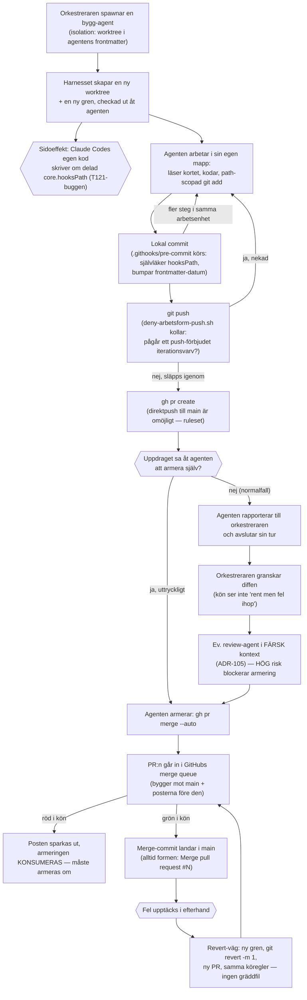

# Branch-, worktree-, commit- och pushflöde

> **Proveniens:** grundstommen (flödet, steg 1–12, isolering, revert) är ett
> avgränsat research-pass, Jobb 2 av CI-djupgranskningen (Session 126,
> 2026-09-17), beställt av orkestreraren enligt
> `tasks/sessions/bilagor/s126-uppdrag/uppdraget-verbatim.md` rad 108–129.
> Kört av modellen `claude-sonnet-5` ("Sonnet 5") i worktreen
> `/Users/marcus/Repon/miranon-media-admin/.claude/worktrees/s126-ci-djupgranskning`,
> gren `docs/s126-ci-djupgranskning`, ovanpå huvudkatalogens ögonblicksbild
> `origin/main` = `eeca8c72` (2026-09-08). **§ "Push-kadens" nedan är
> infogat i våg 2, samma dag**, ur Jobb 3
> ([`underlag/j3-push-kadens.md`](underlag/j3-push-kadens.md), uppdraget
> rad 133–146), skrivet av samma modell i ett eget agent-pass.
> **En tredje körning av samma modell** sammanfogade de två passen till
> detta dokument, 2026-09-17: rättade två fynd enligt orkestrerarens
> stickprovslogg
> ([`underlag/01-orkestrerarens-stickprov.md`](underlag/01-orkestrerarens-stickprov.md),
> post S17 och S14 — se § "Motsägelse" och § "Push-kadens"), och löste en motsägelse
> mellan de två passens egna mätningar om force-push-frekvens med en egen
> kombinerad mätning (§ "Avstämning mellan de två passen"). Allt som
> beskrivs som "i dag" gäller ögonblicksbilden ovan plus vad som
> verifierats live mot GitHub 2026-09-17 (märkt med datum genomgående).
> Öppna PR:er beskrivs som pågående, aldrig som nuläge.

## Kort svar

Repot har **en enda obestridlig mekanisk grind** för hela landningsvägen —
GitHubs ruleset `main-skydd` (id `19627609`) plus dess `merge_queue`-regel —
och **två git-specifika lokala spärrar** (hookar som körs på
Marcus/orkestrerarens dator innan ett kommando får köras): en som håller
reda på VEM som får skriva git i huvudkatalogen just nu, och en som
blockerar `git push` medan ett uttryckligt "under arbete"-läge (kallat
`iteration`) är aktivt, byggd 2026-08-07 (`ADR-097`). **Allt annat i
flödet — hur en gren namnges, hur en commit avgränsas, om `git fetch` körs
före ett arbete — är dokumenterad regel eller ren praxis, inte teknik som
stoppar ett misstag.** Det är inte en brist: det är en medveten arkitektur
där maskinen håller den enda invarianten som MÅSTE hålla (inget obevakat
kommer in i `main`) och lämnar resten åt disciplin, granskning och en
repererbar väg tillbaka (revert, väl övad — se § Återställning).

**Kadensen den mekanismen bär är ovanligt väl mätt för ett projekt av den
här storleken:** ~29 sammanslagna PR:er per dag, median 22 minuter från
öppning till landning, median 5 ändrade filer/214 rader, och **66 % av
grenarna (80 av 121) fick EXAKT EN CI-körning** innan de landade — "en push
per färdig enhet" är normen, inte undantaget. Regeln är dubbelt bärad:
skriven ("commit gratis, push kostar") OCH teknisk (samma push-hook som
ovan), och två sessionsdokument visar spärren fälla skarpt i verkligheten.
Draft-läget (ett "utkast"-läge som gör en PR osynlig för sammanslagning)
används INTE proaktivt som branschens "push early, draft PR" — det används
REAKTIVT, som en broms medan en oberoende granskar-agent arbetar. Se
§ "Push-kadens" nedan.

Den starkaste enskilda upptäckten i detta pass är att **arkitekturen ofta
lever upp till sitt eget löfte snabbare än dokumentationen hinner ikapp —
och ibland med en tidslinje i motsatt riktning mot vad ett tidigare utkast
av det här dokumentet trodde.** En mekanism CLAUDE.md 2026-08-24 kallade
"obetald skuld" (automatisk städning av gamla lokala grenar) fanns som
MANUELLT verktyg redan 2026-08-07 och blev AUTOMATISK fyra dagar **efter**
noteringen (2026-08-28) — inte tre veckor före den. Skulden betalades
snabbt, men bara medan en sessions bevakning faktiskt kör: en hel
semestervecka utan sessioner lät ändå 57 lokala grenar hopa sig. Se
§ "Motsägelse: den 'obetalda skulden' är delvis betald" och § "Push-kadens".

Grennamngivningen är samtidigt det tydligaste exemplet på "ren praxis utan
regel": av 500 landade grenar (2026-08-22–2026-09-08) användes **15 olika
prefix** plus "inget prefix alls" — ingen fil i repot föreskriver ett schema.
Det kostar ingenting mekaniskt (inget läser prefixet för att fatta beslut),
men det är den punkt där en läsare snabbast ser att disciplinen bärs av
människor och agenter, inte av ett verktyg.

**Den tydligaste kvarvarande risken är inte förlust — det är en fråga som
får åldras obesvarad.** En gren med 40 lokala commits har passerat fem
sessioners avslut utan ett beslut om sitt öde (16+ dagar) — ingenting i
arkitekturen tvingar fram det beslutet. Se § "Push-kadens" Fynd 6.

## Vad jag läste först

Jag inventerade `docs/research/` (167 filer) och `docs/decisions/` (132
ADR:er) innan jag sökte något nytt, och läste följande i sin helhet eller i
relevanta delar innan jag skrev en rad:

- **`CONTRIBUTING.md`** §§ "Pull Request-flöde", "Push-kadensen",
  "Landnings-ordningen" och "Revert-vägen" (rad 350–827) — repots mest
  auktoritativa, mest uppdaterade primärkälla för hela flödet. Den bär redan
  två skarpa reverter med mätt tidsåtgång, den fulla merge queue-historiken
  och den exakta `git revert -m 1`-mekaniken. Nästan inget i detta dokument
  motsäger den — merparten av mitt jobb var att FYLLA I regel/spärr/praxis-
  distinktionen den redan pekar mot, inte att hitta nya sanningar.
- **`.claude/agents/bygg-agent.md`** (318 rader, helt) — det enda dokument
  som faktiskt styr en subagents git-beteende i produktion.
- Sju ADR:er i sin helhet: `ADR-076` (merge-grinden), `ADR-090`
  (katalogägarskap), `ADR-096` (subagentens väntekontrakt), `ADR-097`
  (arbetsformens tillståndsbärare/push-ekonomi), `ADR-073` (parallella
  batch-pipelines), `ADR-086` (uppdragets premisser), `ADR-100` § 1
  (sanningshierarkin).
- Tre PreToolUse-hookar i sin helhet, som körande kod, inte som beskrivning:
  `scripts/deny-frammande-huvudkatalog.sh` (353 rader läst, ~1200 rader
  totalt), `scripts/deny-arbetsform-push.sh` (325 rader, helt), samt
  `scripts/check-merge-tree.sh` och `scripts/stada-grenar.sh` (delvis).
- Elva befintliga research-pass om isolering, T121-buggen, revert och
  parallellitet (se § Källor) — flera av dem gamla nog (2026-07-28 till
  2026-08-04) att jag omprövade deras giltighet i stället för att bara citera
  dem (se nedan).
- `tasks/lessons/vol-04.md`, `vol-05.md`, `vol-06.md` för konkreta
  isoleringsläckage-instanser.
- Syskonfilen `docs/research/ci-djupgranskning-2026-09-17/underlag/
  j1e-externa-installningar-och-deployvagar.md` (samma granskning, Jobb 1e),
  som samma dag live-verifierade GitHub-rulesetets sakinnehåll mot ADR-076
  och fann noll drift — jag återanvänder den mätningen i stället för att göra
  om den (se § Metod).

**Vad som var åldrat och omprövades riktat:** T121-forskningspasset
(2026-08-04) mätte buggen mot Claude Code **2.1.221**. Den här sessionen kör
**2.1.274** (sex veckor senare). Jag körde om den avgörande verifieringen
— `strings` mot den nu installerade binären — i stället för att anta att
fyndet höll (se § Fynd 4). Push-kadens-siffran "7–11 PR:er per dag"
(`docs/research/push-kadens-agent-arbetstrad-2026-07-26.md`, citerad i
`CONTRIBUTING.md`) visade sig vid egen mätning vara kraftigt föråldrad —
dagens takt är ungefär tre gånger högre. Siffrans TOLKNING görs i
§ "Push-kadens" nedan (Jobb 3:s delfråga, infogad i våg 2) — jag rapporterar
rätalet här eftersom det påverkades av samma mätning som resten av detta
dokument.

**Vad som redan var 80 % täckt och därför bara kompletterades:** hela
merge queue-mekaniken, revert-mekaniken och push-ekonomins princip står redan
utförligt i `CONTRIBUTING.md` och `CLAUDE.md`. Detta dokument destillerar dem
till en läsbar helhet, korsreferererar dem mot faktisk kod och mäter det som
inte redan var mätt (grennamn-fördelning, PR-storlek, gren-livslängd,
merge-metod, force-push-frekvens) — det duplicerar dem inte.

**Tillägg i våg 2, samma dag (sammanfogningen till detta dokument):** innan
sammanfogningen lästes hela
[`underlag/00-agentkontrakt.md`](underlag/00-agentkontrakt.md) § "Tillägg
inför våg 2 och 3" och hela
[`underlag/01-orkestrerarens-stickprov.md`](underlag/01-orkestrerarens-stickprov.md)
(arton stickprov). Två poster styr rättelserna i detta dokument: **S17**
(grensvepets tidslinje — se § "Motsägelse" nedan) och **S14** (repot är
publikt, inte privat — se § "Push-kadens"). Jobb 3:s egen läslista
([`underlag/j3-push-kadens.md`](underlag/j3-push-kadens.md) § "Vad jag läste
först") upprepas inte här; den bär sin egen proveniens i källfilen.

## Metod

Käll-hierarkin följdes strikt: körande kod och live-mätning mot GitHub före
prosa, prosa (ADR/CONTRIBUTING) före forskningspass, forskningspass daterade
efter ålder. Varje bärande påstående nedan är märkt med exakt en av:
**verifierad** (jag har själv sett koden eller mätt beteendet),
**starkt indikerad** (flera oberoende spår, men jag har inte sett själva
mekanismen), **osäker**, eller **ej verifierbar**.

Jag återanvände Jobb 1e:s live-läsning av GitHub-rulesetet (`gh api
repos/high-five-group/miranon-media-admin/rulesets/19627609`, 2026-09-17) i
stället för att göra om samma API-anrop — agentkontraktet ber uttryckligen om
sparsamhet mot GitHubs API när flera sessioner delar den. Allt annat
empiriskt tal i detta dokument (PR-korpus, gren-livslängd, merge-metod,
force-push-stickprov, hook-testsviter) mätte jag själv, 2026-09-17, med
kommandona citerade inline.

## Grundbegrepp, för den som inte kodar

Referenspersonen för detta avsnitt är någon som aldrig skrivit ett
git-kommando. Termerna förklaras här en gång och används sedan rakt av.

- **Gren (branch):** en egen, namngiven kopia av kodens historik som någon
  kan ändra utan att röra huvudversionen. Som ett separat kladdblock bredvid
  originalet — ändringarna syns bara i kladdblocket tills någon för över dem.
- **Commit:** en sparad ögonblicksbild av en ändring, med ett meddelande som
  förklarar vad och varför. Motsvarar att spara en ny version av ett
  dokument med en kommentar om vad som ändrades.
- **Worktree (arbetsträd):** en egen mapp på disken där en gren ligger
  uppcheckad och redigerbar, samtidigt som andra worktrees för SAMMA repo
  finns i andra mappar. Flera personer kan då jobba i samma bok utan att
  sitta på samma sida.
- **Huvudkatalog:** den ursprungliga mappen där repot först klonades ner —
  den "riktiga" boken, som alla worktrees är utdrag ur.
- **`main`:** grenen som räknas som "den skarpa, aktuella versionen". Allt
  som ska bli en del av produkten måste till slut hamna här.
- **Pull request (PR):** en formell begäran om att föra över en grens
  ändringar till `main`, öppen för granskning innan den går igenom.
- **Merge (sammanfogning):** själva handlingen att föra över en grens
  ändringar till en annan gren, oftast till `main`.
- **Merge queue (sammanfogningskö):** ett system på GitHub som tar emot
  flera PR:er som väntar på att landa och bygger och testar dem i tur och
  ordning, en efter en, mot den senaste versionen av `main` — så att två
  personers ändringar aldrig råkar krocka osynligt.
- **Ruleset:** GitHubs regelverk för en gren — vilka krav som måste vara
  uppfyllda innan något får landa där (t.ex. "testerna måste vara gröna").
- **Hook:** ett litet program som körs automatiskt precis före eller efter
  en handling (t.ex. innan ett kommando får köras) och som kan stoppa den.
- **Rebase:** att skriva om en grens historik som om den hade börjat från en
  senare punkt i `main` — nämns här för att förklara varför repot MEDVETET
  undviker det (se § Undantagen).
- **Revert:** att skapa en NY ändring som river tillbaka en tidigare
  ändring, i stället för att radera historiken. Historiken visar då både
  misstaget och rättelsen.
- **Force-push:** att skriva över en grens historik på GitHub med en ny
  version, i stället för att lägga till ovanpå den gamla. Kan förstöra
  andras arbete om det görs fel — men förekommer regelbundet i detta repo
  under aktivt arbete på en öppen PR, bara aldrig mot `main` eller en
  kö-satt gren (se § "Undantagen" och § "Avstämning mellan de två passen").

## Flödet steg för steg

Var och en av uppdragets tolv steg, med källa. Se § "Diagram" för
helheten i bild och § "Trekolumnstabellen" för en samlad regel/spärr/praxis-
översikt.

### 1. Skapar och namnger grenar

En bygg-agent skapar aldrig en gren "för hand" — dess `isolation: worktree`
i frontmatteln (`.claude/agents/bygg-agent.md` rad 4) gör att harnesset
(Claude Codes egen körmiljö) skapar worktreen och grenen åt den när
agenten spawnas. Filen instruerar bara: **"Egen gren, beskrivande namn."**
(`bygg-agent.md` rad 179) — inget prefix-schema, ingen längdgräns, inget
krav på att koppla grennamnet till ett kort-ID. **Verifierad.**

`ADR-073` § beslut 2 föreskriver ETT eget schema, `task/<kort-id>`, men
uttryckligen bara för sin egen kontext (parallella batch-pipelines där
orkestreraren spawnar flera `do-work`-agenter samtidigt) — inte som en
repo-generell regel. **Verifierad**, via direkt läsning.

Jag sökte uttryckligen efter en dold, mer generell regel
(`grep -rn "prefix\|grennamn\|branch.*namn" docs/decisions/*.md
.claude/agents/*.md CONTRIBUTING.md CLAUDE.md`) och hittade ingen. **Frånvaro
av bevis här är i sig ett resultat**, inte en lucka i min sökning: den
mätta spridningen i praktiken (nedan) är precis vad avsaknaden av regel
förutsäger.

**Praxis, mätt** (500 senast landade PR:er, `gh pr list --state merged
--limit 500 --json headRefName …`, 2026-09-17, spann 2026-08-22–2026-09-08):

| Prefix | Antal | Andel |
|---|---|---|
| `docs/` | 253 | 50,6 % |
| `fix/` | 72 | 14,4 % |
| `feat/` | 67 | 13,4 % |
| `chore/` | 40 | 8,0 % |
| `task/` | 30 | 6,0 % |
| (inget prefix, t.ex. `task-442-…`) | 22 | 4,4 % |
| `ci/` | 4 | 0,8 % |
| `dependabot/` | 3 | 0,6 % |
| `visual-baselines/`, `fynd/` | 2 vardera | 0,4 % vardera |
| `wip/`, `test/`, `proto/`, `lessons/`, `design/` | 1 vardera | 0,2 % vardera |

**Femton distinkta prefix plus en "inget prefix"-kategori** — betydligt fler
än de "minst fem" orkestreraren observerade via `git worktree list`.
**Verifierad.**

### 2. Väljer eller byter gren

En bygg-agent byter aldrig gren i huvudkatalogen — dess kontrakt förbjuder
`git checkout` mot en sökväg utanför den egna worktreen (`bygg-agent.md` rad
14–15). En människa eller orkestreraren i huvudkatalogen väljer gren fritt,
men äger då huvudkatalogens "plats" — se § Parallella sessioner nedan för
vad det ägandet betyder.

### 3–4. Använder worktrees / isolerar parallella agenters arbete

Se eget avsnitt nedan (§ Parallella sessioner och agenter) — frågan är
central nog för hela uppdraget att den förtjänar sin egen genomgång i
stället för en rad här.

### 5. Gör lokala commits

**Ingen mekanisk spärr finns på VAD som får committas lokalt** — commit är,
enligt `ADR-097`s princip, "gratis": det kostar ingen CI, ingen kö-plats,
och kan göras hur ofta som helst. `bygg-agent.md` instruerar path-scopad
`git add` (nästa steg), men själva commit-kommandot är obevakat.

**Ett undantag, tekniskt bevisat:** `.githooks/pre-commit` körs vid VARJE
lokal commit i detta repo (aktiverat via `git config core.hooksPath
.githooks`, satt av `package.json`s `postinstall`). Den auto-bumpar
`updated:`-fältet i styrande dokuments YAML-frontmatter, självläker en
skadad `core.hooksPath` (se § Fynd 4, T121), och kör vid behov en
staging-preflight-vakt. Detta är alltså en teknisk spärr — men den styr
FILINNEHÅLL, inte grenval eller commit-avgränsning. **Verifierad**, läst i
sin helhet.

### 6. Avgränsar vad som ingår i en commit

**Dokumenterad regel, ingen mekanisk spärr:** `bygg-agent.md` rad 182–183:
"`git add` är **path-scopad**, alltid. `git commit` committar hela indexet,
och DoD kräver noll orelaterade filer i diffen." Ingenting i repot hindrar
ett `git add -A`; disciplinen bärs av instruktionen plus (för PR:er som
hamnar i kön) `review-agent`s granskning i efterhand, och av Marcus egen
läsning av diffen. **Verifierad** som prosa; **ej verifierbar** som teknisk
spärr — ingen sådan hittades.

Global `CLAUDE.md` skärper samma regel ("Prefer adding specific files by
name rather than `git add -A`") — samma dokumenterade regel, två nivåer
(hub + spoke), noll mekanik i något av lagren.

### 7. Hanterar andra agenters eller utvecklares samtidiga ändringar

Tre olika mekanismer täcker tre olika delar av denna fråga, och det är lätt
att blanda ihop dem:

1. **Merge queue** löser ordningen mellan REDAN ÖPPNA, klara PR:er — den
   ser aldrig två agenter som fortfarande skriver kod.
2. **Katalogägarskaps-hooken** (`deny-frammande-huvudkatalog.sh`, se
   § Parallella sessioner) löser konflikten om VEM som får skriva git i
   HUVUDKATALOGEN just nu.
3. **`check-merge-tree.sh`** (ADR-073 § beslut 4) löser konflikten mellan
   filer i en PARALLELL BATCH innan PR:n ens öppnas — men bara i den
   orkestrerar-styrda batch-kontexten, inte generellt. Jag verifierade
   direkt i skriptet (`scripts/check-merge-tree.sh` rad 1–60) att det körs
   av orkestreraren manuellt efter en batch-agents push, aldrig av CI.
   **Verifierad.**

**Ett forskningspass** (`docs/research/kodfils-partitionering-parallella-
agenter-2026-08-04.md` § Dom) konstaterar att den bredare frågan — vad
händer om två AD HOC-parallella agenter (inte en Marcus-beordrad batch) rör
samma fil — saknar ett anspråksregister helt: mekanismen finns bara när
Marcus explicit beordrat en partitionerad batch. Utanför den kontexten är
det enda skyddsnätet merge queue (upptäcker konflikten VID landning, för
sent för att förebygga dubbelarbete) och `review-agent` (upptäcker den
FÖRE armering, men efter att båda agenterna redan lagt ner arbetet).
**Starkt indikerad** — passet är sex veckor gammalt, men jag hittade ingen
nyare mekanism som motsäger slutsatsen.

### 8. Pushar grenar

Se § "Push-kadens" nedan (Jobb 3:s delfråga, infogad i våg 2) för RYTMEN.
Här: MEKANIKEN.

**Teknisk spärr, verifierad genom läsning av körande kod:**
`scripts/deny-arbetsform-push.sh` nekar `git push` (alla former: direkt,
kedjad med `&&`/`;`/`|`, eller gömd i en kommandosubstitution) om en
per-arbetsträd tillståndsfil (`.claude/arbetsform-tillstand.json`) bär en
arbetsform som står i `.arbetsform-push-policy.conf`s förbjuden-lista.
I dag innehåller den listan **exakt en post: `"iteration"`** — dvs. push
under ett pågående iterationsvarv (`prototype`-skillens § 5) är mekaniskt
blockerad; push i alla andra lägen släpps igenom. Jag körde skriptets
testsvit live: **25 passerade, 0 fallerade, exit 0** (`bash
scripts/test-deny-arbetsform-push.sh`, 2026-09-17). **Verifierad.**

Push till `main` direkt är dessutom omöjlig oavsett arbetsform — GitHubs
ruleset avvisar den innan hooken ens hinner spela roll (se § 11).

### 9. Öppnar pull requests

`gh pr create`, alltid — direktpush till `main` är avvisad, så en PR är den
enda vägen in. `bygg-agent.md` rad 185–199 lägger en regel ovanpå: en PR
som INTE ska armeras omedelbart (medveten parkering, väntar på ett beslut)
ska skapas som `--draft` DIREKT, aldrig lämnas öppen och oarmerad — en
"clean", oarmerad, icke-draft PR är, för varje bevakningsmekanism i repot,
omöjlig att skilja från en glömd PR. **Verifierad**, prosa utan mekanisk
enforcement (ingenting hindrar att skapa en icke-draft PR ändå), men med
en dokumenterad, namngiven lärdom bakom sig
(`tasks/lessons.d/parkerad-pr-utan-draft-ar-oskiljbar-fran-glomd.md`).

### 10. Uppdaterar eller synkroniserar grenar

**Dokumenterad regel, ingen kvarvarande mekanisk anledning:** `gh pr
update-branch` (att hämta in `main`s senaste ändringar i en öppen PR) ska
köras av orkestreraren, aldrig av en agent, och aldrig mot en gren vars
bygg-agent fortfarande arbetar (`CONTRIBUTING.md` rad 457–459). Skälet är
inte längre "annars blir PR:n BEHIND" (merge queue har gjort BEHIND
strukturellt omöjligt sedan 2026-07-29) utan att en push till PR-grenen
avbryter dess pågående CI-körning — mätt live: samma incident inträffade
två gånger i en session (S91) innan regeln skärptes, en gång **12 minuter
in i en grön körning**. **Verifierad** via `CONTRIBUTING.md`, som citerar
den incidenten med källa.

En kö-satt gren KAN inte uppdateras alls via `gh` — push avvisas med
felkoden `GH006` (git-native, inte en repo-specifik spärr) så länge PR:n
ligger i kön. Vägen ut är en GraphQL-mutation (`dequeuePullRequest`) utanför
`gh`s vanliga yta — skarpt prövad en gång, dokumenterad i
`docs/research/task-99-dequeue-enqueue-live-test-2026-08-01.md`.
**Verifierad**, indirekt via det tidigare passets citerade mätning.

### 11. Mergar till `main`

**Den enda punkten i hela flödet med en riktig, obestridlig teknisk spärr.**
GitHubs ruleset `main-skydd` (id `19627609`) — live-verifierat 2026-09-17 av
Jobb 1e i samma granskning, jag återanvänder den mätningen i stället för att
duplicera API-anropet:

| Egenskap | Värde (mätt 2026-09-17) |
|---|---|
| `enforcement` | `active` |
| `bypass_actors` | `[]` — tom, ingen gräddfil för någon |
| `current_user_can_bypass` | `never` — även repo-admin |
| `allowed_merge_methods` | `["merge"]` — squash och rebase avstängda på RULESET-nivå |
| `required_status_checks` | `"CI Passed or Skipped"`, låst till `integration_id 15368` (GitHub Actions-appen) |
| `strict_required_status_checks_policy` | `false` (ändrad från `true` 2026-08-05, oförändrad sedan dess) |
| `merge_queue.grouping_strategy` | `ALLGREEN` |
| `merge_queue.max_entries_to_merge` | `3` |
| `merge_queue.check_response_timeout_minutes` | `60` |
| Klassisk branch protection på `main` | Finns INTE (`404`) — rulesetet är den enda mekanismen |

**Noll drift funnen** mellan detta live-läge och `ADR-076`s dokumenterade
beslut — ruleset-historiken visar ingen ändring sedan 2026-08-05, 42 dagar
före mätningen. Ett litet, **kosmetiskt** fynd (Jobb 1e, ej centralt för
denna fråga men värt att nämna): repo-nivåns `allow_squash_merge` och
`allow_rebase_merge` står fortfarande `true`, trots att rulesetet
faktiskt filtrerar bort dem vid en verklig merge — en framtida borttagning
av rulesetet skulle alltså tyst återaktivera dem som valbara, utan att
någon rört repo-inställningen.

Jag mätte merge-metoden själv i den faktiska historiken:
`git log origin/main --first-parent --format=%s -80` gav **80 av 80** rader
i formen `Merge pull request #N from …`. **Noll** avvikande
`Merge branch 'main' into …`-poster och **noll** direkta,
icke-merge-commits i detta fönster. **Verifierad**, egen mätning
2026-09-17.

Armering: `gh pr merge --auto`, **utan strategiflagga** — kön äger
strategin, och `gh` avvisar formen med `! The merge strategy for main is
set by the merge queue` om en flagga anges. Exitkoden avslöjar INTE om det
gick bra: samma avvisningstext ger `exit 1` för en oarmerad PR och `exit 0`
för en redan armerad — `CONTRIBUTING.md` dokumenterar båda mätta fallen med
PR-nummer. **Dokumenterad regel plus tekniskt bevisat kvirk**, inte en ren
spärr i sig.

**Vem armerar:** en bygg-agent armerar bara om uppdraget UTTRYCKLIGEN ber
den göra det. Normalfallet är att den öppnar PR:n och rapporterar —
orkestreraren granskar diffen (kön ser inte "två diffar som mergar rent och
ändå är fel tillsammans", bara mekaniska konflikter) och armerar i sitt
eget svep. Sedan `ADR-105` kan orkestreraren dessutom spawna en oberoende
`review-agent` i FÄRSK kontext mellan push och armering — `HÖG` risknivå
blockerar armering formellt tills Marcus sett utlåtandet.

### 12. Återställer eller revertar felaktiga förändringar

Se eget avsnitt nedan (§ Återställning) — samma skäl som steg 3–4.

## Trekolumnstabellen — regel, spärr, praxis, per steg

| Steg | Dokumenterad regel | Teknisk spärr | Faktisk praxis |
|---|---|---|---|
| 1. Skapa/namnge gren | "Egen gren, beskrivande namn" (`bygg-agent.md`); `task/<kort-id>` bara för ADR-073:s batchar | Ingen | 15 prefix + "inget prefix", `docs/` dominerar (50,6 %) |
| 2. Välja/byta gren | Agenten får aldrig lämna sin worktree | `git checkout`/`switch` mot huvudkatalogen nekas för fel ägare (se steg 3–4) | Hålls |
| 3–4. Worktrees/isolering | `ADR-090` beslut 2 (senare session tar worktree) | `deny-frammande-huvudkatalog.sh` + `katalogagarskap-markor.sh` (se eget avsnitt) | Läckt tre gånger dokumenterat (S96, S91) innan mekanism byggdes |
| 5. Lokal commit | Fri, "gratis" (`ADR-097`) | `.githooks/pre-commit` styr filinnehåll, inte grenval | Commit ofta, per litet steg |
| 6. Avgränsa commit | Path-scopad `add`, noll orelaterade filer | Ingen | Beror på disciplin + granskning i efterhand |
| 7. Samtidiga ändringar | `ADR-073` claims-check (bara i batch-kontext) | `check-merge-tree.sh` (bara i batch-kontext) | Utanför batch: inget skydd förutom kön och `review-agent` |
| 8. Push | Push vid färdig enhet, ej per varv (`ADR-097`) | `deny-arbetsform-push.sh`, nekar under `"iteration"` | Se § Push-kadens |
| 9. Öppna PR | Draft om ej redo att armeras | Ingen | Hålls, med en namngiven lärdom om undantag |
| 10. Uppdatera gren | Bara orkestreraren, aldrig mot en aktiv gren | `GH006` hindrar push mot en kö-satt gren (git-nativ, ospecifik) | Hålls sedan skärpning efter S91-incidenten |
| 11. Merge till `main` | `ADR-076` | GitHubs ruleset + merge queue — **den enda obestridliga spärren i hela flödet** | 80/80 mätta landningar via kö, noll avvikelse |
| 12. Revert | `CONTRIBUTING.md` § Revert-vägen | PR-krav gäller även reverten (ingen gräddfil) | Övad två gånger, en gång skarpt mot `main` |

## Diagram — en ändrings väg från agentens första rad till landad commit

## Parallella sessioner och agenter — isoleringsmodellen

Detta är kärnfrågan i uppdraget, och den har flest lager. Här beskrivs
modellen i sin helhet, inte bara den mekanism som råkar synas först.

### Vad som delas, och vad som inte gör det

Alla worktrees under `.claude/worktrees/` i ett repo delar **samma
`.git`-katalog** (den "delade checkouten") i huvudkatalogen. Det betyder att
följande resurser är **globalt delade**, inte per-worktree:

- **git-config** (`.git/config`) — inklusive `core.hooksPath` (roten till
  T121-buggen, § Fynd 4).
- **Stash-stacken.** `bygg-agent.md` förbjuder uttryckligen `git stash`:
  "stash-listan delas av ALLA worktrees under samma `.git`" — mätt
  2026-08-28: en agents `stash pop` tog en ANNAN sessions post. Parkering
  sker i stället med `git diff > fil` eller en WIP-commit. **Verifierad**,
  citerad med datum i källfilen.
- **`FETCH_HEAD`** och alla remote-tracking-refs (`origin/main` m.fl.) —
  ett `git fetch` i en worktree uppdaterar bilden av fjärren för ALLA
  worktrees.
- **Backlog-kortens skapande-lås.** Ett globalt fillås
  (`<git-common-dir>/backlog.md/locks/create`, 30 sekunders timeout) gör att
  flera samtidiga `task create`-anrop konkurrerar om samma lås — mätt 2/8
  lyckade anrop vid åtta samtidiga agenter, ett kort tog **513 sekunder**
  att skapa under en tät fleet-körning (`docs/research/backlog-
  kortskapandets-flaskhals-2026-08-26.md`). Detta är inte ett git-lås i sig,
  men det är en direkt konsekvens av samma "en delad checkout, många
  worktrees"-topologi.

**Vad som INTE delas:** varje worktrees arbetsträd (filerna på disk) och
index (det som är "staged" för nästa commit) är helt egna.

### Katalogägarskapet — ägarlappen

En session som vill köra en git-SKRIVNING i **huvudkatalogen** (aldrig i en
worktree — där gäller inget av detta) prövas av
`scripts/deny-frammande-huvudkatalog.sh`, en hook som körs FÖRE varje
Bash-kommando. Jag läste skriptets fulla logik (rad 1–835 av totalt
~1200):

1. Är kommandot en git-SKRIVNING? Policyn (`.katalogagarskap-policy.conf`
   rad 124–147) räknar upp **22 underkommandon** som skrivande (`merge`,
   `switch`, `checkout`, `commit`, `rebase`, `reset`, `push`, `pull`,
   `cherry-pick`, `revert`, `stash`, `am`, `apply`, `restore`, `branch`,
   `tag`, `clean`, `gc`, `prune`, `add`, `rm`, `mv`) och undantar `fetch`
   uttryckligen ("additiv på refs … två sessioner kan fetcha samtidigt utan
   att störa varandra"). **Verifierad**, exakt antal räknat i filen.
2. Riktas skrivningen mot HUVUDKATALOGEN specifikt (inte en worktree)? Sedan
   `TASK-322` (2026-08-28) upplöses målkatalogen med gits egen
   `rev-parse --git-dir`/`--git-common-dir`, inte en textjämförelse — en
   tidigare textbaserad variant hade flera dokumenterade falska-positiv-
   klasser (t.ex. att en agents EGEN worktree-sökväg råkar innehålla
   huvudkatalogens sökväg som delsträng, eftersom worktrees ligger UNDER
   huvudkatalogen: `<huvudkatalog>/.claude/worktrees/<namn>`).
3. Äger DENNA session huvudkatalogen just nu? En "ägarlapp"
   (`<git-common-dir>/katalogagarskap-agare.json`) bär session-ID, PID och
   PID-starttid. Jag läste den LIVE i denna session (2026-09-17): den
   pekar på en ANNAN, pågående session (`session_id: f6108480-…`, `pid:
   2258`, satt `08:49:07Z` samma dag) — precis det uppdragets "KÄLLMÄRKTA
   FAKTA" påstod, och jag verifierade det direkt i stället för att ta det
   på tro. **Verifierad**, live disk-läsning.
4. Lever den ägande processen fortfarande? (`kill -0` + jämförelse av
   processens starttid, ett skydd mot att en PID hinner återanvändas av en
   helt annan process innan lappen prövas nästa gång.)

**Beslutet:** en bevisligen levande ägare NEKAR ALLTID, oavsett hur länge
den varit tyst — ett tidsbaserat övertagande av en "tyst men levande" ägare
övervägdes och FÖRKASTADES uttryckligen av Marcus (citerat i skriptets eget
källhuvud: *"det kan ju bara vara så att jag behöver gå och bajsa, och när
jag kommer tillbaka så har vi ingen katalog att stå på då?"*). En bevisligen
DÖD ägare släpps tyst igenom, med en varning (inte en blockering) om
huvudträdet bär ocommittat arbete. Formen är **`deny`**, inte `ask` — ändrad
från `ask` 2026-08-04 när liveness-kontrollen gjorde skillnaden mätbar i
stället för gissad. **Verifierad**, läst direkt i skriptets logik och
källhuvud.

### Var isoleringen har läckt historiskt

Modellen är yngre än repot, och den byggdes som svar på konkreta läckage —
inte i förväg. Fyra mätta instanser, i kronologisk ordning:

1. **2026-07-28 (S91), två fel på två timmar, av orkestreraren själv.**
   Ett backlog-kort skapades medan en subagent arbetade i huvudkatalogen —
   på DERAS gren. Hade agenten kört ett svepande `git add` för sitt eget
   kort hade det främmande kortet följt med in i deras PR. Samma session,
   samma timme: en docs-PR landades medan en tyngre PR låg i luften och
   armerad — den senare hamnade i `BEHIND` (detta var FÖRE merge queue
   fanns) trots att lärdomen redan stod skriven sedan en tidigare session.
   Åtgärd: landa alltid ur egen worktree när huvudkatalogen är upptagen; en
   `git status --short`-kontroll före varje `git add`
   (`tasks/lessons/vol-05.md` rad 773–799).
2. **2026-07-30/31 (S91), en bygg-agent commitade i huvudkatalogen trots
   förbud, i en fail-open-lucka i just den isoleringsspärr som skulle
   hindrat det.** Agentens egen worktree hade INGEN spårad ändring (bara
   en gitignorerad `node_modules`-symlänk) och kvalificerade därför för
   harnessets automatiska borttagning av "oförändrade" worktrees. När
   sessionen bröts av en API-gräns och återupptogs föll `cwd` tillbaka till
   huvudträdet — och isoleringsspärren, som tidigare vägrat kommandon i
   samma session, slutade fälla i samma ögonblick worktreen försvann.
   Exponeringsfönstret var **4 minuter 13 sekunder** (mätt ur reflogen).
   Detta är, med lärdomens egen rubrik, "en isolerings-spärr som upphör med
   det den skyddar är fail-open" (`tasks/lessons/vol-05.md`, L418).
   **Verifierad**, läst i sin helhet.
3. **2026-08-02/2026-08-28 (S94), lokala grenar åldras tyst i långlivade
   worktrees.** En granskning jämförde lokalt `git diff main..gren` (4
   filer, 1 618 rader) mot GitHubs egen fillista för samma PR (exakt 1
   fil) — den lokala `main` stod kvar på worktreens FÖDELSE-SHA medan
   `origin/main` hunnit fem landningar längre. Ingen mekanisk spärr fångar
   detta; lärdomen (`L442`) föreskriver att alltid diffa mot `origin/<bas>`
   efter en färsk `fetch`, aldrig mot den lokala grenen rakt av.
4. **2026-08-04 (T121), en extern orsak som förstärks av just detta
   arbetssätt.** Se § Fynd 4 nedan — detta är inte ett läckage MELLAN
   agenter, utan en bieffekt av HUR OFTA worktrees skapas i denna miljö.

### Vad som INTE är byggt än

`ADR-073`s claims-check (att en orkestrerad batch deklarerar vilka filer
varje agent FÅR röra, innan spawn) och `check-merge-tree.sh`-grinden gäller
bara när Marcus explicit beordrat en partitionerad batch. **Ad hoc-
parallellitet — flera agenter som råkar köra samtidigt utan en sådan
beordrad partition — har inget anspråksregister att pröva mot.** Ett
forskningspass konstaterade detta explicit 2026-08-04 och rekommenderade
att mekanisera den redan beslutade ADR-formen snarare än att bygga något
nytt (`docs/research/kodfils-partitionering-parallella-agenter-2026-08-04.md`
§ Dom). **Starkt indikerad** att gapet fortfarande finns: jag hittade ingen
nyare ADR eller skript som stänger det.

## Motsägelse: den "obetalda skulden" är delvis betald — och tidslinjen var fel i ett tidigare utkast

`CLAUDE.md` § "Kortnummer" (dagens repo-kopia, ej ändrad av mig) skriver,
med källa `TASK-310` (2026-08-24): *"ingen mekanism raderar en lokal gren
efter att en worktree-isolerad agent landat sin PR … Ett återkommande
lokalt gren-svep … är flaggat men INTE byggt i detta pass."*

Jag verifierade detta mot körande kod och fann att påståendet är
**föråldrat i dag — men på en annan tidslinje än ett tidigare utkast av
detta dokument påstod.** Rättelsen är gjord enligt orkestrerarens stickprov
S17 (`underlag/01-orkestrerarens-stickprov.md`), som körde om exakt samma
verifiering och fann en annan ordning mellan de två landningarna:

- **Det MANUELLA verktyget** — `scripts/stada-grenar.sh` — landade genom
  commit `b7ee51e3`, **2026-08-07** (`TASK-152`), **17 dagar FÖRE**
  `TASK-310`s notering (2026-08-24). Det städar lokala grenar som är
  mergade i bas-grenen, bakom fyra oberoende skydd (bas-grenen raderas
  aldrig · aktuell gren raderas aldrig · en gren uppcheckad i NÅGON
  worktree raderas aldrig · en config-driven skyddslista).
- **Den AUTOMATISKA intrådningen** i det periodiska underhållssvepet — den
  del som faktiskt gör `CLAUDE.md`s rad felaktig — kom genom commit
  `b9dac6a0`, **2026-08-28** (`TASK-323`, "gles gren-städning som svepets
  femte väg"), följd av `696c62a2` samma dag. Det är **FYRA DAGAR EFTER**
  `TASK-310`s notering, inte tre veckor före den.

Jag verifierade båda commit-tiderna själv, 2026-09-17: `git log --follow
--format='%H %ad %s' -- scripts/stada-grenar.sh` och `git log
-S"stada-grenar" --format='%H %ad %s' -- scripts/heartbeat-svep.sh` — båda
kommandona gav exakt de SHA:n och datum som citeras ovan. **Verifierad**,
egen körning, inte en upprepning av ett tidigare utkasts siffror.

`heartbeat-svep.sh` (rad 259, 436–472, `HEARTBEAT_STADA_GRENAR_INTERVALL=
1800` i `.heartbeat-svep-policy.conf`) anropar `stada-grenar.sh --utfor`
(rad 106–107, 436–472, aldrig med `-D`) högst en gång per 1 800 sekunder
(30 minuter) som en del av det periodiska underhållssvepet. Skriptets eget
källhuvud citerar en skarp körning **2026-08-28** där 162 av 203 grenar
korrekt identifierades som mergade.

**Rättad slutsats:** `CLAUDE.md`s rad var sann precis när den skrevs
(2026-08-24) — automatiken fanns ännu inte. Den blev falsk FYRA DAGAR
senare av en landning som aldrig triggade en uppdatering av prosan, inte
av tre veckors tillväxt före noteringen. Samma felklass som S4, S10 och
S16 i orkestrerarens stickprovslogg: en styrande text som var sann och
blev falsk genom EN SENARE LANDNING, i båda riktningar (för optimistisk
och för pessimistisk) beroende på i vilken ände man mäter.

**En gräns värd att notera, som saknades i det tidigare utkastet:** svepet
städar bara MEDAN en sessions heartbeat-monitor (den bakgrundsprocess som
med jämna mellanrum kontrollerar repots tillstånd) faktiskt kör — det är
inget bakgrundsjobb utanför sessioner. S125 mätte **57 lokala grenar** vid
sin start 2026-09-17, efter en hel semestervecka utan Code-sessioner (se
§ "Push-kadens" Fynd 6) — förenligt med att svepet stått stilla hela den
tiden, inte med att det vore trasigt. Se också § "Avstämning mellan de två
passen" nedan, där samma punkt visar sig vara en plats där Jobb 3 ärvde
`CLAUDE.md`s ÄLDRE, föråldrade premiss rakt av i stället för att pröva
den.

## Fynd 4 — T121-buggen, omprövad mot dagens verktygsversion

Detta fynd förtjänar en egen kort sektion eftersom det är det tydligaste
exemplet i hela passet på principen "mät hellre än citera": en sex veckor
gammal, mycket detaljerad källa fanns redan, men i stället för att bara
återge den körde jag om dess mest centrala verifieringssteg.

**Bakgrund (från källan, `t121-…2026-08-04.md`):** Claude Codes egen
worktree-skapande kod läser huvudrepots `core.hooksPath`, gör värdet
ABSOLUT om det var relativt, och skriver tillbaka det med fel `cwd` (den
NYA worktreen, utan `--worktree`-flaggan) — vilket, eftersom linkade
worktrees delar konfigurationsfil, landar i den DELADE `.git/config`.
Källan verifierade detta mot tre publika, öppna buggrapporter i
`anthropics/claude-code` (`#27474`, `#66993`, `#72714`) OCH mot den då
installerade binären (`v2.1.221`) via `strings`, och fångade två spontana
"flip" (relativ→absolut) live under ett sex minuter långt mätfönster utan
att själv köra ett enda git-kommando.

**Min ompröving (2026-09-17):** jag körde `claude --version` och fick
**`2.1.274`** — en annan, senare version än källans `2.1.221`. Jag körde
`strings -a <claude.exe> | grep -c "Configured worktree to use hooks from
main repository"` mot den nu installerade binären och fick **2 träffar** —
exakt samma loggsträng som källan citerade. Buggen finns alltså KVAR,
oförändrad i sitt yttre beteende, sex veckor och minst en versionsuppgradering
senare. **Verifierad**, egen mätning, inte en upprepning av källans.

Mitigeringen på repots sida (`.githooks/pre-commit`s självläkande vakt,
landad som PR #723 samma dag buggen identifierades) är oförändrad och
fungerar enligt sitt eget kontrakt: jag läste den i sin helhet och den
läker värdet vid varje lokal commit, med ett känt kvarstående fönster
(exakt en commit per worktree-skapelse kan köra huvudkatalogens hook-kopia
i stället för sin egen, innan läkningen hinner ikapp).

**Konsekvens för detta dokuments risklista:** eftersom mekanismen inte går
att patcha från repots sida (`claude` är sluten, kompilerad kod), och
eftersom den skalar med ANTALET worktree-skapelser (19 samtidiga worktrees
mätt av orkestreraren denna session, mot 24 i källans mätning sex veckor
tidigare — samma storleksordning), kvarstår risken som strukturell och
oberoende av vad detta repo gör. Den enda handlingsbara slutsatsen är att
INTE isolera i onödan — vilket är exakt vad `research-pass`-agentens egen
kontrakt (i denna sessions systemprompt) redan instruerar: "Isolera efter
behov, inte som default."

## Återställning — revert-vägen

**Ja, det finns en beprövad rutin — och den har körts skarpt, inte bara
övats.** Detta är inte en möjlighet på papper.

### Mekaniken

Varje landning i `main` är en merge-commit med två föräldrar. En revert
måste peka ut FÖRÄLDER 1 (`main`-linjen) med flaggan `-m 1` — git vägrar
annars gissa (`exit 128`). Att av misstag använda `-m 2` är TYST FARLIGT:
kommandot lyckas (`exit 0`) men ändrar noll rader, och felet ligger kvar.
Detta beror på att rulesetet bara tillåter merge-metoden `["merge"]`
(aldrig squash/rebase) — ett revert-recept skrivet för squash-landningar
är fel recept för detta repo. **Verifierad**, citerat med exakta
kommandon och exitkoder ur `CONTRIBUTING.md` § Revert-vägen.

En revert går via **exakt samma PR-flöde och samma kö** som varje annan
landning — ingen gräddfil, inte ens vid brådska. `ADR-076` beslut 2 gör
detta obestridligt (`bypass_actors: []`, `current_user_can_bypass: never`).
Den enda nödvägen är att synligt inaktivera hela rulesetet, vilket är ett
beslut för Marcus, aldrig för en agent, och som lämnar spår i rulesetets
egen historik.

### Att det faktiskt gjorts, och hur lång tid det tog

**Övning (2026-07-28, PR #370, gren i luften, aldrig landad i `main`):** en
avsiktlig no-op (en HTML-kommentar) skapades, mergades in i en övningsgren
och reverterades. Tre kontrollerade delförsök: utan `-m`-flagga
(`exit 128`, kommandot vägrar), med `-m 2` (`exit 0`, **noll rader
ändrade** — den tysta fällan), och med `-m 1 --no-edit` (korrekt revert,
träd-identitet mot utgångsläget bekräftad via `git diff --stat`).

**Skarp körning (samma dag, mot RIKTIG `main`):** samma no-op landades i
`main` via PR #374 (merge-commit `ed51b95`) och backades via PR #375
(revert-commit `745ec55`, merge-commit `894a3bd`). Jag återfann båda
merge-commitsen i den faktiska historiken (`git log --grep="revert" -i`)
och bekräftade att `894a3bda` är en riktig `Merge pull request #375`-post.
Mätt tidsåtgång:

| Led | Tid |
|---|---|
| No-op påbörjad → revert-commit skapad | 118 sekunder |
| Revert-commit → landad merge-commit i `main` | 25 minuter 16 sekunder |

**Det andra talet är INTE revert-vägens naturliga kostnad** — nästan hela
tiden var kö-väntan på en global staging-mutex som post-merge-lagret då
höll, en brist som senare (`TASK-73`) åtgärdades genom att post-merge-
körningen ärver samma docs/kod-klassning som PR-grinden. `CONTRIBUTING.md`
mäter dagens förväntade tid via en separat, senare 45-PR-mätning:
**≈ 3 minuter** för en docs-klassad revert, **≈ 15 minuter** för en
kod-klassad, som summan av PR-grindens CI-lopp plus kö-byggets eget CI-lopp
plus mätt overhead. **Verifierad**, med öppet bokförd rättelse av ett
tidigare, för lågt tal i samma dokument (repot river alltså sina egna
felaktiga mätningar öppet i stället för att tyst korrigera dem).

**Vad en revert INTE tar tillbaka**, dokumenterat och värt att upprepa här
eftersom det är den vanligaste missuppfattningen om vad "revert" betyder:
redan skickad e-post, redan gjorda skrivningar i Airtable-basen, redan
deployade Edge Functions (deploy är manuellt, ingen CI-pipeline rör en
körande funktion vid en git-revert) och GitHub-inställningar (ruleset,
secrets — de bor inte i git alls).

**Utöver de två dokumenterade övningarna hittade jag, via en bredare
grepp-sökning, tre ÄLDRE revert-commits** (`2be52f13` 2026-06-23,
`fba2624d` 2026-05-29, `8bbb8c15` 2026-05-14) — samtliga från INNAN
ruleset (2026-07-23) och merge queue (2026-07-29) existerade. De visar att
revert som MÖNSTER har använts genom hela projektets historia, men säger
ingenting om DAGENS mekaniserade väg och är därför INTE en del av min
huvudbedömning. **Verifierad** som historiska commits; **osäker** vad
gäller deras exakta driftsprocess, eftersom den föregick allt jag i övrigt
beskriver i detta dokument.

## Roller: Marcus, orkestreraren, subagenten

| Fråga | Marcus | Orkestreraren | Subagent (bygg-agent) |
|---|---|---|---|
| Får skriva git direkt i huvudkatalogen | Ja, alltid hans kanal | Ja, om han äger katalogen just nu (ägarlappen) | Aldrig — kör alltid i egen worktree |
| Får armera en PR (`gh pr merge --auto`) | Ja | Ja, normalfallet | Bara om uppdraget uttryckligen säger det |
| Får besluta ATT backa (revert) | Ja, ensam | Nej — väntar på Marcus beslut | Nej |
| Förbereder revert-gren och PR | — | Nej | Ja, men armerar aldrig mergen själv |
| Får inaktivera rulesetet (nödväg) | Ja, hans beslut, synligt | Nej | Nej |
| Vad hindrar den som inte får | — | `deny-frammande-huvudkatalog.sh` om katalogen är upptagen; kontraktet i `bygg-agent.md` | Samma hook plus `disallowedTools`; ruleset hindrar direktpush oavsett aktör |

Det är värt att notera **vad som INTE skiljer rollerna åt**: GitHubs
ruleset gör ingen skillnad på Marcus, orkestreraren eller en agent — en
PR från VEM SOM HELST går igenom exakt samma kö, samma krav, samma
`bypass_actors: []`. Den enda rollbaserade grinden i hela flödet är
katalogägarskapets ägarlapp, och den skiljer inte på roll utan på
**vem som kom först** till huvudkatalogen.

## Push-kadens

> Detta kapitel svarar på uppdragets Jobb 3 (rad 133–146 i
> `uppdraget-verbatim.md`): har vi en push-kadens, definierad eller
> faktisk? Infogat i våg 2 (2026-09-17) ur
> [`underlag/j3-push-kadens.md`](underlag/j3-push-kadens.md) (594 rader,
> samma modell, eget agent-pass) — destillerat till detta kapitel av samma
> modell i en tredje körning. **Källfilen bär
> fullständig metod, alla 300 mätta PR:er och samtliga 18 lästa
> tidslinjer** — detta kapitel återger bara de bärande siffrorna och
> slutsatserna. Steg 8 ovan beskriver push-MEKANIKEN; det här kapitlet
> beskriver RYTMEN.

Ett tal som bekräftar bilden oberoende: den ofta citerade "7–11 PR:er per
dag" (`docs/research/push-kadens-agent-arbetstrad-2026-07-26.md`) höll
INTE mot varken min egen mätning (500 PR:er på 17 dagar, ≈ 29/dag) eller
Jobb 3:s (300 PR:er på 10 dagar, ≈ 30/dag) — två oberoende mätningar,
samma storleksordning, en dryg tredubbling av den gamla siffran. VARFÖR
takten steg (fler parallella agenter? annan arbetsform?) är inte utrett
av något av passen — se § "Osäkerheter" nedan.

### Svaren på de åtta frågorna

1. **Vet människor och agenter när de ska pusha?** Ja, entydigt för
   agenter och orkestreraren; frågan är delvis fel ställd för Marcus,
   eftersom GitHub-kontot `marcus803` är gemensamt för honom och varje
   agent som kör åt honom (296 av 300 mätta PR:er kom från det kontot —
   git kan inte skilja "Marcus skrev `git push`" från "en agent pushade på
   hans instruktion"). Regeln bärs på TVÅ nivåer: skriven
   (`CONTRIBUTING.md`, `bygg-agent.md`) och teknisk (fråga 4 nedan) — en
   ovanligt stark kombination för ett projekt av den här storleken.
2. **Pushar vi tidigt till små, kortlivade brancher?** Ja, konsekvent:
   median 22 min 27 s öppen→sammanslagen, median 5 filer/214 rader —
   strängare än Googles riktmärke (~100 rader "rimligt"). Svansen (max 4
   dygn 5 t) är sessionspauser och en väntande Dependabot-uppdatering, inte
   läckta grenar.
3. **Öppnar vi PR tidigt eller vid "klart"?** Vid "tros klart" — men
   "klart" omprövas ofta EFTER öppning. 9 av 18 granskade PR:er (50 %)
   gick genom minst en draft-växling efter att de redan var öppna. Draft
   signalerar INTE "detta tar dagar" (branschens "push early, draft PR")
   utan "pausad" eller "väntar på extern granskning" — se § "Draft: en
   broms, inte en startpunkt" nedan.
4. **Instruktioner, automation eller praxis?** Alla tre, samstämda — se
   tabellen nedan.
5. **Skiljer sig beteendet mellan roller?** Ja, i BESLUT, inte i
   git-identitet — se tabellen nedan.
6. **Risk att arbete ligger lokalt för länge?** Ja, mätt konkret: en gren
   med 40 commits ej sammanslagna i `main`, vars fjärrkopia försvunnit
   (`[gone]` i `git for-each-ref`) medan de lokala commits ligger kvar,
   har passerat FEM sessioners avslut (S113, S121, S122, S124, S125) med
   samma notering — *"…står kvar — orörda, städning är eget beslut"* —
   utan att frågan "landa eller kasta?" någonsin besvarats. Grenen föddes
   ur en avsiktlig, Marcus-ledd iterationsloop 2026-09-01, och exakt det
   skydd `iteration`-läget är byggt för (ingen push förrän Marcus säger
   klart) höll: inget gick förlorat. Det som INTE hände är steget EFTER —
   ett beslut om ödet, nu 16+ dagar obesvarat.
7. **Risk att ofärdigt arbete delas för tidigt?** Mätbart LÅG — noll
   belagda instanser hittades i lessons eller sessionsdokument. Fyra lager
   förhindrar det aktivt: merge queue (bygger alltid mot färsk `main`),
   regeln "armera aldrig en PR vars bygg-agent fortfarande arbetar",
   review-grinden (`ADR-105`, en oberoende granskar-agent i färsk kontext
   efter varje push) och draft-som-broms.
8. **Effekt på kostnad, återkoppling, samarbete, återställning?** Se
   § "Priset i CI-körningar" nedan.

### Regel, mekanism, praxis — per roll

| Roll | Dokumenterad regel | Teknisk mekanism | Mätt praxis |
|---|---|---|---|
| Marcus | Avgör NÄR arbete är klart; pushar aldrig `git push` själv (Code utför) | — | Samma GitHub-konto (`marcus803`) som varje agent — omöjligt att skilja mekaniskt |
| Orkestreraren | Push vid sessionspaus, vid nummerbärande artefakt (ADR/lesson/kortnummer), efter granskning innan armering | Samma push-hook som subagenter, om `iteration` är satt | Armerar alltid (`gh pr merge --auto`); öppnar sällan PR själv |
| Subagent, standard (`do-work`) | Push EN gång, när skivan är klar och lokala grindar är gröna | `deny-arbetsform-push.sh` nekar push under `iteration`-läget | 66 % (80 av 121 grenar) fick exakt en `pull_request`-körning |
| Subagent, batch (`ADR-073`) | Push EN gång — öppnar ALDRIG PR själv | Samma hook | Orkestreraren öppnar PR:en, efter en egen merge-tree-kontroll |
| Iterationsläge (valfri aktör) | Push väntar tills Marcus säger "klart" | `.claude/arbetsform-tillstand.json` + hook, `ADR-097` | Mätt skarpt fällande i S121 och S122; en gren höll 40 commits olandade i 16+ dagar |

**Motsägelse i den egna styrande texten, funnen i detta pass:**
`CONTRIBUTING.md` rad 380 säger att en push kostar *"en full CI-körning
plus en plats i staging-mutexen"* — falskt sedan `TASK-70.3` (2026-07-29),
FYRA DAGAR FÖRE meningen skrevs (2026-08-02, `TASK-122`). Samma dokuments
egen § "Post-merge-lagret" beskriver 2026-09-17-läget korrekt: staging kör
aldrig på PR- eller kö-ytan (bekräftat oberoende av orkestrerarens
stickprov S1). En enrads-fix utan avvägning.

### De uppmätta talen

| Mått | Värde | Underlag |
|---|---|---|
| Sammanslagna PR:er/dag | ≈ 29 | 300 PR:er, 2026-08-29–09-08 (av 2 116 totalt i repot) |
| Öppen → sammanslagen (median / p90 / max) | 22 min 27 s / 3 t 21 min / 4 dygn 5 t | samma 300 |
| Ändrade filer (median / p90 / max) | 5 / 18 / 52 | samma 300 |
| Rader ändrade (median / p90 / max) | 214 / 1 616 / 9 762 | samma 300 |
| Grenar med EXAKT EN PR-körning | 80 av 121 (66 %) | 400 `ci.yml`-körningar |
| Grenar med flest körningar | 14 (designiteration under aktiv Marcus-granskning — avsiktligt undantag) | samma 400 |
| PR:er med minst en draft-växling | 9 av 18 (50 %) | tidslinje-stickprov |

### Draft: en broms, inte en startpunkt

Draft stoppar INTE CI — GitHub kör full CI även på en draft-PR. Skälet till
draft är i stället SIGNALERING till en automatisk bevakningsrutin
(`heartbeat-svep.sh`): en namngiven lärdom, mätt på PR `#2319`/`#2312`,
säger rakt ut att en PR under aktiv granskning ska stå i draft, *"annars
läser [bevakningsrutinen] den som en glömd armerings-kandidat och larmar i
onödan, eller värre, någon armerar den innan granskningen är klar."* PR
`#2416` visar mönstret konkret: öppnad 16:22:59, → draft 76 sekunder
senare, tre force-push under aktivt kvällsarbete (se § "Avstämning mellan
de två passen" nedan för vad just den PR:en avslöjade om force-push),
sedan overnight utan aktivitet, → klar för granskning nästa dag 15:44, och
sammanslagen 13 minuter senare.

### Risker, med belagda instanser

- **FÖR SENT — arbete ligger obeslutat, inte förlorat:** § fråga 6 ovan.
  Ingenting tvingar fram ett beslut om en gammal grens öde; git förlorar
  inget (commit är durabelt), men frågan kan åldras obegränsat.
- **FÖR TIDIGT — ofärdigt arbete armeras:** ingen belagd instans (§ fråga
  7 ovan). Fyra skyddslager håller.
- **BÅDA HÅLLEN — en klar-men-väntande PR misstas för glömd:**
  `#2319`/`#2312`, löst med draft-växling och en namngiven lärdom (se
  § "Draft" ovan).
- **Bevaknings-täckning under frånvaro, ett näraliggande men skilt
  fynd:** fem Dependabot-PR:er (`#2480`–`#2484`) stod röda och oagerade i
  tre dagar under Marcus semestervecka, blockerade av en känd
  säkerhetsvarning ingen agerade på. Samma familjeträd som gren-
  ackumuleringen i § "Motsägelse" ovan: bevakning som tystnar när ingen är
  där att svara.

### Priset i CI-körningar

Av 400 `ci.yml`-körningar: `pull_request` 203 (51 %), `merge_group` 104
(26 %), `push` 93 (23 %). 66 % av grenarna landade på en enda körning —
normen håller.

**Kostnaden är inte pengar.** Repot är PUBLIKT — verifierat live
(orkestrerarens stickprov S14, 2026-09-17): GitHub fakturerar aldrig
Actions-minuter på ett publikt repo, oavsett kontoplan. 76 080 körda
minuter i augusti 2026 gav **0 kronor** i nettokostnad
([`underlag/j8-7-tid-och-kostnad.md`](underlag/j8-7-tid-och-kostnad.md) § 5,
dubbelt bekräftat mot GitHubs fakturerings-API). Priset för en extra push är i stället **väntetid och
kö-trängsel**: en kod-klassad körning tar 10–14 minuters väggklocka (ett
självtest av testramverket, inte en riktig databastest — se samma
underlag § 3), och en gren som itereras tio gånger på en eftermiddag kör
den kontrollen tio gånger.

Återkopplingen är ändå snabb i normalfallet: review-grinden triggar direkt
vid push, och medianlivstiden (22 min) gör avståndet mellan "arbete görs"
och "en oberoende part ser det" kort — siffran som drar upp medianen är
exakt den grenklass § fråga 6 beskriver (sessionspauser), inte
push-frekvensen i sig. Merge queue gör dessutom landningar praktiskt
kostnadsfria för andra agenter/sessioner att bygga vidare på.

### Jämförelse med branschmönstret

Vår kadens (≈ 29 PR:er/dag, median 22 min) ligger väl innanför
trunk-based-developments golv ("minst en integration per dygn") och nära
DORA-elitens riktmärke — fast uppskalat till flera parallella AGENTER
snarare än flera utvecklare. "Push early, draft PR"-skolan (kända
molnagentmönster) är INTE vad vi gör: vi öppnar PR:er sent och använder
draft REAKTIVT. Det är en medveten skillnad, motiverad av vår skala — EN
beslutsfattare (Marcus) som ska hinna granska, och MÅNGA parallella
agenter snarare än ett mänskligt team som skulle dra nytta av tidig
synlighet. Det är samma skäl som gör att den parallella batch-formens
extra orkestrerar-kontroll (tabellraden ovan) finns: fler samtidiga
skribenter höjer risken att två rena diffar krockar i sak, en risk
klassiska människo-team sällan möter i samma skala.

### Standardförslaget

Se § "Rekommenderat arbetssätt per roll" nedan — Jobb 3:s fyra förslag
(behåll det som redan fungerar, rätta `CONTRIBUTING.md` rad 380, inför ett
förfallodatum för obeslutade grenar, avstå från att sänka
push-frekvensen) är infogade där tillsammans med detta pass, för att
undvika en dubblerad lista.

## Avstämning mellan de två passen

Uppdraget för denna sammanfogning kräver att en skillnad mellan de två
passens beskrivning av SAMMA fakta löses med en egen mätning, inte bara
noteras. Två sådana hittades.

### 1. Force-push: "strukturellt ovanligt" höll inte vid en bredare mätning

§ "Undantagen" nedan stickprovade ursprungligen 4 PR:er spridda över
korpusen (`#1900`, `#2100`, `#2300`, `#2470`) och fann **0 av 4**
force-pushar — och drog slutsatsen "strukturellt ovanligt, inte
förbjudet". § "Push-kadens" ovans tidslinje-analys av PR `#2416` (en
annan, oberoende stickprovsgrupp — 18 PR:er valda för draft-frågan, inte
för force-push) råkade i förbifarten visa **tre** force-push-händelser på
just den PR:en.

**Prövat:** samma `gh api …/timeline`-fråga
(`--jq 'select(.event=="head_ref_force_pushed")]|length'`) kördes mot
samtliga 22 PR:er från BÅDA passens stickprov (de 4 plus de 18),
2026-09-17.

**Utfall:** 5 av 22 PR:er (23 %) bar minst en force-push, elva
force-push-händelser totalt (`#2416`: 3, `#2403`: 3, `#2325`: 2, `#2180`:
2, `#2269`: 1; övriga 17 PR:er: 0).

**Rättelse:** den ursprungliga slutsatsen byggde på ett för litet
stickprov (n=4, av tillfällighet 0 träffar). Den kombinerade mätningen
(n=22) visar att en dryg femtedel av granskade PR:er force-pushar minst
en gång — vanligt nog för att "strukturellt ovanligt" är en missvisande
beskrivning. Rättad i § "Undantagen" nedan: force-push förekommer
regelbundet under AKTIVT arbete på en öppen PR (i linje med
`bygg-agent.md`s tillåtelse), men fortfarande ALDRIG mot en gren i
merge-kön (`GH006` hindrar det tekniskt, oberoende av detta fynd).

### 2. Den lokala gren-städningens täckning — Jobb 3 ärvde samma föråldrade premiss

§ "Push-kadens" ovans egen risklista citerar `CLAUDE.md` § "Kortnummer"
rakt av som skydd (eller frånvaro av skydd) mot de 57 lokala grenarna
S125 mätte. Det är SAMMA premiss § "Motsägelse" ovan visar är föråldrad:
ett systematiskt svep FINNS (`scripts/stada-grenar.sh`, automatiserat i
`heartbeat-svep.sh` sedan commit `b9dac6a0`, 2026-08-28, `TASK-323`).

**Prövat:** `git log -S"stada-grenar" --format='%H %ad %s' -- scripts/
heartbeat-svep.sh`, 2026-09-17 — samma kommando som i § "Motsägelse" ovan,
kört på nytt för denna avstämning.

**Utfall:** bekräftat — `b9dac6a0` (2026-08-28) och `696c62a2` (samma dag)
trådar in gren-städningen i det periodiska svepet.

**Rättelse, med kvarstående sanning i det ärvda fyndet:** slutsatsen var
inte fel i sak, bara i FÖRKLARINGEN — svepet finns, men det städar bara
MEDAN en sessions heartbeat-monitor faktiskt kör. S125:s 57 grenar mättes
efter en hel semestervecka UTAN sessioner (§ "Push-kadens" fråga 6) —
exakt det fönster där automatiken är strukturellt frånvarande, inte
trasig. Risklistan nedan bär den rättade versionen: inte "obyggt", utan
"byggt men med ett sessions-bundet täckningshål".

## Riskerna, rangordnade

Sammanfogad och omrangordnad i våg 2 (var och en märkt med källpass):

1. **Ad hoc-parallellitet utanför ADR-073:s claims-check saknar
   förebyggande skydd** (§ "Vad som INTE är byggt än", Jobb 2). Detta är
   den enda risken i hela dokumentet utan NÅGON mekanisk motvikt före
   landning — bara merge queue och `review-agent` FÅNGAR problemet, ingen
   mekanism FÖREBYGGER det.
2. **Arbete kan ligga obeslutat och oupptäckbart i veckor — inget tvingar
   fram ett beslut om en grens öde** (§ "Push-kadens" fråga 6, Jobb 3).
   En gren med 40 commits har passerat fem sessioners avslut med samma
   notering upprepad, utan att frågan "landa eller kasta?" besvarats.
   Ingenting går förlorat (git är durabelt), men frågan kan åldras
   obegränsat — den enda risken i listan utan ens ett förfallodatum som
   motvikt.
3. **Fail-open-isoleringsspärren vid worktree-borttagning** (L418,
   § "Var isoleringen har läckt", Jobb 2). Skyddet försvinner exakt när
   felet blir möjligt, och exponeringsfönstret (4 min 13 s i den mätta
   instansen) är tillräckligt kort för att missas av en människa men
   tillräckligt långt för att en samtidig landning ska kunna gå fel.
4. **T121-buggen i själva verktyget** (§ Fynd 4, Jobb 2) — en extern,
   opatchbar källa som förstärks av just det arbetssätt (täta, parallella
   worktree-skapelser) uppdraget vill mekanisera MER av, inte mindre.
5. **Gren-städningen har ett sessions-bundet täckningshål** (§
   "Motsägelse" och § "Avstämning mellan de två passen", Jobb 2 rättat i
   våg 2). Automatiken finns och kör — men bara medan en sessions
   heartbeat-monitor är aktiv. En hel semestervecka utan sessioner lät
   57 lokala grenar hopa sig ändå. Skilj denna risk från punkt 2: här är
   MEKANISMEN byggd, den har bara en tidsmässig gräns ingen dokumenterat
   förrän nu.
6. **Grennamngivningens totala avsaknad av regel** (Jobb 2) — låg skada i
   sig (inget läser prefixet mekaniskt), men den tydligaste indikatorn på
   att disciplinen bärs av människor, inte av verktyg, och därför den
   punkt där ny personal/en ny agenttyp lättast avviker utan att någon
   märker det.
7. **Styrande text har flera instanser av "sant när den skrevs, falsk
   genom en senare händelse" — och ingenting vaktar en prosa-rad som bär
   ett TAL eller en FRÅNVARO-claim** (mönster identifierat av
   orkestrerarens stickprov S4/S10/S16/S17; konkreta instanser: § "Motsägelse"
   ovan och `CONTRIBUTING.md` rad 380 om push-kostnad, § "Push-kadens").
   Låg skada per instans hittills (två av de tre kända hittade instanserna
   i detta dokument beskriver något BÄTTRE än dokumenterat, inte sämre),
   men ett mönster värt att bevaka systematiskt: ingen letar efter fel som
   säger "det är bättre än du tror," och en felaktig kostnadsrad upptäcks
   inte förrän någon räknar efter.

## Undantagen

- **Rebase är helt avstängt** på ruleset-nivå (`allowed_merge_methods:
  ["merge"]`) — ett medvetet undantag från det bredare branschmönstret
  "rebase för en ren historik", eftersom repots merge-dedup-mekanism
  (`task-36.4`) hittar en PR:s träd via merge-commitens andra förälder
  (`HEAD^2`), vilket kräver riktiga merge-commits.
- **Force-push förekommer regelbundet under aktivt arbete på en ÖPPEN PR —
  rättat i våg 2, se § "Avstämning mellan de två passen" ovan.** Ett
  första stickprov på 4 PR:er gav 0 träffar och ledde till slutsatsen
  "strukturellt ovanligt". En bredare, kombinerad mätning (samma 4 plus
  Jobb 3:s 18, n=22, `gh api …/issues/<nr>/timeline --jq 'select(.event==
  "head_ref_force_pushed")'`, 2026-09-17) fann **5 av 22 PR:er (23 %)**
  med minst en force-push, elva händelser totalt — mest koncentrerat till
  PR:er under aktivt, itererande arbete (t.ex. `#2416`: tre force-push
  under en enda kvälls arbete). Vad som KVARSTÅR sant: en force-push mot en
  gren i merge-kön är fortfarande omöjlig (`GH006`, git-nativt) oavsett
  detta fynd, och ingen force-push observerades i mitt urval mot `main`
  eller en kö-satt gren — bara mot öppna, ej köade PR-grenar under eget
  arbete.
- **`git pull` är tillåtet av repots egna permissions** (`.claude/
  settings.json` `permissions.allow`: `"Bash(git pull)"`,
  `"Bash(git pull:*)"`), trots att GLOBAL `CLAUDE.md` uttryckligen säger
  "Kör ALDRIG blint `git pull`". Detta är INGEN motsägelse i sak — en
  permission är en TILLÅTELSE att köra kommandot när det behövs (t.ex. i
  huvudkatalogen, av Marcus), inte en rekommendation om NÄR. Men det är
  värt att notera som en risk för feltolkning: en agent som bara läser
  permissions-listan utan att läsa den globala principen kan dra fel
  slutsats om vad som är gott bruk.
- **Dependabot-PR:er** följer samma ruleset som allt annat (3 av 500
  mätta PR:er, 0,6 %) — inget separat spår, ingen auto-merge-genväg utöver
  vad varje annan PR har.

## Rekommenderat arbetssätt per roll

**Behåll, mätt efterlevt (Jobb 3):** principen "commit gratis, push
kostar" (`ADR-097`), den tekniska push-spärren för `iteration`-läget,
engångs-push-normen i `bygg-agent.md`/`do-work`, och draft-som-
granskningssignal. Alla fyra mäts som efterlevda i dagens praxis (se
§ "Push-kadens") — inget i detta pass motiverar att ändra något av dem.

**Människa (Marcus):** inget i detta pass motiverar en ändring av hur
Marcus själv arbetar — hans kanal är redan den enda som får fatta
revert-/nödväg-beslut, och det är rätt plats för det beslutet. Det enda
NYA beslutet som hamnar hos honom är förfallodatum-förslaget nedan: ett
beslut om en gammal grens öde kan bara han fatta.

**Orkestreraren:** fortsätt äga branch-uppdatering, armering och
diff-granskning centralt (kön ser inte "rent men fel ihop"-fallet) —
detta pass hittade inget som talar för att flytta det ansvaret. Två
tillägg från sammanfogningen i våg 2:

- **Täta uppdateringen av `CLAUDE.md`s "obetald skuld"-noteringar** när
  ett kort som löser dem landar (se § "Motsägelse") — en lätt, billig
  vana (en rad i samma commit som stänger kortet) som hade förhindrat
  just det fyndet, och som nu även bör omfatta sessions-bundna GRÄNSER på
  en mekanism, inte bara dess existens.
- **Inför ett förfallodatum för obeslutade grenar** (Jobb 3:s
  standardförslag). `ADR-097` löser "push under iteration"; inget löser
  "vad händer när iterationen är över och ingen bestämmer grenens öde".
  Förslag: när `session-end`/`session-paus` upptäcker ett arbetsträd på
  en osammanslagen gren som inte rörts på 7 dagar (halva den tid
  40-commits-grenen redan legat, § "Push-kadens" fråga 6), ska den
  STOPPA-OCH-FRÅGA explicit — "landa, kasta, eller medvetet parkera med
  ett uttalat skäl?" — i stället för att tyst notera "orörd, städning är
  eget beslut" ännu en gång. Byggs naturligt in i det redan existerande
  worktree-svepet (`stada-worktrees.sh`, körs redan vid `session-paus`).

**Rätta omedelbart, ingen avvägning (Jobb 3):** `CONTRIBUTING.md` rad 380
("...plus en plats i staging-mutexen") — ta bort eller uppdatera meningen
så den stämmer med samma dokuments § "Post-merge-lagret" (se
§ "Push-kadens"). En enrads-fix.

**Subagent (bygg-agent):** kontraktet i `bygg-agent.md` är redan
tillräckligt strikt för de risker detta pass hittade (path-scopad add,
aldrig `git stash`, aldrig armera utan uttrycklig order, alltid draft om
parkerad). Den enda konkreta luckan är att **kontraktet inte instruerar
agenten att mäta `git rev-parse --show-toplevel` före VARJE git-skrivning**
— L418s egen slutsats efter att ha fallit i just den fällan. Det är en
billig, redan formulerad regel som saknar sin plats i den styrande filen.

**Överväg INTE (Jobb 3):** att sänka push-frekvensen eller batcha pushar
per session. `ADR-097` § Decline-rationale avvisade redan detta med fyra
namngivna, mätta skäl (parallell nummerallokering, agent-synlighet,
write-ahead-principen, DORA:s stor-batch-risk), och mätningarna i detta
dokument ger inget nytt skäl att ompröva det beslutet.

**Vad som kan FÖRENKLAS eller tas bort:** grennamn-prefixen är den tydligaste
kandidaten. Femton olika prefix utan mekanisk konsekvens är komplexitet utan
motsvarande nytta — antingen bör ett litet, dokumenterat schema införas
(vilket kostar disciplin men ingen kod), eller så bör den nuvarande
friheten uttryckligen ERKÄNNAS som avsiktlig i `bygg-agent.md` i stället för
att bara vara frånvaro av en regel ingen skrivit. Det andra: `ADR-073`s
`check-merge-tree.sh`-grind och claims-check används i dag bara inom en
smal, Marcus-beordrad batch-kontext — antingen bör den utökas till att
gälla all parallell agent-spawning (rekommenderat i ett tidigare
forskningspass, aldrig genomfört), eller så bör dess smala scope
dokumenteras tydligare som ett MEDVETET vald gräns, inte en ofullständig
implementation.

## Osäkerheter och vad jag inte kunde belägga

- **Hook-fällningsfrekvens.** `.claude/hook-fallningar.jsonl` (loggen
  `deny-frammande-huvudkatalog.sh` och `deny-grind-genom-pipe.sh` skriver
  till) är gitignorerad och lokal per checkout — jag bekräftade dess
  frånvaro i DENNA worktree men kan inte veta hur ofta den fyller på i
  andra, längre levande sessioner. **Ej verifierbart** utan tillgång till
  en session som kört länge nog att ackumulera fällningar, eller en
  framtida mekanism som aggregerar loggen centralt.
- **Om `ADR-073`s claims-check NÅGONSIN utökats till ad hoc-parallellitet
  sedan 2026-08-04.** Jag hittade ingen nyare källa som säger det, men jag
  har inte läst samtliga 132 ADR:er i sin helhet — bara sökt riktat. **Osäker,
  inte "verifierat frånvarande."**
- **Exakt varför push-takten tredubblats** sedan 2026-07-26-mätningen (till
  ≈ 29 PR:er/dag, § "Push-kadens"). Både detta pass och Jobb 3 mätte
  SKILLNADEN, inte ORSAKEN — trolig delförklaring (fler parallella agenter?
  annan arbetsform?) är inte utredd av något av de två passen.
- **Om `fix/hem-betalningskort-marcus-iteration`s 40 commits redan landat
  separat, cherry-plockade.** En efterföljande, sammanslagen PR bar en
  snarlik commit-rubrik ("Coins-ikonen"), men ingen diff mot `main` har
  gjorts för att avgöra om grenen är helt eller delvis redundant (§
  "Push-kadens" fråga 6). **Ej verifierbart** utan en riktad
  `git diff`/`git log --all --grep`-genomgång, utanför detta dokuments
  scope.
- **Exakt hur många av S125:s 57 lokala grenar som är rena kvarlevor av
  redan städade worktrees kontra genuint obeslutat arbete.** Endast en
  gren (`fix/hem-betalningskort-marcus-iteration`) är verifierad i detalj;
  en fullständig genomlysning av alla 57 ligger utanför denna delfrågas
  scope.
- **Exakt daglig CI-kostnad i minuter, uppdelad per workflow-fil.**
  GitHubs faktureringsändpunkt ger bara en totalsumma per repo och månad
  (`underlag/j8-7-tid-och-kostnad.md` § 5), inte per workflow. **Ej
  verifierbart** utan att summera jobbtider över samtliga körningar i en
  hel månad — bedömdes oproportionerligt tungt mot ett API andra sessioner
  delar.
- **De tre äldre revert-commit-instanserna** (2026-05-14 till 2026-06-23)
  — jag vet ATT de finns men inte HUR de drevs, eftersom de föregår hela
  det mekaniserade flöde jag i övrigt beskriver.
- **Om `allow_squash_merge`/`allow_rebase_merge`-drift på repo-nivå
  (§ steg 11) någonsin orsakat ett verkligt fel** — Jobb 1e flaggar den som
  latent, jag har inte funnit en instans där den bitit.
- **Om `bygg-agent.md`s `disallowedTools`-lista faktiskt hindrar varje
  scenario den avser** — jag läste kontraktet men körde ingen egen
  skarp provokation av det (utanför mitt uppdrags scope; det hör snarare
  till en granskning av agent-verktygsytan än av git-flödet).

## Källor

**Kod, läst direkt (denna session, 2026-09-17):**

- `CONTRIBUTING.md` rad 1–52, 350–827 (Aktörer, Pull Request-flöde,
  Push-kadensen, Landnings-ordningen, Revert-vägen)
- `.claude/agents/bygg-agent.md` (helt, 318 rader)
- `.claude/settings.json` (helt, hook-registret)
- `scripts/deny-frammande-huvudkatalog.sh` (rad 1–835 av ~1200)
- `scripts/deny-arbetsform-push.sh` (helt, 325 rader)
- `.arbetsform-push-policy.conf`, `.katalogagarskap-policy.conf` (utdrag,
  rad 124–147 samt `KATALOG_GIT_SKRIVKOMMANDON`)
- `scripts/check-merge-tree.sh` (rad 1–60)
- `scripts/stada-grenar.sh` (rad 1–160) + `git log --follow` mot filen
- `scripts/heartbeat-svep.sh` (rad 100–135, 420–475)
- `.githooks/pre-commit` (helt, 243 rader)
- `<git-common-dir>/katalogagarskap-agare.json` (live läst, 2026-09-17)
- `bash scripts/test-deny-frammande-huvudkatalog.sh` → 133/133 gröna,
  exit 0, 2026-09-17
- `bash scripts/test-deny-arbetsform-push.sh` → 25 passerade, 0 fallerade,
  exit 0, 2026-09-17

**ADR:er, lästa i sin helhet:**

- `docs/decisions/ADR-076-merge-grinden-ruleset-pr-flode.md`
- `docs/decisions/ADR-090-sessions-parallellitet-detektera-och-fraga.md`
- `docs/decisions/ADR-096-subagentens-vantekontrakt.md`
- `docs/decisions/ADR-097-arbetsformens-tillstandsbarare.md`
- `docs/decisions/ADR-073-parallella-batch-pipelines.md`
- `docs/decisions/ADR-086-uppdragets-premisser-provas-av-mottagaren.md`
- `docs/decisions/ADR-100-sanningshierarkin-koden-ager-beteendet.md` § 1
- `docs/decisions/ADR-081-nummer-tilldelas-vid-landning.md` (skummad för
  branch-namngivning specifikt — inget funnet)

**Egna empiriska mätningar, 2026-09-17:**

- `gh pr list --state merged --limit 500 --json number,headRefName,
  createdAt,mergedAt,additions,deletions,changedFiles,author --repo
  high-five-group/miranon-media-admin` (500 PR:er, 2026-08-22–2026-09-08) —
  prefix-fördelning, PR-storlek, gren-livslängd, bot-andel
- `git log origin/main --first-parent --format=%s -80` — merge-metod,
  80/80 korrekt formade
- `git log origin/main --grep="revert" -i --oneline -50` — revert-instanser
- `gh api repos/high-five-group/miranon-media-admin/issues/{1900,2100,
  2300,2470}/timeline` — force-push-stickprov, 0/4
- `strings -a` mot den installerade `claude.exe` (2.1.274) — T121-buggens
  fortsatta närvaro (se § Fynd 4 ovan)

**Forskningspass i detta repo, med ålder bedömd:**

- `docs/research/t121-skribenten-claude-code-worktree-hookspath-2026-08-04.md`
  (6 veckor gammalt vid läsning — omprövat mot 2.1.274, se § Fynd 4 ovan;
  slutsatsen höll)
- `docs/research/kodfils-partitionering-parallella-agenter-2026-08-04.md`
- `docs/research/task-99-dequeue-enqueue-live-test-2026-08-01.md`
- `docs/research/push-kadens-agent-arbetstrad-2026-07-26.md` (siffran
  föråldrad, se § Push-kadens)
- `docs/research/hook-mekanisering-worktree-isolering-2026-07-28.md`
- `docs/research/backlog-kortskapandets-flaskhals-2026-08-26.md`
- `docs/research/reversibilitet-som-delegeringsaxel-2026-07-29.md` (kort
  svar läst — generell filosofi bakom revert-som-axel, ej repo-specifik
  mekanik)
- `docs/research/ci-djupgranskning-2026-09-17/underlag/
  j1e-externa-installningar-och-deployvagar.md` (samma granskning, Jobb 1e
  — rulesetets live-verifiering återanvänd)

**`tasks/lessons/`, konkreta instanser:**

- `tasks/lessons/vol-05.md` rad 773–799 (S91, dubbla fel samma session)
- `tasks/lessons/vol-05.md` rad 2011–2058, L418 (fail-open worktree-
  borttagning)
- `tasks/lessons/vol-06.md` rad 634–645, L442 (åldrad lokal ref i
  långlivad worktree)
- `tasks/lessons/vol-04.md` rad 443–525 (delad `.git`, gemensamma
  remote-refs)

**Källor för § "Push-kadens" (Jobb 3), kondenserat — fullständig lista i
`underlag/j3-push-kadens.md` § Källor:**

- `docs/decisions/ADR-097-arbetsformens-tillstandsbarare.md` (principen och
  den tekniska spärren, inkl. § Decline-rationale)
- `docs/research/push-kadens-agent-arbetstrad-2026-07-26.md` (förra passet,
  "7–11 PR:er/dag")
- `CONTRIBUTING.md` § Push-kadensen, § Landnings-ordningen, § Post-merge-lagret
- `.claude/agents/bygg-agent.md` § Landning
- `backlog/tasks/task-149*` (ADR-097:s implementationsskivor)
- `tasks/lessons.d/armeringskandidat-larm-under-granskning-svaras-med-draft-inte-vantan.md`
- `tasks/sessions/2026-09-04-session-121.md` rad 1815,
  `tasks/sessions/2026-09-05-session-122.md` rad 22 (push-spärren mätt skarpt)
- `tasks/sessions/2026-08-29-session-113.md` rad 1516–1538 (iterationsgrenens
  födelse), `tasks/sessions/2026-09-17-session-125.md` rad 105–110 (57
  grenar, 40-commits-grenen)
- [`underlag/j8-7-tid-och-kostnad.md`](underlag/j8-7-tid-och-kostnad.md) § 5
  (repot publikt, 0 kr i Actions-kostnad)
- egna mätningar: `gh pr list --state merged --limit 300`, `gh api
  .../issues/<nr>/timeline --paginate` för 18 PR:er, `gh run list
  --workflow ci.yml --limit 400`, `git merge-base --is-ancestor`

**Egna mätningar för sammanfogningen (denna agent, våg 2, 2026-09-17):**

- `gh api repos/high-five-group/miranon-media-admin/issues/<nr>/timeline
  --paginate --jq '[.[] | select(.event=="head_ref_force_pushed")] |
  length'` mot 22 PR:er (Jobb 2:s 4 + Jobb 3:s 18) — force-push-avstämningen,
  se § "Avstämning mellan de två passen"
- `git log --follow --format='%H %ad %s' -- scripts/stada-grenar.sh` och
  `git log -S"stada-grenar" --format='%H %ad %s' -- scripts/
  heartbeat-svep.sh` — bekräftade S17:s tidslinje (`b7ee51e3` 2026-08-07,
  `b9dac6a0`/`696c62a2` 2026-08-28) på nytt, oberoende av stickprovsloggen
- [`underlag/00-agentkontrakt.md`](underlag/00-agentkontrakt.md)
  § "Tillägg inför våg 2 och 3" och
  [`underlag/01-orkestrerarens-stickprov.md`](underlag/01-orkestrerarens-stickprov.md)
  (arton stickprov, lästa i sin helhet)
