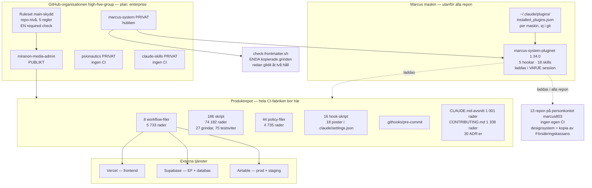
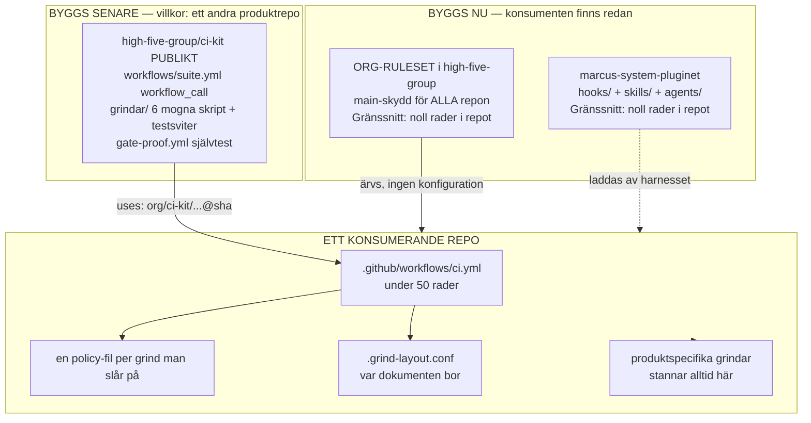

# CI som återanvändbar, centralt förvaltad djup modul — nuläge, målarkitektur och migrationsplan

> **Proveniens:** skrivet av en analysagent i Session 126 (CI-djupgranskningen),
> 2026-09-17, i worktreen `s126-ci-djupgranskning`. Modell: Claude Opus 5
> (1M context) — ett medvetet avsteg från tier-policyn, bokfört av
> orkestreraren i uppdraget: en målarkitektur är ett omdöme, och en felritad
> sådan kostar månader. Ögonblicksbild: `origin/main` på `eeca8c72`
> (2026-09-08) plus arbetsträdets innehåll och levande GitHub-data vid
> mättillfället. Uppdraget är jobb 6 i
> `tasks/sessions/bilagor/s126-uppdrag/uppdraget-verbatim.md` (rad 217–269).

## Kort svar

**Ja, det finns en återanvändbar produkt här — men den är mindre än den ser
ut, och den viktigaste delen av den är inte CI.**

Tre svar, i klartext:

**1. Hur stor del är återanvändbar?** Ungefär **en tredjedel**. Av de 27
mekaniska grindarna (skript som kan stoppa en kodändring) är cirka 10
generella — de skulle fungera i vilket projekt som helst. Cirka 6 är bundna
till just den här produkten (Airtable, betalningar, utskick). Cirka 11 är
bundna till *arbetssättet* — hur Marcus och agenterna samarbetar — och inte
till CI i allmänhet. Den sista gruppen är den som redan har ett hem: pluginet
`marcus-system`, som laddas automatiskt i varje Claude Code-session i varje
repo på maskinen.

**2. Vad bör göras först?** Inte ett CI-kit. **Det finns ingen andra kund.**
Mätt 2026-09-17: Marcus har fyra repon i organisationen `high-five-group`
(detta, hubben, `psionautics`, `claude-skills`) och tretton på sitt
personliga konto. Exakt ett av dem har CI av den här klassen — detta. Ett
annat (`designsystem`) har CI, men det är en **kopia av Försäkringskassans
publika designsystem**, inte ett eget projekt, och kan därför aldrig bli
kund. Att bygga en delad CI-plattform för en enda användare är precis den
"lösning som letar problem" som Marcus egen globala instruktion förbjuder.

Det som däremot bör göras nu är fyra små saker som **inte är bortkastade
även om utlyftet aldrig sker**: laga de tre trasiga delarna, flytta
katalog-sökvägar in i konfigurationsfilerna (så att grindarna faktiskt blir
flyttbara, vilket de i dag inte är), skriva ned modulens kontrakt i EN fil,
och flytta fem agent-hookar till pluginet — de har **redan** flera kunder,
till skillnad från CI.

**3. Vad bör INTE göras?** Inget mallrepo (ett mallrepo gör *fler* kopior,
och kopiedrift är just det fel som redan är uppmätt här). Inga composite
actions. Ingen generator. Inget `.github`-specialrepo. Och framför allt:
**frys ingenting som är trasigt.** Tre delar av maskinen fungerar inte i dag
— merge-dedupen träffar aldrig, post-merge-kontrollen har en täckningslucka
på 55 kod-landningar, och nattnätet har varit rött i femtio dygn. Ett kit som
kapslar in dem sprider felen i stället för att laga dem.

**Min bedömning, rakt ut: utlyftet bör vänta.** Ordningen är laga →
stabilisera → lyft ut, och vi är fortfarande i det första steget. Men
väntan bör vara *förberedd* väntan: de fyra åtgärderna ovan gör att dagen
ett andra produktrepo faktiskt finns, är utlyftet en veckas arbete i stället
för ett projekt.

## Vad jag läste först

Enligt agentkontraktets krav inventerade jag vad som redan finns innan jag
sökte något nytt.

**Granskningens eget material** (`underlag/`, samtliga läsda i den ordning
uppdraget angav): `00-agentkontrakt.md` i sin helhet,
`01-orkestrerarens-stickprov.md` i sin helhet (arton mätningar — loggens
version gäller före underlagen), `j8-8-underhall-och-andra-repon.md` i sin
helhet (storlek, ändringstakt, tvärrepo-jämförelsen, första klassningen),
`j1c-ci-wirade-skript-och-policyfiler.md` (fullständig inventering av 186
skript och 44 policy-filer), `j4a-branschpraxis-ur-primarkallor.md` §§ 11–12
(underhållskostnad och återanvändbarhet mellan repon), `j1d` (hookar och
agentmekanismer), `j1e` (externa inställningar), `j1a`/`j1b` (workflows),
`j1f` (konfiguration) samt leverabel `03-andringslogg.md` § "Särskilt
värdefullt" (vilka ytor lagas om och om igen).

**Repots egna beslut:** `ADR-035` (plugin-aktivering, user-scope) i sin
helhet — den styr distributionskanalen jag föreslår att man använder.
`ADR-131` (work-item-substratet flyttar till GitHub Issues) § beslut 6–7 —
den bär redan ett centraliserings-mönster och river en hel grindfamilj.
`ADR-036`, `ADR-030`, `ADR-033`, `ADR-076`, `ADR-077`, `ADR-083`, `ADR-100`
lästes i relevanta delar via granskningens underlag och korsprövades mot
disk där en slutsats vilar på dem.

**Pococks djupmodul-material** (`docs/reference/pocock/skills-svenska/
codebase-design/`): `SKILL.md` och `DEEPENING.md` i sin helhet. Därifrån
kommer vokabulären jag använder nedan — **modul**, **gränssnitt**,
**skarv**, **adapter**, **djup** — och den enskilt viktigaste regeln för
detta uppdrag: *"En adapter betyder en hypotetisk skarv. Två adaptrar
betyder en verklig. Skapa inte en skarv förrän något faktiskt varierar över
den."*

**Det avgörande fyndet i inventeringen — frågan är redan registrerad.**
`tasks/threads/README.md:180` bär tråden **`T137`**, status `paused`,
ordagrant:

> **CI/grind-systemet ska bli EN central hub-tjänst som varje spoke kopplas
> på — inte hundra kopior.** Marcus vision (S99 uppdrag 9-grillningen):
> branschmönstret är org-centrala pipelines. Kräver egen omfattande research
> FÖRE design; tills dess byggs allt centraliserings-KOMPATIBELT
> (universellt skript + per-repo-konfig, Lesson #6).

**Vad som därför är nytt i detta pass:** `T137` beställer exakt den research
detta dokument är. Ingen av granskningens övriga filer nämner tråden. Den
har ingen kortfil, ingen ADR och inget datum — den har legat pausad medan
apparaten vuxit. Jag skriver alltså inte ett förslag i ett tomrum: jag
levererar underlaget en redan registrerad tråd väntar på, och jag följer
dess egen interimspolicy (*"tills dess byggs allt
centraliserings-KOMPATIBELT"*) i stället för att riva den.

## Metod

Allt nedan som inte är uttryckligen tillskrivet ett underlag är min egen
mätning mot disk eller mot GitHubs API, körd 2026-09-17 i förgrunden, från
worktreen. Fyra spår:

1. **Tvärrepo-inventering.** `find`/`ls`/`grep` mot samtliga 25 kataloger
   under `~/Repon/` (J8.8 undersökte 14 — jag utökade till alla), plus
   läsning av varje repos `.git/config` för att fastställa vem som äger dem.
   Ingen skrivning, inga git-kommandon mot främmande historik.
2. **Levande plattformsdata.** `gh repo list high-five-group` och
   `gh api orgs/high-five-group` (läsande, ett anrop vardera).
3. **Hårdkodnings-stickprov.** `grep` efter projekt-specifika värden
   (organisations- och repo-namn, katalog-sökvägar) i 31 grindvakts-skript,
   med kontextläsning av varje träff för att skilja kommentar från körbar
   rad. Uppdraget bad om minst tio skript; jag körde hela grindvakts-klassen.
4. **Stabilitetsmätning.** `git log origin/main` per fil för
   centraliserings-kandidaterna — hur många gånger har filen ändrats, och
   när senast. Detta visade sig vara det mest avgörande urvalskriteriet i
   hela uppdraget (§ Fynd 4).

**Plattformsreglerna är belagda mot förstapartskällan**, inte antagna —
uppdraget krävde det uttryckligen. Fyra sidor på `docs.github.com` hämtades
2026-09-17; URL:er och ordagranna citat i § Fynd 5 och § Källor.

**Vad jag inte gjorde:** jag körde ingen `npm run check:docs` (kontraktets
förbud — ett tjugotal agenter skriver samtidigt). Jag skrev ingenting utanför
denna fil, committade inget, spawnade inga agenter, och rörde aldrig
huvudkatalogen.

## Fynd 1 — Karta över nuläget: vad bor var i dag

### Figuren



### Tabellen

| Yta | Var den bor i dag | Storlek, mätt | Räckvidd | Versionerad? |
|---|---|---|---|---|
| Workflows (`ci.yml`, `ci-suite.yml`, `nightly.yml`, `post-merge.yml`, `nightly-watchdog.yml`, `visual-baselines.yml`, `gate-proof.yml`, `review-backstopp-proof.yml`) | produktrepot `.github/workflows/` | 8 filer, **5 733 rader** | endast detta repo | via repots egen git |
| Grindvakts-skript | produktrepot `scripts/` | 27 filer, 7 360 rader | endast detta repo | via repots egen git |
| Testsviter för grindvakterna | produktrepot `scripts/` | 75 filer, 34 582 rader | endast detta repo | via repots egen git |
| Policy-filer (värdena grindarna läser) | produktrepots rot | **44 filer**, 4 735 rader | endast detta repo | via repots egen git |
| Lokala agent-hookar | produktrepots `.claude/settings.json` | **18 poster, 16 skript** | endast detta repo | via repots egen git |
| Git-hook | produktrepots `.githooks/pre-commit` | 1 fil, 242 rader | endast detta repo | via repots egen git |
| Agent-definitioner | produktrepots `.claude/agents/` | 3 filer, 777 rader | endast detta repo | via repots egen git |
| **Plugin-hookar** | hubbens `plugins/marcus-system/hooks/` | **5 hookar** (4 skript + manifest) | **VARJE repo på maskinen** | **plugin-version 1.34.0** |
| **Plugin-skills** | hubbens `plugins/marcus-system/skills/` | **18 skills** | **VARJE repo på maskinen** | **plugin-version 1.34.0** |
| Plugin-install-posten | `~/.claude/plugins/installed_plugins.json` | 1 fil | maskinen | **inte i något repo** (`ADR-035`) |
| Den enda kopierade grinden | hubbens `scripts/check-frontmatter.sh` + `.frontmatter-policy.conf` | 183 + 65 rader | hubben | handkopia, ingen synk |
| Grind-ramen (main-skyddet) | GitHub, **repo-nivå-ruleset** `19627609` | 5 regler | endast detta repo | GitHub-API |
| Deploy-vägar | Vercel, Supabase, Airtable | — | endast detta repo | externt |

**Verifierad** för varje rad: workflow-raderna med `wc -l` (5 733 totalt),
hook-posterna genom att parsa `.claude/settings.json` med Node (18 poster, 16
distinkta skript), plugin-innehållet med `ls` mot
`~/Repon/marcus-system/plugins/marcus-system/`, organisationsdata med `gh`.
Skript- och policy-talen är J1c:s inventering, som jag inte räknat om.

### Tre saker kartan gör tydliga, som ingen enskild fil sagt tidigare

**(a) Det finns redan TVÅ distributionskanaler, och de är olika mogna.**
CI-lagret har noll räckvidd utanför detta repo. Agent-lagret (pluginet) har
full räckvidd över varenda repo på maskinen, är versionerat, och laddas utan
att något repo behöver konfigurera något. Frågan "ska vi centralisera?" har
alltså redan besvarats med JA för det ena lagret och aldrig ställts för det
andra. **Verifierad.**

**(b) Grind-ramen sitter på fel nivå för återanvändning.** Rulesetet
`main-skydd` är ett **repo-nivå**-ruleset. Organisationen står på
`enterprise`-planen, vilket enligt GitHubs dokumentation är exakt vad som
krävs för **organisations**-rulesets — en regel som gäller flera repon på en
gång. Den möjligheten är alltså redan betald och oanvänd. **Verifierad**
(plan mätt via `gh api orgs/high-five-group`; planvillkoret citerat i
§ Fynd 5).

**(c) Kopian till hubben har glidit åt BÅDA håll, inte bara ett.** J8.8
mätte att hubbens `check-frontmatter.sh` rekommenderar `review_by` om
"~3 månader" medan spokens säger "6 månader". Jag körde samma `diff` och
bekräftar det — men jag hittade också motsatt drift som J8.8 inte
rapporterade: hubbens kopia bär en **förbättring** spoken saknar. Hubbens
rad 140–142 förklarar vad en `review_by`-bump faktiskt innebär (en
mini-audit: driftkoll, pekar-integritet, ägar-deklarationens giltighet, per
`ADR-100`); spokens rad 132 säger bara *"granska dokumentet och bumpa
review_by"*. Förbättringen gjordes i kopian och flöt aldrig tillbaka till
källan. **Verifierad** (`diff` mellan de två filerna, 2026-09-17, hela
utdatan läst).

Det är en viktigare observation än den första: en handkopia driver inte bara
isär av slarv, den driver isär av **framsteg**. Varje förbättring i en kopia
är en förbättring som originalet aldrig får.

### En rättelse till J8.8 § 7

J8.8 skriver att den enda installationsinstruktionen *"sitter INUTI skriptet
som ska kopieras"* och är *"en kommentar i själva artefakten"*. Det stämmer
inte. `.frontmatter-policy.conf` rad 18–26 bär en fullständig, numrerad
**fyrastegs-checklista**, ordagrant:

> `=== Duplicera till nytt spoke (4 steg) ===` · 1. kopiera skriptet,
> pre-commit-hooken och denna fil · 2. anpassa `FRONTMATTER_GOVERNING_DOCS`
> · 3. lägg till `postinstall` i `package.json` · 4. lägg till CI-steget.

Samma fil bär dessutom, rad 14–16, ett redan fattat arkitekturbeslut som
aldrig verkställdes: *"Hubliftad-design: vid Session 6.7 lyfts skripten till
`~/Repon/marcus-system/`. Denna config-fil förblir per-spoke. Spokes
refererar då hub-skripten via symlink/PATH."* **Verifierad** (filen läst).

Detta ändrar bilden på en viktig punkt: **Marcus har redan designat
utlyftet, två gånger** (policy-filens hublift-not, och tråd `T137`). Det som
saknas är inte idén. Det som saknas är en andra kund.

## Fynd 2 — De tre lagren, prövade mot evidensen

Uppdraget bad mig pröva en indelning i tre lager, inte anta den. Jag prövade
den mot J1c:s fullständiga grind-inventering (27 grindar) och mot mina egna
hårdkodnings-stickprov. **Indelningen håller — men den behöver en fjärde
kategori, och ett av lagren är mycket mindre än det ser ut.**

| Lager | Vad det är | Antal grindar | Återanvändningsvärde | Hem i dag |
|---|---|---|---|---|
| **Produktgrindar** | lint, typkontroll, bygg, sårbarhetskontroll, hermetiska tester, klassning, aggregator, merge-kö, post-merge, nattnät | ~10 av 27 | **Högt i FORM** — varje projekt behöver dem, mönstret är branschstandard | produktrepot |
| **Produktspecifikt** | Airtable-purge, staging-semafor, fas4-deploy, seed-fixturer, kontraktsvakt, mall-paritet, manifest-fält, mailto-vakt | ~6 av 27 | **Noll** — bundet till denna app | produktrepot, ska stanna |
| **Processgrindar** | sessionsdok-fönster, backlog-stängning, lesson-numrering, tråd-index, facit-kedjan, ägarlapp, stop-vakt, review-loopen, pausade sessioner, obesvarade larm, nattvakts-dedup | ~11 av 27 | **Högt — och har redan ett hem** | produktrepot, men hör hemma i pluginet |
| **CI:s egen självvård** (fjärde kategorin, min tillägg) | paritetsgrinden, fetch-depth-invarianten, listparitet, hermetik-självtestet, `gate-proof.yml` | ~5, överlappar ovan | **Högt** — varje maskin av den här klassen behöver dem | produktrepot |

**Verifierad** som klassning av de 27 grindarna i J1c § 4.1; **osäker** som
exakt räkning, eftersom fyra grindar rimligen kan klassas åt två håll
(`check-adr-count.sh` är både dokumentationsdisciplin och arbetsform;
`visual-baselines-scope.sh` är både produktspecifik och generell-med-config).
Andra läsare får andra tal med samma metod — riktningen är däremot robust och
stämmer med J8.8 § 6:s oberoende stickprov (≈ 9 generella, ≈ 3
produktspecifika, ≈ 8 processpecifika av ~20).

### Svaret på uppdragets egen fråga: hör processgrindarna hemma i pluginet?

**Ja för hookarna. Nej för de nattliga grindarna. Och skälet är mätt, inte
antaget.**

Tråd `T126` (`tasks/threads/T126-arbetsformens-leveransvag.md`, läst i sin
helhet) har redan mätt exakt denna fråga, fast för en annan regel. Dess
slutsats, verbatim ur § "Slutsats av generaliseringen":

> mönstret är INTE unikt … det uppstår specifikt när en regels ENDA bärare är
> prosa i en skill vars trigger inte matchar återupptagnings-vägen. Regler
> med en ANDRA bärare (alltid-laddad `CLAUDE.md`, eller en mekanisk CI-/lokal
> grind) undviker klassen strukturellt.

Översatt till centraliseringsfrågan: pluginet har **två kanaler med helt
olika styrka**.

| Kanal | Hur den levereras | Bärarstyrka | Lämplig för |
|---|---|---|---|
| Plugin-**hookar** (`hooks/hooks.json`) | harnesset kör dem vid en verktygshändelse, alltid, oavsett prompt | **Stark** — kan inte hoppas över | spärrar och observation |
| Plugin-**skills** (`skills/*/SKILL.md`) | laddas när beskrivningen matchar prompten | **Svag** — `T126` mätte att en resume-väg hoppar över den | procedurer, inte spärrar |

Konsekvensen är skarp: att flytta en processgrind till pluginet är
meningsfullt **bara om den blir en hook**. En nattlig grind
(`check-backlog-closure.sh`, `check-sessionsdok-fonster.sh`) är varken hook
eller skill — den är ett CI-jobb, och pluginet bär noll workflow-filer. Den
kan alltså inte flyttas dit alls i dag, oavsett hur generell den är.

**Och två av de nattliga processgrindarna är dessutom dömda att rivas.**
`ADR-131` (Accepted 2026-09-04, ej verkställd — S15) river uttryckligen
`check-backlog-closure.sh`, `backlog-kortfakta.mjs`, `backlog-cli.sh`, deras
testsviter och nattjobbet Backlog-stängning. Att produktifiera dem vore att
bygga en produkt av något som redan är beslutat bortrivet.

**Bevis för att plugin-hook-kanalen fungerar:** pluginet bär i dag fem
hookar, varav tre är rena spärrar (`deny-sweeping-git-add.sh`,
`deny-askuserquestion.sh`, `deny-backlog-direct-edit.sh`). Precedenset finns
alltså redan — repo-specifika spärrar HAR flyttats till pluginet och verkar i
varje repo. **Verifierad** (`hooks.json` läst i sin helhet, 2026-09-17).

## Fynd 3 — Vad som faktiskt hindrar återanvändning i dag

Detta är den mätning uppdraget bad om (*"vad hindrar det i dag — stickprova
hårdkodade värden i minst tio skript med grep"*). Jag körde hela
grindvakts-klassen, 31 skript.

### Resultatet är inte det man förväntar sig

**Konventionen "logik i skriptet, värden i config" håller — för VÄRDENA.**
J1c prövade tio par och samtliga höll; jag prövade inget av dem igen utan
sökte i stället efter den läcka konventionen inte täcker. **Noll av de 31
skripten** bär ett hårdkodat organisations- eller repo-namn i körbar kod
(`high-five-group`, `miranon-media-admin`). De sju träffar som finns ligger i
testsviter och kommentarer.

**Men fjorton av dem hårdkodar repots KATALOGSTRUKTUR i körbar kod.** Det är
den verkliga låsningen, och den är osynlig för konventionen, eftersom
konventionen handlar om policy-*värden*, inte om var filerna ligger.

| Skript | Hårdkodad rad (körbar, ej kommentar) | Vad som låser |
|---|---|---|
| `scripts/check-adr-count.sh:28` | `DECISIONS_DIR="docs/decisions"` | beslutskatalogens sökväg |
| `scripts/check-lifecycle.sh:37` | `for file in tasks/sessions/*.md` | sessionsdokens sökväg |
| `scripts/check-lifecycle.sh:79` | `THREAD_INDEX="tasks/threads/README.md"` | trådregistrets sökväg |
| `scripts/check-lifecycle.sh:82` | `for file in tasks/threads/T*.md` | trådkortens namnform |
| `scripts/check-fetch-depth-invariant.sh:37-38` | `ADR029="docs/decisions/ADR-029-…"`, `ADR030="…ADR-030-…"` | två ADR-filers exakta filnamn |
| `scripts/check-docs.sh:199-204` | sex hårdkodade glob-rader till `lychee` | hela dokumentationsträdets form |
| `scripts/check-manifest-fields.mjs:75` | `resolve(REPO, 'src/routeTree.gen.ts')` | produktens routing-fil |
| `scripts/check-mailto.mjs`, `check-langa-streck.mjs` | `src/`-trädet som parsningsrot | produktens källkodskatalog |
| `scripts/verify-ci-parity.mjs` | filnamnen `ci.yml`/`ci-suite.yml` i parsningslogiken (J8.8 § 6) | de två workflow-filernas namn |

**Verifierad** — varje träff lästes i sin kontext för att skilja kommentar
från körbar rad; siffrorna är från min egen `grep`-körning 2026-09-17.

**De mest portabla grindarna, mätt:** `check-listparitet.sh` och
`check-permissions-claims.sh` har **noll** hårdkodade projektsökvägar i
körbar kod. `check-frontmatter.sh` har en (och är den bevisat portabla —
den enda som faktiskt kopierats). Det är alltså tre grindar som redan i dag
skulle fungera oförändrade i ett nytt repo.

### Vad detta betyder för en framtida modul

Konventionen är rätt men **ofullständig**. Den säger: *logiken är universell,
värdena bor i en policy-fil*. Den borde säga: *logiken är universell, och
**både värdena och layouten** bor i en policy-fil*. Skillnaden är liten i
kod — det är att flytta ungefär tjugo rader från skript till config — men
den är hela skillnaden mellan "kan kopieras med anpassning" och "kan anropas
oförändrad".

Detta är den billigaste förberedelse som finns, och den är **inte bortkastad
om utlyftet aldrig sker**: den gör att konventionen som redan står i
`CLAUDE.md` faktiskt blir sann, och den gör påståendet "detta skript är
portabelt" mätbart i stället för antaget.

## Fynd 4 — Stabilitet, inte generalitet, är urvalskriteriet

Detta är det enskilt viktigaste fyndet i mitt pass, och jag hittade det
genom att ställa en fråga uppdraget inte ställde: *vilka delar har slutat
ändras?*

Uppdragets punkt (3) säger att det som inte fungerar inte ska
produktifieras. Mätningen nedan visar en starkare version av samma regel:
**det som fortfarande ändras varje vecka kan inte kapslas in i ett delat
gränssnitt alls**, hur generellt det än är — varje ändring skulle då bli en
versionsbump plus en uppgradering i varje konsumerande repo.

| Fil | Ändringar totalt (hela historiken) | Senast rörd | Kan den frysas? |
|---|---|---|---|
| `.github/workflows/ci.yml` | **156** | löpande | **Nej** — ≈ 7,5 ändringar/vecka (J8.8 § 2) |
| `scripts/check-docs.sh` | 15 sedan 2026-06-01 | löpande | Nej |
| `scripts/heartbeat-svep.sh` | 7 sedan 2026-06-01 | löpande | Nej |
| `scripts/deny-frammande-huvudkatalog.sh` | 7 sedan 2026-06-01 | löpande | Nej, ännu |
| `scripts/deny-grind-genom-pipe.sh` | 4 sedan 2026-06-01 | 2026-08-24 | Snart |
| `scripts/check-frontmatter.sh` | **9 totalt** | — | **Ja** — och den ÄR redan kopierad |
| `scripts/check-public-checklists.sh` | **4 totalt** | **2026-05-16** | **Ja** — orörd i fyra månader |
| `scripts/lib/jq-guard.sh` | **1 sedan 2026-06-01** | 2026-08-24 | **Ja** |
| `scripts/lib/gh-guard.sh` | **1 sedan 2026-06-01** | — | **Ja** |
| `scripts/check-listparitet.sh` | **1 sedan 2026-06-01** | **2026-07-30** | **Ja** |
| `scripts/check-adr-count.sh` | **1 totalt, någonsin** | **2026-05-27** | **Ja** — orörd i 3,7 månader |

**Verifierad** (`git log origin/main` per fil, körd 2026-09-17 från
worktreen; jag använde `origin/main`, inte lokal `HEAD`, för att inte räkna
opushat).

Mönstret är entydigt och användbart: **de grindar som är mest generella är
också de som slutat ändras.** Det är inte en slump — en grind som löser ett
universellt problem (har en dokumentfil giltig frontmatter? har två listor
glidit isär?) blir färdig. En grind som kodar in ett arbetssätt eller en
plattformsegenhet fortsätter röra sig, eftersom arbetssättet och
plattformen rör sig.

**Urvalsregeln som följer:** en komponent får lyftas ut när den uppfyller
tre villkor samtidigt — (1) den är generell, (2) den har varit orörd i minst
ett kvartal, (3) den har en testsvit som reser med den. Sex komponenter
uppfyller alla tre i dag: `check-frontmatter.sh`, `check-public-checklists.sh`,
`check-adr-count.sh`, `check-listparitet.sh`, `lib/jq-guard.sh`,
`lib/gh-guard.sh`. **Det är hela den mogna mängden — sex filer av 186.**

Det tålmodiga svaret på "hur stor del är återanvändbar?" är alltså två tal:
en tredjedel är generell *i princip*, men bara sex filer är mogna *i dag*.

## Fynd 5 — Plattformens väggar, belagda mot förstapartskällan

Uppdragets punkt (1) krävde att jag belägger GitHubs regler mot
`docs.github.com` innan jag ritar. Fyra regler avgör vad som är möjligt, och
en av dem hade sänkt en naiv design.

| Regel | Ordagrant ur källan | Källa (hämtad 2026-09-17) | Vad den betyder för oss |
|---|---|---|---|
| **Privat repo → bara privata konsumenter** | *"Access is allowed only from private repositories"* | [Managing GitHub Actions settings for a repository](https://docs.github.com/en/repositories/managing-your-repositorys-settings-and-features/enabling-features-for-your-repository/managing-github-actions-settings-for-a-repository) | **Ett CI-kit i ett PRIVAT repo kan inte anropas av detta repo, som är PUBLIKT.** Kit-repot måste vara publikt — eller produktrepot måste bli privat. |
| **Versionsreferens** | *"Using the commit SHA is the safest option for stability and security"*; taggar och grennamn stöds också, och *"If a release tag and a branch have the same name, the release tag takes precedence"* | [Reuse workflows](https://docs.github.com/en/actions/how-tos/reuse-automations/reuse-workflows) | SHA-pinning är rekommenderad väg — samma disciplin repot redan kräver för tredjeparts-actions. |
| **Nästningstak** | *"You can connect a maximum of ten levels of workflows"*; hemligheter når *"only … directly called workflow"* i en nästad kedja | samma sida | Vår kedja (`ci.yml` → `ci-suite.yml`) är två nivåer. Gott om marginal. |
| **Organisations-rulesets** | repo-rulesets gäller *"for customers on GitHub Team and GitHub Enterprise plans"*; *"For organizations on the GitHub Enterprise plan, you can set up rulesets at the enterprise or organization level to target multiple repositories"* | [About rulesets](https://docs.github.com/en/enterprise-cloud@latest/repositories/configuring-branches-and-merges-in-your-repository/managing-rulesets/about-rulesets) | Organisationen står på `enterprise` (mätt). **Org-rulesets är alltså redan tillgängliga och oanvända.** |
| **Merge-kö** | tillgänglig *"in any public repository owned by an organization"*; för privata repon krävs Enterprise Cloud | [Managing a merge queue](https://docs.github.com/en/repositories/configuring-branches-and-merges-in-your-repository/configuring-pull-request-merges/managing-a-merge-queue) (via sökning på samma domän) | **S14:s öppna fråga är besvarad:** merge-kön på DETTA repo kräver ingen Enterprise-plan. Planen betalar för org-rulesets och för merge-kö i de tre PRIVATA repona — inte för detta repos kö. |

**Verifierad** för de fyra första raderna (sidorna hämtade och citerade
ordagrant). **Starkt indikerad** för merge-kö-raden: formuleringen kommer ur
en sökning mot `docs.github.com` där sammanfattningen citerar
tillgänglighetsvillkoret, men jag lyckades inte få själva
tillgänglighetsstycket ur sidans brödtext i den hämtning jag gjorde. Vad som
krävs för att stänga luckan: en läsning av samma sidas
"Availability"-banner, eller en `gh api`-kontroll av
`merge_queue`-regelns tillgänglighet i ett Team-org.

### En fälla i den första raden, värd att skriva ut

Den mest naturliga designen — *"lägg CI-kitet i ett privat repo i
organisationen, där ligger ju redan hubben"* — **fungerar inte**. Detta repo
är publikt (S14, verifierat av mig igen 2026-09-17 via `gh repo list`), och
ett publikt repo kan inte konsumera ett privat repos arbetsflöden. Den som
ritar kitet utan att känna till den regeln bygger något som faller först vid
första anropet.

De två vägar som faktiskt finns:

1. **Publikt kit-repo** (`high-five-group/ci-kit`, publikt). Fungerar mot
   både publika och privata konsumenter. Kostnaden: grindvakternas källkod
   blir offentlig. Det är redan sant för detta repo, så den kostnaden är
   inte ny — men den gäller då även för de tre privata repona den dag de
   blir kunder.
2. **Produktrepot blir privat.** Då fungerar ett privat kit. Men det river
   en annan egenskap (öppenheten) för att lösa ett problem som ännu inte
   finns.

Väg 1 är den rimliga. Den bör noteras i beslutet, inte upptäckas vid bygget.

## Fynd 6 — Komponenttabellen

Uppdraget bad om ett trettiotal komponenter, inte 186 filer. Jag grupperar
efter det problem komponenten löser, eftersom det är den axel som avgör var
den hör hemma.

**Kolumnerna:** *Problemklass* = generellt (G), produktspecifikt (P),
processpecifikt (Pr), eller CI:ns självvård (S). *Mogen?* = uppfyller de tre
villkoren i § Fynd 4 (generell, stabil ett kvartal, egen testsvit).
*Placering* = rekommenderad framtida hemvist.

### Lager 1 — produktgrindarna

| Komponent | Vad den gör i dag | Problem den löser | Klass | Hinder för återanvändning | Mogen? | Placering | Nästa steg |
|---|---|---|---|---|---|---|---|
| `ci.yml` jobbet `changed` | klassar diffen (docs/kod, D0-glob, acceptance-urval) | onödig full testkörning på trivial ändring | G | D0-globben är repots egen fillista | Nej — ändras löpande | produktrepot; globben till en config-fil | flytta D0-globben till `.klassning-policy.json` |
| `ci.yml` jobbet `lint` | 17 skriptgrindar + Biome, `tsc`, shellcheck, yamllint, actionlint + 63 testsviter | språk-, format- och invariantdrift | G + Pr | blandar tre lager i ETT jobb | Nej | produktrepot; dela i två steg (generellt/process) | dela steget, inte filen |
| `ci.yml` jobbet `audit` | `npx audit-ci` med degraderingsväg | sårbarheter i beroenden | G | ingen | Delvis | **CI-kit (senare)** | behåll; en kandidat för första utlyftet |
| `ci.yml` jobbet `suite` | delegerar till `ci-suite.yml` | undviker dubblerad workflow-logik | G | anropar med lokal sökväg `./` | — | produktrepot | **byt `./` mot `org/ci-kit@sha` den dag kitet finns** |
| `ci.yml` jobbet `docs` | lychee, markdownlint, Vale, Vale-regression | dokumentationsdrift | G | hårdkodade globbar i `check-docs.sh` | Delvis | **CI-kit (senare)** | parametrisera globbarna |
| `ci.yml` jobbet `ci-passed` | aggregerar allt till EN required check | sex checkar att underhålla i rulesetet | G | `needs`-listan måste hållas komplett | Nej — ändras med jobben | produktrepot | se risk nedan om `needs`-vakten |
| `ci-suite.yml` | **redan ett `workflow_call`-arbetsflöde** med tre inputs (`run_staging`, `run_a11y`, `acceptance_selection`) | delad svit för tre anropare | G med config | anropas med lokal sökväg; två jobb är produktspecifika | Nej | **CI-kit (senare) — detta är den mest färdiga byggstenen** | inget nu; se § Fynd 8 |
| `nightly.yml` | nattligt fullsvep + processgrindar + metrics | postsubmit-nät (`ADR-077`) | G + Pr | **bär fel last** (S12) | Nej — trasig | produktrepot | dela rött/grönt (§ Fynd 10 steg 0) |
| `post-merge.yml` | efterkontroll på mergat träd | det kön inte hinner köra | G | **täckningslucka, 55 kod-landningar** (S18) | Nej — trasig | produktrepot | laga klassningen först |
| `nightly-watchdog.yml` | vakt för vakten | ett larm som tystnar tyst | G | ingen | Delvis | **CI-kit (senare)** | — |
| `visual-baselines.yml` | genererar visuella referensbilder | baseline-drift | G med config | Playwright-projektlistan | Nej | produktrepot | — |
| `gate-proof.yml` | **bevisar att aggregatorn faktiskt FÄLLER** | en grind som tyst slutat fälla | S | bevisar just våra jobbnamn | Delvis | **CI-kit — mönstret är kitets eget självtest** | se § Fynd 8 |
| `review-backstopp-proof.yml` | samma för review-grinden | samma | S + Pr | våra egna mekanismer | Nej | produktrepot / pluginet | — |
| `audit-ci-med-degradering.sh` | sårbarhetskontroll med nätverksdegradering | CI stannar på en nätverksblipp | G | ingen hårdkodning | **Ja, nära** | **CI-kit (senare)** | — |
| `hermetik-sjalvtest.mjs` | tvåsidigt bevis att testerna är hermetiska | tester som tyst börjar ringa ut | G med config | acceptance-klassens form | Delvis | **CI-kit (senare)** | — |
| `acceptance-urval.sh`, `classify-post-merge.sh`, `post-merge-attribution.sh` | klassnings-logik för vad som ska köras | onödiga körningar; rätt skyldig vid larm | S | noll hårdkodade sökvägar | Delvis | **CI-kit (senare)** | laga spann-klassningen (S18) först |

### Lager 2 — produktspecifikt (ska aldrig lyftas ut)

| Komponent | Vad den gör | Klass | Placering | Nästa steg |
|---|---|---|---|---|
| `purge-staging-sentinels.mjs` + `.purge-staging-policy.json` | städar testdata i staging-basen | P | produktrepot | oförändrat |
| `seed-review-fixture.mjs`, `seed-dokument-fixture.mjs`, `seed-eventinnehall-modell.mjs` | bygger granskningsdata | P | produktrepot | oförändrat |
| `fas4-prod-deploy.sh`, `deploy-prod-functions.sh` + allowlisten (57 funktioner) | fail-closed produktionsdeploy | P | produktrepot | oförändrat |
| `staging-semaphore.sh` | fillås mot parallella pipelines mot delad staging | P i praktiken, G i form | produktrepot | oförändrat |
| `tests/support/fixturvarld/*`, `tests/kontraktsvakt/*` | simulerad omvärld + kontraktskontroll | P | produktrepot | laga täckningen 7/18 (S10) |
| `check-mallparitet.sh`, `check-manifest-fields.mjs`, `check-mailto.mjs`, `check-langa-streck.mjs`, `check-staging-preflight-wiring.mjs` | produktspecifika kodregler | P | produktrepot | oförändrat |
| `deny-prod-airtable.sh`, `deny-prod-ref.sh`, `deny-resend-send.sh` | lås mot produktionsdata och skarpa utskick | P (formen G) | produktrepot | oförändrat; formen kan mallas |
| `backfill-*`, `create-*`-skripten | engångs-schemaverktyg | P | produktrepot | kandidater för arkivering |

### Lager 3 — processgrindarna (hör hemma i pluginet, med förbehåll)

| Komponent | Vad den gör | Bärartyp | Klass | Placering | Nästa steg |
|---|---|---|---|---|---|
| `deny-grind-genom-pipe.sh` | hindrar att en grinds felkod tyst sväljs av en pipe | hook | **G — universellt shell-problem** | **pluginet** | **lyft nu** (§ Fynd 10 steg 3) |
| `deny-hemlighet-utskrift.sh` | hindrar att ett hemligt värde skrivs i klartext | hook | **G — universellt** | **pluginet** | **lyft nu** |
| `deny-subagent-vantan.sh` | hindrar att en underagent väntar på en signal den aldrig får | hook | **G — gäller varje agentflotta** | **pluginet** | **lyft nu** |
| `agent-spawn-log.sh` | loggar varje agentstart (nekar aldrig) | hook | **G — ren observation** | **pluginet** | **lyft nu** |
| `deny-frammande-huvudkatalog.sh` | hindrar att en agent skriver i en katalog den inte äger | hook | G — gäller varje multi-agent-repo | pluginet, **men vänta** — 7 ändringar sedan juni | lyft när den stabiliserats |
| `stop-vakt.sh`, `deny-precompact.sh`, `post-compact-igenkanning.sh`, `katalogagarskap-*.sh` | sessions- och kontexthygien | hook | Pr — vårt eget kontrakt | pluginet, senare | efter `ADR-131`-städningen |
| `deny-arbetsform-push.sh`, `deny-facit-godkand-skrivning.sh` | arbetsformens tillstånd, facit-kedjan | hook | Pr | produktrepot tills vidare | — |
| `check-lesson-numbers.sh`, `check-thread-index.sh`, `check-lifecycle.sh` | bokföringens form | **CI-jobb** | Pr — men **pluginet bär inga CI-jobb** | produktrepot | se § Fynd 8, "gate pack" |
| `check-backlog-closure.sh`, `backlog-kortfakta.mjs`, `backlog-cli.sh` | backlog-registrets integritet | CI-jobb | Pr | **rivs av `ADR-131`** | **verkställ rivningen — produktifiera inte** |
| `check-sessionsdok-fonster.sh`, `check-pausade-sessioner.sh`, `check-obesvarade-larm.sh`, `check-nattvakt-dedup.sh` | sanningsavstämning i natten | CI-jobb | Pr | produktrepot | lyft ur nattnätets rött/grönt (§ Fynd 10) |
| `review-*`-familjen (11 filer, 6 testsviter) | granskningsgrinden | CI + CLI | Pr | produktrepot; kandidat för gate pack senare | mät fångstraten först |
| `.claude/agents/*.md` | agent-kontrakten | prosa | Pr | **pluginet** (samma kanal som skills) | låg prioritet, hög effekt |

### Lager 4 — CI:ns självvård och det delade biblioteket

| Komponent | Vad den gör | Klass | Hinder | Mogen? | Placering | Nästa steg |
|---|---|---|---|---|---|---|
| `lib/jq-guard.sh`, `lib/gh-guard.sh` + versionspolicyerna | kontrollerar att `jq`/`gh` finns och är rätt version innan något körs | **G — helt** | **inget** | **Ja** | **pluginet eller kitet — först ut** | lyft med hooksvepet |
| `check-listparitet.sh` | håller två listor som ska matcha i synk | **G — noll hårdkodning** | inget | **Ja** | **kitet** | — |
| `check-permissions-claims.sh` | hindrar prosa från att påstå en mekanism som inte finns (`ADR-083`) | **G — noll hårdkodning** | listan över styrande filer ligger redan i config | **Ja** | **kitet** | — |
| `check-frontmatter.sh` + policy | frontmatter på styrande dokument | **G — BEVISAT portabel** | en sökväg | **Ja** | **kitet** — och synka tillbaka hubbens förbättring | § Fynd 1 (c) |
| `check-public-checklists.sh` | oavslutade kryssrutor i publika dokument | **G** | en sökväg | **Ja** | **kitet** | — |
| `check-adr-count.sh` | beslutsregistrets räkning stämmer | **G** | `DECISIONS_DIR` hårdkodad | **Ja** (efter en rads ändring) | **kitet** | flytta sökvägen till config |
| `check-fetch-depth-invariant.sh` | ett värde är enhetligt över fem bärare | S | två ADR-filnamn hårdkodade | Delvis | kitet | parametrisera |
| `verify-ci-parity.mjs` + `.ci-parity-policy.json` | kör CI:s egen uppsättning lokalt, härledd ur YAML | **S — starkt mönster** | filnamnen hårdkodade | Delvis | **kitet — detta är kitets egen paritetsvakt** | parametrisera filnamnen |
| `check-docs.sh` | lokal spegel av 14 dokumentationsgrindar | G | sex hårdkodade globbar; **15 ändringar sedan juni** | Nej | produktrepot | parametrisera globbarna |
| `stada-grenar.sh`, `heartbeat-svep.sh`, `ci-wait.sh` | orkestrerings-hjälpmedel | Pr/G | ändras löpande | Nej | produktrepot → pluginet senare | — |

## Fynd 7 — Klassificeringen

Varje komponent i exakt en klass, som uppdraget kräver. Sammanräkningen
längst ned.

| Klass | Komponenter | Skäl |
|---|---|---|
| **Behåll lokalt** | `ci.yml` (alla sju jobb), `nightly.yml`, `post-merge.yml`, `visual-baselines.yml`, `review-backstopp-proof.yml`, hela produktspecifika lagret (14 komponenter), `check-docs.sh`, `staging-semaphore.sh`, `heartbeat-svep.sh`, `stada-grenar.sh`, `ci-wait.sh`, `deny-arbetsform-push.sh`, `deny-facit-godkand-skrivning.sh`, `deny-prod-*`, `deny-resend-send.sh` | Antingen bundna till denna produkt, eller fortfarande i rörelse (`ci.yml`: 156 ändringar). Ett delat gränssnitt kring en rörlig yta kostar mer än det ger. |
| **Centralisera** (flytta till en befintlig kanal — pluginet) | `deny-grind-genom-pipe.sh`, `deny-hemlighet-utskrift.sh`, `deny-subagent-vantan.sh`, `agent-spawn-log.sh`, `lib/jq-guard.sh`, `lib/gh-guard.sh` + de två versionspolicyerna; senare `deny-frammande-huvudkatalog.sh` och `.claude/agents/*.md` | **Flera kunder finns redan i dag** — pluginet laddas i varje repo på maskinen. Samtliga är generella, stabila (1–4 ändringar sedan juni) och har testsviter. Detta är den enda centralisering där konsumenten existerar. |
| **Centralisera** (org-inställning) | rulesetet `main-skydd` → **organisations-ruleset** | Enterprise-planen är redan betald och möjligheten oanvänd. Nästa repo i organisationen ärver main-skyddet utan konfiguration. |
| **Produktifiera** (lyft till ett eget, versionerat kit — SENARE, se villkor) | `ci-suite.yml` som `workflow_call` från ett publikt kit-repo; `check-frontmatter.sh`, `check-public-checklists.sh`, `check-adr-count.sh`, `check-listparitet.sh`, `check-permissions-claims.sh`; `audit-ci-med-degradering.sh`; `gate-proof.yml`-mönstret; `verify-ci-parity.mjs` | Samtliga är generella, mogna och testade. **Villkoret är ett andra produktrepo.** Utan det bär produktifieringen noll värde och full underhållskostnad (J4a § 12: alla fyra branschmekanismer är byggda för situationen "fler än ett repo"). |
| **Förenkla** | `nightly.yml` (dela rött/grönt så processgrindar inte döljer testregressioner — S12); `ci.yml` jobbet `lint` (dela steget i generellt/process); `check-docs.sh` (parametrisera globbarna); de fjorton skript som hårdkodar layout (§ Fynd 3); de fyra o-SHA-pinnade action-referenserna i `ci-suite.yml` | Var och en är en liten, reversibel ändring som ger värde ensam och samtidigt gör ytan flyttbar. |
| **Ta bort** | `scripts/verify-phase-1.ts` (föräldralös sedan Fas 1, J1c § 4.8); `check-backlog-closure.sh`, `backlog-kortfakta.mjs`, `backlog-cli.sh` + deras testsviter + nattjobbet Backlog-stängning (**`ADR-131` har redan beslutat rivningen**); merge-dedupen i `changed` (träffar aldrig — S11/J8.5); engångs-schemaskripten `create-*`/`backfill-*` när deras migrering är avslutad | "Ta bort" är ett fullvärdigt svar där evidensen bär det. Här bär den: en föräldralös fil, en beslutad rivning, en mekanism som mätts till noll träffar på 80 körningar, och fyra engångsverktyg. |

**Sammanräkning:** av ungefär 45 namngivna komponenter är **cirka 22 behåll
lokalt**, **8 centralisera** (varav 7 till en kanal som redan finns),
**8 produktifiera senare**, **5 förenkla nu**, **6 ta bort**. Ungefär en av
sex komponenter bär alltså ett genuint utlyfts-värde i dag — och ingen av
dem bär det förrän det finns en andra kund.

## Fynd 8 — Minimal målarkitektur

### Formerna, vägda mot varandra för VÅR skala

| Form | Vad den ger | Vad den kostar | Dom för oss |
|---|---|---|---|
| **Återanvändbara arbetsflöden** (`workflow_call`) | en levande fil, en ändring gäller alla konsumenter | kräver ett kit-repo, SHA-pinning, uppgraderingsrutin; **kit-repot måste vara publikt** (§ Fynd 5) | **Vald — men senare.** `ci-suite.yml` har redan formen; bara sökvägen behöver ändras. |
| **Composite actions** | återanvänder en *stegsekvens* inuti ett jobb | ännu en versionerad artefaktklass att underhålla | **Avvisad.** Vi återanvänder hela arbetsflöden, inte stegsekvenser. `workflow_call` täcker behovet. |
| **npm-paket med grindvakterna** | versionerad distribution som fungerar utanför Claude Code | tredje distributionskanalen; grindarna blir beroende av `npm ci` innan de kan köra | **Avvisad nu** — rätt form bara om grindarna någon gång ska konsumeras av repon som inte kör Claude Code. |
| **Mallrepo** (template repository) | en fristående kopia, noll fortsatt koppling | **gör fler kopior** — och kopiedrift är det fel som redan är uppmätt här, åt två håll på sex veckor | **Avvisad.** J4a taggar den "rimlig på vår skala", men den löser fel problem: vårt fel är inte att kopiering är svårt, det är att kopior driver isär. |
| **Generator / installationsskript** | automatiserar anslutningen | en generator för en enda användare | **Avvisad nu.** Bygg den när det finns tre kunder, inte en. |
| **`.github`-specialrepo** | organisationsbreda standardfiler | löser "samma standardfil i många repon"; vi har fyra repon och ett behov | **Avvisad.** |
| **Organisations-ruleset** | main-skyddet gäller alla repon automatiskt | en engångsflytt; reversibel via API | **Vald — nu.** Redan betald med Enterprise-planen. |
| **Pluginet som bärare av det lokala lagret** | versionerad, automatiskt laddad i varje repo | manuell versionsbump + ominstallation; install-posten bor utanför git (`ADR-035`); fyra dokumenterade cache-incidenter (J8.8 § 5 Fynd 4) | **Vald — nu, för hookarna.** Enda kanalen med flera kunder i dag. |

### Arkitekturen, ritad

Målbilden är **inte en plattform**. Det är **tre bärare med olika mognad**,
där bara två av dem byggs nu.



### Modulens gränssnitt — vad ett konsumerande repo måste skriva

Detta är den **skarv** (Pococks term: platsen där modulens gränssnitt
ligger) jag föreslår. Allt ovanför skarven är konsumentens; allt under är
kapslat.

**Konsumenten skriver tre saker, och inget mer:**

1. **En `ci.yml` på under femtio rader** — triggers, ett anrop per lager,
   och aggregatorns namn (som rulesetet kräver ska vara identiskt på båda
   ytorna). Skiss:

   ```yaml
   name: CI
   on:
     pull_request: { branches: [main] }
     push: { branches: [main] }
     merge_group: { types: [checks_requested], branches: [main] }
   permissions: {}
   concurrency:
     group: ${{ github.workflow }}-${{ github.event.number || github.sha }}
     cancel-in-progress: ${{ github.event_name != 'merge_group' }}
   jobs:
     grindar:
       permissions: { contents: read }
       uses: high-five-group/ci-kit/.github/workflows/grindar.yml@<sha>
     svit:
       permissions: { contents: read }
       uses: high-five-group/ci-kit/.github/workflows/suite.yml@<sha>
       with:
         run_staging: false
         run_a11y: false
       secrets: inherit
     produktgrindar:
       uses: ./.github/workflows/produkt.yml
     ci-passed:
       name: CI Passed or Skipped
       needs: [grindar, svit, produktgrindar]
       if: always()
       uses: high-five-group/ci-kit/.github/workflows/aggregator.yml@<sha>
   ```

2. **En policy-fil per grind man slår på** — samma `.<grind>-policy.conf`-form
   som redan används. Ett minimalt nytt repo slår på tre: frontmatter,
   checklistor, listparitet. Ungefär 60 rader totalt.

3. **En layout-deklaration** (`.grind-layout.conf`) — den fil som i dag
   *saknas*, och vars frånvaro är låsningen § Fynd 3 mätte:

   ```bash
   GRIND_BESLUTSKATALOG="docs/decisions"
   GRIND_SESSIONSDOK="tasks/sessions"
   GRIND_KALLKOD="src"
   GRIND_DOKUMENT_GLOBBAR=("docs/**/*.md" "tasks/*.md")
   ```

**Det som kapslas** (konsumenten ser det aldrig): jobbgrafen, diff-klassningen,
aggregatorns fail-closed-logik, grindvakternas implementation, deras 68
CI-wirade testsviter, verktygs-pinningen, `jq`/`gh`-versionskontrollerna, och
paritetsvakten som fäller när kitets egen uppsättning drivit isär.

### Gränssnittets storlek — räkningen uppdraget bad om

| Mått | I dag | I målbilden | Faktor |
|---|---|---|---|
| Rader konsumenten själv måste skriva och äga | 8 workflows (**5 733**) + 44 policy-filer (**4 735**) + 186 skript (**74 182**) | ~45 rader `ci.yml` + ~60 rader policy + ~8 rader layout ≈ **115** | **≈ 700×** |
| Rader man måste LÄSA för att säkert ändra CI | ≈ **5 900** (J8.8 § 4: `CLAUDE.md`s CI-avsnitt 1 001 + `CONTRIBUTING.md` 1 338 + relevant del av `ci.yml` + 3–5 ADR:er) | kitets `README` + tre config-filers kommentarer ≈ **300** | **≈ 20×** |
| `CLAUDE.md`-rader ägnade åt att förklara flödet | ≈ **1 001** av 1 244 (80,5 %) | pekare till kitet + de repo-egna undantagen ≈ **80** | **≈ 12×** |
| Beslut konsumenten måste fatta | dussintals (vilka jobb, vilken ordning, vilka trösklar, vilken klassning) | **sex** (vilka grindar på/av, vilken layout, vilken svit-nivå, kit-version, produktgrindar, aggregatorns namn) | — |
| `npm run`-poster som hör till maskineriet | **62** totalt i `package.json` | de produktspecifika kvar; grindarnas kommandon kapslas | — |

**Verifierad** för nuläges-kolumnen (egna `wc -l` och `node`-räkning av
`package.json`, 2026-09-17; läsbördan är J8.8:s beräkning, som jag inte
räknat om och som filen självt märker **starkt indikerad**). Målbilds-kolumnen
är en **uppskattning ur skissen ovan**, inte en mätning — den kan inte mätas
förrän kitet finns.

### Hur kitet versioneras

**Taggar för läsbarhet, SHA-pinning för säkerhet** — exakt den disciplin
repot redan kräver av tredjeparts-actions, och som GitHubs egen dokumentation
kallar *"the safest option for stability and security"*.

Konsumenten skriver `@<40-tecken-sha>  # v2.1.0`. Kitet taggar varje release.
Uppgradering är att byta SHA och kommentar i en rad — en enradig PR som
passerar samma grindar som all annan kod.

**En fälla att bygga bort från början:** repot har redan drift i just den
disciplinen. Av 64 `uses:`-referenser i workflow-filerna är **fyra inte
SHA-pinnade** — `actions/upload-artifact@v7`, `actions/checkout@v7`,
`actions/setup-node@v7.0.0` och `actions/download-artifact@v8`, samtliga i
`ci-suite.yml` (rad 903, 945, 950, 963). **Verifierad** (egen `grep` över
alla åtta workflow-filer, 2026-09-17). Pinningssvepet (ändringsloggen
tema 1.2, *"ett enda stort svep"*) har alltså redan läckt i EN fil — och
det är just den fil som är tänkt att bli kitets kärna. Ett kit bör därför
bära en pinningsgrind över sig självt, inte bara en konvention.

### Hur kitet testas

**`gate-proof.yml`-mönstret är kitets viktigaste tillgång**, och det bör bo
i kitet, inte i konsumenten. Filens egen beskrivning fångar varför:

> *"Formen är sitt eget test: en GRÖN avfyrning = paraply-repliken körde
> OCH dess fail-closed-gren blev failure på ett rött jobb. En RÖD avfyrning =
> repliken skippades eller fail-closed-grenen fyrade inte (regression)."*

Ett kit som påstår att det stoppar dåliga ändringar måste kunna **bevisa att
det fäller** — annars är det bara konfiguration som ser ut som en grind. Tre
lager:

1. **Enhetstesterna reser med skripten.** De 68 CI-wirade testsviterna är
   redan skrivna och gröna; de flyttar med sin grind.
2. **`gate-proof` på kitets egen CI.** Kitet kör sitt eget
   fail-branch-bevis vid varje ändring.
3. **Paritetsvakten som kontraktstest.** `verify-ci-parity.mjs`s
   `verifieraJobbmangd()` fäller redan i dag när workflow-filerna drivit
   isär från policyn. I kitet blir samma mekanism ett kontraktstest mellan
   kit och konsument.

## Fynd 9 — Så ansluter ett nytt repo

Skrivet för en läsare utan teknisk bakgrund. Ett **repo** är en mapp med
kod som GitHub håller reda på; en **grind** är ett program som stoppar en
ändring som bryter mot en regel; ett **arbetsflöde** är en instruktionsfil
GitHub kör automatiskt.

### Ett helt nytt repo — sju steg

1. **Skapa repot i organisationen** `high-five-group` (inte på
   personkontot). Skälet: organisations-rulesetet och kitet når bara
   organisationens repon.
2. **Main-skyddet kommer automatiskt.** Organisations-rulesetet gäller redan
   det nya repot. Inget att konfigurera. *(Detta steg existerar först efter
   migrationsplanens steg 4.)*
3. **Agent-reglerna kommer automatiskt.** Pluginet laddas i varje session på
   maskinen, oavsett repo. Hookarna som hindrar svepande staging,
   klartext-hemligheter och sväljda felkoder gäller från första minuten.
   Inget att konfigurera.
4. **Skriv `ci.yml`** — kopiera skissen i § Fynd 8, byt SHA mot kitets
   senaste tagg, och ta ställning till tre frågor: kör vi staging-tester?
   kör vi tillgänglighetstester? har vi egna produktgrindar?
5. **Skriv `.grind-layout.conf`** — fyra rader som säger var beslut,
   sessionsdokument och källkod bor.
6. **Slå på de grindar repot behöver** — en policy-fil per grind. Ett litet
   repo behöver oftast tre.
7. **Kör `gh api` för att sätta aggregatorns namn som obligatorisk kontroll**
   — eller låt organisations-rulesetet göra det, om kontrollnamnet är
   detsamma.

Rimlig tidsåtgång när kitet finns: **en timme**. I dag: flera dagar, och
utan checklista utöver fyra rader i en konfigurationsfil (§ Fynd 1).

### Detta repo — vad som händer här

**Ingenting river om.** Migrationen är additiv och stegvis:

| Steg | Vad som ändras här | Vad som INTE ändras |
|---|---|---|
| Org-ruleset | repo-rulesetet ersätts av ett org-ruleset med identiskt innehåll | check-namnet `CI Passed or Skipped`, merge-kön, alla workflows |
| Hook-lyft | fem rader försvinner ur `.claude/settings.json`; skripten flyttar till pluginet | hookarnas beteende — samma skript, annan startpunkt |
| Layout-parametrisering | fjorton skript byter en hårdkodad sökväg mot en config-läsning | vad grindarna gör; testsviterna fäller om något ändras |
| Kit-utlyft (senare) | `uses: ./.github/workflows/ci-suite.yml` blir `uses: high-five-group/ci-kit/...@sha` | jobbnamnen, inputarna, secrets-ärvningen |

Varje steg är en egen PR, med sina egna gröna grindar, och kan återställas
med en revert.

## Fynd 10 — Prioriterad migrationsplan

Ordningen är uppdragets egen: **laga → stabilisera → lyft ut**. Varje steg är
litet, reversibelt, och — det avgörande kriteriet — **värdefullt ensamt även
om nästa steg aldrig tas**.

| # | Steg | Värde ensamt? | Verifiering | Rollback | Beroende |
|---|---|---|---|---|---|
| **0** | **Laga de tre trasiga delarna.** (a) Ta bort merge-dedupen som aldrig träffar (S11). (b) Låt `post-merge.yml` klassa hela det pushade spannet, inte bara toppen (S18). (c) Dela nattnätets rött/grönt så processgrindar inte döljer testregressioner (S12). | **Ja — störst värde av alla steg.** (b) ensam återger 55 kod-landningar sin efterkontroll. | en kod-landning följd av en docs-landning får en grön, faktiskt körd post-merge-svit; nattnätet blir grönt eller rött av rätt skäl | revert per PR | inget |
| **1** | **Verkställ `ADR-131`:s rivning** (eller sätt en brytdag). Backlog-grindfamiljen underhålls i dag trots ett taget rivningsbeslut. | **Ja** — tar bort en nattgrind, en CLI-wrapper, två testsviter och två `CLAUDE.md`-avsnitt ur underhållet | nattnätet tappar ett rött jobb; inget annat fäller | ADR:n bär en tvåstegs-plan med verifieringsvecka | steg 0 (c) |
| **2** | **Parametrisera layouten** i de fjorton skript som hårdkodar sökvägar (§ Fynd 3). Ny fil `.grind-layout.conf`; skripten läser den med samma fallback-mönster som redan används. | **Ja** — gör konventionen i `CLAUDE.md` sann i stället för ungefärlig, och gör "portabel" mätbart | de befintliga testsviterna fäller om en sökväg tappas; kör dem riktat | revert; filen kan ligga kvar oanvänd | inget |
| **3** | **Lyft de fem mogna agent-hookarna till pluginet** (`deny-grind-genom-pipe`, `deny-hemlighet-utskrift`, `deny-subagent-vantan`, `agent-spawn-log`, `lib/jq-guard`+`gh-guard`). | **Ja — den enda centraliseringen med kunder i dag.** De börjar verka i alla tretton övriga repon. | plugin-bump + ominstallation; kör varje hooks testsvit; **skarpbeviset är öppen skuld tills nästa session** (`CLAUDE.md` § En ny hooks skarpbevis) | ta bort ur pluginet, återregistrera lokalt | inget |
| **4** | **Flytta main-skyddet till ett organisations-ruleset** med identiskt innehåll. | **Ja** — nästa repo i organisationen ärver skyddet utan konfiguration | `gh api` visar samma fem regler; en PR landar normalt | rulesetet är API-togglabart, och vägen tillbaka är prövad skarpt (`CONTRIBUTING.md` § Landnings-ordningen) | inget |
| **5** | **Skriv modulens kontrakt** — EN fil som beskriver hela flödet, det dokument J8.8 § 4 mätte att ingen har. | **Ja** — sänker läsbördan för varje ny agent; är dessutom kravspecen för kitet | en läsare utan förkunskap kan följa en ändring från tangentbord till `main` | det är en fil | steg 0–2 (annars beskriver den ett trasigt flöde) |
| **6** | **VILLKORAT: skapa `high-five-group/ci-kit`, publikt.** Flytta `ci-suite.yml`, de sex mogna grindarna med testsviter, `gate-proof.yml` och paritetsvakten. Detta repo byter en `uses:`-rad. | Ja, men **bara om villkoret är uppfyllt** | båda repona kör samma svit från samma SHA; `gate-proof` grönt i kitet | byt tillbaka `uses:`-raden till `./` | **ett andra produktrepo finns och har landat kod i två veckor** |
| **7** | **VILLKORAT: gate pack för processgrindarna** — de nattliga bokförings-grindarna som ett eget anropsbart arbetsflöde. | Ja | samma | samma | steg 6 + `ADR-131` verkställd |

**Steg 0 till 5 kräver inget kit och förutsätter inte att steg 6 någonsin
tas.** Det är hela poängen med ordningen. Skulle utlyftet aldrig ske har de
sex första stegen ändå lagat tre trasiga mekanismer, tagit bort en dömd
grindfamilj, gjort konventionen sann, gett tretton repon fem nya skydd,
gjort main-skyddet organisationsbrett och producerat det dokument ingen har.

## Fynd 11 — Nu, senare eller inte alls

### NU (steg 0–5 ovan)

**Laga, städa, parametrisera, lyft hookarna, flytta rulesetet, skriv
kontraktet.** Sammanlagd insats: uppskattningsvis en till två sessioner.
Samtliga sex bär värde ensamma. Ingen av dem förutsätter att ett kit
någonsin byggs.

Motiveringen ligger i tre av granskningens egna fynd som pekar åt samma
håll: `T137` har redan lagt fast interimspolicyn (*"tills dess byggs allt
centraliserings-KOMPATIBELT"*) — steg 2 är exakt den policyn verkställd.
Global `CLAUDE.md` förbjuder abstraktion utan nuvarande användare — steg 3
är den enda åtgärden som har användare. Och `ADR-083`-disciplinen kräver att
prosan inte påstår mer än mekanismen gör — steg 2 gör påståendet "config-driven"
sant i stället för ungefär sant.

### SENARE (steg 6–7) — och det exakta villkoret

**Villkoret bör skrivas ned, inte kännas efter.** Mitt förslag, i tre delar
som alla måste hålla:

1. **Ett andra produktrepo finns och har landat kod i minst två veckor.**
   Inte ett planerat repo, inte ett kursprojekt, inte en kopia av någon
   annans projekt. `CLAUDE.md` § Vision namnger två kandidater —
   Passionslyftet och Maxat Event — men ingen av dem finns som repo i dag
   (mätt: organisationen har fyra repon, inget av dem är endera).
2. **Nattnätet har varit grönt eller läsbart rött i två veckor.** Ett kit
   får inte kapsla in ett larm som ingen läser.
3. **De sex mogna komponenterna är fortfarande orörda.** Blir en av dem
   aktiv igen är den inte mogen längre, och mängden krymper.

**Varför just två veckor:** kortare än så och man vet inte om det andra
repot faktiskt behöver samma grindar eller bara ser ut att göra det. Talet
är en **öppet deklarerad startbedömning**, inte en mätning — samma form som
`ADR-105` använder för sitt rundtak.

### INTE ALLS

| Vad | Varför inte |
|---|---|
| **Mallrepo** | Löser fel problem. Vårt uppmätta fel är inte att kopiering är svårt — det är att kopior driver isär, åt två håll, på sex veckor (§ Fynd 1 c). Ett mallrepo gör fler kopior. |
| **Composite actions** | Vi återanvänder hela arbetsflöden, inte stegsekvenser. `workflow_call` täcker behovet och finns redan i huset. |
| **Generator eller installationsskript** | En generator för en enda användare är definitionen av en lösning som letar ett problem. |
| **`.github`-specialrepo** | Byggt för "samma standardfil i många repon". Vi har fyra repon och ett behov. |
| **Organisationstvingande "Require workflows to pass"** | Byggt för att en organisation med flera team ska framtvinga en policy utan att lita på att teamen minns den. Här finns inga andra team att tvinga. |
| **En "intern CI-produkt"** med egen backlog och roadmap | Det vore att låta apparaten bli sitt eget projekt — exakt den självmotiverande komplexitet Marcus fråga handlar om. |
| **Att frysa de trasiga delarna** | Merge-dedupen, post-merge-klassningen och nattnätets larmkanal. Ett kit gör ett lokalt fel till ett spritt fel. |

### Det billigaste som INTE är bortkastat

Om bara **en** sak får göras, är det **steg 2: parametrisera layouten**.
Skälen: den är liten (ungefär tjugo rader flyttade från kod till config),
den är helt reversibel, den är mätbar med testsviter som redan finns, den
gör en konvention som redan står nedskriven faktiskt sann, den är precis
vad `T137`:s egen interimspolicy beställer — och den är det enda som gör
skillnaden mellan "kan kopieras med anpassning" och "kan anropas oförändrad"
den dag frågan blir skarp.

Om **två** saker får göras är den andra **steg 3: hook-lyftet**, eftersom
det är den enda åtgärden i hela dokumentet där kunden redan existerar.

## Osäkerheter och vad jag inte kunde belägga

- **Målbildens gränssnittsstorlek (§ Fynd 8) är en uppskattning ur en
  skiss, inte en mätning.** Jag har inte byggt ett kit och inte anslutit ett
  repo. De ~115 raderna och de sex besluten kan visa sig vara fler när
  verkligheten möter skissen — särskilt aggregator-jobbet, som måste
  rapportera exakt det checknamn rulesetet kräver, och som i dag bär
  fail-closed-logik `ci.yml` beskriver i trettio kommentarsrader. **Osäker.**
  Vad som krävs för att stänga luckan: en spike som skapar ett tomt repo och
  ansluter det mot en kopia av `ci-suite.yml` i ett annat repo.
- **Merge-köns plankrav (§ Fynd 5) är starkt indikerat, inte verifierat.**
  Sökningen mot `docs.github.com` citerar villkoret, men jag fick inte
  tillgänglighetsstycket ur sidans brödtext vid direkthämtning. Innan det
  används som argument för att omvärdera Enterprise-planen bör någon läsa
  sidans "Availability"-banner direkt, eller pröva mot ett Team-org.
- **Jag har inte prövat att ett publikt repo faktiskt kan anropa ett annat
  publikt repos `workflow_call`-arbetsflöde.** Dokumentationen säger inget
  som hindrar det, och den omvända riktningen (privat källa, publik
  konsument) är uttryckligen förbjuden — men jag har inte kört ett skarpt
  anrop. **Ej verifierbar** utan att skapa ett testrepo, vilket
  agentkontraktet förbjuder mig.
- **Klassningen av de 27 grindarna (§ Fynd 2) är min tolkning**, byggd på
  J1c:s inventering och mina egna hårdkodnings-stickprov, inte på en läsning
  av varje grinds fulla källkod. Fyra grindar kan rimligen klassas åt två
  håll. En annan granskare får andra tal med samma metod.
- **Jag har inte mätt kostnaden för att faktiskt underhålla ett kit.** J4a
  § 11 ger branschens princip (varje sofistikerad mekanism kräver löpande
  underhåll), men ingen siffra för vår skala existerar. Det är en del av
  varför jag rekommenderar att vänta: kostnaden är okänd och nyttan är noll
  tills en andra kund finns.
- **`psionautics` och `claude-skills` ligger i organisationen** men deras
  lokala kloner pekar mot personkontot `marcus803` — de har alltså flyttats
  in i organisationen efter att de klonades. Jag har inte undersökt vad de
  ÄR (aktiva projekt? arkiv?) och kan därför inte bedöma om någon av dem är
  en trolig andra kund. **Ej verifierbar** utan att fråga Marcus.
- **Jag har inte verifierat att plugin-hookar faktiskt laddas i repon utan
  egen `.claude/settings.json`.** J8.8 mäter att pluginet är
  user-scope-installerat och `ADR-035` beskriver mekanismen, men jag har
  inte kört en session i `video-producer` och observerat en hook fälla där.
  **Starkt indikerad**, inte verifierad — och den slutsatsen bär steg 3:s
  hela nyttoargument. Vad som krävs: en session i ett annat repo där ett
  `git add -A` fälls av plugin-hooken.

## Risker

- **Risken att detta dokument läses som en beställning.** Det innehåller en
  fullständig målarkitektur, och en målarkitektur är förförisk att börja
  bygga. Den är villkorad, och villkoret (§ Fynd 11) är inte uppfyllt.
  Läses § Fynd 8 utan § Fynd 11 är risken hög att fel sak byggs först.
- **Risken att "vänta" läses som "gör ingenting".** Steg 0–5 är arbete som
  bör göras nu, och steg 0 är det mest värdefulla i hela granskningen. Att
  skjuta upp utlyftet är inte att skjuta upp underhållet.
- **Hook-lyftet flyttar en spärr längre bort från repot som behöver den.**
  Pluginets uppdateringsväg är manuell (versionsbump + ominstallation) och
  har fyra dokumenterade cache-incidenter (J8.8 § 5 Fynd 4). En hook som
  slutar laddas är en spärr som tyst försvinner — precis den felklass
  `ADR-083` finns för, fast i mekanismens riktning. Steg 3 bör därför bära
  ett eget litet verifieringssteg: en hook som flyttats ska fälla skarpt i
  ett annat repo innan den tas bort lokalt.
- **Ett publikt kit-repo exponerar grindvakternas logik.** Det är redan sant
  för detta repo, men blir nytt för de tre privata. En grindvakts källkod
  avslöjar vad som INTE kontrolleras lika mycket som vad som kontrolleras.
- **Org-rulesetet gäller ALLA repon i organisationen**, även de som inte har
  CI. Ett ruleset som kräver checken `CI Passed or Skipped` skulle blockera
  varje PR i `psionautics` och `claude-skills`, som inte har någon CI som
  rapporterar den. Steg 4 måste därför antingen rikta rulesetet mot namngivna
  repon eller sätta upp en minimal alltid-grön aggregator i de andra två.
  **Detta är den enskilt största fällan i hela planen** och jag har inte löst
  den här — den kräver en läsning av rulesetets `conditions.repository_name`-
  målmekanism innan steg 4 utförs.
- **Aggregatorns `needs`-lista har ingen vakt** (S2 b, öppen fråga). Ett nytt
  toppnivåjobb som glöms bort i listan blir osynligt för den enda
  obligatoriska kontrollen. I ett kit blir samma lucka värre, eftersom
  konsumenten då äger en del av listan och kitet en annan. Kitets
  kontraktstest måste täcka detta.

## Rekommendationer

**Detta är rekommendationer, inte beslut — Marcus avgör.**

1. **Skjut upp utlyftet, öppet och med ett nedskrivet villkor.** Sätt
   `T137`:s villkor på papper (§ Fynd 11) och lämna tråden pausad tills det
   är uppfyllt. Detta dokument är den research tråden beställde; den bör
   pekas ut ur trådraden så att nästa läsare hittar den.
2. **Kör steg 0 först, och betrakta det som en förutsättning, inte ett
   alternativ.** Tre trasiga mekanismer är det som gör ett kit farligt i dag.
   Post-merge-spannklassningen (S18) är den enskilt mest värdefulla fixen i
   hela granskningen.
3. **Gör steg 2 (layout-parametriseringen) även om ingenting annat görs.**
   Den är billig, reversibel, och den är skillnaden mellan en konvention som
   påstås och en som håller.
4. **Gör steg 3 (hook-lyftet) som den enda centraliseringen med en kund i
   dag** — men med det extra verifieringssteget under § Risker.
5. **Utred steg 4:s målmekanism innan det utförs.** Org-rulesets gäller alla
   repon; två av organisationens fyra saknar CI. Frågan är liten men den
   måste besvaras först.
6. **Produktifiera aldrig något som `ADR-131` redan dömt.** Backlog-grindfamiljen
   underhålls i dag trots ett taget rivningsbeslut — S15 mätte två öppna PR:er
   på att städa dess kort tretton dagar efter beslutet. Sätt en brytdag.
7. **Synka tillbaka hubbens förbättring till spoken.** Hubbens
   `check-frontmatter.sh` förklarar vad en `review_by`-bump innebär; spokens
   gör det inte. Det är en tvåraders rättelse, och den illustrerar precis
   varför kopior är dyra.
8. **Skriv `T137`:s beslut som en ADR när villkoret väl uppfylls** — inte
   nu. `ADR-baren` kräver tre saker samtidigt: svårt att återställa,
   överraskande utan kontext, resultat av en verklig avvägning. Ett utlyft
   av CI till ett delat kit klarar alla tre. Ett beslut att *vänta* gör det
   inte — det hör hemma i trådregistret, där det redan bor.

## Källor

### Egna mätningar mot arbetsträdet och GitHub, 2026-09-17

- `wc -l .github/workflows/*.yml` (5 733 rader över 8 filer);
  `grep -n "^  [a-zA-Z0-9_-]*:$"` på `ci.yml` och `ci-suite.yml` (7
  respektive 8 toppnivåjobb).
- `node -e` mot `.claude/settings.json` (18 hook-poster, 16 distinkta
  skript) och mot `package.json` (62 `npm run`-poster) och
  `.ci-parity-policy.json` (`knownJobs`).
- `grep` efter `high-five-group|miranon-media-admin` och efter
  projektsökvägar i 31 grindvakts-skript, med kontextläsning av varje träff.
- `git log origin/main` per fil för stabilitetsmätningen (`ci.yml` 156
  commits; `check-adr-count.sh` 1; `check-public-checklists.sh` 4;
  `check-frontmatter.sh` 9; `lib/jq-guard.sh`, `lib/gh-guard.sh`,
  `check-listparitet.sh` 1 vardera sedan 2026-06-01).
- `grep -rn "uses: "` över alla workflow-filer (64 referenser, 4 utan
  SHA-pinning, samtliga i `ci-suite.yml` rad 903/945/950/963).
- `diff` mellan `scripts/check-frontmatter.sh` och
  `~/Repon/marcus-system/scripts/check-frontmatter.sh`, och mellan de två
  `.frontmatter-policy.conf`-filerna.
- `find`/`ls`/`grep` över 25 kataloger under `~/Repon/` samt läsning av
  varje repos `.git/config` (12 av 13 syskonrepon på personkontot
  `marcus803`; `designsystem` = klon av `Forsakringskassan/designsystem`,
  `@fkui/fkui-monorepo`; `cohort-004-project` = klon av
  `anthropics/courses`).
- `gh repo list high-five-group --json name,visibility,…` (fyra repon) och
  `gh api orgs/high-five-group` (plan `enterprise`, 1 publikt, 3 privata,
  skapad 2026-07-27).
- `ls`/`cat` mot `~/Repon/marcus-system/plugins/marcus-system/` (5 hookar i
  `hooks.json`, 18 skills, 2 skript) och mot hubbens `.githooks/pre-commit`.

### Repo-artefakter lästa (inga ändrade)

- `tasks/threads/README.md` rad 170–195 (`T137`, `T142`);
  `tasks/threads/T126-arbetsformens-leveransvag.md` i sin helhet.
- `docs/decisions/ADR-035-plugin-aktivering-user-scope.md` i sin helhet;
  `ADR-131-work-item-substratet-github-issues.md` § beslut 6–7 + statusrad.
- `.frontmatter-policy.conf` rad 14–30 (hublift-noten och
  fyrastegs-checklistan); `.ci-parity-policy.json`;
  `.github/workflows/ci.yml` rad 1–60 och 2156–2180;
  `.github/workflows/ci-suite.yml` rad 30–88;
  `.github/workflows/gate-proof.yml` rad 1–45.
- `docs/reference/pocock/skills-svenska/codebase-design/SKILL.md` och
  `DEEPENING.md` i sin helhet.
- `.markdownlint-cli2.jsonc`, `.vale.ini`, `.vale/styles/Miranon/*.yml`.

### Syskonfiler i samma granskning

`underlag/00-agentkontrakt.md` · `underlag/01-orkestrerarens-stickprov.md`
(S1–S18) · `underlag/j8-8-underhall-och-andra-repon.md` ·
`underlag/j1c-ci-wirade-skript-och-policyfiler.md` ·
`underlag/j4a-branschpraxis-ur-primarkallor.md` §§ 11–12 ·
`underlag/j1d-lokala-hookar-och-agentmekanismer.md` ·
`underlag/j1e-externa-installningar-och-deployvagar.md` ·
`03-andringslogg.md` § "Särskilt värdefullt".

### Webbkällor (hämtade 2026-09-17)

- <https://docs.github.com/en/actions/how-tos/reuse-automations/reuse-workflows>
- <https://docs.github.com/en/repositories/managing-your-repositorys-settings-and-features/enabling-features-for-your-repository/managing-github-actions-settings-for-a-repository>
- <https://docs.github.com/en/enterprise-cloud@latest/repositories/configuring-branches-and-merges-in-your-repository/managing-rulesets/about-rulesets>
- <https://docs.github.com/en/repositories/configuring-branches-and-merges-in-your-repository/configuring-pull-request-merges/managing-a-merge-queue>
- <https://docs.github.com/en/actions/how-tos/reuse-automations/create-workflow-templates>
- <https://docs.github.com/en/actions/how-tos/reuse-automations/share-across-private-repositories>
