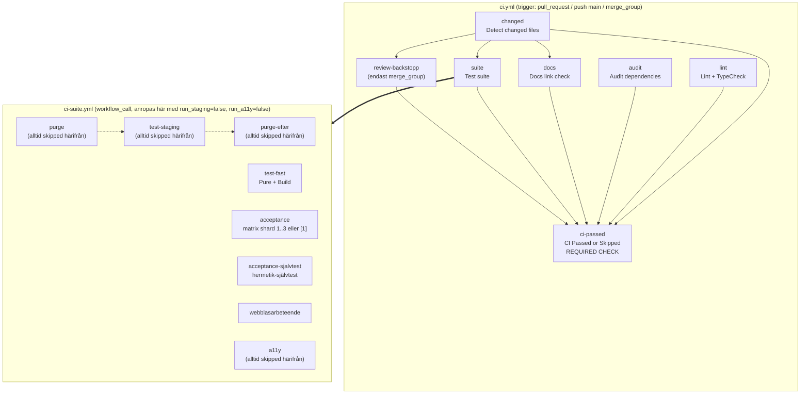

# J1a — `ci.yml` och `ci-suite.yml` in i minsta detalj

> **Proveniens.** Skrivet av en `research-pass`-agent (modell: se § Rapport i
> orkestrerarens slutsammanställning — denna fil citerar inte sin egen
> modell-identitet, det gör agentens returrapport till orkestreraren) som en
> av flera parallella jobb i CI-djupgranskningen, Session 126, 2026-09-17.
> Arbetskatalog: worktreen `s126-ci-djupgranskning`. Ögonblicksbild:
> `origin/main` vid `eeca8c72` (2026-09-08) plus vad som faktiskt låg på disk
> i worktreen vid läs-tillfället — se § Metod för exakt vad som lästes och när.
> Denna fil svarar på EN fråga: hur fungerar `.github/workflows/ci.yml` och
> `.github/workflows/ci-suite.yml` exakt. Riskbedömning av det som beskrivs
> här görs av ett annat jobb i granskningen (8.5) — den här filen är
> faktagrunden, inte domen över den.

## Kort svar

`ci.yml` är huvudflödet: sju jobb (`changed`, `lint`, `audit`, `suite`,
`docs`, `review-backstopp`, `ci-passed`) triggade av `pull_request`, `push`
(till `main`) och `merge_group`. Ett enda jobb, **`ci-passed`** ("CI Passed
or Skipped"), är den mekaniskt bindande grinden — det är den enda required
check GitHub-rulesetet `main-skydd` känner till (verifierat direkt mot
GitHub 2026-09-17, se § Metod), och den är byggd för att **aldrig** kunna
bli `skipped`: den kör alltid och rapporterar success eller failure
explicit.

`ci-suite.yml` är en återanvändbar svit (`workflow_call`) med åtta jobb
(`purge`, `test-fast`, `acceptance`, `acceptance-sjalvtest`,
`webblasarbeteende`, `a11y`, `test-staging`, `purge-efter`). Den anropas av
**tre** workflower, inte två: `ci.yml` (PR- och kö-ytan, med `run_staging:
false` och `run_a11y: false` tvingat), `post-merge.yml` (varje landning på
`main`, utan inputs — alltså full bredd) och `nightly.yml` (var natt,
likaså utan inputs). Det betyder att fyra av de åtta jobben — `purge`,
`a11y`, `test-staging`, `purge-efter` — **aldrig körs på PR- eller
kö-ytan**. De körs bara efter att en ändring redan landat, i
`post-merge.yml` och `nightly.yml`, som inte är required checks.

Uppdragets tre namn-hypoteser höll ordagrant, prövade mot disk
2026-09-17: **"Detect changed files"** (`.github/workflows/ci.yml:51`),
**"CI Passed or Skipped"** (`ci.yml:2538`, och detta är samtidigt namnet på
den skarpa GitHub-checken) och **"Staging sentinel purge"**
(`ci-suite.yml:90`) heter alla exakt likadant i dag som för sju veckor
sedan. Det jobb som INTE höll sitt namn är `lint`: det hette **"Lint +
Audit + TypeCheck"** fram till `TASK-395` (2026-09-04), då
supply-chain-revisionen (`audit-ci`) flyttades till ett eget jobb
(`audit`) och `lint` döptes om till **"Lint + TypeCheck"**
(`ci.yml:504-516`).

## Vad jag läste först

`docs/research/` innehåller inget tidigare pass som gör en fullständig
rad-för-rad-genomgång av dessa två filer i deras NUVARANDE form. Två
tidigare pass är direkt relevanta men är **designdokument från innan
implementationen fanns**, inte revisioner av den färdiga koden:

- `docs/research/riskanpassad-ci-design-2026-07-23.md` — designen för
  D1-klassen, merge-dedup, nattnät och visuell regression, skriven innan
  `ADR-077` mintades. Läst i sin helhet.
- `docs/research/merge-queue-mot-staging-mutex-2026-07-26.md` — varför
  merge queue inte löser staging-mutexen. Läst i sin helhet, inklusive
  amenderingen 2026-07-27 (organisationsflytten som öppnade merge queue).

Jag läste följande styrande ADR:er i sin helhet innan jag öppnade
workflow-filerna, för att inte föreslå något redan avgjort:
**ADR-029** (changed-files-mönstret, grundarkitekturen), **ADR-036**
(CI som enda mekaniska enforcement — och de två 2026-08-05-amenderingarna
om `verify:ci-parity` som diagnosverktyg), **ADR-076** (merge-grinden,
ruleset, och tre korrigeringsblock: skipped-aggregator-hålet 2026-07-23,
ägarform-flytten 2026-07-27, `strict` avstängd 2026-08-05), **ADR-077**
(riskklassning/dedup/nattnät, plus 2026-08-28-uppdateringen om
post-merge-lagrets ärvda klassning), **ADR-080** (Acceptance-klassens
utbrytning, med utfalls-korrigeringen 2026-07-28 och `skipAssetRequests`-
rättelsens historik) och **ADR-094** (Webbläsarbeteende-klassen). **ADR-105**
(review-grinden) fanns redan sammanfattad i `CLAUDE.md` § Review-grinden i
stor detalj; jag läste ADR:n själv ändå, i sin helhet, eftersom
`CLAUDE.md`-sammanfattningen är en karta, inte källan.

**Ingen av dessa var åldrad på ett sätt som gjorde dem obrukbara** — men
samtliga beskriver ARKITEKTUR-BESLUT, inte den levande filens exakta
rader. Skillnaden är stor: `ci.yml` har vuxit till 2 566 rader och
`ci-suite.yml` till 976 rader sedan besluten togs, med dussintals
punktinsatser (se de enskilda jobbens kommentarer, som själva citerar
`TASK`-nummer från 2026-05 till 2026-09-07) som ingen ADR eller tidigare
research beskriver i sin helhet. Det är den luckan den här filen fyller:
en läsning av filerna SOM DE STÅR i dag, med varje jobb, villkor och
skip-väg verifierad mot den faktiska YAML:en, inte mot vad ett
designdokument sade att de skulle bli.

## Metod

Båda filerna lästes i sin helhet, i sekventiella block, utan att hoppa
över något:

| Fil | Storlek (uppdragets mätning) | Rader (mätt av mig, `wc -l`) | Lästa radintervall |
|---|---|---|---|
| `.github/workflows/ci.yml` | 158 676 byte | 2 566 | 1–500, 500–1000, 1000–1500, 1500–1900, 1900–2300, 2300–2566 |
| `.github/workflows/ci-suite.yml` | 53 336 byte | 976 | 1–500, 500–975, 975–976 |

Byte-talen i uppdraget stämmer mot `ls -la` kört av mig 2026-09-17 i
samma worktree. Utöver de två målfilerna läste jag riktade utdrag ur
`nightly.yml` (rad 1–70, `on:`-blocket och `suite`-jobbets anrop av
`ci-suite.yml`) och `post-merge.yml` (rad 1–60 och 141–249, trigger och
anrop av `ci-suite.yml`) — **enbart** de ställen där de anropar eller
refereras av `ci.yml`/`ci-suite.yml`, per uppdragets avgränsning ("rör dem
bara där ci.yml anropar eller anropas av dem"). Jag läste även
`gate-proof.yml` och `review-backstopp-proof.yml`s inledande
kommentarblock (bevis-workflower för `ci-passed` respektive
`review-backstopp`, triggade manuellt via `workflow_dispatch` — de körs
aldrig automatiskt och ingår inte i det ordinarie flödet, men förklarar
VARFÖR vissa konstruktioner i `ci.yml` ser ut som de gör).

**En mätning gjordes live mot GitHub**, inte bara läst ur ADR-prosa:

```text
$ gh api repos/high-five-group/miranon-media-admin/rulesets/19627609 \
    --jq '{name, enforcement, rules: [.rules[] | {type, parameters}]}'
```

körd 2026-09-17, gav (utdrag): `required_status_checks` →
`{"context":"CI Passed or Skipped","integration_id":15368}`,
`strict_required_status_checks_policy: false`, samt en aktiv
`merge_queue`-regel med `grouping_strategy: ALLGREEN`,
`max_entries_to_build: 3`, `max_entries_to_merge: 3`,
`min_entries_to_merge: 1`, `min_entries_to_merge_wait_minutes: 5`,
`check_response_timeout_minutes: 60`. Detta bekräftar **verifierat**, inte
bara "starkt indikerat", att `ADR-076`s beskrivning av läget efter
2026-08-05-amenderingen fortfarande gäller ordagrant den 2026-09-17.

Jag läste också `package.json` (rad 24–32) för att verifiera de exakta
Playwright-projektnamnen bakom varje `npm run test:*`-kommando, i stället
för att gissa utifrån skript-namnen.

**Vad jag INTE gjorde:** jag körde ingen egen CI-körning och triggade
ingen `workflow_dispatch`. Uppdragskontraktet (`00-agentkontrakt.md`)
förbjuder skrivande GitHub-anrop, och alla tidsangivelser (t.ex.
`Acceptance`-jobbets 404–461 sekunder) är därför **citerade ur filernas
egna kommentarer**, som i sin tur citerar `gh run view`-mätningar gjorda av
tidigare sessioner — märkta i denna fil som `starkt indikerad` (jag har
inte själv sett run-datan) snarare än `verifierad`, utom där jag själv
körde `gh api` (ruleset-mätningen ovan) eller läste källkod direkt
(`package.json`).

## Fynd

### 1. Triggers — exakt vad som kör på vilken händelse

**`ci.yml`** (`ci.yml:4-24`):

```yaml
on:
  pull_request:
    branches: [main]
  push:
    branches: [main]
  merge_group:
    types: [checks_requested]
    branches: [main]
```

Tre händelser, alla riktade mot `main`. `merge_group` har bara EN
aktivitetstyp i dag (`checks_requested`) — kommentaren i filen förklarar
att den ändå skrivs ut explicit, i stället för ett tomt `merge_group:`,
för att inte tyst utöka omfånget om GitHub någon gång lägger till en andra
aktivitetstyp. Ingen `workflow_dispatch` och ingen `schedule` finns i
`ci.yml` — de trigger-formerna hör till `nightly.yml`,
`gate-proof.yml` och `review-backstopp-proof.yml`.

**`ci-suite.yml`** (`ci-suite.yml:34-80`) har en enda trigger:
`workflow_call`, med tre inputs (`run_staging: boolean, default true`,
`run_a11y: boolean, default true`, `acceptance_selection: string, default
''`). Filen kan aldrig triggas direkt av ett GitHub-event — bara anropas
av ett annat workflow via `uses:`.

**Vem anropar `ci-suite.yml`, och med vad** (verifierat med grep mot
samtliga workflow-filer, 2026-09-17):

|Anropare|`with:`-block|Effekt|
|---|---|---|
|`ci.yml` (`ci.yml:2270-2273`)|`run_staging: false`, `run_a11y: false`, `acceptance_selection: ${{ needs.changed.outputs.acceptance_urval }}`|Endast `test-fast`, `acceptance` (ev. urvald delmängd) och `webblasarbeteende` körs på PR- och kö-ytan|
|`post-merge.yml` (`post-merge.yml:248-249`)|inget `with:`-block alls|Alla defaulter gäller: full bredd, alla åtta jobb|
|`nightly.yml` (`nightly.yml:61-62`)|inget `with:`-block alls|Samma som ovan — full bredd, var natt|

Detta är den ENA korrigeringen av uppdragets hypotes värd att lyfta högst:
hypotesen sade "anropas av både `ci.yml` och `nightly.yml`" — det stämmer,
men listan är **ofullständig**. `post-merge.yml` är den TREDJE anroparen,
och den är strukturellt viktigast av de två icke-PR-anroparna eftersom den
kör på VARJE landning, inte bara en gång om dygnet.

### 2. Toppnivå: `permissions`, `concurrency`, `env`, `defaults`

**`ci.yml`:**

- `permissions: {}` (`ci.yml:28`) — minsta möjliga rättighet som default;
  varje jobb måste själv be om det den behöver (`contents: read`,
  `actions: read`, `pull-requests: read` där det förekommer).
- `concurrency` (`ci.yml:43-45`):

  ```yaml
  concurrency:
    group: ${{ github.workflow }}-${{ github.event.number || github.event.merge_group.head_sha || github.sha }}
    cancel-in-progress: ${{ github.event_name != 'merge_group' }}
  ```

  En ny push på samma PR avbryter den gamla körningen (vanlig
  CI-hygien). Men på kö-ytan (`merge_group`) är `cancel-in-progress`
  medvetet **avstängt** — att avbryta en kö-körning gör att dess required
  check aldrig rapporteras, vilket kan fälla hela kön (dokumenterad
  GitHub-fälla, community-diskussion #137976, citerad i filens egen
  kommentar rad 32-36).
- Inget `env:`-block och inget `defaults:`-block på toppnivå. Miljövariabler
  sätts per steg (t.ex. `NPM_CONFIG_FETCH_TIMEOUT` i `audit`-jobbet).

**`ci-suite.yml`:**

- `permissions: {}` (`ci-suite.yml:82`) — samma minsta-rättighet-princip.
  Eftersom ett anropat (`workflow_call`) workflow bara kan BEHÅLLA eller
  MINSKA anroparens tokenrättigheter, aldrig höja dem (GitHub-dokumenterad
  regel, citerad i `ci.yml:2164-2171`), måste `ci.yml`s `suite`-jobb
  explicit ge `contents: read` för att `ci-suite.yml`s jobb ska kunna
  checka ut koden — annars blir det en eskalering och jobbet dör med
  `startup_failure` (empiriskt fångat en gång, S79, run `30037333924`,
  citerat i kommentaren).
- Ingen toppnivå-`concurrency` i `ci-suite.yml`. Den enda
  `concurrency`-gruppen i filen sitter på jobbnivå, i `test-staging`
  (se § 6).
- Inget `env:`- eller `defaults:`-block.

### 3. Varje jobb i `ci.yml`

#### `changed` — "Detect changed files"

- **Definierad:** `ci.yml:50-499`. **Namn:** oförändrat sedan `ADR-029`
  (2026-05-13).
- **`if:`** inget — root-jobb, kör alltid.
- **`needs:`** inget.
- **Runner:** `ubuntu-latest`. **Timeout:** 3 minuter (`ci.yml:53`).
- **Permissions:** `contents: read`, `actions: read` (den senare enbart
  för att dedup-steget kan fråga `gh run list` — minsta grant utöver
  läsning, `ci.yml:54-59`).
- **Concurrency:** ingen egen — ärver workflow-nivåns grupp.
- **Hemligheter/variabler (namn):** `GH_TOKEN` (satt till
  `secrets.GITHUB_TOKEN`, i dedup-steget), `EVENT_NAME`
  (`github.event_name`), `OVRIGA_ANDRADE` (`steps.changed-files.outputs.
  other_changed_files`, karantänsatt i `env:` för att undvika
  skal-injektion från angriparstyrbara filnamn).
- **Steg** (samtliga `uses: tj-actions/changed-files@9426d40…` SHA-pinnat,
  v47.0.6, utom Checkout som är `actions/checkout@3d3c42e…` v7.0.1):

  |#|Steg|`fil:rad`|Vad det gör|
  |---|---|---|---|
  |1|Checkout|`122-129`|`fetch-depth: 0` (full historik — ADR-054)|
  |2|Get changed files|`131-250`|D0-klassning (docs-only-allowlist)|
  |3|Get changed docs files|`252-308`|Bredare "påverkar docs-grindarna"-lista|
  |4|Get changed UI files (D1)|`310-340`|Ren CSS/stil-yta-allowlist|
  |5|Get changed acceptance-class files|`342-405`|Ändring lokal till `tests/acceptance/**`|
  |6|Acceptance-urval|`407-450`|Väljer delmängd spec-filer via `scripts/acceptance-urval.sh`|
  |7|Merge-dedup|`452-499`|Se § 4|

- **Outputs** (`ci.yml:60-86`, samtliga exponerade som strängar
  `'true'`/`'false'` eller fri text):

  |Output|Källa|Betydelse|
  |---|---|---|
  |`should_skip_tests`|`changed-files.outputs.only_changed`|D0: hela testsviten hoppas|
  |`docs_changed`|`changed-docs.outputs.any_changed`|Docs-jobbet ska köras|
  |`ui_low_risk`|`changed-ui.outputs.only_changed`|D1 — **utan konsument sedan `TASK-70.3`**, se nedan|
  |`acceptance_local`|`changed-acceptance.outputs.only_changed`|Samma öde som `ui_low_risk`|
  |`dedup_hit`|`dedup.outputs.dedup_hit`|Main-push vars träd redan bevisats grönt|
  |`acceptance_urval`|`acceptance-urval.outputs.acceptance_urval`|Blankstegsseparerad fil-lista eller tom sträng|

  **Viktigt fynd, som filen själv dokumenterar rakt ut** (`ci.yml:63-68`,
  `ci.yml:358-359`): `ui_low_risk` och `acceptance_local` beräknas
  fortfarande varje körning men har **noll konsumenter** sedan `suite`-
  jobbet (se § 3, `suite`) skickar `run_staging: false` OVILLKORLIGT.
  Klassificeringen körs, kostar CPU-tid, men styr ingenting längre. Filen
  kallar detta öppet — inte en bugg, ett medvetet kvarlämnat spår
  (`ADR-077` § Beslut 1 äger klassrymden och beslutet att riva eller
  bevara den är inte fattat).

- **Success:** samtliga outputs sätts, nedströms-jobb (`docs`, `suite`,
  `review-backstopp`, `ci-passed`) kan utvärdera sina villkor.
- **Failure:** om något steg faller (t.ex. dedup-scriptets `set -euo
  pipefail` träffar ett oväntat fel) blir `changed` `failure`. `docs`,
  `suite` och `review-backstopp` har inget `if: always()` och blir då
  automatiskt `skipped` av GitHub Actions runtime (standardbeteendet: ett
  jobb med ett fallerat `needs` körs inte om `if:` inte explicit säger
  annat). `ci-passed` kör ändå (`if: always()`) och ser `changed: failure`
  → aggregatorn faller.
- **Skip:** `changed` självt kan aldrig bli `skipped` genom ett `if:` —
  det saknar ett sådant villkor. Den enda vägen till att det inte körs
  alls är att hela workflow-körningen avbryts (t.ex. `concurrency`
  `cancel-in-progress`).
- **Nedströms:** `docs`, `suite`, `review-backstopp`, `ci-passed`.

#### `lint` — "Lint + TypeCheck"

- **Definierad:** `ci.yml:501-1978`. **Bytt namn** `TASK-395`
  (2026-09-04): var "Lint + Audit + TypeCheck" tills `audit-ci` flyttades
  ut till ett eget jobb.
- **`if:`** inget. **`needs:`** inget — kör alltid, parallellt med
  `changed` och `audit`.
- **Runner:** `ubuntu-latest`. **Timeout:** 15 minuter (`ci.yml:518`) —
  höjt två gånger på en och samma dag, 2026-09-04 (5→10→15), efter att
  `npm ci` och `audit-ci` (som DÅ fortfarande bodde här) fastnade i
  npm-registrets latens; se jobbets egen "AVLÄSNING"-kommentarer
  (`ci.yml:1754-1789`) för de citerade run-ID:na. Taket är MÄTT
  historiskt värsta fall plus marginal, inte en projektion.
- **Permissions:** `contents: read`.
- **Hemligheter/variabler:** inga `secrets.*` används i detta jobb.
- **Steg (35 st, i ordning; jag listar namn + `fil:rad`, inte varje
  motivering — de är omfattande och citerade ovan i § Vad jag läste
  först-andan men bor i filen själv):**

  |#|Steg|`fil:rad`|
  |---|---|---|
  |1|Checkout (`fetch-depth: 0`)|`522-530`|
  |2|Setup Node|`532-536`|
  |3|Install dependencies (`npm ci`)|`538-539`|
  |4|Biome check|`541-542`|
  |5|TypeScript check (`npm run typecheck`)|`544-545`|
  |6|TypeScript check (tests)|`547-548`|
  |7|Check workflow files (actionlint, SHA256-verifierad binär)|`550-577`|
  |8|Install yamllint (pinnad 1.38.0)|`579-611`|
  |9|Check YAML syntax (yamllint)|`613-630`|
  |10|Check public docs for unchecked items|`644-653`|
  |11|Validate frontmatter on governing docs|`655-664`|
  |12|Validate lifecycle field on session docs|`666-669`|
  |13|Validate thread index integrity|`671-700`|
  |14|Check ADR count consistency|`702-707`|
  |15|Check lesson numbering|`709-716`|
  |16|Check permissions claims|`718-778`|
  |17|Check fetch-depth invariant|`780-786`|
  |18|Check list parity|`788-817`|
  |19|Validate locked facit is addressable|`819-835`|
  |20|Check mall parity|`838-855`|
  |21|Check for long dashes in UI strings|`857-879`|
  |22|Check for mailto: paths in send flows|`881-907`|
  |23|Test consistency gates (2 sviter)|`909-918`|
  |24|**Test gatekeeper script suites (53 sviter i ett steg)**|`919-1546`|
  |25|Test post-merge-lagrets ärvda klassning|`1548-1566`|
  |26|Test post-merge-larmets attribution|`1568-1588`|
  |27|Test PR-grindens acceptance-urval|`1590-1607`|
  |28|Test prod-deploy allowlist|`1609-1622`|
  |29|Test purge-vaktens 404-diskriminering|`1623-1651`|
  |30|Test seed-fixturens guard-funktioner|`1653-1674`|
  |31|Test facit:godkann-skriptets guard-funktioner|`1676-1693`|
  |32|Check staging-preflightens wiring|`1695-1728`|
  |33|Test wiring-vaktens fyrning|`1730-1789`|
  |34|Install shellcheck (pinnad v0.11.0, SHA256-verifierad)|`1791-1840`|
  |35|Validate bash scripts with shellcheck-strict (32 filer/mönster)|`1842-1978`|

  **Steg 24 i detalj**, eftersom det är jobbets tyngsta enskilda steg
  (`run: |`-block `ci.yml:1494-1546`, exakt 53 kommandorader): det kör
  hela husets bibliotek av gatekeeper-testsviter i en enda `run:`-sekvens.
  Grupperat efter familj (fullständig lista finns i filen, inte
  återgiven post för post här — se `fil:rad` ovan för exakt läsplats):
  frontmatter/checklist/lifecycle/trådregister (6 st), review-grinden
  (6 st: `validera-review-utlatande`, `review-policy`,
  `review-risk-sektion`, `review-loop`, `review-metrics`,
  `review-backstopp`), `deny-*`-hook-familjen (10 st, PreToolUse-lås som
  körs live i en Claude Code-session men aldrig i CI — bara deras LOGIK
  testas här), nattvakts-familjen (`arkivera-sessionsdok`,
  `check-obesvarade-larm`, `check-pausade-sessioner`, `check-nattvakt-
  dedup`, `check-sessionsdok-fonster`), verktygspolicy-vakter
  (`supabase-cli-policy`, `jq-guard`, `gh-guard`), samt en handfull
  domänspecifika sviter (`docraptor-sjalvbarande`,
  `task-338-6-prod-migration`, `backfill-inbetalningar`, `synka-labels`,
  `visual-baselines-scope`, `mallparitet`, `audit-degradering`,
  `heartbeat-svep`, `stada-grenar`, `post-compact-igenkanning`,
  `check-langa-streck`, `check-mailto`). Samtliga är **hermetiska** enligt
  sina egna filhuvuden (mktemp-sandlådor, stubbade PATH-verktyg, inga
  riktiga secrets, ingen nätverkstrafik) — jag har läst detta i
  kommentarerna men INTE själv kört sviterna för att verifiera hermetiken;
  märkt **starkt indikerad**, inte verifierad av mig.

- **Success:** alla 35 steg passerar.
- **Failure:** vilket steg som helst faller (t.ex. en Biome-regel, ett
  typfel, en trasig frontmatter, en shellcheck-varning i style-läge) →
  jobbet `failure` → `ci-passed` faller.
- **Skip:** jobbet har inget `if:` och kan alltså aldrig bli `skipped` av
  ett villkor — det körs på VARJE `pull_request`, `push` och
  `merge_group`-händelse, inklusive rena docs-ändringar (K17-principen:
  supply-chain- och kodkvalitetsgrindar gäller doc-only lika mycket som
  kod).
- **Nedströms:** `ci-passed`.

#### `audit` — "Audit dependencies (audit-ci)"

- **Definierad:** `ci.yml:2097-2147`. **Nytt jobb** sedan `TASK-395`
  (2026-09-04) — splittrat ut ur `lint` efter att npm:s
  advisory-bulk-endpoint flappade och tog HELA `lint`-jobbet (inklusive
  arton efterföljande steg) i fallet med sig (mätt: run `33862945280`,
  `Audit dependencies`-steget tog 575 s = exakt 5×90s+4×30s
  retry-loopen, jobbet `failure`, alla efterföljande steg `skipped`).
- **`if:`** inget. **`needs:`** inget — villkorslöst, exakt som `lint`.
- **Runner:** `ubuntu-latest`. **Timeout:** 20 minuter (`ci.yml:2100`) —
  rymmer loopens värsta fall (~9,5 min) plus `npm ci` med marginal.
- **Permissions:** `contents: read`. Ingen `fetch-depth:`-nyckel på
  Checkout-steget (medvetet — jobbet behöver ingen historik, och en
  fjärde fetch-depth-bärare hade fällt `check-fetch-depth-invariant.sh`,
  som kräver exakt tre bärare i denna fil).
- **Hemligheter/variabler:** `NPM_CONFIG_FETCH_TIMEOUT` (litteral
  `"90000"`), `AUDIT_BAS_SHA` (`github.event.pull_request.base.sha ||
  github.event.merge_group.base_sha`), `AUDIT_HEAD_SHA`
  (motsvarande `.head.sha`). Inga `secrets.*`.
- **Steg:**

  |#|Steg|`fil:rad`|
  |---|---|---|
  |1|Checkout|`2114-2115`|
  |2|Setup Node|`2117-2121`|
  |3|Install dependencies|`2123-2124`|
  |4|Audit dependencies (audit-ci with allowlist)|`2126-2147`|

  Steg 4 anropar `bash scripts/audit-ci-med-degradering.sh` — logiken bor
  i ett skript (inte inline i YAML) just för att `shellcheck-strict` och
  en egen testsvit (`test-audit-degradering.sh`, 41 hävdanden, körs i
  `lint`-jobbets steg 24) ska kunna skydda den. Degraderingen (skriptets
  fail-soft-läge vid nätverksfel) kräver att BÅDA villkoren håller
  samtidigt: (A) alla fem försök klassas som ett känt nätverksfel-mönster,
  och (B) `package.json`/`package-lock.json` är oförändrade mot en
  effektiv bas (PR:ens merge-bas, härledd via `git cat-file`, med
  fallback till eventets `base.sha`). Håller båda: `::warning::` + exit 0.
  Håller inte: exit 1. På ett rent `push`-event (utan PR-bas) gäller
  degraderingen ALDRIG — skriptet faller alltid ut med exit 1 om
  auditen inte lyckas på riktigt.
- **Success:** audit-ci hittar inga sårbarheter över tröskeln (eller
  degraderar giltigt).
- **Failure:** en verklig sårbarhet över tröskeln, ELLER ett nätverksfel
  som inte matchar degraderingens två villkor.
- **Skip:** aldrig — inget `if:`.
- **Nedströms:** `ci-passed`.

#### `suite` — "Test suite" (anropar `ci-suite.yml`)

- **Definierad:** `ci.yml:2149-2274`.
- **`needs:`** `changed`.
- **`if:`** (`ci.yml:2163`, ordagrant):

  ```yaml
  if: ${{ needs.changed.outputs.should_skip_tests != 'true' && needs.changed.outputs.dedup_hit != 'true' }}
  ```

- **Runner/timeout:** inget explicit `timeout-minutes` på detta
  caller-jobb — varje inre jobb i `ci-suite.yml` bär sitt eget tak (se
  § 6). **Permissions:** `contents: read` (se § 2 för varför detta grant
  krävs för att inte eskalera-nekas).
- **`with:`** (`ci.yml:2270-2273`): `run_staging: false` (litteral,
  villkorslöst — staging kör aldrig på PR/kö-ytan), `run_a11y: false`
  (litteral, villkorslöst), `acceptance_selection: ${{
  needs.changed.outputs.acceptance_urval }}` (dynamiskt).
- **`secrets:`** `inherit` — alla anroparens ärvbara secrets når de inre
  jobben (verifierat via en kastbar spike-körning 2026-07-23, citerad i
  filen; jag har inte själv kört den spiken).
- **Success:** samtliga inre jobb som faktiskt kördes (givet `run_staging:
  false`/`run_a11y: false`, alltid `test-fast`, `acceptance`,
  `acceptance-sjalvtest`, `webblasarbeteende` — se § 6) blev `success`
  eller `skipped`-by-design.
- **Failure:** något av de inre jobben som körde blev `failure` eller
  `cancelled` (t.ex. en `acceptance`-shard som tar timeout).
- **Skip:** hela anropet — och därmed alla åtta inre jobb — hoppas när
  `should_skip_tests == 'true'` (ren D0-docs-diff) ELLER `dedup_hit ==
  'true'` (main-push vars träd redan bevisats grönt i PR:en). `suite:
  skipped` tolereras av aggregatorn.
- **Nedströms:** `ci-passed`.

#### `docs` — "Docs link check"

- **Definierad:** `ci.yml:2276-2449`.
- **`needs:`** `changed`. **`if:`** (`ci.yml:2281`):
  `needs.changed.outputs.docs_changed == 'true'`.
- **Runner:** `ubuntu-latest`. **Timeout:** 10 minuter (`ci.yml:2283`).
- **Permissions:** `contents: read`.
- **Hemligheter/variabler:** `token: ${{ secrets.GITHUB_TOKEN }}` till
  lychee-action (för högre rate limit mot GitHub-URL:er, men se nedan —
  körs `--offline`).
- **Steg:**

  |#|Steg|`fil:rad`|
  |---|---|---|
  |1|Checkout (`fetch-depth: 0`)|`2287-2295`|
  |2|Run lychee link check (`--offline`)|`2297-2369`|
  |3|Setup Node|`2370-2374`|
  |4|Install dependencies|`2376-2377`|
  |5|Check markdown hygiene (markdownlint-cli2)|`2379-2385`|
  |6|Install Vale (SHA256-verifierad binär)|`2387-2429`|
  |7|Check prose with Vale|`2431-2440`|
  |8|Validate Vale L_X.2 regression-test-suite|`2442-2449`|

  Steg 2 kör `lychee` med `--offline` (`ci.yml:2352`) — det gör att VARJE
  `http(s)://`-länk klassas `Excluded`, inte `broken`. Extern länkkontroll
  flyttades till natten (`ADR-082`, 2026-07-28) efter att 467 av 903
  unika länkar visade sig vara externa fördelade på 125 värdar, vilket
  gjorde varje extern flakighet till en PR-blockerare. Röd `docs`-grind
  betyder sedan dess "vår egen text pekar fel", aldrig "internet hade en
  dålig dag".
- **Success:** samtliga fyra grindar (lychee, markdownlint, Vale-prosa,
  Vale-regressionssviten) passerar.
- **Failure:** valfri av de fyra faller.
- **Skip:** när `docs_changed != 'true'` — dvs. ingen fil i den bredare
  docs-relaterade listan (§ 4) rördes.
- **Nedströms:** `ci-passed`.

#### `review-backstopp` — "Review-backstopp (granskningsutlåtande)"

- **Definierad:** `ci.yml:2451-2520`. Byggd i `TASK-173.4` (`ADR-105`
  beslut 2/3), 2026-08-28.
- **`needs:`** `[changed]`. **`if:`** (`ci.yml:2486`, ordagrant):

  ```yaml
  if: ${{ github.event_name == 'merge_group' && needs.changed.outputs.should_skip_tests != 'true' }}
  ```

- **Runner:** `ubuntu-latest`. **Timeout:** 5 minuter (`ci.yml:2488`).
- **Permissions:** `contents: read`, `pull-requests: read` (för `gh pr
  view` mot den PR kö-grenens namn pekar ut).
- **Hemligheter/variabler:** `MG_REF` (`github.event.merge_group.
  head_ref`), `GH_TOKEN` (`secrets.GITHUB_TOKEN`), `GH_REPO`
  (`github.repository`).
- **Steg:**

  |#|Steg|`fil:rad`|
  |---|---|---|
  |1|Checkout (ingen `fetch-depth:`-nyckel, medvetet)|`2505-2506`|
  |2|Setup Node (ingen npm-cache — jobbet kör aldrig `npm ci`)|`2508-2511`|
  |3|Verifiera granskningsutlåtandet (`node scripts/review-backstopp.mjs`)|`2515-2520`|

  Jobbet installerar **inga** npm-beroenden alls — ett medvetet val:
  `scripts/review-backstopp.mjs` och dess enda import
  (`scripts/lib/review-risk-sektion.mjs`) har inga egna beroenden, så
  backstoppen kan inte släckas av att `npm ci` faller.
- **Success:** PR-kroppen som kö-grenens namn pekar ut bär en giltig,
  färsk (`granskadSha` == PR-huvudets SHA) Riskbedömnings-sektion.
- **Failure:** sektionen saknas, är korrupt, eller är stale (huvudet har
  rört sig sedan granskningen skrevs) → exit 1 → jobbet `failure`.
  Konsekvens: kön sparkar ut PR:en (`failed_checks`) och **konsumerar
  armeringen** (kräver ett nytt `gh pr merge --auto`).
- **Skip:** ALLTID på `pull_request`- och `push`-ytan (villkoret kräver
  `merge_group`). På `merge_group`-ytan skippas det ÄNDÅ om diffen är ren
  D0 (`should_skip_tests == 'true'`) — en docs-only-landning kräver alltså
  aldrig ett granskningsutlåtande.
- **Nedströms:** `ci-passed`.

#### `ci-passed` — "CI Passed or Skipped"

Se § 5 för fullständig detalj — den är granskningens viktigaste enskilda
jobb och behandlas separat nedan.

### 4. `changed`-jobbet i detalj

**Klassningsalgoritmen är gemensam för samtliga fyra glob-listor**
(D0/docs/D1/acceptance): varje lista är en **allowlist**, och
`only_changed`/`any_changed` beräknas av `tj-actions/changed-files`. Filens
egen kommentar (`ci.yml:373-379`) citerar actionens källkod vid den
pinnade SHA:n (`src/changedFilesOutput.ts`):

```text
onlyChanged = otherChangedFiles.length === 0
           && allChangedFiles.paths.length > 0
           && filePatterns.length > 0
```

Det andra ledet är avgörande: **noll matchande filer ger `false`, inte
`true`**. En allowlist som ingen ändrad fil träffar faller alltså alltid
till full svit — klassningen kan aldrig av misstag "vakuöst" släcka något.

**De fyra glob-listorna, verbatim** (samtliga inramade av
`# paritet:start …` / `# paritet:slut …`-markörer som
`scripts/check-listparitet.sh` — körd i `lint`-jobbets steg 18 — jämför
mot sin motpart i `scripts/check-docs.sh`):

|Klass|`fil:rad`|Positiva mönster (urval)|Exkluderingar|
|---|---|---|---|
|D0 (docs-only, `should_skip_tests`)|`219-250`|`**/*.md`, `docs/**`, `tasks/**`, `.claude/**`, `.vale/**`, `LICENSE`, `.editorconfig` m.fl. (17 poster)|`.github/workflows/**`, `package*.json`, `tsconfig*.json`, `biome.json`, `vite.config.ts` m.fl. (12 poster)|
|Bredare docs (`docs_changed`)|`296-308`|`**/*.md` + docs-verktygens EGNA configfiler (`.lycheeignore`, `.vale.ini`, `.markdownlint-cli2.jsonc`) + `.github/workflows/ci.yml` + `.claude/**`|inga (inte en allowlist mot testsviten — bredare avsikt)|
|D1 (ren UI-yta, `ui_low_risk`)|`323-340`|`**/*.css`, `src/styles/**`, `public/**`|samma 12 som D0|
|Acceptance-lokal (`acceptance_local`)|`390-405`|`tests/acceptance/**`|samma 12 (redundanta här, dokumenterat som golv för en framtida bredare allowlist)|

**Fail-closed-grenar, en per klassning:**

1. **D0/D1/acceptance:** varje fil som inte matchar allowlisten (eller
   som matchar en exkludering) faller till `false` → full svit.
2. **Dedup** (`ci.yml:452-499`, se kod nedan): fail-closed på VARJE
   avvikelse — ingen andra förälder (`HEAD^2` finns inte, dvs. inte en
   merge-commit), träd-avvikelse, `gh run list`-API-fel, eller en
   conclusion som inte är exakt `"success"`.
3. **Acceptance-urval** (`scripts/acceptance-urval.sh`, anropat från
   `ci.yml:447-450`): faller till tom sträng (= full klass) om NÅGON
   ändrad fil utanför D0-listan inte är en existerande
   acceptance-spec-fil.

**Dedup-logiken, verbatim** (`ci.yml:472-499`):

```bash
dedup_hit=false
if [ "${EVENT_NAME}" = "push" ]; then
  if head2=$(git rev-parse --verify HEAD^2 2>/dev/null); then
    tree_head=$(git rev-parse 'HEAD^{tree}')
    tree_head2=$(git rev-parse "${head2}^{tree}")
    if [ "${tree_head}" = "${tree_head2}" ]; then
      conc=$(gh run list --commit "${head2}" --workflow ci.yml \
        --json conclusion,status \
        --jq '[.[] | select(.status == "completed")][0].conclusion // ""' \
        2>/dev/null || echo "APIERR")
      if [ "${conc}" = "success" ]; then
        dedup_hit=true
      fi
    fi
  fi
fi
```

Meningen: på ett `push`-event (main-landningen efter en PR-merge), om
merge-commiten har en andra förälder (dvs. den ÄR en merge-commit) OCH
det trädet är byte-identiskt med förälderns träd OCH den förälderns SHA
redan har en avslutad, grön `ci.yml`-körning — då hoppas hela `suite`-
anropet på main-pushen. Soundheten vilar helt på `ADR-076`s
`strict_required_status_checks_policy`... **men den är sedan 2026-08-05
avstängd** (se § Metod, live-mätningen). Detta är inte en motsägelse:
merge queue (aktiverad sedan `TASK-70.1`, verifierad live ovan) bygger
varje kö-post ovanpå `main` plus posterna före den, vilket ger samma
träd-identitets-garanti som `strict` gav — bara via en annan mekanism.
Jag har INTE själv verifierat att denna kedja håller mot en konkret
`push`-körning 2026-09-17 (`ej verifierbar` inom detta pass' tidsram utan
att trigga en skarp merge); jag noterar den som **starkt indikerad**
utifrån att `ADR-076`s amendering är explicit om just denna ersättning.

### 5. Aggregatorn i detalj

`ci-passed` (`ci.yml:2537-2566`) är den **enda mekaniskt bindande grinden**
i hela flödet — verifierat live (§ Metod) att `main-skydd`-rulesetets
`required_status_checks` innehåller exakt en post: `"CI Passed or
Skipped"`, bunden till `integration_id: 15368` (GitHub Actions-appen,
enligt `ADR-076` beslut 5 — ett skydd mot att en ANNAN app eller ett rått
`POST /repos/.../statuses/{sha}`-anrop kan förfalska check-namnet).

```yaml
ci-passed:
  name: CI Passed or Skipped
  if: ${{ always() }}
  needs: [changed, lint, audit, docs, suite, review-backstopp]
  runs-on: ubuntu-latest
  timeout-minutes: 1
  permissions: {}
  steps:
    - name: Verifiera needs-resultaten (fail-closed)
      env:
        NEEDS: ${{ toJSON(needs) }}
      run: |
        echo "${NEEDS}" | jq -r 'to_entries[] | "\(.key): \(.value.result)"'
        bad=$(echo "${NEEDS}" | jq -r '[to_entries[] | select(.value.result == "failure" or .value.result == "cancelled")] | length')
        if [ "${bad}" -ne 0 ]; then
          echo "❌ ${bad} jobb med failure/cancelled — aggregatorn FAILAR explicit …"
          exit 1
        fi
        echo "✅ CI Passed or Skipped — alla jobb success eller skipped-by-design."
```

**Den exakta logiken:** `if: always()` gör att jobbet körs oavsett vad
som hänt uppströms — inklusive om `changed` själv har fallerat. Steget
serialiserar alla sex `needs`-resultat till JSON och räknar hur många som
är `"failure"` **eller** `"cancelled"`. Är den summan noll → exit 0 →
grönt. Är den större än noll → exit 1 → rött. **`"skipped"` räknas varken
som bra eller dåligt explicit — det passerar tyst genom filtret** eftersom
det varken är `"failure"` eller `"cancelled"`, vilket är precis avsikten:
ett jobb som medvetet hoppades (docs-only `suite`, ett icke-doc-ändrat
`docs`, ett icke-kö `review-backstopp`) ska INTE fälla aggregatorn.

**Historiken bakom formen är själva skälet till att den ser ut så här**
(`ci.yml:2522-2536`): den GAMLA formen villkorade aggregator-JOBBET självt
på ett `if:` som kunde göra HELA aggregatorn `skipped` när ett uppströms-
jobb fallerade. GitHub räknar en `skipped` required check som **uppfylld**
— PR `#101` mergades därför AUTOMATISKT trots ett rött `docs`-jobb
(körning `30023934304` → main-rött `30024005788`, S77, 2026-07-23). Dagens
form (`if: always()` PLUS explicit `exit 1`) stänger exakt det hålet.
`gate-proof.yml` är den riktade bevis-workflowen som skarpt testar båda
riktningarna (en grön avfyrning bevisar att paraplyn kör och fäller på
rött; en negativ kontroll bevisar att en tvingad skip fångas) — jag har
läst dess syfte men inte själv kört den.

**Nedströms av `ci-passed`:** ingenting inom `ci.yml` självt — det är
slutpunkten. Utåt är det required-check-signalen som GitHubs merge queue
och `pull_request`-UI läser för att avgöra om en PR får armeras/mergas.

### 6. `ci-suite.yml` i detalj

**Inputs** (se § 1) styr tre saker: om staging körs, om a11y körs, och
vilken delmängd av Acceptance-klassen som körs. **Secrets-arv:**
`ci.yml`s `suite`-jobb skickar `secrets: inherit`; `post-merge.yml` och
`nightly.yml` gör detsamma (verifierat med grep, `nightly.yml:62`,
`post-merge.yml` motsvarande rad). Alla secrets anroparen har tillgång
till (Actions-repo-secrets) blir därmed tillgängliga för `ci-suite.yml`s
jobb — modererat av att flera av jobben ändå har egna `if:`-villkor som
utesluter Dependabot (som saknar secrets-åtkomst ändå, ADR-031 Lager 3).

**Samtliga åtta jobb:**

|Jobb (id)|Namn|`fil:rad`|`needs`|`if` (kort)|Timeout|Concurrency|
|---|---|---|---|---|---|---|
|`purge`|Staging sentinel purge|`89-149`|—|`run_staging && !dependabot`|5 min|—|
|`test-fast`|Pure + Build|`153-202`|—|inget (alltid)|8 min|—|
|`acceptance`|Acceptance (hermetisk)|`231-454`|—|inget (alltid), matrix `shard`|12 min|—|
|`acceptance-sjalvtest`|Acceptance — tvåsidigt bevis|`516-593`|—|inget (alltid)|20 min|—|
|`webblasarbeteende`|Webblasarbeteende|`625-688`|—|inget (alltid)|8 min|—|
|`a11y`|A11y (axe-runner)|`705-747`|—|`run_a11y && !dependabot`|8 min|—|
|`test-staging`|Staging (API + E2E)|`755-908`|`[purge]`|`!cancelled() && run_staging && !dependabot && purge OK`|20 min|`staging-tests`, `queue: max`|
|`purge-efter`|Staging sentinel purge (efter körning)|`935-976`|`[test-staging]`|`always() && run_staging && !dependabot`|5 min|—|

**Sharding i `acceptance`** (`ci-suite.yml:365-372`, `TASK-239` varv 3,
2026-09-02): matrisen är

```yaml
matrix:
  shard: ${{ fromJson(inputs.acceptance_selection == '' && '[1,2,3]' || '[1]') }}
```

Tom `acceptance_selection` (full klass — alltid fallet på
`post-merge.yml`/`nightly.yml`, och på `ci.yml` när PR:en INTE är en ren
acceptance-spec-ändring) ⇒ tre parallella shards, `--shard=I/N` där `N =
strategy.job-total` (aldrig ett hårdkodat tal). Ett satt urval (PR:en
rör bara acceptance-spec-filer) ⇒ en enda shard, ingen sharding-overhead.
Filen citerar en marginalberäkning (461 s hel svit / 3 ≈ 154 s
testtid/shard + ~30 s infrastruktur ≈ 184 s mot ett 12-minuterstak) som
grund för talet 3 — jag har inte själv mätt om detta.

**Staging-mutexen** (`ci-suite.yml:815-817`):

```yaml
concurrency:
  group: staging-tests
  queue: max
```

En global sträng utan `github.ref` — ALLA körningar som tar denna mutex
(PR-körning om `run_staging: true`, main-push via `post-merge.yml`, natt
via `nightly.yml`) delar SAMMA FIFO-kö. `queue: max` (GitHub-funktion
sedan 2026-05-07) tillåter upp till 100 väntande körningar i stället för
att den äldsta väntande avbryts (`single`-defaulten). Eftersom `ci.yml`
tvingar `run_staging: false` ovillkorligt betyder detta i praktiken att
**PR- och kö-ytan aldrig tar mutexen** — bara `post-merge.yml` (varje
landning) och `nightly.yml` (en gång/natt) gör det.

**Sentinel-purgen, före och efter:** `purge` (setup, ADR-060 punkt 3–4)
tar bort gamla sentinel-rader (äldre än en ålders-guard på 60 minuter)
INNAN staging-jobbet skapar nya. `purge-efter` (`TASK-309.15`, ny sedan
den ursprungliga designen) städar SPECIFIKT de rader den just avslutade
körningen skapade, läst ur ett ägar-manifest
(`.kastbara/poster.jsonl`) som `test-staging` laddar upp som artefakt
(`always()`, `retention-days: 1`) och `purge-efter` laddar ner
(`continue-on-error: true`, så en saknad artefakt — t.ex. vid en tidig
krasch — inte fäller städjobbet). Motiveringen (`ci-suite.yml:910-919`):
en mätning 2026-08-24 hittade 151 kvarliggande `ZZ`-testevent, samtliga
yngre än 2,4 timmar — setup-purgen hade redan kört, men fönstret MELLAN
en körning och nästa var strukturellt utanför dess räckvidd.

**Playwright-projekt per jobb** (verifierat mot `package.json:24-32`,
inte gissat ur skriptnamnen):

|Jobb|`npm run`-kommando|Playwright-projekt / mekanism|
|---|---|---|
|`test-fast`|`test:api:pure`|`--project=api-pure`|
|`acceptance`|`test:acceptance`|`--project=acceptance`|
|`acceptance-sjalvtest`|`test:acceptance:sjalvtest`|`node scripts/hermetik-sjalvtest.mjs` — INTE ett Playwright-projekt, ett separat körskript som avsiktligt kör om acceptance-sviten med nätverket avstängt|
|`webblasarbeteende`|`test:webblasarbeteende`|`--project=webblasarbeteende`|
|`a11y`|`test:a11y`|`--project=a11y`|
|`test-staging`|`test:api:staging` + `test:e2e:staging`|`--project=api-staging` respektive `--project=chromium-authenticated`|

**Retries:** jag hittade INGEN `retries`-inställning i `ci-suite.yml`
själv — Playwrights `retries: process.env.CI ? 2 : 0` sätts i
`playwright.config.ts` (citerad i flera kommentarer, t.ex.
`ci-suite.yml:772-773`, `508`), som ligger utanför denna fils läsvidd men
nämns här som cross-referens eftersom den direkt påverkar varför
`test-staging` (E2E) har ett stort marginalbehov: en flakig test kostar
upp till tre gånger sin egen körtid (1 försök + 2 omförsök). Jag har inte
själv läst `playwright.config.ts` för att verifiera denna rad ordagrant —
märkt **starkt indikerad** (citerad konsekvent på minst tre ställen i
`ci-suite.yml`s egna kommentarer, aldrig motsagd).

**Artefakter som laddas upp (samtliga vid `failure() || cancelled()`, utom
en):**

|Jobb|Artefakt-namn|Villkor|Retention|
|---|---|---|---|
|`acceptance` (per shard)|`playwright-acceptance-artefakter-${{ matrix.shard }}`|`failure() \|\| cancelled()`|7 dagar|
|`acceptance-sjalvtest`|`playwright-acceptance-sjalvtest-artefakter`|`failure() \|\| cancelled()`|7 dagar|
|`webblasarbeteende`|`playwright-webblasarbeteende-artefakter`|`failure() \|\| cancelled()`|7 dagar|
|`test-staging`|`playwright-e2e-artefakter`|`failure() \|\| cancelled()`|7 dagar|
|`test-staging`|`kastbara-poster` (ägar-manifest, JSONL)|`always()`|1 dag|

Ingen artefakt laddas upp av `purge`, `test-fast`, `a11y` eller
`purge-efter` (den sistnämnda laddar NER en artefakt, laddar aldrig upp
någon).

### 7. Beroendegrafen

**Mermaid, för människan** (visar `ci.yml`s toppnivå och hur `suite`
öppnar upp till `ci-suite.yml`s åtta jobb; streckade pilar = villkorad
körning som ALLTID är av på PR/kö-ytan, per `ci.yml`s tvingade inputs):



**Tabell, för maskinen — jobb → needs → villkor:**

|Fil|Jobb|`needs`|`if` (kort form)|
|---|---|---|---|
|`ci.yml`|`changed`|—|—|
|`ci.yml`|`lint`|—|—|
|`ci.yml`|`audit`|—|—|
|`ci.yml`|`suite`|`changed`|`should_skip_tests != 'true' && dedup_hit != 'true'`|
|`ci.yml`|`docs`|`changed`|`docs_changed == 'true'`|
|`ci.yml`|`review-backstopp`|`[changed]`|`event_name == 'merge_group' && should_skip_tests != 'true'`|
|`ci.yml`|`ci-passed`|`[changed, lint, audit, docs, suite, review-backstopp]`|`always()`|
|`ci-suite.yml`|`purge`|—|`inputs.run_staging && actor != 'dependabot[bot]'`|
|`ci-suite.yml`|`test-fast`|—|—|
|`ci-suite.yml`|`acceptance`|—|— (matrix på `inputs.acceptance_selection`)|
|`ci-suite.yml`|`acceptance-sjalvtest`|—|—|
|`ci-suite.yml`|`webblasarbeteende`|—|—|
|`ci-suite.yml`|`a11y`|—|`inputs.run_a11y && actor != 'dependabot[bot]'`|
|`ci-suite.yml`|`test-staging`|`[purge]`|`!cancelled() && inputs.run_staging && actor != 'dependabot[bot]' && (purge.result == 'success' \|\| purge.result == 'skipped')`|
|`ci-suite.yml`|`purge-efter`|`[test-staging]`|`always() && inputs.run_staging && actor != 'dependabot[bot]'`|

**Samtliga ställen ett jobb kan bli `skipped`**, samlat på ett ställe
(mandatets specifika krav):

1. `docs` — `docs_changed != 'true'` (ingen fil i den bredare docs-listan
   rördes).
2. `suite` (och därmed ALLA åtta `ci-suite.yml`-jobb på en gång, som en
   grupp) — `should_skip_tests == 'true'` (ren D0-diff) ELLER `dedup_hit
   == 'true'` (main-push med redan bevisat träd).
3. `review-backstopp` — `event_name != 'merge_group'` (alltid på PR/push)
   ELLER (`event_name == 'merge_group'` men `should_skip_tests ==
   'true'`).
4. `purge` (inom `ci-suite.yml`, bara relevant när `suite` körs) —
   `inputs.run_staging == false` (alltid sant från `ci.yml`) ELLER
   `github.actor == 'dependabot[bot]'`.
5. `a11y` (inom `ci-suite.yml`) — `inputs.run_a11y == false` (alltid sant
   från `ci.yml`) ELLER Dependabot.
6. `test-staging` (inom `ci-suite.yml`) — `inputs.run_staging == false`
   (alltid sant från `ci.yml`) ELLER Dependabot ELLER `purge.result`
   varken `success` eller `skipped` (dvs. `purge` fallerade) ELLER
   körningen redan är `cancelled()`.
7. `purge-efter` (inom `ci-suite.yml`) — `inputs.run_staging == false`
   (alltid sant från `ci.yml`) ELLER Dependabot. (`always()` i villkoret
   betyder att den KAN köra även om `test-staging` fallerade — det som
   ändå släcker den är `run_staging`/Dependabot-delen.)
8. `test-fast`, `acceptance`, `acceptance-sjalvtest`, `webblasarbeteende`
   har INGA egna `if:`-villkor — de kan bara utebli genom att HELA
   `suite`-anropet skippas (punkt 2), aldrig individuellt.
9. `changed`, `lint`, `audit`, `ci-passed` kan ALDRIG bli `skipped` genom
   ett villkor — de saknar `if:` (`ci-passed` har `if: always()`, vilket
   är motsatsen till skippbart).

Punkt 4–7 är strukturellt de MEST SKIPPADE jobben i hela systemet: på
PR- och kö-ytan (`ci.yml`) är de **alltid** skippade, oavsett diff. De
körs bara via `post-merge.yml` och `nightly.yml`.

### 8. Flödet steg för steg

**PR öppnas eller uppdateras (`pull_request`):**

1. `changed`, `lint`, `audit` startar parallellt (inga inbördes
   beroenden).
2. När `changed` är klar: `docs` (om docs-relevant), `suite` (om inte
   ren D0-diff) startar. `suite` anropar `ci-suite.yml` med
   `run_staging: false`, `run_a11y: false` — bara `test-fast`,
   `acceptance` (ev. urval, 1 eller 3 shards) och `webblasarbeteende`
   körs faktiskt.
3. `review-backstopp` är ALLTID `skipped` här (kräver `merge_group`).
4. `ci-passed` väntar på samtliga sex `needs`, kör sist, rapporterar
   den enda required-checken.
5. Marcus (eller orkestreraren) armerar med `gh pr merge --auto`. Är
   `ci-passed` redan grön går PR:en direkt in i kön (`CLEAN`); annars
   registreras auto-merge-begäran och väntar på grönt.

**Kö-ytan (`merge_group`, efter armering):**

1. GitHub skapar en temporär gren `gh-readonly-queue/main/pr-<nr>-<sha>`
   som bygger PR:en OVANPÅ `main` plus ev. poster före den i kön
   (`grouping_strategy: ALLGREEN`, verifierat live — VARJE post i
   gruppen måste vara grön, inte bara gruppens huvud).
2. `ci.yml` triggas om, nu med `github.event_name == 'merge_group'`.
   Samma sex jobb kör igen (ingen dedup ännu — det är fortfarande en
   `merge_group`-händelse, inte `push`) MED ETT TILLÄGG:
   `review-backstopp` är nu AKTIVT (om diffen inte är ren D0) och kräver
   ett giltigt, färskt granskningsutlåtande i PR-kroppen.
3. `cancel-in-progress` är avstängt för `merge_group` — en kö-körning kan
   inte råka avbrytas av en ny händelse på samma grupp-sträng.
4. Faller NÅGOT jobb (inklusive `review-backstopp`) sparkas PR:en ur kön
   (`RemovedFromMergeQueueEvent`, `reason: failed_checks`) och
   **armeringen konsumeras** — ett nytt `gh pr merge --auto` krävs.
5. Går allt grönt: GitHub mergar den längsta gröna prefixen till `main`
   (merge-commit, `allowed_merge_methods: ["merge"]` — squash/rebase är
   avstängda i rulesetet).

**Main-push (efter en lyckad kö-merge, `push` till `main`):**

1. `ci.yml` triggas EN GÅNG TILL, nu med `github.event_name == 'push'`.
2. `changed`-jobbets dedup-steg körs: om merge-commiten har en andra
   förälder (den har det — det ÄR en merge-commit) och trädet är
   identiskt med den förälderns (PR-headens) OCH den SHA:n redan har en
   grön `ci.yml`-körning → `dedup_hit = true` → `suite` (och alla åtta
   inre jobb) hoppas HELT på denna push.
3. `review-backstopp` är `skipped` (inte `merge_group`).
4. `ci-passed` blir grön (via `skipped`-toleransen) utan att köra om
   den tunga sviten.
5. **Separat och oberoende:** `post-merge.yml` triggas av SAMMA
   `push`-händelse. Den är INTE en required check och kan alltså inte
   blockera något — men den anropar `ci-suite.yml` UTAN inputs, alltså
   med full bredd: `purge`, `test-fast`, alla tre `acceptance`-shards,
   `acceptance-sjalvtest`, `webblasarbeteende`, `a11y`, `test-staging`,
   `purge-efter` körs ALLA, inklusive den globala `staging-tests`-mutexen.
   Detta är den FAKTISKA platsen där staging och a11y testas för en
   vanlig kod-PR, eftersom PR- och kö-ytan aldrig gör det.

**Vad skiljer de tre ytorna, sammanfattat:**

|Yta|`event_name`|`review-backstopp`|Staging/a11y (via `suite`)|Dedup möjlig|
|---|---|---|---|---|
|PR|`pull_request`|Alltid skippad|Alltid skippad (tvingat av `ci.yml`)|Nej (dedup gäller bara `push`)|
|Kö|`merge_group`|AKTIV (om ej D0)|Alltid skippad (samma tvingning)|Nej|
|Main-push|`push`|Alltid skippad|Alltid skippad (samma tvingning) — men `post-merge.yml` kör dem separat, obligatoriskt|Ja — kan hoppa HELA `suite`|

### 9. Komponenttabell (uppdragets format)

|Komponent|Funktion i dag|Problem den löser|Trigger|Beroenden|Unik signal|Merge-blockerande|Risk|Evidens|Rekommendation|
|---|---|---|---|---|---|---|---|---|---|
|`changed`|Klassar diffen i fyra dimensioner + dedup|En ändring ska inte betala samma CI-pris oavsett storlek|Alla tre events|`tj-actions/changed-files`, `gh run list`|Enda källan till `should_skip_tests`/`docs_changed`/`dedup_hit`|Ja (indirekt, via `ci-passed`)|Fail-closed konstruktivt bevisat i källkoden|`ci.yml:50-499`|Ingen — behandlas av 8.5|
|`lint`|35 steg: Biome, TypeScript, actionlint, yamllint, 30+ interna gatekeeper-grindar|Kodkvalitet + repots egna styrande-dokument-invarianter|Alla tre events, ovillkorligt|npm, actionlint/yamllint/shellcheck-binärer|Enda platsen flertalet interna grindar körs|Ja|Enda jobbet med `timeout-minutes` höjt två gånger på en dag (npm-latens)|`ci.yml:501-1978`|Ingen — behandlas av 8.5|
|`audit`|`npm audit`/`audit-ci` med allowlist + fail-soft-degradering|Supply-chain-sårbarheter i beroendeträdet|Alla tre events, ovillkorligt|npm-registrets advisory-endpoint (extern)|Enda källan till beroende-sårbarhetssignal på PR-ytan|Ja|Beroende av en extern endpoints tillgänglighet; degraderingen är villkorad, inte automatisk|`ci.yml:2097-2147`|Ingen — behandlas av 8.5|
|`suite`|Anropar `ci-suite.yml` med staging/a11y tvingat av|Delar EN testsvit-källa mellan tre workflower|`changed` grön + ej D0/dedup|`ci-suite.yml` (reusable)|Enda vägen in till de sex/åtta tunga jobben|Ja|Skip-logiken (D0 + dedup) är den enda vägen en regression kan glida igenom PR-grinden helt otestad|`ci.yml:2149-2274`|Ingen — behandlas av 8.5|
|`docs`|Länkkontroll (offline), markdownlint, Vale, Vale-regressionssvit|Dokumentations-kvalitet och intern länkintegritet|`docs_changed`|lychee, markdownlint-cli2, Vale (binärer)|Enda platsen intern länkintegritet mäts på PR-ytan|Ja (om den körs)|Extern länkkontroll flyttad till natt — PR-ytan ser aldrig länkröta mot omvärlden|`ci.yml:2276-2449`|Ingen — behandlas av 8.5|
|`review-backstopp`|Verifierar giltigt, färskt granskningsutlåtande i PR-kroppen|Mekaniserar `ADR-105`s review-grind — ingen PR landar ogranskad|`merge_group`, ej D0|`gh pr view`, `review-risk-sektion.mjs`|Enda mekaniska bevis att en granskning ägt rum (bevisar INTE att den var korrekt)|Ja, på kö-ytan|Bevisar bara NÄRVARO av sektionen, inte dess sanningshalt — PR-kroppen är skrivbar av författaren|`ci.yml:2451-2520`|Ingen — behandlas av 8.5|
|`ci-passed`|Aggregerar sex `needs`-resultat, fail-closed på failure/cancelled|Enda required check — stänger fail-open-hålet från S77|Alla tre events, `always()`|Alla sex syskonjobb|Den EXAKTA signalen GitHub-rulesetet läser|Ja — DETTA ÄR grinden|Om ett nytt jobb läggs till `ci.yml` utan att läggas i `needs`-listan här räknas det aldrig|`ci.yml:2537-2566`|Ingen — behandlas av 8.5|
|`purge` (ci-suite)|Städar gamla sentinel-testrader innan nya skapas|Förhindrar att staging-basen växer okontrollerat|`run_staging` (aldrig sant på PR/kö)|Airtable staging-token|Enda plats som kör städning FÖRE en staging-svit|Endast via `post-merge`/`nightly`|Race mellan två samtidiga purge-körningar hanteras av idempotens i skriptet, inte av mutex|`ci-suite.yml:89-149`|Ingen — behandlas av 8.5|
|`test-fast`|`npm run test:api:pure` + build + manifest-grindar|Snabb, mutexfri signal även för Dependabot|Alltid (när `suite` körs)|npm, Vite-build|Enda jobbet Dependabot-PR:er faktiskt kör i den tunga sviten|Ja|—|`ci-suite.yml:153-202`|Ingen — behandlas av 8.5|
|`acceptance`|Hermetisk Playwright-svit, sharding 1–3|Bevisar appens beteende utan staging-beroende|Alltid (när `suite` körs)|MSW-fixturvärld, Playwright/Chromium|Kritiska vägen på PR-ytan (mätt 404–461 s)|Ja|Ingen `continue-on-error` — medvetet, för att inte tysta en röd svit|`ci-suite.yml:231-454`|Ingen — behandlas av 8.5|
|`acceptance-sjalvtest`|Bevisar att Acceptance-testerna FAKTISKT hänger på fixturvärlden|Motverkar tyst mock-drift (`ADR-080` beslut 3, villkor för klassens existens)|Alltid (när `suite` körs)|Samma fixturvärld, avstängd|Enda mekaniska bevis att Acceptance INTE är vakuös|Ja|—|`ci-suite.yml:516-593`|Ingen — behandlas av 8.5|
|`webblasarbeteende`|Playwright-tester utan nätverksdimension|Egen hemvist för plattforms-/webbläsarbeteende (`ADR-094`)|Alltid (när `suite` körs)|Playwright/Chromium|Enda klassen med garanterat noll nätverksanrop, per konstruktion|Ja|—|`ci-suite.yml:625-688`|Ingen — behandlas av 8.5|
|`a11y` (ci-suite)|axe-core-scan mot en riktig dev-server|Tillgänglighet 11/11 utan undantag (`CLAUDE.md`)|`run_a11y` (aldrig sant på PR/kö)|Vite dev-server, axe|Enda mekaniska a11y-mätningen|Endast via `post-merge`/`nightly`|Ribban mäts EFTER merge i stället för före — medvetet, dokumenterat|`ci-suite.yml:705-747`|Ingen — behandlas av 8.5|
|`test-staging`|API + E2E mot en delad, muterbar Airtable/Supabase-miljö|Enda beviset att staging faktiskt beter sig som koden tror|`run_staging` (aldrig sant på PR/kö)|Delad Airtable-bas, Supabase, global mutex|Enda platsen som når en skarp backend|Endast via `post-merge`/`nightly`|Global mutex + 20 min-tak; historik av taket-fällningar vid organisk testtillväxt|`ci-suite.yml:755-908`|Ingen — behandlas av 8.5|
|`purge-efter` (ci-suite)|Städar just DENNA körnings kastbara poster direkt efter|Täpper fönstret setup-purgen strukturellt missar|`run_staging` (aldrig sant på PR/kö)|Ägar-manifest-artefakt, Airtable staging-token|Enda platsen som städar per-körning i stället för åldersbaserat|Endast via `post-merge`/`nightly`|Beror på att `test-staging` hann ladda upp sitt manifest|`ci-suite.yml:935-976`|Ingen — behandlas av 8.5|

## Osäkerheter och vad jag inte kunde belägga

- **Retries-inställningen i `playwright.config.ts`** citeras konsekvent i
  `ci-suite.yml`s kommentarer (`retries: process.env.CI ? 2 : 0`) men jag
  har inte själv öppnat den filen — den ligger utanför mitt jobbs
  avgränsning. Märkt **starkt indikerad**, inte verifierad av mig.
- **Faktisk körtid för samtliga jobb** (t.ex. `Acceptance` 404–461 s,
  `Lint` 3–15 min, `test-staging` 5m48s–12m18s) är citerad ur filernas
  EGNA kommentarer, som i sin tur citerar specifika `gh run
  view`/`gh api`-körningar med run-ID. Jag har inte själv kört dessa
  API-anrop för att återmäta. Märkt **starkt indikerad** genomgående,
  inte **verifierad**, utom där jag explicit skriver att jag körde
  kommandot själv (ruleset-mätningen i § Metod).
- **`scripts/acceptance-urval.sh`, `scripts/purge-staging-sentinels.mjs`,
  `scripts/review-backstopp.mjs` m.fl. skript-INNEHÅLL** är beskrivna
  genom `ci.yml`/`ci-suite.yml`s egna, mycket detaljerade kommentarer om
  vad de gör — men jag har inte öppnat och läst skripten själva. Ett
  annat jobb i granskningen (troligen scripts-inventeringen under Jobb 1)
  äger den läsningen. Det jag rapporterar här om DERAS BETEENDE är alltså
  **starkt indikerad** via kommentarerna, inte **verifierad** mot
  skriptkod.
- **Hur `test-staging`s `retries`-kostnad faktiskt fördelar sig** och om
  den citerade "upp till tre gånger sin egen körtid"-siffran stämmer:
  **ej verifierbar** inom detta pass utan att läsa `playwright.config.ts`
  och möjligen köra en riktad mätning — kräver läsbehörighet till den
  filen (som jag hade men inte använde, då den låg utanför min
  avgränsning) plus `gh api`-åtkomst till en riktig `test-staging`-körning.
- **Om `dedup`-mekanismen faktiskt slår in korrekt på en skarp
  main-push idag** (2026-09-17): jag har inte trigat eller observerat en
  levande merge under detta pass (skrivskyddad enligt kontraktet). Märkt
  **starkt indikerad** utifrån att koden är oförändrad sedan `ADR-077` och
  att `ADR-076`s amendering (merge queue ersätter `strict`) är dokumenterad
  som avsiktlig, inte **verifierad** av mig mot en färsk körning.
- **`.ci-parity-policy.json`s exakta innehåll** (nämnt flera gånger i
  kommentarerna, t.ex. rörande `exprSubstitutions` för matrix-uttryck)
  har jag inte öppnat och läst själv — jag citerar bara vad
  `ci-suite.yml`s kommentarer säger om den. **Ej verifierad** av mig.

## Risker

Detta jobb levererar fakta, inte riskbedömning (det är jobb 8.5:s
uppgift). Tre STRUKTURELLA fakta är ändå värda att lyfta explicit här,
eftersom de är synliga direkt i koden och inte kräver tolkning:

1. **En enda required check** ("CI Passed or Skipped") bär hela
   merge-grindens mekaniska tyngd. Den är väl härdad mot fail-open
   (§ 5), men det betyder också att EN glömd rad i dess `needs:`-lista
   (om ett framtida jobb läggs till `ci.yml` utan att läggas till här)
   gör det nya jobbet overksamt som grind — det skulle synas i UI:t men
   aldrig kunna fälla merge. Ingen mekanism i filen skyddar mot just den
   glömskan; `gate-proof.yml` bevisar att BEFINTLIGA `needs` fälls
   korrekt, inte att FRAMTIDA jobb läggs till där.
2. **Fyra av åtta `ci-suite.yml`-jobb — inklusive den enda skarpa
   staging-kontrollen och den enda a11y-mätningen — körs ALDRIG på PR-
   eller kö-ytan.** De körs uteslutande via `post-merge.yml` (som
   uttryckligen INTE är och ALDRIG ska bli en required check, per filens
   egen kommentar) och `nightly.yml` (en gång per dygn). En regression
   som bara staging eller a11y kan fånga upptäcks alltså tidigast EFTER
   att koden redan ligger på `main`.
3. **Merge-dedup och D0/D1-klassningen är båda "kan bara ge falsk körning,
   aldrig falsk skip"-konstruerade** (fail-closed i källkoden, § 4) —
   men detta gäller BARA klassningslogiken själv. Det gäller inte
   sanningshalten i det som klassas: en fil som RÄTTELIGEN matchar D0
   (ren docs) men som RÅKAR påverka något testkritiskt (t.ex. en config
   som en grind läser men som ingen glob-lista känner till) skulle ändå
   hoppa hela sviten — ett scenario `CLAUDE.md` § "Känd kant, medvetet ej
   undantagen" redan bokför för `.claude/settings.json`.

## Rekommendationer

Följande är **rekommendationer**, inte beslut — de är mina egna
observationer utifrån vad jag läst, inte en order:

1. **Överväg en periodisk sanity-check att `ci-passed`s `needs`-lista
   verkligen innehåller alla topp-nivå-jobb i `ci.yml`.** Det finns i
   dag ingen mekanisk grind mot att ett nytt jobb läggs till utan att
   läggas i listan (till skillnad från t.ex. fetch-depth-invarianten,
   som HAR en egen grind). Detta är en observation av en strukturell
   lucka, inte ett påstått fel — jag har inte hittat något ställe där
   listan faktiskt driftat.
2. **Om organisk tillväxt i `test-staging`/`acceptance-sjalvtest`
   fortsätter i samma takt som de senaste `TASK-239`/`TASK-383`/
   `TASK-404`-höjningarna visar, kommer nästa takhöjning sannolikt
   krävas inom kort** — filerna själva dokumenterar detta öppet som en
   återkommande mönster (organisk svit-tillväxt äter marginal, tak höjs,
   upprepas). Detta bekräftar bara vad kommentarerna redan säger; ingen
   ny insikt.
3. **Läs `.ci-parity-policy.json` och `playwright.config.ts` som en egen,
   riktad uppföljning** om nästa fas av granskningen behöver verifiera
   retries-kostnaden eller paritets-verktygets exakta täckning — de låg
   utanför denna fils avgränsning men refereras tungt av båda
   målfilerna.

## Källor

**Repo-filer (primärkälla, läst i sin helhet eller i angivna utdrag):**

- `.github/workflows/ci.yml` (2 566 rader, läst helt)
- `.github/workflows/ci-suite.yml` (976 rader, läst helt)
- `.github/workflows/nightly.yml` (rad 1–70, utdrag)
- `.github/workflows/post-merge.yml` (rad 1–60, 141–249, utdrag)
- `.github/workflows/gate-proof.yml` (rad 1–40, inledande kommentarblock)
- `.github/workflows/review-backstopp-proof.yml` (rad 1–40, inledande
  kommentarblock)
- `package.json` (rad 9–32, npm-scriptdefinitioner)
- `docs/decisions/ADR-029-ci-architektur-changed-files-pattern.md` (läst helt)
- `docs/decisions/ADR-036-kvalitetsgrind-ci-enda-mekaniska-enforcement.md` (läst helt)
- `docs/decisions/ADR-076-merge-grinden-ruleset-pr-flode.md` (läst helt)
- `docs/decisions/ADR-077-riskanpassad-ci-klassning-dedup-nightly.md` (läst helt)
- `docs/decisions/ADR-080-acceptance-klassen-hermetisk-utbrytning.md` (läst helt)
- `docs/decisions/ADR-094-webblasarbeteende-testklass.md` (läst helt)
- `docs/decisions/ADR-105-review-grinden-fyra-deltan-byggs-inte-adopteras.md` (läst helt)
- `docs/research/riskanpassad-ci-design-2026-07-23.md` (läst helt)
- `docs/research/merge-queue-mot-staging-mutex-2026-07-26.md` (läst helt)
- `tasks/sessions/bilagor/s126-uppdrag/uppdraget-verbatim.md` (rad 1–120,
  416–421)
- `docs/research/ci-djupgranskning-2026-09-17/underlag/00-agentkontrakt.md`
  (läst helt)

**Live-mätning (kommando, körd av mig 2026-09-17):**

```text
gh api repos/high-five-group/miranon-media-admin/rulesets/19627609 \
  --jq '{name, enforcement, rules: [.rules[] | {type, parameters}]}'
```

**Externa källor citerade i workflow-filernas kommentarer (INTE själv
hämtade av mig i detta pass — vidarebefordras som sekundär evidens):**

- GitHub Docs, `managing-a-merge-queue.md` — citerad för
  `grouping_strategy`/batchning (via `ci.yml`/`ADR-076`s egna citat)
- `github.blog/changelog/2026-05-07-github-actions-concurrency-groups-now-allow-larger-queues`
  — citerad för `queue: max`-semantiken
- `actions/toolkit#1739` — citerad i `gate-proof.yml`/
  `review-backstopp-proof.yml` för job-nivå `continue-on-error`-fällan
