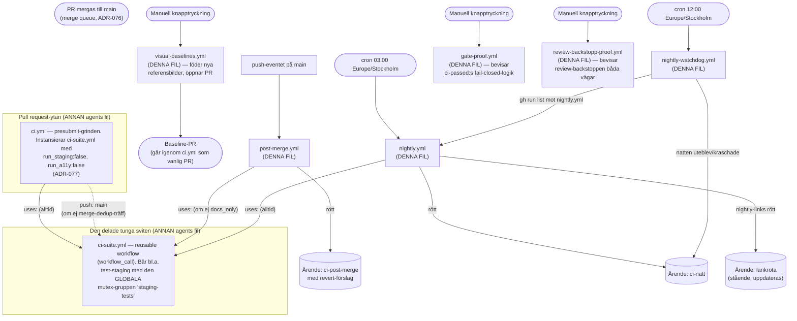
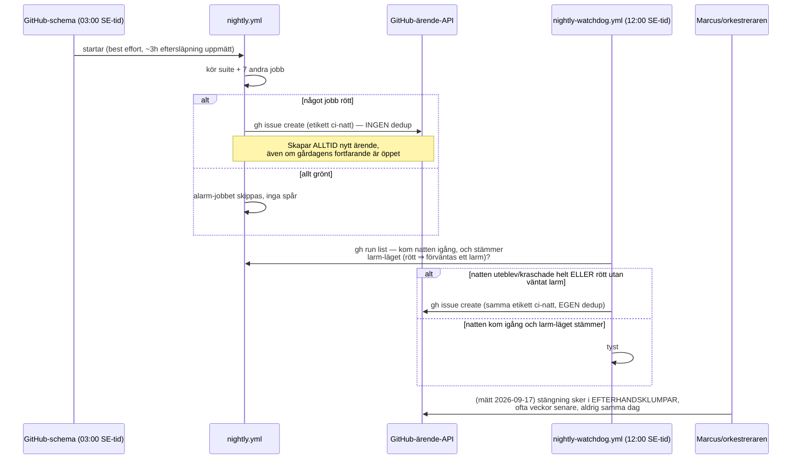
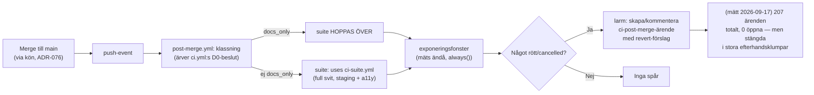

# J1b — De sex övriga workflow-filerna och resten av `.github/`

> **Proveniens:** skrivet av en subagent (`research-pass`) under Session 126,
> 2026-09-17, som en del av den fullständiga CI-djupgranskningen. Modell:
> Claude Sonnet 5 (`claude-sonnet-5`). Ögonblicksbild: arbetsträdet
> `docs/s126-ci-djupgranskning` på commit `18c8f22e`, vars innehåll för
> `.github/` motsvarar `origin/main` `eeca8c72` (2026-09-08) — filerna i denna
> katalog har inte ändrats sedan dess (se § Ändringslogg). Uppdragets exakta
> fråga: "Hur fungerar allt i `.github/` UTOM `ci.yml` och `ci-suite.yml` —
> exakt, jobb för jobb — och hur hänger det ihop med resten?" `ci.yml` och
> `ci-suite.yml` kartläggs av en annan agent (Jobb 1a) — denna fil beskriver
> bara GRÄNSSNITTET mot dem.

**Ordförklaring för den som inte jobbar med detta dagligen:** en "workflow" är
en instruktionsfil GitHub Actions (GitHubs inbyggda robotsystem) läser och kör
automatiskt, t.ex. varje gång någon skickar in kod. Ett "jobb" är ett
delmoment i en sådan fil — en fristående uppgift som körs i sin egen tillfälliga
dator. En "trigger" är HÄNDELSEN som startar workflowen (t.ex. "någon skickade
in kod", "klockan blev 03:00" eller "någon klickade en knapp"). Fler termer
förklaras löpande första gången de dyker upp.

## Kort svar

De sex filerna bygger **två oberoende skyddsnät UTANFÖR själva merge-grinden**
(nattnätet `nightly.yml` + dess egen vakthund `nightly-watchdog.yml`, och
lager-2-kontrollen `post-merge.yml` som körs på det redan landade trädet),
plus **två riktade bevis-workflower** som aldrig körs automatiskt
(`gate-proof.yml`, `review-backstopp-proof.yml`) och **en fabrik** för
referensbilder (`visual-baselines.yml`). Ingen av de sex kan blockera en
merge — det är arkitektoniskt omöjligt eftersom ingen av dem triggar på
`pull_request` eller `merge_group` (se § Blockerar de merge?).

Arkitekturen ÄR sofistikerad och i huvudsak korrekt byggd: fail-closed-logik,
dedup mot att larma två gånger för samma sak, och noggrant dokumenterade
plattformsfällor (se § Osäkerheter för de undantag jag hittade). Men **mätt
mot verkligheten i dag (2026-09-17) fungerar inte den mänskliga/organisatoriska
halvan av löftet**: nattnätet har varit rött **21 sammanhängande nätter i
rad** (`#2072`–`#2488`, 2026-08-28 till i dag) utan att ett enda av dessa
larm-ärenden stängts under tiden — exakt den "kyrkogårdseffekt"
(`kyrkogårds­effekten` = ett larm som blir så vanligt att ingen längre reagerar
på det) som den styrande designen (`ADR-077`) uttryckligen byggdes för att
undvika. `post-merge.yml`s egen larmkanal har producerat **207 ärenden totalt**
sedan den byggdes, och samtliga stängdes i stora efterhandsklumpar (senast: tio
ärenden stängda inom loppet av 39 sekunder, 2026-09-17, med kommentaren
"Besvarat av S125-orkestreraren ... i efterhand"). **Domen: mekaniken är sund,
men den producerar ett ständigt växande OBESVARAT larm-lager — komplexiteten
har inte börjat motivera sig själv i KODEN, men den har börjat överstiga vad
den mänskliga svarsförmågan hinner med i PRAKTIKEN.** Se § Dom för den fulla
resonemangskedjan.

## Vad jag läste först

`ls docs/research/` gav 165 filer; ingen av dem behandlar `nightly.yml`,
`post-merge.yml`, `nightly-watchdog.yml`, `visual-baselines.yml`,
`gate-proof.yml` eller `review-backstopp-proof.yml` specifikt (sökt på
`nightly|post-merge|watchdog|gate-proof|visual-baseline|review-backstopp|
dependabot|codeowners|codeql|issue-template` — noll träffar). Två pekade
research-dokument fanns dock och överlappar delvis:

- [`lankgrindens-form-2026-07-28.md`](../../lankgrindens-form-2026-07-28.md)
  — grunden för `nightly.yml`s `nightly-links`-jobb. Läst i sin helhet
  tillsammans med [ADR-082](../../../decisions/ADR-082-lankgrindens-form-presubmit-postsubmit.md)
  som kodifierar den. Sju veckor gammalt men gäller ett arkitekturmönster
  (var i pipelinen en kontroll ska sitta), inte en verktygsversion — jag har
  INTE sökt om det, bara verifierat att koden fortfarande matchar beslutet.
- [`ci-stadjobbets-credential-scope-2026-08-23.md`](../../ci-stadjobbets-credential-scope-2026-08-23.md)
  — rör `purge`-jobbet i `ci-suite.yml` (en ANNAN agents fil), men läst för
  kontext eftersom det citerar trigger-villkor i `post-merge.yml`/`nightly.yml`
  som jag själv behövde verifiera.

Jag läste dessutom i sin helhet, eftersom uppdraget pekade ut dem:
[ADR-028](../../../decisions/ADR-028-supply-chain-incident-respons.md)
(supply chain-incidenter — `nightly-audit`s bredare tröskel hänger ihop med
detta beslut), [ADR-077](../../../decisions/ADR-077-riskanpassad-ci-klassning-dedup-nightly.md)
(nattnätets grundbeslut — mintad för HELA T85-vågen, den styr `nightly.yml`s
existens), [ADR-082](../../../decisions/ADR-082-lankgrindens-form-presubmit-postsubmit.md)
(se ovan), [ADR-099](../../../decisions/ADR-099-sessionsdok-rotens-rullande-fonster.md)
(sessionsdok-fönstrets regel — `nightly.yml`s `sessionsdok-fonster`-jobb är
dess mekaniska vakt). `ADR-036` och `ADR-076` (kvalitetsgrind/merge-kö) läste
jag som bakgrund för § Blockerar de merge? men de styr `ci.yml`, inte mina
filer. Ingen ADR fanns som förkastat något jag hittade — inget att räta ut.

**Vad som var nytt i mitt pass:** allt run-historik-baserat innehåll
(§ Verklig körhistorik, § Dom) är min egen mätning 2026-09-17 mot GitHubs API
— framför allt den 21-dagars öppna larm-strömmen, som inget tidigare
research-dokument nämner (den startade EFTER det senaste relevanta
research-passets datum). Det gör detta avsnitt särskilt färskvarande: läs
`review_by`-datumet ovan och mät om vid behov.

## Metod

1. Läste samtliga sex filer i sin helhet, rad för rad (inte genom sökning).
2. Läste de styrande ADR:erna och research-dokumenten ovan i sin helhet.
3. Spårade varje jobbs faktiska historik med `git log --oneline -- <fil>` för
   att fastställa senaste ändring och bygga ändringsloggen.
4. Mätte verklig körhistorik med `gh run list --workflow <fil> --limit 30
   --json databaseId,conclusion,event,createdAt` för samtliga sex filer
   (2026-09-17).
5. Följde upp EN avvikelse (den ihållande röda natt-strömmen) med riktade
   `gh issue list`/`gh api graphql`-anrop mot etiketterna `ci-natt`,
   `ci-post-merge` och `lankrota` — detta var inte en del av den ursprungliga
   planen, men sparsamhets-regeln ("hämta en sida i taget, spara ner det du
   hämtat") vägde mot att en flagga så stor som "21 dagars kyrkogård" inte kan
   lämnas okontrollerad.
6. Verifierade EN uttrycklig hypotes i uppdraget (TASK-365/PR #2306-kopplingen)
   mot disk och `gh pr view` — se § Motsägelser.
7. Verifierade ETT tekniskt sakpåstående i koden (`concurrency.queue: max`)
   mot GitHubs egen dokumentation, eftersom det bär hela `staging-tests`-
   mutexens semantik och flera kommentarer i filerna bygger vidare på det.

## Fynd

### Översikt — var de sex filerna sitter i helheten

**Läsanvisning:** alla sex filer är alltså SATELLITER runt `ci.yml`/
`ci-suite.yml` — de anropar den delade sviten (`post-merge.yml`, `nightly.yml`),
bevisar dess logik utan att röra den (`gate-proof.yml`,
`review-backstopp-proof.yml`), eller lever helt vid sidan av den
(`nightly-watchdog.yml`, `visual-baselines.yml`). Ingen av de sex ÄGER någon
del av den logik `ci.yml`/`ci-suite.yml` bär — de LÅNAR den (`uses:` mot
samma fil) eller OBSERVERAR den (`gh run list`).

---

### `post-merge.yml` — lager 2: kontroll av det redan landade trädet

**Syfte i klartext för Gunilla:** även om en kodändring blivit godkänd och
sammanslagen ("mergad") till huvudgrenen, kör den här filen en extra,
grundligare kontroll EFTERÅT — som en besiktning efter att bilen redan är
såld, för att fånga fel som den snabbare kontrollen före köpet missade.

**Triggers:** `push` till grenen `main` (rad 142–143) samt manuell
`workflow_dispatch` med en checkbox `simulate_failure` (rad 144–153) som
tvingar fram ett äkta rött jobb för att bevisa att larmkedjan verkligen fyrar
(används aldrig i produktion, bara för att testa mekaniken själv).

**Topp-nivå:** `permissions: {}` (rad 156 — minsta möjliga rättighet som
standard; varje jobb höjer själv exakt vad det behöver). `concurrency`-grupp
`post-merge-${{ github.sha }}` (rad 182), `cancel-in-progress: false` (rad
183) — **grupperad per commit**, alltså: två OLIKA landningar (två olika
commit-identiteter, "SHA") kan aldrig avbryta varandras post-merge-körning
via den här mekanismen, eftersom de hamnar i olika grupper. (Detta blir
viktigt i § Motsägelser nedan.)

#### Jobben i `post-merge.yml`

| id | Visningsnamn | `if:` (ordagrant) | `needs` | Timeout | Vad det gör |
|---|---|---|---|---|---|
| `klassning` | Ärvd klassning — körde PR-grinden sviten? | `${{ !inputs.simulate_failure }}` | — | 3 min | Läser (ÄRVER, räknar aldrig om) `ci.yml`s beslut om SAMMA träd via `scripts/classify-post-merge.sh` (rad 229) — svarar bara "var detta en ren dokumentationsändring (D0)?" |
| `suite` | Verifierande svit på det mergade trädet | `${{ !inputs.simulate_failure && needs.klassning.outputs.docs_only != 'true' }}` | `[klassning]` | (ärvt från `ci-suite.yml`) | Anropar `ci-suite.yml` (rad 248) UTAN `with:`-block — kör alltså sviten i sitt FULLA default-läge: `run_staging: true`, `run_a11y: true`, hela Acceptance-klassen |
| `sjalvtest` | Självtest — framkalla rött (endast simulate_failure) | `${{ inputs.simulate_failure }}` | — | 1 min | Kör bara vid manuell testkörning; failar med avsikt för att bevisa att larmet reagerar på ett ÄKTA rött needs-resultat |
| `exponeringsfonster` | Exponeringsfönster (merge → svar) | `${{ always() }}` | `[klassning, suite, sjalvtest]` | 2 min | Mäter tiden från mergen till att detta svar finns, oavsett om sviten blev röd eller grön (rad 300–348) |
| `larm` | Larm vid rött post-merge | `${{ always() && (contains(needs.*.result, 'failure') \|\| contains(needs.*.result, 'cancelled')) }}` | `[klassning, suite, sjalvtest, exponeringsfonster]` | 3 min | Skapar eller kommenterar ett GitHub-ärende med etikett `ci-post-merge`, revert-förslag och tolkningshjälp |

**Om `klassning` (rad 202–229):** gör en `checkout` (hämtar koden, rad 220)
men BÄR MEDVETET ingen `fetch-depth`-rad (kommentar rad 190–194: skriptet gör
noll git-operationer, hämtar föräldrar/träd via GitHubs API i stället). Kräver
`contents: read` + `actions: read` (rad 207–213) — det senare för att fråga
`gh run list`/`gh run view` om PR-grindens körning på samma träd. **Fail-closed
hela vägen** (rad 196–201): varje osäkerhet (API-fel, inget grönt PR-svar,
träd-avvikelse) ger `docs_only=false`, alltså FULL svit — en besparing kan
aldrig bli ett hål av misstag.

**Om `suite` (rad 235–269):** detta ÄR platsen där kravet "tillgänglighet är
alltid 11, ingen ska undantas" (repots kvalitetsribba) och full E2E-täckning
("Staging API + E2E") faktiskt MÖTER varje landad kodändring, sedan
`ci.yml`s PR-yta stängde av dem (`run_staging: false`/`run_a11y: false`
villkorslöst, se filens egen header rad 42–61). `permissions: contents: read`
(rad 246) är nödvändig av en subtil anledning: ett anropat ("reusable")
workflow kan ENDAST behålla eller sänka anroparens rättigheter, aldrig höja
dem — utan den raden hade `ci-suite.yml`s egen `contents: read`-behov varit
en (förbjuden) höjning och hela jobbet hade kraschat direkt
(`startup_failure`).

**Om `larm` (rad 376–555):** detta är den mest innehållsrika filen av de sex.
Den läser vilka jobb som blev röda (rad 428), avgör om DEN HÄR landningen
verkligen är den sannolika boven (rad 430–456, via ett separat skript —
se § Motsägelser för bakgrunden), räknar ut RÄTT form för ett
`git revert`-kommando (rad 458–471, en sammanslagnings-commit kräver
`-m 1`, en vanlig commit gör inte det) och skapar antingen ett nytt ärende
eller kommenterar ett befintligt öppet ärende FÖR SAMMA TRÄD (dedup, rad
473–486). Ärendet bär en "tolkningshjälp" (rad 528–533) som explicit varnar
mot att reflexmässigt reverta om det ENDA röda jobbet är känt flakigt
(`Acceptance (hermetisk)`) eller om det bara är mät-jobbet
(`exponeringsfonster`) som gått sönder.

**Vad workflowet påverkar:** skapar/kommenterar GitHub-ärenden (`issues:
write`, bara i `larm`-jobbet). Rör aldrig kod, gör ingen deploy, pushar
ingenting. Kan strukturellt inte blockera merge — den triggar EFTER att
mergen redan skett (filens eget huvud säger det rakt ut, rad 38–39: "Den kan
därför strukturellt inte blockera en landning").

**Verklig körhistorik (mätt 2026-09-17, `gh run list --workflow post-merge.yml
--limit 30`):** 29 av de 30 senaste körningarna (2026-09-07–2026-09-08) var
`success`, en `failure` (2026-09-07 16:05, körning `34141597453`). Det säger
mest om VOLYM (tätt spaced push-events, flera samma minut) och lite om
CI-hälsa generellt — men bekräftar att lagret faktiskt körs kontinuerligt.

---

### `nightly.yml` — nattnätet: fullständig kontroll en gång per dygn

**Syfte i klartext:** varje dags snabbare kontroller hoppar MEDVETET över
vissa saker för att gå snabbt (se `ADR-077`). Nattnätet är motvikten: en gång
per dygn, när ingen väntar på svaret, körs ALLT — plus några kontroller som
bara hör hemma i natten eftersom de mäter "har något RUTTNAT sedan sist"
snarare än "är den här ändringen okej".

**Triggers:** `schedule` (cron-uttryck `0 3 * * *`, tidszon `Europe/
Stockholm` — alltså **klockan 03:00 svensk tid**, året om enligt filens egen
kommentar rad 19–21) samt `workflow_dispatch` med `simulate_failure` (samma
testmönster som `post-merge.yml`). **Ärlig begränsning skriven i filen
själv** (rad 23–28): tidszonen styr NÄR körningen SCHEMALÄGGS, inte när den
FAKTISKT startar — uppmätt eftersläpning i repot har varit ~3 timmar
(schemalagt 01:00 UTC, startat 03:56–04:00 UTC).

**Topp-nivå:** `permissions: {}` (rad 41). `concurrency`-grupp `nightly`
(en enda, delad sträng — rad 45), `cancel-in-progress: false` (rad 46): en
nattkörning avbryts aldrig av nästa.

#### Jobben i `nightly.yml` (tio stycken)

| id | Visningsnamn | `needs` (för `alarm`) | Timeout | Vad det gör |
|---|---|---|---|---|
| `suite` | Nattlig fullsvit | i `alarm.needs` | (ärvt) | `uses: ./.github/workflows/ci-suite.yml` (rad 61) UTAN `with:` — full svit, `secrets: inherit` (rad 62) |
| `nightly-audit` | Bredare sårbarhetsgranskning | i `alarm.needs` | 5 min | `npx audit-ci --moderate` (rad 91) — dagens gräns är `high`; natten sänker tröskeln |
| `nightly-links` | Länkkontroll (utan cache) | **INTE** i `alarm.needs` (ADR-082, medvetet) | 8 min (jobb) / 5 min (steg) | `lychee` mot BÅDE intern och extern länkyta, kallt (ingen cache) |
| `links-arende` | Länkröta — stående ärende | — | 3 min | Fyrar bara om `nightly-links` = `failure` (rad 198); skapar ELLER kommenterar EN stående tråd, etikett `lankrota` |
| `nightly-metrics` | CI-mätning (siffror, ej känsla) | i `alarm.needs` | 10 min | Kör tre fristående testsviter (mätverktygens EGNA regressionsskydd) och sedan `scripts/ci-metrics.mjs --limit 50` mot körnings-API:t |
| `kontraktsvakt` | Kontraktsvakt (fixtur mot skarp staging) | i `alarm.needs` | 8 min | Sju GET-anrop, jämför fixturvärldens svar mot SKARP staging (kräver 6 secrets, `STAGING_REQUIRED=1` — fail-hard om de saknas) |
| `backlog-closure` | Backlog-stängning (natt-grind) | i `alarm.needs` | 10 min | `scripts/check-backlog-closure.sh` — fångar arbetskort vars status inte matchar deras faktiska framsteg |
| `pausade-sessioner` | Sannings-avstämning — pausade sessioner (natt-grind) | i `alarm.needs` | 5 min | `scripts/check-pausade-sessioner.sh` — fångar sessionsdokument som PÅSTÅR paus medan git-historiken visar landat arbete |
| `sessionsdok-fonster` | Sessionsdok-fönstret (natt-grind, ADR-099) | i `alarm.needs` | 5 min | `scripts/check-sessionsdok-fonster.sh` — vakt för att dokument-katalogen inte växer förbi sitt rullande fönster |
| `obesvarade-larm` | Sannings-avstämning — obesvarade larm (natt-grind) | i `alarm.needs` | 5 min | `scripts/check-obesvarade-larm.sh` — kontrollerar att `post-merge.yml`s EGNA larm-ärenden faktiskt besvaras (se § Dom — denna kontroll är ironiskt nog den som exponerar problemet i § Dom) |
| `alarm` | Larm vid röd natt | (aggregatorn) | 3 min | Skapar ETT ärende (etikett `ci-natt`) om något av ovanstående sju (`nightly-links` explicit UNDANTAGET) är `failure`/`cancelled`, eller vid `simulate_failure` |

**`nightly-links` står MEDVETET utanför `alarm`s `needs`-lista** (kod rad
673–677, beslut i `ADR-082`): en extern webbplats som har en dålig dag ska
inte devalvera det tilldelade, akuta `ci-natt`-ärendet. Den har sin egen,
mildare kanal (`links-arende`) som är STÅENDE — en död länk som ligger kvar
en vecka ger EN kommentar-tråd, inte sju nya ärenden.

**`alarm`-jobbets ärende-text (rad 697–869)** bygger dynamiskt upp en lista
över ALLA icke-gröna jobb (rad 761–791, en historisk lärdom: tidigare
namngavs bara `backlog-closure` explicit, och en natt där `nightly-links`
(medvetet utanför) var det enda röda jobbet visade att INGET av de sju
"riktiga" needs-jobben heller namngavs om de föll — nu gör alla det),
beräknar ett commit-spann sedan senaste GRÖNA natt (rad 826–847, fyra
distinkta fall: API-fel, ingen tidigare grön, samma träd två nätter i rad
[flake-signal], eller ett äkta spann) och skriver ETT ärende.

**Central observation, verifierad genom att LÄSA koden rad för rad:**
`alarm`-jobbet har **INGEN dedup-kontroll**. Till skillnad från
`links-arende` (kollar om ett `lankrota`-ärende redan är öppet, rad
225–232) och `post-merge.yml`s `larm` (kollar om ett `ci-post-merge`-ärende
för SAMMA TRÄD redan finns, rad 478–486), skapar `alarm` ett **nytt** ärende
VARJE gång den fyrar, oavsett om gårdagens fortfarande står öppet. Det finns
ingen kodrad som frågar "finns redan ett öppet `ci-natt`-ärende?" innan
`gh issue create` (rad 863) körs. Det förklarar exakt varför § Dom nedan
visar 22 separata öppna ärenden i stället för en enda uppdaterad tråd —
mekaniken fungerar SOM SKRIVEN, men den skrevs utan den motgift `ADR-082`
uttryckligen byggde in för länkrötan.

**Vad workflowet påverkar:** skapar/kommenterar ärenden (`issues: write` i
`links-arende` och `alarm`). Rör aldrig kod. Kan inte blockera merge (bara
schema och dispatch — ingen `pull_request`/`merge_group`-trigger).

**Verklig körhistorik — DETTA ÄR HUVUDFYNDET (mätt 2026-09-17,
`gh run list --workflow nightly.yml --limit 30`):** samtliga 30 senaste
schemalagda körningar, 2026-08-20 till 2026-09-17 (28 dagar), har
`conclusion: failure`. **Noll gröna nätter på 28 dagar.** Se § Dom för
uppföljningen mot ärende-kanalen.

---

### `nightly-watchdog.yml` — "Nattvakten": en vakt FÖR vakten

**Syfte i klartext:** `nightly.yml`s eget larm sitter INUTI den körning det
ska bevaka. Om körningen aldrig äger rum alls (GitHub avvisar den helt, eller
schemat missar den) finns det inget larm-jobb kvar som kan reagera — precis
som en brandvarnare inte hjälper om huset aldrig fick ström. Den här filen
löser det genom att stå UTANFÖR och fråga "kom natten ens igång?"

**Trigger:** `schedule` (`0 12 * * *`, `Europe/Stockholm` — **klockan 12:00**,
vald med gott om marginal mot den uppmätta eftersläpningen ovan) samt
`workflow_dispatch` med `simulate_missing` för avsiktlig självtestning.

**Topp-nivå:** `permissions: contents: read` (rad 63). `concurrency`-grupp
`nightly-watchdog` (rad 66), `cancel-in-progress: false`.

#### Det enda jobbet: `watch` ("Kom natten igång?")

Ett enda steg (rad 91–239) som:

1. Frågar `gh run list --workflow nightly.yml --branch main --event schedule
   --limit 1` om senaste schemalagda körning (rad 106–108).
2. Klassar läget i EN av flera möjliga avvikelser: aldrig kört, för gammal
   (>26 timmar — ett fönster satt mot UPPMÄTT eftersläpning, inte mot
   nominell cron, rad 104 + 129–131), `startup_failure` (rad 132–134), eller
   ett rött resultat DÄR de röda jobben faktiskt bär larmet (rad 135–186 —
   nyanserad logik, se nedan).
3. **En viktig nyans, kodad efter ett verkligt falsklarm (rad 136–161):** en
   `conclusion != success` räcker INTE som signal ensamt. Om `nightly-links`
   (som medvetet står utanför `alarm`s needs, se ovan) är det ENDA röda
   jobbet, är det KORREKT att `nightly.yml`s eget `alarm`-jobb skippades —
   och vakten ska då vara TYST. Vakten frågar därför `gh run view <id> --json
   jobs` och filtrerar bort jobb vars namn matchar `Länkkontroll|Länkröta`
   innan den avgör om något "alarm-bärande" är rött.
4. **Fail-closed genomgående:** kan jobblistan inte hämtas eller tolkas,
   larmar vakten ändå ("OKÄND" i stället för tystnad, rad 174–177).
5. **Dedup FÖRE skapande** (rad 194–215): anropar
   `scripts/check-nattvakt-dedup.sh` (konfig `.nattvakt-dedup-policy.conf`)
   som räknar BÅDE öppna ärenden OCH ärenden stängda inom ett fönster MED en
   skriven motivering som redan täckta. Byggd efter ett verkligt falsklarm
   (`TASK-180`, 2026-08-10) där ett redan-löst-och-stängt ärende ändå gav ett
   nytt larm.

**Skillnaden mot `nightly.yml`s egen `alarm`-jobb är alltså slående:** denna
fil HAR dedup-logik (byggd, testad, med en egen policy-fil), medan
`nightly.yml`s huvudlarm inte har det alls. Vaktens dedup skyddar bara MOT SIN
EGEN kanal (samma "Nattnätet uteblev/vägrade starta/rött utan larm"-rubrik
ska inte dupliceras) — den skyddar INTE mot att `nightly.yml`s EGET `alarm`-
jobb skapar ett nytt ärende varje natt. Det är två separata kanaler med olika
dedup-status, inte en motsägelse i sig, men det förklarar varför den ENA
kanalen (denna fils) är ren i praktiken medan den ANDRA (`nightly.yml`s
`alarm`) inte är det — se § Dom.

**Öppet bokförd begränsning, skriven av upphovspersonen själv (rad 35–39):**
vakten är själv en GitHub Actions-cron och ärver därmed EXAKT den defekt den
ska täcka — om HELA schemaläggningsmaskineriet slutade fungera skulle varken
natten eller vakten någonsin köra. Att bryta den rekursionen kräver en klocka
UTANFÖR GitHub (extern tjänst) — ett medvetet uppskjutet beslut, inte en
lucka man missat.

**Vad workflowet påverkar:** kan skapa ett `ci-natt`-ärende (samma etikett
som `nightly.yml`s eget larm — de delar kanal). Kan inte blockera merge.

**Verklig körhistorik (mätt 2026-09-17, 30 körningar 2026-08-19–2026-09-16):**
**samtliga 30 var `success`.** Det betyder INTE att natten var frisk — det
betyder att vakten själv aldrig behövde larma, för att den (korrekt, se
klassificeringen ovan) bedömde att `nightly.yml`s EGET larm redan hade fyrat
för samtliga 28 röda nätter (se § `nightly.yml` ovan). Vakten fungerar alltså
exakt som designad: den är tyst när huvudlarmet redan gjort sitt jobb, och
skulle bara höjas om huvudlarmet TYST uteblev. Det gjorde det aldrig under
mätfönstret.

---

### `visual-baselines.yml` — referensbild-fabriken

**Syfte i klartext:** de visuella regressionstesterna jämför varje ny
skärmdump mot en "sann" referensbild. Den här filen är det ENDA stället där
nya referensbilder föds — och den gör det medvetet i SAMMA miljö
(Linux/Ubuntu) som jämförelsen sker i, eftersom en bild renderad på en Mac
aldrig blir pixel-identisk med en Linux-rendering.

**Trigger:** ENDAST `workflow_dispatch`, med en valfri textinput
`specfilter` (rad 78–88) — en regex (ett sökmönster) som avgränsar körningen
till en delmängd av de visuella testerna. Tom input (default) kör HELA
sviten.

**Topp-nivå:** `permissions: {}` (rad 90). `concurrency`-grupp
`visual-baselines` (en enda delad sträng, rad 95) — parallella dispatcher
ska aldrig kunna öppna konkurrerande PR:er mot samma bilder.

#### Det enda jobbet: `generate` ("Generera linux-baselines + öppna baseline-PR")

`permissions: contents: write, pull-requests: write` (rad 104–105) — de enda
skriv-rättigheterna i hela min filuppsättning som INTE bara skapar ärenden
utan faktiskt skapar en NY GREN och en NY PULL REQUEST.

Stegkedja (rad 107–227):

1. Checkout + Node-installation + `npm ci`.
2. **Fail-closed-grinden FÖRE den dyra delen** (rad 128–132): `bash
   scripts/visual-baselines-scope.sh` prövar `specfilter`-inputen mot
   Playwrights (testverktygets) egen fil-lista INNAN någon webbläsare ens
   installeras — skräpinput dör billigt.
3. Cache + installation av Chromium-webbläsaren.
4. `npm run test:visual -- --update-snapshots` (eventuellt med filtret) —
   **detta är INTE en grind, det är ett FÖDELSE-läge**: kommandot skriver
   ALLTID om avvikande bilder i stället för att fälla på dem.
5. Om `git status` visar ändrade skärmdumpar: skapar en ny gren, committar,
   pushar, och kör `gh pr create` (rad 221–223).

**Granskningsgrinden är arkitekturen, inte en bugg** (rad 12–18): PR:n skapas
med `GITHUB_TOKEN` (den automatiska token GitHub själv ger varje
körning — inte en personlig nyckel), vilket enligt GitHubs egen dokumentation
sätter PR:ens CI i "approval-required"-läge. Samma person som godkänner att
bilderna SER RÄTT UT måste alltså klicka "Approve workflows to run" för att
släppa igenom PR:ens egen CI. Filen dokumenterar explicit (rad 26–46) en
plattformsfälla den redan blivit bränd av: förmågan att godkänna
pull-requests automatiskt ärvs i en TRE-NIVÅERS kedja (enterprise → org →
repo) där en restriktiv nivå LÅSER de lägre — mätt 2026-07-27 när repot
flyttades till en organisation och tyst ärvde en strängare default.

**Riktad körning (`specfilter`, `TASK-298`):** byggd efter ett verkligt
misslyckande (rad 48–53: en enda trasig testfamilj blockerade HELA
baseline-födseln, run `32587783890`). Tre egenskaper är själva grindade av en
testsvit: (1) default är BYTE-IDENTISKT med kommandot före ändringen, (2)
scope SYNS på tre ställen (grennamn, PR-titel, PR-kropp) så en delmängd
aldrig kan misstas för en fullständig födsel, (3) fail-closed innan den dyra
delen börjar.

**Vad workflowet påverkar:** kan skapa en ny gren + en ny pull request med
bildändringar. Rör alltså faktiskt kod (testbilder) — men ALDRIG `main`
direkt, bara via en granskningsbar PR. Kan inte i sig blockera merge av EN
ANNAN PR, men PR:en den själv öppnar går igenom samma `ci.yml`-grind som allt
annat.

**Verklig körhistorik (mätt 2026-09-17, 21 körningar 2026-07-24–2026-09-03):**
15 `success`, 6 `failure`. Samtliga sex misslyckanden klustrar kring TVÅ
datum: 2026-07-24 (den allra första körningen, `Actions is not permitted to
approve pull requests`-fällan ovan) och 2026-08-22 (fyra misslyckanden samma
dag, konsekvent med `TASK-298`s egen beskrivning av att just den dagen byggde
och felsökte den riktade `specfilter`-formen, inklusive det dokumenterade
`--update-snapshots [mode]`-argumentfelet). Ingen körning alls sedan
2026-09-03 — filen har inte avfyrats på två veckor.

---

### `gate-proof.yml` — bevisar att merge-grindens paraplykontroll fäller rätt

**Syfte i klartext:** `ci.yml` har EN sammanfattande kontroll ("CI Passed or
Skipped") som GitHub faktiskt kollar innan den tillåter en merge. Den måste
FALLA så fort NÅGOT annat jobb blir rött — annars kan en trasig PR glida
igenom obemärkt. Den här filen bevisar, med en riktig körning, att den
kontrollen verkligen gör det.

**Trigger:** ENDAST `workflow_dispatch`, med en boolean `simulate_skip` (rad
30–38): `false` = det POSITIVA beviset (allt ska bli grönt); `true` = en
NEGATIV KONTROLL (tvingar paraply-repliken att skippas, så att assert-jobbet
FÅNGAR det och hela workflowen blir röd — ett test av testet självt).

**Topp-nivå:** `permissions: {}`. `concurrency`-grupp unik per körning
(`gate-proof-${{ github.run_id }}`, rad 45) — tar ALDRIG den delade
`staging-tests`-mutexen och konkurrerar aldrig med någon annan körning.

#### De tre jobben

| id | Visningsnamn | Roll |
|---|---|---|
| `forced-red` | Framkalla rött jobb (avsiktlig failure) | Kör medvetet `exit 1`, men med steg-nivå `continue-on-error: true` — jobbet FÖRBLIR grönt utåt medan den sanna utgången ("failure") exporteras som en jobb-output |
| `umbrella-replica` | CI Passed or Skipped (replik under bevis) | En ORDAGRANN kopia av `ci.yml`s riktiga paraplykontroll-logik (samma `jq`-uttryck), matad med den framkallade signalen |
| `assert-proof` | Assertera paraply-checkens FAIL-gren | Enda jobbet UTAN `continue-on-error` på sin egen slutsats — kräver att repliken KÖRDE (aldrig skippades) OCH gav `failure` |

**Varför konstruktionen är krånglig (och det är medvetet, rad 18–27):**
GitHub kan inte visa "ett rött jobb inuti en grön körning" på annat sätt än
via steg-nivå-utfall. Filens kommentar pekar uttryckligen ut en känd
plattformsbugg (`actions/toolkit#1739`) som gör att en JOBB-nivå
`continue-on-error` hade DÖLT den sanna signalen från både `needs.result` och
GitHubs eget API — därför används `continue-on-error` bara på STEG-nivå,
aldrig på jobb-nivå, någonstans i filen.

**Vad workflowet påverkar:** ingenting utanför sig självt. Ingen checkout,
inga secrets, inga ärenden, ingen kod rörs. Ren självbevisning. Kan inte
blockera merge (bara `workflow_dispatch`).

**Verklig körhistorik (mätt 2026-09-17, 14 körningar 2026-07-23–2026-09-04):**
9 `success`, 5 `failure`. De fem röda klustrar på tre datum (2026-07-23,
2026-07-28 ×2, 2026-07-29), vilket är KONSISTENT med att detta är
`simulate_skip: true`-självtester (det AVSEDDA negativa beviset, som ska ge
en röd workflow) körda parvis med sina positiva motsvarigheter under
byggfasen — men jag har INTE öppnat varje enskild körnings loggar för att
bekräfta att alla fem faktiskt var avsiktliga negativa kontroller och inte
regressioner. Märkning: **starkt indikerad**, inte verifierad, för den
specifika tolkningen av varje enskild röd körning.

---

### `review-backstopp-proof.yml` — bevisar granskningsgrinden i BÅDA riktningar

**Syfte i klartext:** repot kräver att varje kod-PR bär en
"Riskbedömnings-sektion" (ett stycke text som visar att en oberoende
granskning ägt rum) innan den får läggas i landningskön (se `CLAUDE.md` §
Review-grinden, `ADR-105`). Den här filen bevisar, med en RIKTIG körning mot
en RIKTIG tidigare PR:s faktiska text, att den mekaniska kontrollen både
FÄLLER en PR utan sektionen och SLÄPPER en PR med den.

**Trigger:** ENDAST `workflow_dispatch`, med boolean `simulera_gront` (samma
mönster som `gate-proof.yml`s `simulate_skip`).

**Topp-nivå:** `permissions: {}`. Egen `concurrency`-grupp per körning (rad
57). `env`-block (rad 60–64) fäster fixturens identitet: `FIXTUR_PR: '2031'`,
`FIXTUR_HEAD: d11a2f20...` — en kommentar varnar uttryckligen att beviset blir
FALSKT om PR-numret/headen ändras utan att fixturfilerna byts.

**Fixturerna är INTE syntetiska** (rad 24–29): `tests/fixtures/
review-backstopp/pr-2031-*.txt` är den FAKTISKA PR-kroppen från en riktig,
redan granskad pull request (`#2031`), hämtad med `gh pr view 2031 --json
body` — med respektive utan Riskbedömnings-sektionen.

#### De tre jobben

| id | Visningsnamn | Roll |
|---|---|---|
| `faller` | Backstoppen ska FÄLLA en kropp utan sektion | Kör `scripts/review-backstopp.mjs` mot fixturen UTAN sektion; steg-nivå `continue-on-error` fångar den förväntade `exit 1` |
| `slapper` | Backstoppen ska SLÄPPA en kropp med giltig sektion | Samma skript mot fixturen MED sektion; INGEN `continue-on-error` — ett fall här FÄLLER hela workflowen (rätt signal) |
| `assert-bevis` | Assertera att BÅDA riktningarna höll | Kräver att `faller` gav `failure`-utfall OCH `slapper` gav `success` |

**Vad workflowet påverkar:** ingenting utanför sig själv — ingen `gh`-hämtning
sker ens (kommentar rad 52–54: fixturerna läses offline ur arbetsträdet, ingen
`gh pr view` körs live). Kan inte blockera merge.

**Verklig körhistorik (mätt 2026-09-17):** endast **två körningar någonsin**,
båda 2026-08-28 med fyra sekunders mellanrum — en `success` och en `failure`.
Det matchar perfekt mönstret "en positiv körning + en `simulera_gront: true`-
negativ kontroll", körda direkt efter varandra vid filens första och hittills
enda användning (samma dag som `TASK-173.4` landade enligt `git log`). Filen
har inte körts sedan dess.

---

### Resten av `.github/`

#### `dependabot.yml` — automatiska beroende-uppdateringar

Två separata "ekosystem" (rad 13–133):

- **`npm`** (kodens paket): veckovis, måndagar 06:00 svensk tid. Grupperar
  uppdateringar i FYRA "stack-grupper" (`tanstack`, `react-aria`, `tailwind`,
  `types` — paket som måste röra sig SYNKRONT för att fungera ihop) plus TVÅ
  "catch-all"-grupper uppdelade på produktions- kontra utvecklingsberoenden.
  En 7-dagars "cooldown" (default) resp. 3-dagars (för patch-nivå-ändringar)
  betyder att Dependabot väntar innan den öppnar en PR för en ny version — ett
  skydd mot att vara FÖRST att installera en version som visar sig vara
  komprometterad (samma logik som `ADR-028`s malware-incident kodifierade).
  Ett explicit undantag (rad 97–106): `@types/node` följer ALDRIG en stor
  versionsändring automatiskt, den ska bara följa Node-körmiljöns egen
  version, medvetet satt efter att ha stängt samma typ av PR två gånger förut.
- **`github-actions`** (workflow-filernas egna beroenden, t.ex.
  `actions/checkout`): månadsvis, ospecificerad dag, samma 7-dagars cooldown,
  en enda catch-all-grupp för allt.

**Gränssnitt mot mina sex filer:** Dependabot öppnar egna PR:er mot
`.github/workflows/*.yml`s `uses:`-rader (t.ex. den SHA-pinnade
`actions/checkout`-versionen alla sex filer delar). En sådan PR går igenom
SAMMA `ci.yml`-grind som allt annat — Dependabot är alltså en FÖRFATTARE av
ändringar, inte en egen grind.

#### `CODEOWNERS`

Fyra rader (hela filen): `*` (allt) ägs av `@marcus803`, plus tre extra rader
som pekar ut samma person för styrande dokument, `.github/` självt,
`LICENSE` och `SECURITY.md`. **Eftersom Marcus är repots enda ägare/skribent
har filen i praktiken NOLL urskiljande effekt** — den skulle bara göra
skillnad om (a) fler personer bidrog och (b) rulesetet krävde godkännande
från en kodägare. Punkt (b) verifierades INTE av mig (en annan agent
granskar rulesetet) — men `visual-baselines.yml`s egen kommentar (rad 46:
"ruleset main-skydd kräver 0 approvals") antyder starkt att inget
godkännande alls krävs för att merga, vilket skulle göra CODEOWNERS-filens
mekaniska effekt obefintlig oavsett innehåll. Märkning: **osäker** —
verifiera mot `gh api repos/.../rulesets` för att stänga frågan definitivt.

#### `PULL_REQUEST_TEMPLATE.md`

Sexpunkts DoD-checklista (Definition of Done — "vad måste vara sant innan
detta får kallas klart"): de fyra kommandona (`test:api`, `typecheck`,
`biome check`, `build`) plus två prosakrav (`docs/BUILD-LOG.md` uppdaterad,
ADR skriven vid arkitekturbeslut, `tasks/lessons.md` uppdaterad). **Detta är
en HONOR SYSTEM-checklista** — ingen mekanisk grind i något av mina sex
filer, eller i `ci.yml`/`ci-suite.yml` såvitt synligt härifrån, verifierar
att kryssrutorna faktiskt är sanna. Jämför detta med `backlog-closure`-jobbet
i `nightly.yml`, som MEKANISKT kontrollerar att arbetskortens status matchar
verkligheten — PR-mallens motsvarande löfte har ingen sådan efterlevnads-
mekanism.

Filen har bara ändrats en gång sedan den skapades (`git log`: skapad
`dca15916`, en efterföljande no-op-kommando-rättning `04011080`) — den är
alltså mycket stabil, inte nödvändigtvis eftersatt.

#### `ISSUE_TEMPLATE/` (`bug.md`, `feature.md`)

Två enkla formulär (frontmatter-styrda GitHub-mallar): buggrapport
(Beskrivning/Reproduktion/Förväntat/Faktiskt/Miljö/Korsreferens) och
feature-förslag (Problem/Förslag/Alternativ/Korsreferens). Ingen
`config.yml` finns för att t.ex. stänga av GitHubs "blank issues"-läge eller
länka vidare till extern support — GitHubs standardbeteende gäller. Ingen
koppling till någon av mina sex workflow-filer; det ÄR dock samma
ärende-mekanism (`gh issue create`) som `nightly.yml`/`post-merge.yml`/
`nightly-watchdog.yml` använder programmatiskt, fast här är det en människa
som fyller i formuläret för hand.

#### CodeQL — finns, men BOR INTE i `.github/workflows/`

Uppdraget bad mig klargöra vad "körs som `dynamic`-event" betyder. Mätt
2026-09-17: `gh api repos/.../code-scanning/default-setup` svarar
`{"state":"configured","languages":["actions","javascript","javascript-
typescript","typescript"],"query_suite":"default","threat_model":"remote",
"schedule":"weekly","runner_type":"standard"}`, och `gh run list --json
workflowName,event | jq 'select(.workflowName=="CodeQL")'` visar `"event":
"dynamic"` på samtliga senaste körningar (t.ex. 2026-09-17 09:51). **Detta
är GitHubs "Default Setup"** — en central, av GitHub HANTERAD
kodsäkerhetsskanning som INTE lever som en fil i repot alls. Det finns ingen
`codeql.yml` att läsa; hela konfigurationen (vilka språk, vilken svit av
kontroller, hur ofta) sköts via repots inställningar på GitHub.com, inte via
en versionerad fil. `event: dynamic` är GitHubs egen beteckning för just
denna typ av plattforms-injicerad körning, till skillnad från `push`,
`pull_request`, `schedule` eller `workflow_dispatch` som alla har en
motsvarande rad i en riktig workflow-fil. **Konsekvens:** CodeQL:s exakta
regler kan inte granskas genom att läsa kod i det här repot — bara genom
`gh api`-anrop mot GitHubs inställnings-API, vilket jag gjort ovan men inte
djupdykt vidare i (utanför uppdragets scope för denna delfråga).

---

### Gränssnittet mot `ci.yml`/`ci-suite.yml` (den andra agentens filer)

Sammanfattat, eftersom uppdraget bad mig hålla mig till GRÄNSSNITTET:

| Min fil | Anropar `ci-suite.yml`? | Med vilka inputs? | Läser `ci.yml`s klassning? |
|---|---|---|---|
| `post-merge.yml` | Ja (`suite`-jobbet) | Inga (`with:` utelämnat) → alla defaulter: `run_staging: true`, `run_a11y: true`, `acceptance_selection: ''` | Ja — ärver `ci.yml`s D0-beslut via `scripts/classify-post-merge.sh`, räknar aldrig om själv |
| `nightly.yml` | Ja (`suite`-jobbet) | Inga → samma fulla defaulter | Nej — kör alltid, oavsett klassning |
| `nightly-watchdog.yml` | Nej | — | Nej — läser bara `nightly.yml`s KÖRNINGSRESULTAT via `gh run list`, aldrig dess kod |
| `visual-baselines.yml` | Nej | — | Nej |
| `gate-proof.yml` | Nej (replikerar bara EN logik-gren ur `ci.yml` som en kopia) | — | Nej |
| `review-backstopp-proof.yml` | Nej | — | Nej (kör `scripts/review-backstopp.mjs` direkt, samma skript `ci.yml`s `review-backstopp`-jobb kör) |

Ingen av mina sex filer skriver till eller ändrar `ci.yml`/`ci-suite.yml`.
Två av dem (`gate-proof.yml`, `review-backstopp-proof.yml`) existerar
UTESLUTANDE för att bevisa att logik SOM LEVER i `ci.yml` fungerar korrekt,
utan att någonsin röra den delade sviten eller dess mutex.

---

## Diagram

### (a) Nattflödet — från cron till larm-ärende till stängning

### (b) Post-merge-flödet — från landning till larm

### (c) Bevis-workflowsen — vad de bevisar

| Fil | Bevisar | Metod | Rör produktion? |
|---|---|---|---|
| `gate-proof.yml` | `ci.yml`s paraplykontroll ("CI Passed or Skipped") FALLER fail-closed när ett jobb är rött — aldrig fail-open | Kör en ORDAGRANN kopia av dess `jq`-logik mot ett medvetet framkallat rött jobb | Nej — egen concurrency-grupp, ingen checkout av produktionskod behövs |
| `review-backstopp-proof.yml` | `review-backstopp`-grinden (kräver granskningssektion i PR-kroppen) fäller UTAN sektion och släpper MED sektion — båda riktningar i samma körning | Kör det RIKTIGA skriptet (`scripts/review-backstopp.mjs`) mot en RIKTIG historisk PR:s text, offline | Nej — läser bara arbetsträdets fixturer |

---

## Ändringslogg — de senaste två veckorna (och varför den är tunn)

**Ingen av de sex filerna har ändrats sedan 2026-08-28** (verifierat med
`git log --since="2026-09-01" -- <var och en av de sex filerna>`, noll
träffar; vidgat till hela historiken för att bekräfta senaste faktiska
träff). Det här är i sig ett fynd relevant för uppdragets "djup modul"-fråga:
komplexiteten i dessa sex filer är STILLASTÅENDE, medan RESULTATET de
producerar (§ Dom) har försämrats kontinuerligt under exakt samma period.
Filerna är alltså inte orsaken till den nyare försämringen — de har inte
rörts.

| Datum | Fil | Commit | Vad | Källa |
|---|---|---|---|---|
| 2026-08-28 06:48 | `post-merge.yml` | `44260534` | `TASK-334`: larmets attribution rättad (slutade felaktigt peka ut fel landning som "primär misstänkt") | `ADR-077` § Updates 2026-08-28 |
| 2026-08-28 06:11 | `review-backstopp-proof.yml` | `9240517c` | `TASK-173.4`: backstopp-jobbet tar bort en `fetch-depth`-rad (ADR-039-invarianten) | `git log` |
| 2026-08-28 (samma dag) | `review-backstopp-proof.yml` | `12fac214` | `TASK-173.4`: filen SKAPAD (CI-backstoppen blir mekaniskt otvingbar) | `git log`, egen filhistorik (`diff-filter=A`) |
| 2026-08-26 05:00 | `nightly.yml` | `0e71c380` | S112 fix-våg 4: en felrad rättad | `git log` |
| 2026-08-24 18:41 | `nightly-watchdog.yml`, `visual-baselines.yml` | `5e96e15a` | `TASK-312`: verktygs-SHA-pinning (jq, yamllint, GitHub Actions, gh) i grind- och landningsvägen | `git log` |
| 2026-08-10 13:22 | `nightly.yml` | `1ece41d2` | `TASK-158.4`: `sessionsdok-fonster`-jobbet tillagt (ADR-099s drift-grind) | `git log`, `ADR-099` |
| 2026-07-23 19:57 | `gate-proof.yml` | `36afdb59` | Filen SKAPAD (`task-36.1`) — har ALDRIG ändrats sedan dess | `git log --follow --diff-filter=A` |

## Osäkerheter och motsägelser

### Motsägelse 1 — uppdragets PR-citat för TASK-365 är FEL (verifierad)

Uppdraget kopplade den påstådda "täckningsluckan" (kod-landning följd av
docs-landning inom sekunder) till "PR #2306". Jag verifierade detta:
`gh pr view 2306` visar att PR `#2306` är **`feat(labels): kurerad
label-policy och synk-skript (ADR-131 § 5)`**, mergad 2026-09-04 — helt
orelaterad till post-merge-täckning. Det RÄTTA kortet är `TASK-365`
(`backlog/tasks/task-365 - ...md`, status **To Do**, alltså fortfarande
OLÖST), som INTE nämner PR #2306 någonstans. Källan till sammanblandningen är
oklar för mig — kanske en förväxling med ett annat kort som råkade landa
samma dag som en relaterad diagnos. **Märkning: verifierad** (jag har läst
båda källorna direkt).

### Motsägelse 2 — TASK-365s egen mekanism-förklaring stämmer inte fullt ut mot dagens kod (osäker)

`TASK-365`s beskrivning hävdar att kod-landningen `#2193` (commit `9dca0e56`)
fick sin post-merge-körning "cancelled" av en efterföljande docs-landning
(`2d3647f2`) via `concurrency`. Jag har läst `post-merge.yml`s
`concurrency`-block: gruppen är `post-merge-${{ github.sha }}` (rad 182) —
**per COMMIT**, inte delad — och den har varit så sedan filens allra första
version (`ed282fcd`, `TASK-70.2`, verifierat med `git log --follow
--diff-filter=A`). Två OLIKA commit-SHA:n hamnar därför strukturellt i OLIKA
concurrency-grupper och kan per denna mekanism INTE avbryta varandra. Jag
verifierade dessutom mot GitHubs egen dokumentation
(`docs.github.com/en/actions/using-jobs/using-concurrency`) att
`ci-suite.yml`s delade `staging-tests`-mutex bär `queue: max` — vilket enligt
GitHub tillåter UPP TILL 100 väntande körningar i stället för att evictera
den äldsta (motsatsen till eviction). Och en docs-only-push instansierar
ALDRIG `suite`-jobbet över huvud taget (villkoret `docs_only != 'true'`), så
den kan strukturellt inte ens KONKURRERA om den mutexen. Jag kan alltså INTE
själv reproducera den exakta mekanism `TASK-365` beskriver utifrån dagens
kod. Kortets egen granskningsrunda (R1, `#2218`) bekräftade DELEN om
concurrency-avbrottet som stående, men grävde inte i HUR. Möjliga
förklaringar jag inte hunnit pröva: (a) ett tredje, samtidigt landat
kod-träd konkurrerade om samma mutex och den ursprungliga anteckningen
tillskrev effekten fel orsak, eller (b) ett verkligt, sedan dess ORÖRT
GitHub-plattforms-beteende jag inte har täckning för. **Märkning: osäker.**
Vad som krävs för att stänga luckan: hämta de exakta historiska
jobb-nivå-detaljerna för körningarna kopplade till `9dca0e56` och `2d3647f2`
via `gh api repos/.../actions/runs/<id>/jobs` (dessa specifika körnings-ID:n
citeras inte i kortet, bara commit-SHA:n och tider — de skulle behöva letas
fram via `gh run list --created <fönster>`).

### Vad jag inte kunde belägga

- **CODEOWNERS mekaniska effekt** (kräver rulesetet faktiskt
  kodägar-godkännande?) — en ANNAN agent granskar rulesetet; jag har bara
  citerat `visual-baselines.yml`s egen kommentar som indikation, inte
  verifierat själv. **Ej verifierbar härifrån**; kräver `gh api
  repos/.../rulesets/<id>`.
- **`gate-proof.yml`s fem historiska röda körningar** — jag har INTE öppnat
  varje enskild körnings jobb-loggar för att bekräfta att alla var avsedda
  negativa självtester och ingen var en genuin regression som aldrig
  åtgärdades. **Starkt indikerad**, inte verifierad, byggd på datumkorrelation
  med kända byggmilstolpar.
- **Rotorsaken till `Bredare sårbarhetsgranskning`s upprepade röda utfall
  i dagens nattström** — jag har läst att jobbet ingår i `alarm.needs` och
  var rött i dagens körning, men har INTE kört `npx audit-ci --moderate`
  själv eller läst loggen för att avgöra VILKEN advisory som fäller den.
  Ligger utanför min tilldelade fil-uppsättnings kod (jobbet KÖR ur
  `nightly.yml`, men den underliggande sårbarheten hör hemma i
  beroendeträdet, som en annan del av granskningen bör täcka).
- **Exakt vilka jobb i den inre `ci-suite.yml`-sviten som var röda i de
  historiska `post-merge.yml`/`nightly.yml`-körningarna jag listade** (utöver
  de som redan var explicit källmärkta i uppdraget för dagens körning) — jag
  har bara läst TOPPNIVÅNS `conclusion`, inte grävt i varje körnings
  `--json jobs` (sparsamhetsregeln mot GitHub-API:t väger mot detta för alla
  utom den ena körning uppdraget redan pekade ut).

## Risker

1. **Kyrkogårdseffekten har redan inträffat i `nightly.yml`s huvudkanal**
   (se § Dom). Risken är inte hypotetisk — den är mätt, pågående, och växer
   med en ny öppen tråd per dag. En riktig regression som landar MITT i
   strömmen av redan-rödа nätter riskerar att drunkna i bruset, exakt det
   `ADR-077` varnade för.
2. **`alarm`-jobbets avsaknad av dedup är en STRUKTURELL asymmetri** mot
   filens syskonkanaler (`links-arende`, `post-merge.yml`s `larm`,
   `nightly-watchdog.yml`s egen dedup) — det är inte ett medvetet, bokfört
   designval (ingen kommentar i koden motiverar frånvaron, till skillnad
   från VARJE annat beslut i dessa filer, som konsekvent bokförs med
   motivering). Det ser ut som en genuin lucka snarare än ett avvägt val.
3. **`ci-post-merge`-kanalens 207 historiska ärenden, samtliga stängda i
   efterhandsklumpar** (senast: tio stängda på 39 sekunder, "i efterhand"),
   visar samma mönster i en KANAL SOM FAKTISKT HAR DEDUP. Dedup löser
   "duplicerat brus", inte "ingen läser det i tid" — de är olika problem, och
   arkitekturen har bara byggt en lösning för det första.
4. **`visual-baselines.yml` och `review-backstopp-proof.yml` har inte körts
   på två respektive tre veckor.** Ingen mekanism VARNAR om en bevis-workflow
   blir för gammal för att lita på (t.ex. om `scripts/review-backstopp.mjs`
   ändras utan att fixturerna eller bevis-körningen uppdateras).

## Dom

Arkitekturen bakom dessa sex filer är, tekniskt, VÄL BYGGD: fail-closed
genomgående, medvetna dokumenterade avvägningar (särskilt `ADR-082`s
uppdelning av intern/extern länkkontroll och `ADR-077`s presubmit/postsubmit-
princip), noggrant SHA-pinnade externa beroenden, och två genuint användbara
bevis-workflower som gör overifierbar YAML-logik faktiskt PRÖVBAR. Detta är
inte en maskin som byggts för sin egen skull — varje mekanism jag läste har
en skriven motivering kopplad till en verklig, tidigare incident.

Men uppdragets centrala fråga var inte "är koden välskriven" utan "är detta
en välmotiverad kvalitetsplattform, eller har komplexiteten börjat motivera
sig själv". Mätt mot verkligheten i dag väger svaret åt en oväntad sida:
**koden har inte blivit över-komplex, men den mänskliga svarsloopen runt den
har kollapsat.** `nightly.yml` har inte visat en enda grön natt på 28 dagar.
Larmkanalen för det (`ci-natt`) har producerat 22 obesvarade, öppna ärenden i
rad utan en enda stängning under tiden — mekaniken som skulle förhindra just
detta (`ADR-077`s "kyrkogårds-motgift") byggdes bara in i länkrote-kanalen,
inte i huvudkanalen. `post-merge.yml`s kanal har hanterat volymen (207
ärenden) men bara genom stora, sena efterhandsklumpar, aldrig i realtid. Det
är inte bevis för att plattformen är fel designad — det är bevis för att en
plattform kan vara korrekt designad OCH ändå sluta fungera, om ingen
mekanism (bara mänsklig disciplin) håller svarsloopen vid liv. Det är
precis den typ av risk `ADR-077` själv namngav i förväg men bara delvis
byggde skydd mot.

## Rekommendationer

**(Markerat som rekommendationer, inte beslut — Marcus och orkestreraren
väger dem mot resten av granskningens fynd.)**

1. **Nu — billigt, hög effekt:** lägg samma dedup-mönster
   (`scripts/check-nattvakt-dedup.sh`s princip: öppet ELLER stängt-med-
   motivering-inom-fönster) på `nightly.yml`s `alarm`-jobb, så en ny
   `ci-natt`-tråd bara skapas om gårdagens inte redan täcker samma
   grundorsak. Det löser inte att ingen SVARAR, men det stoppar
   ärende-antalet från att växa linjärt med antalet röda nätter.
2. **Nu — utred grundorsaken bakom den aktuella strömmen**, i första hand
   `Backlog-stängning (natt-grind)` (närvarande i BÅDE den första och den
   senaste öppna trådens jobb-lista) — det finns redan två fynd-kort om just
   detta (`TASK-425`, Done; `TASK-427`, To Do, en HELT NY population av 22
   kort upptäckt EFTER `TASK-425`s fix), vilket antyder att korten dyker upp
   snabbare än de städas.
3. **Senare — en gång, ej brådskande:** bygg en periodisk (t.ex. veckovis)
   "har bevis-workflowen körts nyligen"-kontroll för `gate-proof.yml`/
   `review-backstopp-proof.yml`, så att en tyst kod-drift i det de bevisar
   inte upptäcks först när mekanismen faktiskt behövs skarpt.
4. **Inte alls, utan vidare underlag:** att bygga en TREDJE bevaknings-nivå
   ovanpå `nightly-watchdog.yml` för att lösa "ingen läser larmen" —
   problemet är inte avsaknad av MEKANIK (tre lager finns redan: natt, vakt,
   post-merge), det är avsaknad av en MÄNSKLIG/organisatorisk rutin för att
   arbeta av kön. Ännu ett tekniskt lager löser inte ett kö-arbetsproblem.

## Källor

- `.github/workflows/post-merge.yml`, `.github/workflows/nightly.yml`,
  `.github/workflows/nightly-watchdog.yml`,
  `.github/workflows/visual-baselines.yml`, `.github/workflows/gate-proof.yml`,
  `.github/workflows/review-backstopp-proof.yml`,
  `.github/dependabot.yml`, `.github/CODEOWNERS`,
  `.github/PULL_REQUEST_TEMPLATE.md`, `.github/ISSUE_TEMPLATE/bug.md`,
  `.github/ISSUE_TEMPLATE/feature.md` — samtliga lästa i sin helhet,
  arbetsträdet `docs/s126-ci-djupgranskning`, commit `18c8f22e` (motsvarar
  `.github/` på `origin/main` `eeca8c72`).
- [ADR-028 — Supply chain incident-respons-protokoll](../../../decisions/ADR-028-supply-chain-incident-respons.md)
- [ADR-077 — Riskanpassad CI — klassning, dedup, nightly](../../../decisions/ADR-077-riskanpassad-ci-klassning-dedup-nightly.md)
- [ADR-082 — Länkgrindens form](../../../decisions/ADR-082-lankgrindens-form-presubmit-postsubmit.md)
- [ADR-099 — Sessionsdok-rotens rullande fönster](../../../decisions/ADR-099-sessionsdok-rotens-rullande-fonster.md)
- [`docs/research/lankgrindens-form-2026-07-28.md`](../../lankgrindens-form-2026-07-28.md)
- [`docs/research/ci-stadjobbets-credential-scope-2026-08-23.md`](../../ci-stadjobbets-credential-scope-2026-08-23.md)
- `backlog/tasks/task-365 - ...md`, `task-425 - ...md`, `task-427 - ...md` —
  lästa i sin helhet.
- GitHub Docs — [Using concurrency](https://docs.github.com/en/actions/using-jobs/using-concurrency)
  (hämtat 2026-09-17, via verktygets sammanfattning — verifierar
  `queue: max`-semantiken).
- `gh run list`/`gh run view`/`gh issue list`/`gh issue view`/`gh pr view`/
  `gh api graphql` — samtliga körda 2026-09-17 mot
  `high-five-group/miranon-media-admin`, exakta anrop och resultat
  återgivna i löptexten ovan.

## Komponenttabell (uppdragets format — en rad per jobb)

| Komponent | Funktion i dag | Problem den löser | Trigger | Beroenden | Unik signal | Merge-blockerande | Risk | Evidens | Rekommendation |
|---|---|---|---|---|---|---|---|---|---|
| `post-merge.yml` / `klassning` | Läser om PR-grinden redan körde full svit på detta träd | Undviker att köra dubbelt på rena docs-landningar | `push: main` | `scripts/classify-post-merge.sh`, `ci.yml`s körning på samma träd | Ja — ända platsen som ärver klassningen post-merge | Nej | Låg (fail-closed vid osäkerhet) | `post-merge.yml:202-229` | Behåll |
| `post-merge.yml` / `suite` | Kör full svit (staging+a11y+acceptance) på landat träd | Ger staging-täckning som PR-grinden avstår från | `needs.klassning` ej docs_only | `ci-suite.yml` (reusable) | Ja — enda stället staging möter landat träd före natt | Nej (körs efter merge) | Medel (mutex-delning, se § Motsägelse 2) | `post-merge.yml:235-269` | Behåll |
| `post-merge.yml` / `sjalvtest` | Framkallar äkta rött för att pröva larmkedjan | Bevisar larmet reagerar på RIKTIGT `failure`, ej bara if-bypass | Endast `simulate_failure`-dispatch | — | Ja | Nej | Låg | `post-merge.yml:278-289` | Behåll |
| `post-merge.yml` / `exponeringsfonster` | Mäter tid från merge till post-merge-svar | Gör "hur länge kan ett fel ligga dolt" till en siffra | `always()` | push-eventets `head_commit` | Ja | Nej | Låg | `post-merge.yml:300-348` | Behåll |
| `post-merge.yml` / `larm` | Skapar/uppdaterar ärende med revert-förslag vid rött | Säkerställer att rött på `main` inte blir tyst | Rött/cancelled i needs | `gh issue`, `scripts/post-merge-attribution.sh` | Ja | Nej | **Hög** (mätt: 207 ärenden, stängs bara i efterhandsklumpar) | `post-merge.yml:376-555`; § Dom | Bygg dedup + kö-arbets-rutin (se Rek. 2) |
| `nightly.yml` / `suite` | Full svit en gång/dygn | Post-submit-nät för det presubmit medvetet hoppar över | `schedule 03:00`/dispatch | `ci-suite.yml` | Ja | Nej | Hög (rött 28/28 dagar mätt) | `nightly.yml:52-62` | Utred grundorsak (Rek. 2) |
| `nightly.yml` / `nightly-audit` | Bredare (moderate) sårbarhetsgranskning | Fångar advisories dagsvitens `high`-tröskel missar | `schedule`/dispatch | `audit-ci` | Ja | Nej | Medel | `nightly.yml:67-91` | Behåll |
| `nightly.yml` / `nightly-links` | Länkkontroll, intern+extern, kallt | Enda ytan som ser extern länkröta (ADR-082) | `schedule`/dispatch | `lychee` | Ja | Nej | Låg (egen kanal) | `nightly.yml:142-184` | Behåll |
| `nightly.yml` / `links-arende` | Stående ärende för länkröta | Undviker ärende-spam för externa värdars dåliga dagar | `needs.nightly-links == failure` | `gh issue` | Ja, med dedup | Nej | Låg | `nightly.yml:195-264` | Behåll (mönster-förebild för `alarm`) |
| `nightly.yml` / `nightly-metrics` | CI-hastighet som siffror | Gör CI-hälsa mätbar över tid | `schedule`/dispatch | `scripts/ci-metrics.mjs` m.fl. | Ja | Nej | Låg | `nightly.yml:281-326` | Behåll |
| `nightly.yml` / `kontraktsvakt` | Jämför fixtur mot skarp staging | Fångar att testfixturer glidit från verkligheten | `schedule`/dispatch | 6 `TEST_*`-secrets | Ja | Nej | Medel | `nightly.yml:343-378` | Behåll |
| `nightly.yml` / `backlog-closure` | Fångar kort vars status ej matchar framsteg | Håller arbetsregistret ärligt | `schedule`/dispatch | `scripts/check-backlog-closure.sh` | Ja | Nej | **Hög** (konstant röd i mätfönstret; ny 22-korts-population efter fix) | `nightly.yml:409-454`; `TASK-425`/`427` | Utred grundorsak (Rek. 2) |
| `nightly.yml` / `pausade-sessioner` | Fångar sessionsdok som påstår paus men har landat arbete | Håller kontinuitets-artefakter sanna | `schedule`/dispatch | full git-historik | Ja | Nej | Låg | `nightly.yml:496-533` | Behåll |
| `nightly.yml` / `sessionsdok-fonster` | Vakt för sessionsdok-rotens rullande fönster | Mekaniserar ADR-099s arkiveringsregel | `schedule`/dispatch | `scripts/check-sessionsdok-fonster.sh` | Ja | Nej | Medel (röd i dagens körning) | `nightly.yml:560-596` | Behåll, utred dagens fällning |
| `nightly.yml` / `obesvarade-larm` | Kontrollerar att post-merge-ärenden faktiskt besvaras | Lager-2-bevakning av larm-kanalen själv | `schedule`/dispatch | `gh issue list` | Ja | Nej | Medel (röd i dagens körning — ironiskt, se § Dom) | `nightly.yml:627-662` | Behåll |
| `nightly.yml` / `alarm` | Skapar `ci-natt`-ärende vid rött | Enda åskådaren natten har (L321-mönstret) | Rött/cancelled i needs | `gh issue` | Ja, **UTAN dedup** | Nej | **Hög** (22 öppna, 0 stängda på 21 dagar) | `nightly.yml:697-869`; § Dom | Bygg dedup nu (Rek. 1) |
| `nightly-watchdog.yml` / `watch` | Kontrollerar att natten alls startade | Täcker `startup_failure` + uteblivet schema | `schedule 12:00`/dispatch | `gh run list`, egen dedup-policy | Ja | Nej | Låg (mätt: fungerar som avsett, tyst när huvudlarmet redan täcker) | `nightly-watchdog.yml:70-239` | Behåll |
| `visual-baselines.yml` / `generate` | Föder nya referensbilder i Linux-miljö, öppnar PR | Enda källan till nya visuella baslinjer | Endast dispatch | Playwright, `gh pr create` | Ja | Nej (öppnar en PR som själv går igenom `ci.yml`) | Låg | `visual-baselines.yml:99-227` | Behåll |
| `gate-proof.yml` / `forced-red` | Framkallar avsiktligt rött jobb | Ger paraply-repliken en sann signal att pröva mot | Endast dispatch | — | Ja | Nej | Låg | `gate-proof.yml:53-66` | Behåll |
| `gate-proof.yml` / `umbrella-replica` | Ordagrann kopia av `ci-passed`s fail-closed-logik | Bevisar logiken utan att röra riktig CI | Endast dispatch | — | Ja | Nej | Låg | `gate-proof.yml:73-102` | Behåll, håll i synk med `ci.yml` manuellt |
| `gate-proof.yml` / `assert-proof` | Asserterar att repliken körde och blev `failure` | Slutgiltigt facit för hela bevis-workflowen | Endast dispatch | — | Ja | Nej | Låg | `gate-proof.yml:108-133` | Behåll |
| `review-backstopp-proof.yml` / `faller` | Backstoppen ska fälla kropp utan sektion | Bevisar den negativa riktningen skarpt | Endast dispatch | Verklig PR-fixtur (`#2031`) | Ja | Nej | Låg (ej körd på 3 veckor) | `review-backstopp-proof.yml:70-104` | Kör om periodiskt (Rek. 3) |
| `review-backstopp-proof.yml` / `slapper` | Backstoppen ska släppa kropp med giltig sektion | Bevisar den positiva riktningen skarpt | Endast dispatch | Samma fixtur | Ja | Nej | Låg | `review-backstopp-proof.yml:109-131` | Kör om periodiskt (Rek. 3) |
| `review-backstopp-proof.yml` / `assert-bevis` | Asserterar båda riktningar höll | Slutgiltigt facit för hela bevis-workflowen | Endast dispatch | — | Ja | Nej | Låg | `review-backstopp-proof.yml:135-171` | Behåll |
