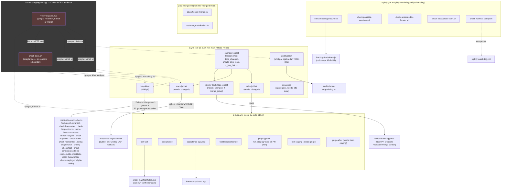

# Jobb 1c — skripten och policy-filerna som CI faktiskt kör

> **Proveniens:** skrivet av agenten J1c (research-pass, delfråga i Session
> 126:s CI-djupgranskning), 2026-09-17. Modell: se § Rapportering nedan.
> Arbetskatalog: worktreen
> `.claude/worktrees/s126-ci-djupgranskning`, gren
> `docs/s126-ci-djupgranskning`, HEAD `2f11a443` vid skrivandet — alltså
> **inte** exakt samma ögonblicksbild som agentkontraktets `eeca8c72`
> (2026-09-08); grenen bär tre egna commits ovanpå den (dokumentations- och
> forskningsarbete för just denna granskning, ingen kod). Ingenting i detta
> dokument vilar på skillnaden.

## Kort svar

Repot har **186 enskilda filer** under `scripts/` (`ls scripts | wc -l` ger
`172`, men den summan räknar katalogen `scripts/lib/` som **en** post av 172
— expanderar man den till dess 15 filer blir det 186 individuella filer,
`74 182` rader kod totalt) och **44 policy-filer** i repo-roten. Av
skript-filerna är **27 grindvakter** — skript som CI faktiskt kör som en
gate eller en klassnings-styrande gren i ett workflow — och **75 är
testsviter** för just dessa grindvakter (varav **68 är CI-wirade** och **7
är avsiktligt lokala**, dokumenterat i `ci.yml`s egen kommentar). Resten
fördelar sig på mätverktyg, produktionsdeploy, seed/purge/schema-verktyg,
ett delat hjälpbibliotek (`scripts/lib/`) och en stor grupp lokala verktyg
(orkestrerings-hjälpmedel, Claude Code-hookar, engångsgeneratorer).

De två skript som fungerar som **nav** — `scripts/check-docs.sh` och
`scripts/verify-ci-parity.mjs` — är **båda lokala speglingsverktyg som CI
självt aldrig kör**. Det är den enskilt viktigaste, lättast missförstådda
sanningen i hela kartläggningen: CI kör 13 dokumentationsgrindar och en lång
rad kod-grindar som **separata steg**, och check-docs.sh finns för att en
människa (eller agent) ska kunna köra samma uppsättning lokalt **innan**
push — verifierat ordagrant i `ci.yml` rad 683 ("check-docs.sh körs INTE av
CI"). `verify-ci-parity.mjs` är motsvarande spegling för RESTEN av
grindarna, klassad som **diagnosverktyg** sedan `ADR-036`s andra amendering
— inte en obligatorisk pre-push-gate.

Policy-filerna följer nästan undantagslöst konventionen "logik i skriptet,
värden i configen" (`CLAUDE.md`, hub-nivå) — jag stickprovade tio par och
samtliga höll. Två av de 44 filerna har **ingen konsument i `scripts/`
alls**: `.mutation-hemvist-policy.conf` läses av en Playwright-testfil under
`tests/api/`, och `.staging-preflight-hook-policy.conf` läses av
`.githooks/pre-commit` (en lokal Git-hook, inte ett skript i `scripts/`).
Ingen av de 44 är oanvänd — bara två bor utanför den katalog uppdraget
pekade mig mot.

Jag hittade **en** genuint föräldralös fil: `scripts/verify-phase-1.ts`, en
runtime-verifiering från projektets allra första byggfas (Fas 1, våren
2026). Den nämns bara i tre historiska dokument (`ADR-005`, `ADR-006`,
`docs/BUILD-LOG.md`) som redan bevis på arbete som är slutfört — ingen
nu­varande mekanism anropar den, importerar den eller kör den.

## Vad jag läste först

Jag inventerade `docs/research/` (165 filer) innan jag började. Två filer
överlappar delvis men svarar på en annan fråga än min:

- [`verify-ci-parity-regel-vantetid-2026-08-05.md`](../../verify-ci-parity-regel-vantetid-2026-08-05.md)
  — mätningen bakom `ADR-036`s klassning av `verify-ci-parity.mjs` som
  diagnosverktyg (910,7 s lokalt mot 401,0 s i CI, ~30× kostnad mot vinst).
  Jag återanvänder den mätningen rakt av i stället för att mäta om den —
  den är fem veckor gammal, och inget i arkitekturen den mätte (parallell
  CI, merge queue) har ändrats.
- [`processregler-mekanisering-branschpraxis-2026-08-04.md`](../../processregler-mekanisering-branschpraxis-2026-08-04.md)
  och [`mekaniserbara-regler-branschpraxis-2026-07-27.md`](../../mekaniserbara-regler-branschpraxis-2026-07-27.md)
  — branschprecedent för config-driven grindvakts-logik. Jag har inte
  omprövat den frågan; den är arkitekturmönster, inte version, och håller
  sig ung.

Ingen befintlig research-fil bygger en fullständig anropsgraf över
`scripts/` eller en fil-för-fil-inventering av rot-policyfilerna — det är
den delen jag tillför.

**ADR:er lästa i sin helhet** (samtliga sju uppdraget pekade på, plus de jag
själv fann relevanta under arbetet):

- **ADR-030** (docs-grindvakter + frontmatter-policy, 2026-05-14) — grundade
  fem av de grindvakter jag kartlägger (markdownlint, Vale, yamllint,
  scripted-checklist-check, frontmatter) och den ursprungliga
  fetch-depth-disciplinen.
- **ADR-033** (shellcheck-strict, 2026-05-16) — scope och strict-mode-kravet
  för `shellcheck` mot `scripts/*.sh` + `.githooks/*` + sourced configar;
  förklarar varför **varje** `.sh`-fil i `scripts/` måste vara
  shellcheck-ren från start.
- **ADR-036** (CI som enda mekaniska enforcement, 2026-05-27, amenderad
  2026-08-05 två gånger) — historien bakom `verify-ci-parity.mjs`s
  diagnosverktygs-klassning. Utan den ADR:n hade jag kunnat missta
  skriptet för en obligatorisk gate.
- **ADR-039** (konsistens-grindar, kadensprincipen + lesson→grind,
  2026-05-27, amenderad 2026-05-29/06-17/07-23) — varför flera av
  grindarna kör vid VARJE push i stället för bara vid fas-avslut, och
  fetch-depth-invariantens ägarskap (nu `0` = full historik, sex bärare).
- **ADR-083** (prosa som påstår mekanism, 2026-07-30) — grunden för
  `check-permissions-claims.sh`, och skälet till att jag genomgående
  skiljer "detta är mekaniserat" från "detta står bara i prosa".
- **ADR-117** (backlog-grindens bulk-insamling, 2026-08-17) — varför
  `backlog-kortfakta.mjs` finns och varför `check-backlog-closure.sh` inte
  längre gör ett CLI-anrop per kort.
- **ADR-127** (backlog-stängningsformerna, 2026-08-24) — de två undantagen
  (härledd DoD-rad, avstådda krav) i samma grind.

**Ålder:** allt jag citerar ur `ci.yml`/`ci-suite.yml`/`package.json`/
`.ci-parity-policy.json` är läst DIREKT ur arbetsträdet 2026-09-17, alltså
inte åldrat. De sju ADR:erna är 1–4 månader gamla; jag korsläste varje
sakpåstående i dem mot dagens filer (se § Fynd 6, tabellraden "verifierad
mot dagens `ci.yml`/`ci-suite.yml`, ingen drift") i stället för att anta att
de fortfarande stämmer.

## Metod

Jag byggde anropsgrafen mekaniskt, inte genom att läsa filer i tur och
ordning:

1. Extraherade varje `scripts/`-sökväg som nämns i de åtta filerna under
   `.github/workflows/*.yml` och i `package.json`s `scripts`-block.
2. För varje sådant skript: grepp:ade hela repot (workflows, `package.json`,
   övriga skript, `.claude/settings.json`, styrande docs) efter skriptets
   filnamn, för att hitta VEM som anropar det och VAD det i sin tur anropar
   (`source`, `bash scripts/…`, `node scripts/…`, `import`/`require`,
   `exec`, config-sökvägar).
3. Skilde **omnämnande** (en kommentar som nämner ett skript) från
   **anrop** (en `run:`-rad, en `source`-rad, ett `exec`) genom att alltid
   läsa TRÄFFENS kontext, aldrig bara räkna träffar — `check-docs.sh` självt
   varnar för just den fällan (dess § "RÄKNINGEN VERIFIERAS MEKANISKT" om
   skillnaden mellan en kommentar som nämner `bash scripts/check-x.sh` och
   raden som faktiskt kör den).
4. Filer som inte nämndes NÅGONSTANS (workflow, `package.json`, annat
   skript, hook, styrande dokument) klassades som föräldralösa kandidater
   och lästes i sin helhet innan de dömdes.
5. Parade varje grindvakt med sin `test-*`-svit och verifierade CI-wiring
   för sviten separat från grindens egen wiring — de är inte samma fråga
   (en grind kan köra i natten medan dess svit körs i PR-lint-jobbet).

**Mätt, inte antaget:** jobbmängden i `.ci-parity-policy.json` (`changed`,
`lint`, `audit`, `suite`, `docs`, `review-backstopp`, `ci-passed` för
`ci.yml`; `purge`, `test-fast`, `acceptance`, `acceptance-sjalvtest`,
`webblasarbeteende`, `test-staging`, `purge-efter` för `ci-suite.yml`) las
jag mot en egen `grep -n '^  [a-zA-Z-]*:$'`-körning på båda
workflow-filerna. **Noll drift** — samma sju respektive sju jobbnamn,
2026-09-17. Det betyder att paritetsgrindens egen `verifieraJobbmangd()`
(§ Fynd 3) inte skulle fälla just nu.

## Fynd

### 1. De två naven: `check-docs.sh` och `verify-ci-parity.mjs`

#### `scripts/check-docs.sh` (301 rader)

**Vad den gör:** kör, i EN körning, samtliga **13 dokumentationsgrindar**
som `ci.yml` kör som separata steg i `docs`-jobbet (4: lychee, markdownlint,
Vale, Vale-regressionssviten) och det alltid-på `lint`-jobbet (9:
frontmatter, lifecycle, tråd-index, publika checklistor, ADR-räkning,
lesson-numrering, permissions-påståenden, fetch-depth-invariant,
listparitet) plus `check-facit.sh` (den fjortonde — filens eget
huvud räknar upp "DE FJORTON", en siffra som skiljer sig från min
"13 dokumentationsgrindar"-formulering ovan bara genom att jag räknar
`check-facit.sh` separat i den summan; håller mig till filens EGEN räkning
här: 14).

**Vem anropar den:** `npm run check:docs` (`package.json` rad 19) — en
människa eller en agent, ALDRIG ett `.github/workflows/*.yml`-jobb.
**Verifierat ordagrant i `ci.yml` rad 683**: *"check-docs.sh körs INTE av
CI (verifierat 2026-07-31: noll run-träffar i något workflow — den är den
LOKALA samlaren som speglar detta jobb)."* Skälet den finns: S91 mätte att
två av tre dokumentationsgrindar kördes vid två separata tillfällen samma
dag av två olika aktörer, och de missade grindarna föll först i CI — ~9
minuter bakom staging-låset (skriptets eget filhuvud, rad 5–9).

**Vad den anropar:** `lychee` (om binären finns lokalt, annars SKIPPAD —
aldrig tyst grönt), `npx markdownlint-cli2`, `npm run lint:prose` (Vale),
`scripts/test-vale-regression.sh`, samt nio `bash scripts/check-*.sh`-anrop
(frontmatter, lifecycle, tråd-index, publika checklistor, ADR-räkning,
lesson-numrering, permissions-påståenden, fetch-depth-invariant,
listparitet) plus `check-facit.sh`.

**Policy:** ingen egen — den orkestrerar andra grindars egna policyfiler.

**Ärlighetskravet, mekaniskt:** skriptet har tre tillstånd per grind —
`PASSED`/`FAILED`/`SKIPPED` — och slutraden räknar `${#PASSED[@]}` i stället
för att hårdkoda ett tal. Det är en medveten fix på ett tidigare fel: en
literal `"samtliga tio"` i slutraden stod fel mot både skriptets egen lista
och `bygg-agent.md`s kopia (den senare sa "nio") tills TASK-106 gjorde
räkningen härledd. **`scripts/check-listparitet.sh` håller listan i
check-docs.sh (markörparet `docs-grindar-lokal`) i synk med motsvarande
lista i `ci.yml` (`docs-grindar-ci`)** — så en ny grind i `ci.yml`s
alltid-på-steg som inte läggs till här fälls mekaniskt, inte bara i teorin.

**Test-svit:** ingen egen `test-check-docs.sh` — skriptet är en ren
orkestrering av redan testade grindar, och dess EGEN korrekthet (att
listan matchar `ci.yml`) vaktas av `check-listparitet.sh` + dess svit
(`test-check-listparitet.sh`, 18 fall).

**CI-wirad:** **Nej** — se ovan. Detta är den enskilt viktigaste
enkelheten att inte missförstå i hela kartläggningen.

#### `scripts/verify-ci-parity.mjs` (920 rader) + `.ci-parity-policy.json` (144 rader)

**Vad den gör:** kör den grinduppsättning `ci.yml` + `ci-suite.yml`
FAKTISKT skulle köra för en given PR, i ETT lokalt kommando — men **härlett
ur workflow-YAML:en vid varje körning**, inte en fjärde handhållen kopia.
Konkret: den läser `ci.yml`/`ci-suite.yml`, kör de dokumentationsgrindar
`check-docs.sh` redan täcker via just det skriptet (ingen tredje kopia av
samma 14 grindar), och kör sedan VARJE ÖVRIGT steg i de tre "härledda"
jobben (`lint`, `audit`, `docs` i `ci.yml`; `test-fast`, `acceptance`,
`acceptance-sjalvtest`, `webblasarbeteende` i `ci-suite.yml`) **verbatim**,
rad för rad ur `run:`-blocket.

**Vem anropar den:** `npm run verify:ci-parity` / `verify:ci-parity:fast`
(`package.json` rad 20–21) — alltid en människa eller agent som medvetet
plockar fram den. **Aldrig** ett CI-jobb.

**Vad den anropar:** `js-yaml` för att parsa `ci.yml`/`ci-suite.yml`,
`micromatch` för att matcha D0-globen (samma bibliotek `ci.yml`s egna
kommentarer citerar som facit för `tj-actions/changed-files`s tolkning),
`spawnSync` för att köra varje härlett stegs `run:`-text, samt
`scripts/check-docs.sh` som ETT steg (inte en omimplementation).

**Policy:** `.ci-parity-policy.json` — och den filen är ovanligt väl
dokumenterad om VARFÖR den inte är en grindlista: *"Målet är INTE att räkna
upp varenda grind CI kör … Varje jobb i `derivedJobs` läses från
workflow-filen VID VARJE KÖRNING och EXEKVERAS VERBATIM steg för steg."*
Vad filen FAKTISKT deklarerar är fyra saker: (a) `knownJobs` — vilka jobb i
`ci.yml`/`ci-suite.yml` som är kända, och en förklarande text per jobb om
VARFÖR det härleds eller uteslutits, (b) `derivedJobs` — vilka jobb som
körs verbatim (`ci.lint/audit/docs`, `ciSuite.test-fast/acceptance/
acceptance-sjalvtest/webblasarbeteende`), (c) `diffClassification` — var i
`ci.yml` D0-globen bor (jobb `changed`, steg `changed-files`), så
diff-klassningen (docs-only vs kod) aldrig blir en handkopierad glob-lista,
och (d) `suiteInputInvariants` — att `suite`-jobbets `run_staging`/
`run_a11y`-inputs fortfarande är literalt `false` (annars måste `purge`/
`a11y`/`test-staging` tas in i täckningen).

**Paritets-preflighten (`main()`, körs FÖRE något grindas):** tre
mekaniska kontroller, samtliga fail-closed med **exit 2** vid drift:
`verifieraJobbmangd()` (finns det en NY jobb i `ci.yml`/`ci-suite.yml` som
policyn inte känner till, eller ett policy-jobb som inte längre finns?),
`verifieraSuiteInputInvarianter()` (är `run_staging`/`run_a11y`
fortfarande literalt `false`?), `verifieraDiffKlassningskoppling()` (pekar
`should_skip_tests` fortfarande på `suite`-jobbets `if:`-villkor?). Jag
körde den första kontrollen själv (§ Metod) mot dagens `ci.yml`/
`ci-suite.yml` — **noll drift**, samma sju jobbnamn på båda sidor.

**Diff-klassningen (TASK-142, 2026-08-05):** default är sedan dess INTE
"kör alltid allt" utan "klassa diffen mot samma D0-glob CI:s `changed`-jobb
använder, och kör bara testsviterna om NÅGOT i diffen inte är docs-only".
Klassningen är en allowlist (måste matcha D0 för att räknas docs-only) och
fail-closed vid osäkerhet (kan diffen inte beräknas → fullt läge, aldrig en
gissad delmängd).

**Varför den INTE är en obligatorisk gate — `ADR-036`s mätning:** en full
lokal körning mätte **910,7 s** mot CI:s **401,0 s** parallellt, med en
uppmätt felfrekvens på **3 av 99 ≈ 3 %** i det mätfönstret. Kostnaden är
alltså ~30× besparingen. `CLAUDE.md` (projektnivå) instruerar uttryckligen
att köra den i tre namngivna lägen (CI-config ändrad, reproducera en röd
CI, ovanligt riskabel ändring) — **inte** som rutin före varje push.

**Test-svit:** `scripts/test-verify-ci-parity.mjs` (712 rader) — CI-wirad
(rad 1542 i `ci.yml`s gatekeeper-steg). Testar paritets-preflightens tre
kontroller mot syntetiska fixturer OCH — där I/O är oundviklig (diff mot
`origin/main`) — via ett sandlåde-CLI-bevis, enligt filens egen
kommentar.

**CI-wirad:** **Nej**, av samma skäl som `check-docs.sh`, men klassad
EXPLICIT som diagnosverktyg (inte bara "glömd") i `ADR-036`s andra
amendering 2026-08-05 — en tidigare rad i `CLAUDE.md` som gick förbi ADR:n
och krävde full körning "före push" revs samma dag den skrevs, efter att en
agent kört 153 acceptance-tester på en ändring som var en enda markdown-fil.

### 2. Anropsgrafen — mermaid

Grupperad efter workflow/jobb-nivå, inte alla 186 filer i en klump. Pilar
visar den FAKTISKA anropskedjan (workflow → jobb → skript → skript det
anropar), inte bara "nämns i samma fil".

**Läsanvisning för den som inte är teknisk:** en "workflow" är en fil GitHub
Actions läser och kör automatiskt (t.ex. vid varje push); ett "jobb" är en
avgränsad del av en workflow som kör på en egen maskin; ett "steg" är en
enskild kommandorad inom ett jobb. Pilar med heldragen linje betyder
"anropar direkt och väntar på svaret"; streckade pilar betyder "syftar på /
speglar, men körs inte av den andra parten".

### 3. Anropsgrafen — tabell (de viktigaste kopplingarna)

| Från | Till | Typ av koppling | Evidens |
|---|---|---|---|
| `ci.yml` (`push`) | jobbet `changed` | trigger | `.github/workflows/ci.yml:7,50` |
| jobbet `changed` | jobbet `suite` | `needs: changed` | `ci.yml:2158` |
| jobbet `changed` | jobbet `docs` | `needs: changed` | `ci.yml:2280` |
| jobbet `changed` | jobbet `review-backstopp` | `needs: [changed]`, `if: merge_group` | `ci.yml:2485` |
| jobbet `suite` | `.github/workflows/ci-suite.yml` | `uses:` (återanvänd workflow) | `ci.yml:2174` |
| jobbet `ci-passed` | `changed, lint, audit, docs, suite, review-backstopp` | `needs:` (aggregator, den faktiska required-checken) | `ci.yml:2551` |
| `ci-suite.yml` jobbet `test-staging` | jobbet `purge` | `needs: [purge]` | `ci-suite.yml:759` |
| `ci-suite.yml` jobbet `purge-efter` | jobbet `test-staging` | `needs: [test-staging]` | `ci-suite.yml:937` |
| lint-jobbet | `scripts/check-mallparitet.sh` | `run: bash scripts/check-mallparitet.sh` | `ci.yml:855` |
| `check-mallparitet.sh` | `scripts/synka-bilagemallar.mjs --check` | `exec node "${SCRIPT_DIR}/synka-bilagemallar.mjs" --check` | `scripts/check-mallparitet.sh:17` |
| lint-jobbet ("Test gatekeeper script suites") | 47 `test-*`-sviter i EN `run:`-block | `bash`/`node scripts/test-*` | `ci.yml:1494-1546` |
| `test-fast`-jobbet (`ci-suite.yml`) | `npm run verify:manifest` → `check-manifest-fields.mjs` | `run:` | `ci-suite.yml:195` |
| `acceptance-sjalvtest`-jobbet | `npm run test:acceptance:sjalvtest` → `hermetik-sjalvtest.mjs` | `run:` via `package.json:28` | `ci-suite.yml` (jobbnamn), `package.json:28` |
| `review-backstopp`-jobbet | `scripts/review-backstopp.mjs --merge-group-ref` | `run:` | `ci.yml:2520` |
| `nightly.yml` (jobbet `backlog-closure`) | `scripts/check-backlog-closure.sh` | `run:` | `nightly.yml:441` |
| `check-backlog-closure.sh` | `scripts/backlog-kortfakta.mjs` | variabel `KORTFAKTA_SKRIPT` (default = detta skript) | `scripts/check-backlog-closure.sh:626` |
| `nightly-watchdog.yml` (jobbet `watch`) | `scripts/check-nattvakt-dedup.sh` | `run:` (kommandosubstitution) | `nightly-watchdog.yml:209` |
| `post-merge.yml` (jobbet `klassning`) | `scripts/classify-post-merge.sh "${SHA}"` | `run:` | `post-merge.yml:229` |
| `post-merge.yml` (jobbet `larm`) | `scripts/post-merge-attribution.sh` | kommandosubstitution | `post-merge.yml:456` |
| `scripts/mall-pdf.mjs` | `scripts/docraptor-sjalvbarande.mjs` | ES-modul-`import { gorSjalvbarande }` | `scripts/mall-pdf.mjs:76` |
| `npm run check:docs` (aldrig ett workflow) | 9 `check-*.sh` + Vale-regressionssviten + lychee/markdownlint/Vale | `run_gate`/`skip_gate`-anrop | `scripts/check-docs.sh:196-258` |
| `npm run verify:ci-parity` (aldrig ett workflow) | `check-docs.sh` + samtliga steg i `lint`/`audit`/`docs`/`test-fast`/`acceptance`/`acceptance-sjalvtest`/`webblasarbeteende` | härlett + verbatim-körning | `scripts/verify-ci-parity.mjs:665-720`, `.ci-parity-policy.json` |
| `.claude/settings.json` (PreToolUse/SessionStart/SessionEnd-hookar) | 10 `deny-*.sh`/`katalogagarskap-*.sh`/`post-compact-igenkanning.sh`/`stop-vakt.sh` + `agent-spawn-log.sh` | hook-registrering (**J1d:s primära scope** — noterat här för fullständighet) | `.claude/settings.json` (grep `scripts/.*\.sh`) |

### 4. Fullständig inventering av `scripts/` — alla 186 filer

`ls scripts | wc -l` ger **172** — det talet räknar `scripts/lib/` som EN
post. Jag expanderar katalogen till dess 15 filer nedan för fullständighet,
vilket ger **186 rader**. Grupperat per klass, inte alfabetiskt inom hela
katalogen — annars försvinner mönstret i bruset.

**Kolumnförklaring:** *Anropas av* = vem som startar skriptet (workflow-jobb,
`npm run`-namn, ett annat skript, en hook, eller "orkestreraren" = en
människa/agent som kör det för hand). *CI-wirad* = körs skriptet (eller dess
testsvit, för sviterna) automatiskt av något `.github/workflows/*.yml`-jobb.

#### 4.1 Grindvakter (27 filer, 7 360 rader)

Skript CI faktiskt kör som en gate, en klassnings-avgörande gren, eller en
natt-kontroll.

| Fil | Syfte | Anropas av | Anropar | Policy | Testsvit (wirad?) | CI-wirad | Not |
|---|---|---|---|---|---|---|---|
| `check-adr-count.sh` | ADR-fil-antal == README:s räkning (ADR-039) | `ci.yml` lint-jobbet | grep mot `docs/decisions/` + README | — | `test-check-adr-count.sh` (ja) | Ja, PR | — |
| `check-fetch-depth-invariant.sh` | fetch-depth-värdet enhetligt över 5 bärare (ADR-039) | `ci.yml` lint-jobbet | läser `ci.yml`+`.frontmatter-policy.conf` | `.frontmatter-policy.conf` | `test-check-fetch-depth-invariant.sh` (ja) | Ja, PR | — |
| `check-frontmatter.sh` | YAML-frontmatter på 10 styrande docs (ADR-030) | `ci.yml` lint-jobbet | `git log` per fil | `.frontmatter-policy.conf` | `test-check-frontmatter.sh` (ja) | Ja, PR | Shallow-clone-detection (ADR-033 K4) |
| `check-langa-streck.mjs` | fäller NYA em/en-dash i `src/`-strängar (TASK-172) | `ci.yml` lint-jobbet | AST-parsning av `src/` | `.langa-streck-policy.json` | `test-check-langa-streck.mjs` (ja) | Ja, PR | — |
| `check-lesson-numbers.sh` | lesson-nummer tilldelas vid landning, inte skrivning | `ci.yml` lint-jobbet | grep `tasks/lessons*` | `.lesson-policy.conf` | `test-check-lesson-numbers.sh` (ja) | Ja, PR | — |
| `check-lifecycle.sh` | `lifecycle:`-fält på sessionsdok/trådkort (ADR-052) | `ci.yml` lint-jobbet | grep frontmatter | — | `test-check-lifecycle.sh` (ja) | Ja, PR | — |
| `check-listparitet.sh` | två listor som ska matcha har inte glidit isär (TASK-85) | `ci.yml` lint-jobbet | läser markörpar i flera filer | `.listparitet-policy.conf` | `test-check-listparitet.sh` (ja) | Ja, PR | Vaktar bl.a. `check-docs.sh`↔`ci.yml` |
| `check-mailto.mjs` | fäller `mailto:`-länkar i utskicksflöden (TASK-147.8) | `ci.yml` lint-jobbet | AST-parsning av `src/` | `.mailto-policy.json` | `test-check-mailto.mjs` (ja) | Ja, PR | — |
| `check-mallparitet.sh` | genererade TS-mallmoduler byte-identiska mot källan (TASK-309.4) | `ci.yml` lint-jobbet | **execar** `synka-bilagemallar.mjs --check` | (ärver `synka-bilagemallar.mjs`s config) | `test-check-mallparitet.sh` (ja) | Ja, PR | 17 rader — tunn wrapper |
| `check-facit.sh` | låst facits adresserbarhet + rivningsspärr (ADR-102) | `ci.yml` lint-jobbet | `scripts/lib/facit-validera.mjs` | `.facit-policy.conf` | `test-check-facit.sh` (ja) | Ja, PR | — |
| `check-permissions-claims.sh` | prosa får inte påstå en `permissions.*`-mekanism som inte finns (ADR-083) | `ci.yml` lint-jobbet | grep styrande docs + settings-filer | `.permissions-claims-policy.conf` | `test-check-permissions-claims.sh` (ja) | Ja, PR | — |
| `check-public-checklists.sh` | oavslutade `- [ ]` i publika docs (ADR-030) | `ci.yml` lint-jobbet | awk-scan | `.checklist-policy.conf` | `test-check-public-checklists.sh` (ja) | Ja, PR | — |
| `check-thread-index.sh` | tråd-registrets index (radform/enum/numrering) | `ci.yml` lint-jobbet | grep `tasks/threads/README.md` | `.thread-index-policy.conf` | `test-check-thread-index.sh` (ja) | Ja, PR | — |
| `check-staging-preflight-wiring.mjs` | deletion-vakt: hakar preflighten fortfarande i? (TASK-91) | `ci.yml` lint-jobbet | läser `playwright.config.ts` + `scripts/*.mjs` | `.staging-preflight-wiring-policy.json` | `test-check-staging-preflight-wiring.mjs` (ja) | Ja, PR | — |
| `check-manifest-fields.mjs` | app-manifestets fält (TASK-126.1/126.4) | `ci-suite.yml` test-fast-jobbet (`npm run verify:manifest`) | läser byggd `dist/manifest.webmanifest` | — | `test-check-manifest-fields.mjs` (ja) | Ja, PR | Enda check-* i `test-fast`, inte `lint` |
| `audit-ci-med-degradering.sh` | `npx audit-ci` med steg-loop + smal nätverksdegradering (TASK-395) | `ci.yml` audit-jobbet | `npx audit-ci --config audit-ci.jsonc` | `audit-ci.jsonc` (ej i policy-mängden) | `test-audit-degradering.sh` (ja) | Ja, PR | Eget jobb sedan TASK-395 |
| `acceptance-urval.sh` | avgör om HELA diffen tillåter ett smalt acceptance-urval (TASK-75) | `ci.yml` `changed`-jobbet | git diff-analys | — | `test-acceptance-urval.sh` (ja) | Ja, PR | Klassningsgate, inte pass/fail |
| `classify-post-merge.sh` | ärver `should_skip_tests` för post-merge-lagret (TASK-73) | `post-merge.yml` jobbet `klassning` | `git show`/`gh api` mot commiten | — | `test-classify-post-merge.sh` (ja) | Ja, post-merge | Klassningsgate |
| `post-merge-attribution.sh` | är denna landning primär misstänkt eller del av ett spann? (TASK-334) | `post-merge.yml` jobbet `larm` | `gh api` | — | `test-post-merge-attribution.sh` (ja) | Ja, post-merge | — |
| `visual-baselines-scope.sh` | vilken delmängd av visual-sviten en baseline-körning ska ta (TASK-298) | `visual-baselines.yml` | Playwright-projektlista | — | `test-visual-baselines-scope.sh` (ja) | Ja, manuell dispatch | Klassningsgate |
| `review-backstopp.mjs` | fäller en `merge_group`-landning utan giltigt granskningsutlåtande (TASK-173.4, ADR-105) | `ci.yml` jobbet `review-backstopp` | `gh pr view` mot kö-grenens PR | (läser PR-kroppen, ingen egen config-fil) | `test-review-backstopp.mjs` (ja) | Ja, endast `merge_group` | Enda grinden som prövar en LEVANDE GitHub-resurs |
| `check-backlog-closure.sh` | Done-status men obockad AC/DoD (ADR-073/117/127) | `nightly.yml` jobbet `backlog-closure` | `backlog-kortfakta.mjs` (bulk) | `.backlog-closure-policy.conf` | `test-check-backlog-closure.sh` (ja) | Ja, natt | 1 126 rader, störst i klassen |
| `check-pausade-sessioner.sh` | ett sessionsdok som PÅSTÅR paus är faktiskt pausat | `nightly.yml` | `git log` mot `[S<N>]`-taggade commits | `.sanningsavstamning-policy.conf` | `test-check-pausade-sessioner.sh` (ja) | Ja, natt | — |
| `check-sessionsdok-fonster.sh` | rullande fönster för `tasks/sessions/`-roten (ADR-099) | `nightly.yml` | torrkör `arkivera-sessionsdok.sh` | `.arkivera-sessionsdok-policy.conf` | `test-check-sessionsdok-fonster.sh` (ja) | Ja, natt | — |
| `check-obesvarade-larm.sh` | larm-ärenden som skapats faktiskt besvarade | `nightly.yml` | `gh api`/`gh issue list` | `.sanningsavstamning-policy.conf` | `test-check-obesvarade-larm.sh` (ja) | Ja, natt | — |
| `check-nattvakt-dedup.sh` | ny avvikelse redan täckt av ett existerande ärende? | `nightly-watchdog.yml` | `gh issue list` | `.nattvakt-dedup-policy.conf` | `test-check-nattvakt-dedup.sh` (ja) | Ja, natt | — |
| `hermetik-sjalvtest.mjs` | acceptance-klassens tvåsidiga hermetik-bevis (ADR-080) | `ci-suite.yml` jobbet `acceptance-sjalvtest` (`npm run test:acceptance:sjalvtest`) | kör acceptance-sviten mot en neutraliserad + en normal konfiguration | — | (är själv beviset — ingen `test-hermetik-sjalvtest.mjs`) | Ja, PR | Eget jobb sedan TASK-239 |

#### 4.2 Testsviter för grindvakter (75 filer, 34 582 rader — 68 CI-wirade, 7 avsiktligt lokala)

Jag listar dem grupperade efter vad de skyddar, inte alfabetiskt. **CI-wirad**
avser om SVITEN körs automatiskt (inte om skriptet den skyddar gör det —
`test-check-backlog-closure.sh` är PR-wirad trots att `check-backlog-
closure.sh` bara kör i natten).

| Testsvit | Skyddar | CI-wirad | Var |
|---|---|---|---|
| `test-check-adr-count.sh` | `check-adr-count.sh` | Ja | lint-jobbets gatekeeper-steg |
| `test-check-fetch-depth-invariant.sh` | `check-fetch-depth-invariant.sh` | Ja | lint-jobbet, eget steg (rad 917) |
| `test-check-frontmatter.sh` | `check-frontmatter.sh` | Ja | gatekeeper-steg |
| `test-check-langa-streck.mjs` | `check-langa-streck.mjs` | Ja | gatekeeper-steg |
| `test-check-lesson-numbers.sh` | `check-lesson-numbers.sh` | Ja | gatekeeper-steg |
| `test-check-lifecycle.sh` | `check-lifecycle.sh` | Ja | gatekeeper-steg |
| `test-check-listparitet.sh` | `check-listparitet.sh` | Ja | gatekeeper-steg |
| `test-check-mailto.mjs` | `check-mailto.mjs` | Ja | gatekeeper-steg |
| `test-check-mallparitet.sh` | `check-mallparitet.sh`/`synka-bilagemallar.mjs` | Ja | gatekeeper-steg |
| `test-check-manifest-fields.mjs` | `check-manifest-fields.mjs` | Ja | `ci-suite.yml` test-fast, direkt efter grinden |
| `test-check-nattvakt-dedup.sh` | `check-nattvakt-dedup.sh` | Ja | gatekeeper-steg |
| `test-check-obesvarade-larm.sh` | `check-obesvarade-larm.sh` | Ja | gatekeeper-steg |
| `test-check-pausade-sessioner.sh` | `check-pausade-sessioner.sh` | Ja | gatekeeper-steg |
| `test-check-permissions-claims.sh` | `check-permissions-claims.sh` | Ja | gatekeeper-steg |
| `test-check-public-checklists.sh` | `check-public-checklists.sh` | Ja | gatekeeper-steg |
| `test-check-sessionsdok-fonster.sh` | `check-sessionsdok-fonster.sh` | Ja | gatekeeper-steg |
| `test-check-staging-preflight-wiring.mjs` | `check-staging-preflight-wiring.mjs` | Ja | eget steg (rad 1789) |
| `test-check-thread-index.sh` | `check-thread-index.sh` | Ja | gatekeeper-steg |
| `test-check-facit.sh` | `check-facit.sh` | Ja | gatekeeper-steg |
| `test-check-backlog-closure.sh` | `check-backlog-closure.sh` | Ja | gatekeeper-steg (grinden själv kör i natten) |
| `test-backlog-cli.sh` | `backlog-cli.sh` (wrappern) | Ja | gatekeeper-steg |
| `test-acceptance-urval.sh` | `acceptance-urval.sh` | Ja | eget steg (rad 1607) |
| `test-classify-post-merge.sh` | `classify-post-merge.sh` | Ja | eget steg (rad 1566) |
| `test-post-merge-attribution.sh` | `post-merge-attribution.sh` | Ja | eget steg (rad 1588) |
| `test-visual-baselines-scope.sh` | `visual-baselines-scope.sh` | Ja | gatekeeper-steg |
| `test-audit-degradering.sh` | `audit-ci-med-degradering.sh` | Ja | gatekeeper-steg |
| `test-review-backstopp.mjs` | `review-backstopp.mjs`/`lib/review-backstopp.mjs` | Ja | gatekeeper-steg |
| `test-review-loop.mjs` | `review-loop-beslut.mjs`/`lib/review-loop.mjs` | Ja | gatekeeper-steg |
| `test-review-metrics.mjs` | review-instrumenteringen (`lib/review-metrics.mjs` m.fl.) | Ja | gatekeeper-steg |
| `test-review-policy.mjs` | `.review-policy.json`/`lib/review-policy.mjs`/`hamta-review-policy.mjs` | Ja | gatekeeper-steg |
| `test-review-risk-sektion.mjs` | `lib/review-risk-sektion.mjs`/`uppdatera-review-sektion.mjs` | Ja | gatekeeper-steg |
| `test-validera-review-utlatande.mjs` | `lib/review-utlatande.mjs`/`validera-review-utlatande.mjs` | Ja | gatekeeper-steg |
| `test-verify-ci-parity.mjs` | `verify-ci-parity.mjs` | Ja | gatekeeper-steg |
| `test-synka-labels.mjs` | `synka-labels.mjs`/`lib/synka-labels.mjs` | Ja | gatekeeper-steg |
| `test-backfill-inbetalningar.mjs` | `backfill-inbetalningar.mjs` | Ja | gatekeeper-steg |
| `test-docraptor-sjalvbarande.mjs` | `docraptor-sjalvbarande.mjs` | Ja | gatekeeper-steg |
| `test-task-338-6-prod-migration.mjs` | `task-338-6-prod-migration.mjs` | Ja | gatekeeper-steg |
| `test-agent-spawn-log.sh` | `agent-spawn-log.sh` (hook) | Ja | gatekeeper-steg |
| `test-ci-wait.sh` | `ci-wait.sh` | Ja | gatekeeper-steg |
| `test-staging-semaphore.sh` | `staging-semaphore.sh` | Ja | gatekeeper-steg |
| `test-stop-vakt.sh` | `stop-vakt.sh` (hook) | Ja | gatekeeper-steg |
| `test-pre-commit-hook.sh` | `.githooks/pre-commit` (**J1d**) | Ja | gatekeeper-steg |
| `test-jq-guard.sh` | `lib/jq-guard.sh` | Ja | gatekeeper-steg |
| `test-gh-guard.sh` | `lib/gh-guard.sh` | Ja | gatekeeper-steg |
| `test-fas4-prod-deploy.sh` | `fas4-prod-deploy.sh` | Ja | gatekeeper-steg (bara pre-nätverk-delen) |
| `test-supabase-cli-policy.sh` | `lib/supabase-cli.sh` | Ja | gatekeeper-steg |
| `test-deploy-prod-functions.sh` | `deploy-prod-functions.sh` | Ja | eget steg (rad 1621) |
| `test-heartbeat-svep.sh` | `heartbeat-svep.sh` (**J1d**) | Ja | gatekeeper-steg |
| `test-stada-grenar.sh` | `stada-grenar.sh` | Ja | gatekeeper-steg |
| `test-arkivera-sessionsdok.sh` | `arkivera-sessionsdok.sh` | Ja | gatekeeper-steg |
| `test-post-compact-igenkanning.sh` | `post-compact-igenkanning.sh` (**J1d**) | Ja | gatekeeper-steg |
| `test-deny-arbetsform-push.sh` | `deny-arbetsform-push.sh` (**J1d**) | Ja | gatekeeper-steg |
| `test-deny-facit-godkand-skrivning.sh` | `deny-facit-godkand-skrivning.sh` (**J1d**) | Ja | gatekeeper-steg |
| `test-deny-frammande-huvudkatalog.sh` | `deny-frammande-huvudkatalog.sh` (**J1d**) | Ja | gatekeeper-steg |
| `test-deny-grind-genom-pipe.sh` | `deny-grind-genom-pipe.sh` (**J1d**) | Ja | gatekeeper-steg |
| `test-deny-hemlighet-utskrift.sh` | `deny-hemlighet-utskrift.sh` (**J1d**) | Ja | gatekeeper-steg |
| `test-deny-precompact.sh` | `deny-precompact.sh` (**J1d**) | Ja | gatekeeper-steg |
| `test-deny-prod-airtable.sh` | `deny-prod-airtable.sh` (**J1d**) | Ja | gatekeeper-steg |
| `test-deny-prod-ref.sh` | `deny-prod-ref.sh` (**J1d**) | Ja | gatekeeper-steg |
| `test-deny-resend-send.sh` | `deny-resend-send.sh` (**J1d**) | Ja | gatekeeper-steg |
| `test-deny-subagent-vantan.sh` | `deny-subagent-vantan.sh` (**J1d**) | Ja | gatekeeper-steg |
| `test-vale-regression.sh` | Vale-installationens L_X.2-regression | Ja | EGET steg i docs-jobbet (rad 2449) **och** `check-docs.sh` — dubbel roll |
| `test-facit-godkann.mjs` | `facit-godkann.mjs` | Ja | eget steg (rad 1693) |
| `test-purge-staging-sentinels.mjs` | `purge-staging-sentinels.mjs` | Ja | eget steg (rad 1651) |
| `test-seed-review-fixture.mjs` | `seed-review-fixture.mjs` | Ja | eget steg (rad 1674) |
| `test-ci-metrics.mjs` | `ci-metrics.mjs` | Ja | `nightly.yml` nightly-metrics-jobbet (rad 300) |
| `test-flake-matserie.mjs` | `flake-matserie.mjs` | Ja | `nightly.yml` (rad 308) |
| `test-uppdragsrevision.mjs` | `uppdragsrevision.mjs` | Ja | `nightly.yml` (rad 319) |
| `test-check-claims-tackning.sh` | `check-claims-tackning.sh` (orkestrerar-verktyg) | **Nej** | avsiktligt lokal (TASK-82/139-precedent) |
| `test-check-merge-tree.sh` | `check-merge-tree.sh` (orkestrerar-verktyg) | **Nej** | avsiktligt lokal |
| `test-backfill-bilagor-dokumentklass.mjs` | `backfill-bilagor-dokumentklass.mjs` | **Nej** | avsiktligt lokal — engångs-migreringsverktyg |
| `test-create-betalningsfalt.mjs` | `create-betalningsfalt.mjs` | **Nej** | avsiktligt lokal |
| `test-create-bilagor-table.mjs` | `create-bilagor-table.mjs` | **Nej** | avsiktligt lokal |
| `test-create-eventinnehall-modell.mjs` | `create-eventinnehall-modell.mjs` | **Nej** | avsiktligt lokal |
| `test-create-kvitton-table.mjs` | `create-kvitton-table.mjs` | **Nej** | avsiktligt lokal |

De sju o-wirade är inte en lucka — sex av dem bokförs UTTRYCKLIGEN i
`ci.yml`s egen kommentar (rad 1142–1154, TASK-185-revisionen 2026-08-26):
*"Sex ANDRA o-wirade sviter … rördes INTE: var och en bär sin egen 'INTE
WIRAD/AVGRÄNSAD BORT (medvetet)'-kommentar i eget filhuvud."* Den sjunde
(`test-create-betalningsfalt.mjs`) tillkom senare (TASK-346, efter
TASK-185-revisionen) i samma mönster — dess eget filhuvud säger "körs
lokalt vid skript-utveckling, ej CI-wirad."

#### 4.3 Mätverktyg (8 filer, 2 724 rader)

| Fil | Syfte | Anropas av | CI-wirad |
|---|---|---|---|
| `agent-spawn-metrics.mjs` | läser `agent-spawn-log.sh`s JSONL, mäter om typade agenter används | `npm run metrics:agents` | Nej |
| `ci-metrics.mjs` | CI-hastighet som DORA-tal (ledtid, kötid, flakighet) | `npm run metrics:ci`, `nightly.yml` nightly-metrics | Delvis — testsviten ja, verktyget själv körs manuellt/i natten som rapport |
| `flake-matserie.mjs` | interfolierad A/B-mätrigg för flakighet (TASK-81) | `npm run metrics:flake` | Nej (testsviten är dock CI-wirad) |
| `mat-ikon-centrering.mjs` | mäter PWA-ikoners centrering i FAKTISKA utfiler (TASK-282) | manuellt vid ikon-ändring | Nej |
| `uppdragsrevision.mjs` | extraherar mönster ur ett transkript (uppdragsrevision) | `npm run revision:uppdrag` | Nej (testsviten CI-wirad i natten) |
| `review-metrics.mjs` | summerar review-grindens instrumenteringslogg | `npm run review:metrics` | Nej |
| `review-metrics-kalibrering.mjs` | bokför en Marcus-fångst som grind-miss (ADR-105) | `npm run review:kalibrering` | Nej |
| `verifiera-farg-atlas.mjs` | oberoende andra-implementation som verifierar färgatlasen | `npm run atlas` (sista steget i kedjan) | Nej |

#### 4.4 Produktionsdeploy (6 filer, 2 143 rader)

| Fil | Syfte | Anropas av | Policy | CI-wirad |
|---|---|---|---|---|
| `deploy-prod-functions.sh` | fail-closed EF-deploy mot en allowlist | Marcus manuellt | `.prod-functions-allowlist.conf` | Nej (testsviten ja, egen steg rad 1621) |
| `fas4-prod-deploy.sh` | hela Fas 4-deploysekvensen som EN körning | Marcus manuellt (`--kontrollera` via `!`, `--deploya` i eget fönster) | `.prod-ref-policy.conf`, `.supabase-cli-policy.conf`, `.hemlighets-namn-policy.conf` | Nej (testsviten ja) |
| `kontrollera-bilagor-bucket.sh` | read-only konvergenskontroll av Storage-bucketen | `fas4-prod-deploy.sh` | `.supabase-cli-policy.conf` | Nej |
| `kontrollera-hemlighets-namn.sh` | verifierar att kända hemlighetsNAMN finns i ett projekt | `fas4-prod-deploy.sh --kontrollera` | `.hemlighets-namn-policy.conf` | Nej |
| `provision-attachments-bucket.mjs` | engångsprovisionering av bilagornas Storage-bucket | manuellt (TASK-146.3) | `.supabase-cli-policy.conf` | Nej |
| `task-338-6-prod-migration.mjs` | förberedelse-skript, KÖRT AV MARCUS mot prod | Marcus manuellt | `.prod-ref-policy.conf` | Nej (testsviten ja, gatekeeper-steg) |

#### 4.5 Seed, purge och schema/backfill-verktyg (11 filer, 10 856 rader)

| Fil | Syfte | Anropas av | Policy | CI-wirad |
|---|---|---|---|---|
| `seed-dokument-fixture.mjs` | permanenta demo-bilagor i staging | `npm run seed:dokument[:clean]` | `.purge-staging-policy.json`, `.prod-ref-policy.conf` | Nej |
| `seed-eventinnehall-modell.mjs` | standardrader för bilage-datamodellen i staging | `npm run seed:eventinnehall` | `.purge-staging-policy.json` | Nej |
| `seed-review-fixture.mjs` | granskningsfixturer (event + anmälningar) för Marcus manuella review | `npm run seed:review[:clean]` | `.purge-staging-policy.json` | Nej (testsviten ja, egen steg rad 1674) |
| `purge-staging-sentinels.mjs` | städar sentinel-rader i staging (ADR-060) | `npm run purge:staging`, **`ci-suite.yml` jobbet `purge`/`purge-efter`** (gated `run_staging`) | `.purge-staging-policy.json` | Delvis — själva jobbet instansieras aldrig på PR-ytan, men testsviten är CI-wirad (egen steg rad 1651) |
| `backfill-bilagor-dokumentklass.mjs` | backfyller ett additivt fält på gamla rader | `npm run backfill:bilagor-dokumentklass` | `.prod-ref-policy.conf` | Nej |
| `backfill-inbetalningar.mjs` | historiska inbetalningar ur basens befintliga sanning (1 911 rader, störst i katalogen) | `npm run backfill:inbetalningar` | `.prod-ref-policy.conf`, `.supabase-cli-policy.conf` | Nej (testsviten ja, gatekeeper-steg) |
| `create-betalningsfalt.mjs` | additiva prisfält i Airtable-basen, idempotent | `npm run schema:betalningsfalt` | — | Nej |
| `create-bilagor-table.mjs` | skapar "Bilagor"-tabellen additivt | `npm run schema:bilagor` | — | Nej |
| `create-eventinnehall-modell.mjs` | skapar tre nya tabeller för bilage-modellen | `npm run schema:eventinnehall` | — | Nej |
| `create-kvitton-table.mjs` | skapar kvittoseriens ledger-tabell | `npm run schema:kvitton` | — | Nej |
| `task-346-3-staging-verifiering.sql` | manuell SQL-verifiering mot staging-databasen | `npx supabase db query --linked -f …` (dokumenterat i `supabase/migrations/README.md`) | — | Nej |

#### 4.6 Hjälpbibliotek — `scripts/lib/` (15 filer, 3 887 rader)

Ren logik, ingen egen `set -euo pipefail`/top-level-körning där det går att
undvika — importeras/sourceas av flera skript. Detta ÄR den katalog
uppdraget räknar som "1 lib-katalog" av de 172.

| Fil | Vad den delar | Konsumeras av |
|---|---|---|
| `facit-godkand-skrivning.mjs` | avgör om en Edit/Write skulle sätta `godkand` i ett facit-manifest | `deny-facit-godkand-skrivning.sh` (hook) + dess testsvit |
| `facit-validera.mjs` | strukturvalidering av ETT facit-manifest | `check-facit.sh` |
| `farg.mjs` | oberoende färgmatematik (sRGB↔linjär, WCAG-luminans, OKLab) | `build-farg-atlas.mjs`, `verifiera-farg-atlas.mjs` |
| `gh-guard.sh` | delad presence+minimiversion-guard för `gh` | ~10 skript i grind-/landningsvägen |
| `jq-guard.sh` | delad presence+minimiversion-guard för `jq` | ~25 anropsställen (hela hook-/grindlagret) |
| `review-backstopp.mjs` | CI-backstoppens rena verdikt-logik | `review-backstopp.mjs` (CLI-lagret) |
| `review-loop.mjs` | rundtaks-loopens deterministiska nästa-steg-logik | `review-loop-beslut.mjs` |
| `review-metrics.mjs` | instrumenteringens schema + summering | `review-metrics.mjs`, `review-metrics-kalibrering.mjs`, `review-loop-beslut.mjs` |
| `review-policy.mjs` | path-scopade granskningsreglers parsning/matchning | `hamta-review-policy.mjs` |
| `review-risk-sektion.mjs` | renderar utlåtandet till PR-kroppens Riskbedömnings-sektion | `uppdatera-review-sektion.mjs` |
| `review-utlatande.mjs` | zod-schemat för review-agentens JSON-utlåtande | hela review-familjen + `generera-review-schema.mjs` |
| `skala.mjs` | (design-token-skalning, konsumeras av färgatlas-kedjan) | `build-farg-atlas.mjs` |
| `staging-preflight.mjs` | staging-preflight för Node-script utanför Playwrights setup | `purge-staging-sentinels.mjs`, `seed-review-fixture.mjs` m.fl. |
| `supabase-cli.sh` | delad resolver för PINNAD Supabase CLI-version | `deploy-prod-functions.sh`, `fas4-prod-deploy.sh`, `kontrollera-bilagor-bucket.sh` |
| `synka-labels.mjs` | rena funktioner för GitHub-label-synk | `synka-labels.mjs` (CLI-lagret) |

#### 4.7 Lokala verktyg (43 filer, 12 457 rader)

Claude Code-hookar (**primärt J1d, noterade här för fullständighet**),
orkestrerings-hjälpmedel och engångs-/dev-verktyg. Ingen av dessa är en
CI-gate.

| Fil | Klass | Syfte | Anropas av |
|---|---|---|---|
| `agent-spawn-log.sh` | Hook (**J1d**) | skriver en JSONL-rad per subagent-spawn | `.claude/settings.json` PreToolUse på `Agent` |
| `arbetsform-tillstand.sh` | Hook-hjälpare (**J1d**) | sätt/rensa/läs arbetsform-tillståndsfilen | `deny-arbetsform-push.sh`, skills |
| `arkivera-sessionsdok.sh` | Orkestrerar-verktyg | rullande fönster för `tasks/sessions/`-roten (ADR-099) | orkestreraren manuellt, `check-sessionsdok-fonster.sh` (torrkörning) |
| `atkomst-diagnos.sh` | Dev-verktyg | mekaniserad självdiagnos för åtkomst/nycklar | `npm run atkomst:diagnos` |
| `backlog-cli.sh` | Orkestrerar-verktyg | backlog-CLI utan gren-skanningens kostnad (ADR-117) | `npm run bl` |
| `backlog-kortfakta.mjs` | Grindstöd | bulk-svep av kortfakta (ADR-117) | `check-backlog-closure.sh` |
| `build-farg-atlas.mjs` | Dev-verktyg | bygger färgatlasen ur CSS-tokens | `npm run atlas` |
| `check-claims-tackning.sh` | Orkestrerar-verktyg | täcknings-pass FÖRE en parallell-batch-avfyrning | orkestreraren manuellt (ADR-073) |
| `check-docs.sh` | Lokal spegel | se § 1 | `npm run check:docs` |
| `check-merge-tree.sh` | Orkestrerar-verktyg | merge-tree-grinden EFTER en batch-push, FÖRE `gh pr create` | orkestreraren manuellt (ADR-073) |
| `check-staging-bundle.sh` | Dev-verktyg | verifierar att `dist/` är ett STAGING-bygge | `npm run verify:staging-bundle` |
| `ci-wait.sh` | Orkestrerar-verktyg | blockerande, avgränsad väntan på en GH Actions-körning | orkestreraren manuellt |
| `deny-arbetsform-push.sh` | Hook (**J1d**) | spärr vid handlingen (ADR-097) | `.claude/settings.json` PreToolUse |
| `deny-facit-godkand-skrivning.sh` | Hook (**J1d**) | kanalseparation för facit-godkännande (ADR-104) | `.claude/settings.json` PreToolUse |
| `deny-frammande-huvudkatalog.sh` | Hook (**J1d**) | ägarskaps-regeln som mekanism (ADR-090), 1 200 rader — störst i hela `scripts/` | `.claude/settings.json` PreToolUse |
| `deny-grind-genom-pipe.sh` | Hook (**J1d**) | L440 som mekanism: grind-exitkod tyst förlorad i pipe | `.claude/settings.json` PreToolUse |
| `deny-hemlighet-utskrift.sh` | Hook (**J1d**) | lås mot kommandon som skriver ut hemligheters VÄRDE | `.claude/settings.json` PreToolUse |
| `deny-precompact.sh` | Hook (**J1d**) | PreCompact-grinden (ADR-101) | `.claude/settings.json` PreToolUse |
| `deny-prod-airtable.sh` | Hook (**J1d**) | lås mot agent-kommandon mot Airtable-prod (TASK-419) | `.claude/settings.json` PreToolUse |
| `deny-prod-ref.sh` | Hook (**J1d**) | lås mot kommandon riktade mot prod-Supabase | `.claude/settings.json` PreToolUse |
| `deny-resend-send.sh` | Hook (**J1d**) | MAIL-LÅSET lager 2 | `.claude/settings.json` PreToolUse |
| `deny-subagent-vantan.sh` | Hook (**J1d**) | spärr mot subagent som väntar in bakgrundssignaler (ADR-096) | `.claude/settings.json` PreToolUse |
| `docraptor-sjalvbarande.mjs` | Dev-verktyg | gör en renderad mall självbärande inför DocRaptor | `mall-pdf.mjs` (import) |
| `facit-godkann.mjs` | Marcus-kanal | stämplar Marcus godkännande i ett facit-manifest | `npm run facit:godkann` (Marcus, via `!`-prefix) |
| `generate-favicons.mjs` | Dev-verktyg | genererar favicon-setet ur SVG-källan | manuellt (dokumenterat i `docs/byggplan.md`) |
| `generera-review-schema.mjs` | Dev-verktyg | genererar portabel JSON-Schema ur zod-schemat | `npm run review:schema` |
| `hamta-review-policy.mjs` | Orkestrerar-verktyg | hämtar path-scopade granskningsregler för en PR | `npm run review:policy`, orkestreraren vid review-agent-spawn |
| `heartbeat-svep.sh` | Orkestrerar-verktyg (**J1d**) | trevägs-svep för landningsläget (TASK-119) | bakgrunds-heartbeat, orkestreraren |
| `katalogagarskap-markor.sh` | Hook (**J1d**) | rapporterar en främmande ägarlapp vid SessionStart | `.claude/settings.json` SessionStart |
| `katalogagarskap-slapp.sh` | Hook (**J1d**) | släpper ägarlappen vid SessionEnd | `.claude/settings.json` SessionEnd |
| `mall-pdf.mjs` | Dev-verktyg | lokal PDF-loop för bilage-mallar | `npm run mall:pdf` |
| `post-compact-igenkanning.sh` | Hook (**J1d**) | SessionStart-igenkänning av compact-källan (ADR-101) | `.claude/settings.json` SessionStart |
| `pwa-icon-version.ts` | Build-hjälpare | delad versionsstämpel för PWA-ikonfilnamn | `import` i `vite.config.ts`/`pwa-assets.config.ts` |
| `render-bilage-mall.mjs` | Dev-verktyg | granskningsrendering av en bilage-mall (Eta-mallmotor) | `npm run mall:granska` |
| `review-loop-beslut.mjs` | Orkestrerar-verktyg | CLI: utlåtande → loopens nästa-steg-beslut (ADR-105) | `npm run review:loop`, orkestreraren |
| `stada-grenar.sh` | Orkestrerar-verktyg | säker städning av lokala grenar mergade i main | manuellt (TASK-152, TASK-310) |
| `staging-semaphore.sh` | Semafor (**delvis J1d**) | mkdir-atomiskt fillås för parallella pipelines | Playwright setup-projekt + `.claude/settings.json`-hook |
| `stop-vakt.sh` | Hook (**J1d**) | Stop/SubagentStop-avstämning mot observerat tillstånd | `.claude/settings.json` Stop/SubagentStop |
| `synka-bilagemallar.mjs` | Grindstöd + dev-verktyg | genererar TS-strängmoduler ur mallkällan (två lägen: sync/check) | `check-mallparitet.sh` (`--check`), manuellt (sync-läge) |
| `synka-labels.mjs` | Dev-verktyg | skapar/uppdaterar GitHub-labels ur policyn | `npm run labels:synka` |
| `uppdatera-review-sektion.mjs` | Orkestrerar-verktyg | skriver Riskbedömnings-sektionen i PR-kroppen (ADR-105) | `npm run review:sektion`, orkestreraren |
| `validera-review-utlatande.mjs` | Dev-verktyg | CLI-validator för ett utlåtande mot schemat | `npm run review:validera` |
| `verify-ci-parity.mjs` | Lokal spegel (diagnosverktyg) | se § 1 | `npm run verify:ci-parity[:fast]` |

#### 4.8 Föräldralös (1 fil, 173 rader)

| Fil | Syfte | Vad jag hittade | Dom |
|---|---|---|---|
| `verify-phase-1.ts` | Runtime-verifiering av Fas 1 (schema-parsning, `fetchWithRetry`, `alertScreenReader`) | Nämns ENDAST av `ADR-005`, `ADR-006` och `docs/BUILD-LOG.md` — samtliga historiska dokument som citerar den som redan utfört bevis ("11 passed, 0 failed", "Godkänt av Marcus"). Ingen `package.json`-post, inget workflow, inget annat skript importerar eller kör den. | **Föräldralös, med avsikt snarare än förbiseende.** Den är en arkiverad bevis-artefakt för ett beslut som redan är stängt (Fas 1 → commit `c91bfa0`, per `BUILD-LOG.md`), inte en aktiv mekanism. Jag hittade ingen skada i att den ligger kvar — men den är strukturellt oskyddad: ingenting hindrar att den bit-rotnar (t.ex. mot en nyare TypeScript-version) utan att någon märker det, eftersom inget kör den längre. |

### 5. Policy-filerna i repo-roten — alla 44

**Konventionen jag stickprovade (minst tio par, enligt uppdraget):**
`CLAUDE.md` (hub-nivå) säger att custom CI-grindvaktslogik alltid ska vara
config-driven — skriptets LOGIK är universell, VÄRDENA bor i en
`.<grindvakt>-policy.conf`/`.json`-fil. Jag läste källkoden för tio
slumpmässigt spridda par (inte bara de uppenbara) och samtliga höll
konventionen fullt ut — ingen hade en hårdkodad lista som konfig-filen
påstod styra:

1. `.frontmatter-policy.conf` ↔ `check-frontmatter.sh` — **håller.** Skriptet
   läser `FRONTMATTER_GOVERNING_DOCS`, `FRONTMATTER_MIN_HISTORY_DEPTH` m.fl.
   ur filen; noll hårdkodade docs-sökvägar i skriptet självt.
2. `.thread-index-policy.conf` ↔ `check-thread-index.sh` — **håller.**
   Filsökvägen till registret och de tillåtna lifecycle-värdena är
   variabler ur configen.
3. `.langa-streck-policy.json` ↔ `check-langa-streck.mjs` — **håller.**
   AST-undantagen (import-modulspecifikationer, fil-scopade REST-undantag)
   läses ur JSON:en, inte kodade i skriptet.
4. `.mailto-policy.json` ↔ `check-mailto.mjs` — **håller.** Legitima
   kontaktlänkar som undantag bor i JSON:en.
5. `.backlog-closure-policy.conf` ↔ `check-backlog-closure.sh` — **håller.**
   `BACKLOG_HARLEDD_DOD_MONSTER`, `BACKLOG_AVSTADD_KRAV_ETIKETT` m.fl.
   (ADR-127) är variabler i filen.
6. `.prod-functions-allowlist.conf` ↔ `deploy-prod-functions.sh` —
   **håller.** Allowlistens 57 EF-namn bor i configen; skriptet itererar
   över dem generiskt.
7. `.review-policy.json` ↔ `hamta-review-policy.mjs`/
   `lib/review-policy.mjs` — **håller.** Path-scopade regler är helt
   data-drivna (ADR-105 beslut 7 kräver dessutom att de läses ur `main`,
   aldrig PR-grenen — samma disciplin en nivå djupare).
8. `.staging-preflight-hook-policy.conf` ↔ `.githooks/pre-commit`
   (**utanför `scripts/`**) — **håller**, men konsumenten bor hos J1d:s
   yta, inte min. Se anmärkning nedan.
9. `.mutation-hemvist-policy.conf` ↔ `tests/api/mutation-hemvist-vakt.test.ts`
   (**utanför `scripts/`**) — **håller**, men konsumenten är en
   Playwright-testfil, inte ett skript. Se anmärkning nedan.
10. `.jq-version-policy.conf` ↔ `lib/jq-guard.sh` — **håller.** Den pinnade
    minimiversionen är en variabel, sourcead av ~25 anropsställen enligt
    filens eget filhuvud.

**De två avvikande paren, i detalj (inga andra av de resterande 34 avvek —
jag läste samtliga 44 filers filhuvud, se § Metod):**

- **`.staging-preflight-hook-policy.conf`** styr **`.githooks/pre-commit`**
  (en lokal Git-hook som körs vid varje commit, inte ett skript i
  `scripts/`). Den listar staged path-prefix som ska trigga
  staging-preflight-vakten (`STAGING_WIRING_TRIGGER_PATHS`). Detta är
  formellt **J1d:s territorium** (lokala mekanismer) — jag tar med den här
  för fullständighet eftersom den är en policy-fil i repo-roten, precis som
  uppdraget bad om, men dess KONSUMENT ligger utanför min primära yta.
- **`.mutation-hemvist-policy.conf`** styr **`tests/api/mutation-hemvist-
  vakt.test.ts`**, en Playwright-testfil (`test:api:pure`-projektet, CI-wirad
  via `ci-suite.yml`s `test-fast`-jobb, rad 174: `npm run test:api:pure`).
  Den är en FAIL-CLOSED allowlist för var en komponent-lokal `useMutation`
  legitimt får bo, utanför den etablerade `src/data/mutations/`-katalogen.
  Formatet är radbaserat, `#` inleder kommentar. Detta ligger utanför
  `scripts/`-scopet uppdraget avgränsade till mig, men jag flaggar den
  eftersom den annars hade sett ut som en föräldralös policy-fil.

**Fullständig lista, alla 44** (skript = kolumnen "Läses av"; markerade med
`†` de två som avviker från "en scripts/-konsument"):

| Policy-fil | Läses av | Styr |
|---|---|---|
| `.arbetsform-push-policy.conf` | `arbetsform-tillstand.sh`, `deny-arbetsform-push.sh` | Arbetsforms-tillståndets sökväg och nycklar (ADR-097) |
| `.arkivera-sessionsdok-policy.conf` | `arkivera-sessionsdok.sh`, `check-sessionsdok-fonster.sh` | Rullande fönstrets storlek (ADR-099) |
| `.atkomst-diagnos-policy.conf` | `atkomst-diagnos.sh` | Vilka åtkomster som diagnostiseras |
| `.backfill-inbetalningar-policy.json` | `backfill-inbetalningar.mjs` | Backfill-körningens fältmappning |
| `.backlog-closure-policy.conf` | `check-backlog-closure.sh` | Grindens mönster, etiketter, tröskelvärden (ADR-117/127) |
| `.checklist-policy.conf` | `check-public-checklists.sh` | Vita listan av publika docs + undantagssektioner |
| `.ci-parity-policy.json` | `verify-ci-parity.mjs` | Jobbmängd, härledda jobb, D0-glob-plats, suite-invarianter (se § 1) |
| `.ci-wait-policy.conf` | `ci-wait.sh` | Pollnings-intervall/tak för väntan |
| `.claims-tackning-policy.conf` | `check-claims-tackning.sh` | Täcknings-passets register |
| `.facit-policy.conf` | `check-facit.sh`, `facit-godkann.mjs`, `deny-facit-godkand-skrivning.sh` | Facit-manifestens sökvägar (ADR-102) |
| `.frontmatter-policy.conf` | `check-frontmatter.sh`, `check-fetch-depth-invariant.sh` | Styrande docs-lista, fetch-depth-tröskel (ADR-030/039) |
| `.gh-version-policy.conf` | `lib/gh-guard.sh` | Pinnad minimiversion för `gh` |
| `.grind-exitkod-policy.conf` | `deny-grind-genom-pipe.sh` | Vilka kommandon räknas som "grind" |
| `.heartbeat-svep-policy.conf` | `heartbeat-svep.sh` | Sveptakt, ägarskaps-regler |
| `.hemlighet-utskrift-policy.conf` | `deny-hemlighet-utskrift.sh`, `kontrollera-hemlighets-namn.sh` | Förbjudna utskriftsmönster |
| `.hemlighets-namn-policy.conf` | `kontrollera-hemlighets-namn.sh`, `fas4-prod-deploy.sh` | Kända hemlighetsNAMN (inte värden) |
| `.jq-version-policy.conf` | `lib/jq-guard.sh` | Pinnad minimiversion för `jq` |
| `.katalogagarskap-policy.conf` | `katalogagarskap-markor.sh`, `katalogagarskap-slapp.sh`, `deny-frammande-huvudkatalog.sh` | Ägarlappens format, liveness-tröskel |
| `.label-policy.json` | `synka-labels.mjs` | GitHub-labels att skapa/uppdatera |
| `.langa-streck-policy.json` | `check-langa-streck.mjs` | AST-undantag för em/en-dash-vakten |
| `.lesson-policy.conf` | `check-lesson-numbers.sh` | Volymfiler att skanna |
| `.listparitet-policy.conf` | `check-listparitet.sh`, `check-docs.sh` (indirekt, via markörer) | Par av listor som ska matcha |
| `.mail-lock-policy.conf` | `deny-resend-send.sh` | Mail-låsets aktiveringsvillkor |
| `.mailto-policy.json` | `check-mailto.mjs` | Legitima kontakt-mailto-undantag |
| `.merge-tree-mandat-policy.conf` | `check-merge-tree.sh` | Mandat-berättigade filer vid konflikt |
| `.mutation-hemvist-policy.conf` † | `tests/api/mutation-hemvist-vakt.test.ts` (**utanför scripts/**) | Allowlistade komponent-lokala `useMutation` |
| `.nattvakt-dedup-policy.conf` | `check-nattvakt-dedup.sh` | Dedup-fönster för natt-ärenden |
| `.permissions-claims-policy.conf` | `check-permissions-claims.sh` | Vilka filer räknas som "styrande" för ADR-083-grinden |
| `.precompact-policy.conf` | `deny-precompact.sh`, `post-compact-igenkanning.sh` | Kompakterings-kedjans tröskel/markörer (ADR-101) |
| `.prod-airtable-policy.conf` | `deny-prod-airtable.sh` | Prod-bas-ID och undantagsregler (TASK-419) |
| `.prod-functions-allowlist.conf` | `deploy-prod-functions.sh` | De 57 allowlistade EF-namnen |
| `.prod-ref-policy.conf` | `deny-prod-ref.sh`, `fas4-prod-deploy.sh`, flera backfill/migration-skript | Prod-projektreferensen som ska nekas i agent-kommandon |
| `.purge-staging-policy.json` | `purge-staging-sentinels.mjs`, `seed-*-fixture.mjs`, `check-listparitet.sh` | Sentinel-mönster + purge-targets |
| `.review-loop-policy.json` | `review-loop-beslut.mjs`, `lib/review-loop.mjs` | Rundtak, blockeringströsklar (ADR-105 beslut 4) |
| `.review-policy.json` | `hamta-review-policy.mjs`, `lib/review-policy.mjs`, `lib/review-utlatande.mjs` | Path-scopade granskningsregler (ADR-105 beslut 7) |
| `.sanningsavstamning-policy.conf` | `check-pausade-sessioner.sh`, `check-obesvarade-larm.sh` | Sannings-avstämningens fönster/mönster |
| `.stada-grenar-policy.conf` | `stada-grenar.sh` | Vilka grenar är säkra att radera |
| `.staging-preflight-hook-policy.conf` † | `.githooks/pre-commit` (**utanför scripts/**) | Staged path-prefix som triggar preflight-vakten |
| `.staging-preflight-wiring-policy.json` | `check-staging-preflight-wiring.mjs` | Upptäcktsnätets kataloger |
| `.staging-semaphore-policy.conf` | `staging-semaphore.sh` | Semaforens timeout/sökväg |
| `.stop-vakt-policy.json` | `stop-vakt.sh` | Väntepåstående-mönster som fälls |
| `.subagent-vantan-policy.conf` | `deny-subagent-vantan.sh` | Verktygsmönster som räknas som "väntan" |
| `.supabase-cli-policy.conf` | `lib/supabase-cli.sh`, deploy-familjen | Pinnad Supabase CLI-version |
| `.thread-index-policy.conf` | `check-thread-index.sh` | Registrets format/kolumner |

## 6. Tal att bära med sig

| Mått | Värde |
|---|---|
| Filer i `scripts/` enligt `ls scripts \| wc -l` | **172** (171 filer + 1 `lib`-katalog) |
| Filer i `scripts/` expanderat (lib inräknat individuellt) | **186** |
| Rader kod totalt i `scripts/` (`wc -l`, `.sh`+`.mjs`+`.ts`+`.sql`, inkl. `lib/`) | **74 182** |
| — varav grindvakter | 27 filer, 7 360 rader |
| — varav testsviter för grindvakter | 75 filer, 34 582 rader (68 CI-wirade, 7 avsiktligt lokala) |
| — varav mätverktyg | 8 filer, 2 724 rader |
| — varav produktionsdeploy | 6 filer, 2 143 rader |
| — varav seed/purge/schema-verktyg | 11 filer, 10 856 rader |
| — varav hjälpbibliotek (`lib/`) | 15 filer, 3 887 rader |
| — varav lokala verktyg (hookar, orkestrerings-/dev-verktyg) | 43 filer, 12 457 rader |
| — varav föräldralösa | 1 fil, 173 rader |
| Policy-filer i repo-roten (`*policy.conf\|json`, `*allowlist.conf`) | **44** |
| — med scripts/-konsument | 42 |
| — med konsument utanför scripts/ (dokumenterat, ej lucka) | 2 |
| Jobb i `ci.yml` | 7 (`changed`, `lint`, `audit`, `suite`, `docs`, `review-backstopp`, `ci-passed`) — verifierat, noll drift mot `.ci-parity-policy.json` |
| Jobb i `ci-suite.yml` | 7 (`purge`, `test-fast`, `acceptance`, `acceptance-sjalvtest`, `webblasarbeteende`, `test-staging`, `purge-efter`) — verifierat, noll drift |

## 7. Komponenttabell (23 viktigaste)

| Komponent | Funktion i dag | Problem den löser | Trigger | Beroenden | Unik signal | Merge-blockerande | Risk | Evidens | Rekommendation |
|---|---|---|---|---|---|---|---|---|---|
| `ci.yml` jobbet `changed` | klassar diffen (docs/kod, D0-glob, acceptance-urval) | onödig full testkörning på trivial diff | varje push | `tj-actions/changed-files` | `should_skip_tests`/`docs_changed`-outputs | Indirekt (styr vad `suite` kör) | Låg | `.github/workflows/ci.yml:50` | Behåll |
| `ci.yml` jobbet `lint` | 17 skriptbaserade grindar + Biome/tsc/shellcheck/yamllint/actionlint + 63 gatekeeper-testsviter | språk-, format-, invariant- och regressionsdrift | varje push, alltid på | ingen `needs:` | enda jobbet utan gating | **Ja** | Låg | `ci.yml:503-2096` | Behåll |
| `ci.yml` jobbet `audit` | `npx audit-ci` med degradering | supply-chain-sårbarheter | varje push, alltid på | `audit-ci.jsonc` | eget jobb sedan TASK-395 | **Ja** | Medel (degraderingslogik osedd i lokal körning) | `ci.yml:2097` | Behåll, mät CI-tid för degraderingsgrenen |
| `ci.yml` jobbet `suite` | delegerar till `ci-suite.yml` | undviker dubblerad workflow-logik | `needs: changed` | `ci-suite.yml` | inga egna steg | **Ja** (via barnjobb) | Låg | `ci.yml:2156-2174` | Behåll |
| `ci.yml` jobbet `docs` | lychee/markdownlint/Vale/Vale-regression | dokumentationsdrift | `needs: changed` | `lychee-action`, npm-paket | villkorat på `docs_changed` men körs superset-säkert | **Ja** | Låg | `ci.yml:2278` | Behåll |
| `ci.yml` jobbet `review-backstopp` | fäller `merge_group` utan giltigt granskningsutlåtande | osann/saknad review-grind (ADR-105) | endast `merge_group` | PR-kroppens Riskbedömnings-sektion | prövar en LEVANDE GitHub-resurs, inte bara kod | **Ja**, i kön | Medel (bevisar bara att sektionen finns, inte att granskning ägde rum) | `ci.yml:2483-2536` | Behåll, känd gräns bokförd |
| `ci.yml` jobbet `ci-passed` | aggregerar `needs` | EN required-check i stället för sex | efter alla andra | `changed,lint,audit,docs,suite,review-backstopp` | den faktiska GitHub-branch-protection-checken | **Ja** (detta ÄR checken) | Låg | `ci.yml:2537-2551` | Behåll |
| `scripts/check-docs.sh` | lokal spegel av 14 dokumentationsgrindar | dubbelarbete/missad grind vid manuell körning | `npm run check:docs` | 9 `check-*.sh` + tre externa verktyg | tri-state PASSED/SKIPPED/FAILED | Nej (körs aldrig av CI) | Låg | `scripts/check-docs.sh` | Behåll, medvetet ej CI-wirad |
| `scripts/verify-ci-parity.mjs` + `.ci-parity-policy.json` | lokal spegel av RESTEN av grindarna, härlett ur YAML | "verifierat innan push"-behov utan en fjärde handkopierad lista | `npm run verify:ci-parity[:fast]` | `js-yaml`, `micromatch` | preflight fäller EXIT 2 vid jobb-/inputdrift | Nej | Medel (kostar 910 s fullt läge — DoD, inte rutin) | `scripts/verify-ci-parity.mjs`, `ADR-036` | Behåll som diagnosverktyg, INTE gör obligatorisk |
| `scripts/check-permissions-claims.sh` | prosa får inte påstå obefintlig `permissions.*`-mekanism | ADR-083-felklassen (mekanism påstådd, aldrig byggd) | `lint`-jobbet | grep styrande docs + settings | fyrar noll ggr när prosan har rätt | **Ja** | Låg | `ADR-083`, `ci.yml:778` | Behåll |
| `scripts/check-listparitet.sh` | håller par av listor i synk (bl.a. `check-docs.sh`↔`ci.yml`) | tyst listdrift (TASK-85s ursprungsfynd) | `lint`-jobbet | markörpar i flera filer | mängd-LIKHET, inte bara "hittade något" | **Ja** | Låg | `ci.yml:817` | Behåll |
| `scripts/check-fetch-depth-invariant.sh` | fetch-depth enhetlig över 5 bärare | falskt-negativt drift-fönster (ADR-029/039-erratan, fyra gånger falsifierat) | `lint`-jobbet | `.frontmatter-policy.conf` | matchar mot ERRATA, inte ADR-brödtext | **Ja** | Låg | `ADR-039` | Behåll |
| `scripts/check-backlog-closure.sh` + `backlog-kortfakta.mjs` | Done-status men obockad AC/DoD | O(n²) CLI-loop kraschade natt-jobbet (ADR-117) | `nightly.yml` | bulk `task list --json` + AC/DoD-markörer i filerna | korsvaliderar mot `task view --json` varje körning | Nej (natt, inte PR) | Medel (formatberoende på backlog.md:s markörer, mekaniskt vaktat) | `ADR-117`, `ADR-127` | Behåll |
| `scripts/review-backstopp.mjs` + `.review-policy.json`/`.review-loop-policy.json` | mekanisk spärr för review-grinden i kön | ett granskningsutlåtande som aldrig krävdes mekaniskt | `merge_group` | PR-kroppens sektion, `gh pr view` | enda grinden som läser en levande GitHub-resurs | **Ja** | Hög (bevisar närvaro, inte att granskningen ÄGDE RUM — öppet dokumenterat i `CLAUDE.md`) | `ADR-105` | Behåll, känn gränsen |
| `scripts/heartbeat-svep.sh` | trevägs-svep för landningsläget | envägs-blindhet i orkestrerar-väckning (T112) | bakgrunds-heartbeat/notifikation | `.heartbeat-svep-policy.conf` | level-triggered, inte edge-triggered | Nej (orkestrerings-lager, inte CI) | Låg | `CLAUDE.md` § Landning | Behåll (J1d huvudscope) |
| `scripts/stop-vakt.sh` | Stop/SubagentStop-hook mot obevisade väntepåståenden | agent avslutar med ett väntepåstående ingen mekanism bär (T108) | varje turavslut | `.stop-vakt-policy.json` | fail-closed vid `jq` saknas | Nej (hook, inte CI) | Låg | `ADR-087` | Behåll (J1d huvudscope) |
| `scripts/deny-frammande-huvudkatalog.sh` | ägarskaps-regeln som mekanism | prosa-regel bruten tre gånger i ETT pass (ADR-090) | varje Bash-git-anrop | `.katalogagarskap-policy.conf` | störst hook i `scripts/`, 1 200 rader | Nej (hook, inte CI) | Låg | `ADR-090` | Behåll (J1d huvudscope) |
| `scripts/deny-prod-airtable.sh` + `.prod-airtable-policy.conf` | mekaniskt lås mot agent-anrop mot Airtable-prod | ett agent-anrop nådde prod-basen skarpt (TASK-419) | varje `mcp__airtable__*`/`mcp__claude_ai_Airtable__*`-anrop | prod-bas-ID i configen | särbehandlar huvudsession vs subagent | Nej (hook, inte CI) | Medel (skarpbevis genom harnesset öppen skuld, se `CLAUDE.md`) | `TASK-419` | Behåll, betala skarpbevis-skulden |
| `scripts/backlog-cli.sh` (`npm run bl`) | backlog-CLI utan gren-skanningens kostnad | `task list`/`task view` 3–4× dyrare med `check_active_branches` på | varje icke-`create`-anrop | isolerad `BACKLOG_CWD`, symlänk | ingen delad muterbar fil | Nej (konvention, ej spärr) | Låg | `ADR-117` | Behåll, konvention ej spärr — öppet bokfört |
| `scripts/fas4-prod-deploy.sh` + `.prod-ref-policy.conf` | fail-closed EF-deploy-sekvens | tre mätta handkörnings-fel (hängande `link`, fel projekt, glömd återlänkning) | Marcus manuellt, ALDRIG via `!`-prefix för `--deploya` | `.supabase-cli-policy.conf`, `.hemlighets-namn-policy.conf` | EXIT-trap återlänkar staging även vid fel | Nej (prod-deploy, ej PR-CI) | Hög om körd i fel kanal (SIGKILL-risk via `!`) | `CLAUDE.md` § Prod-EF-deploy | Behåll, disciplinen om egen terminal är kritisk |
| `scripts/purge-staging-sentinels.mjs` | städar sentinel-data i staging | delad staging-data mellan parallella pipelines (ADR-060) | `npm run purge:staging`, `ci-suite.yml` (gated, aldrig PR-ytan) | `.purge-staging-policy.json` | separat CI-jobb, egen secret, aldrig i testjobben | Nej på PR-ytan | Låg | `ADR-060` | Behåll |
| `scripts/hermetik-sjalvtest.mjs` | acceptance-klassens tvåsidiga hermetik-bevis | hermetik bevisades för hand tre gånger i rad innan detta fanns | `ci-suite.yml` jobbet `acceptance-sjalvtest` | acceptance-testsviten själv | körbart, inte manuellt | **Ja** | Låg | `ADR-080` | Behåll |
| `scripts/synka-bilagemallar.mjs` (via `check-mallparitet.sh --check`) | genererade TS-mallmoduler byte-identiska mot källan | mall-drift mellan `docs/mallar/bilagor/` och EF-lagret | `lint`-jobbet | fyra `MALLPARITET_*_DIR`-miljövariabler | dubbel roll: grind (`--check`) OCH generator (sync) | **Ja** | Låg | `ADR-125` § Beslut 4 | Behåll |

## Osäkerheter och vad jag inte kunde belägga

- **CI-tiden för de flesta enskilda grindsteg är INTE mätt av mig.**
  Flertalet kommentarer i `ci.yml` anger uttryckligen "CI-tiden är INTE mätt
  av mig" för sina egna lokala mätningar — jag har inte kört någon egen
  CI-körning under detta pass (jag är skrivskyddad utåt per agentkontraktet)
  och citerar därför bara de tal som redan står i filerna. **Ej
  verifierbar** av mig i detta pass; skulle kräva `gh run view --json` mot
  en färsk körning.
- **Att en `test-*`-svit är CI-wirad bevisar inte att den senast kördes
  grön.** Jag har verifierat WIRING (raden finns i `run:`-blocket), inte
  UTFALL (senaste körnings gröna/röda status). **Starkt indikerad**, inte
  verifierad, eftersom `main` per agentkontraktets premiss är grön vid
  `eeca8c72`.
- **`test-vale-regression.sh`s dubbla roll** (både en testsvit för Vale-
  installationen OCH ett eget CI-steg i `docs`-jobbet) är verifierad genom
  radnummer i `ci.yml` (226, 304, 2449) men jag har inte läst hela
  skriptets 136 rader för att avgöra om de två anropen (i `check-docs.sh`
  respektive `docs`-jobbet) faktiskt är identiska eller bara liknande.
  **Osäker** på den detaljnivån.
- **Om `review-backstopp.mjs` faktiskt fällt en skarp landning** har jag
  inte sökt efter — `CLAUDE.md` nämner att skarpbeviset via harnesset är en
  öppen skuld för flera näraliggande hookar, men jag har inte kontrollerat
  just denna grinds skarphistorik. **Ej verifierbar** i detta pass utan
  `gh run list --workflow ci.yml --event merge_group`.
- **`.mutation-hemvist-policy.conf` och `.staging-preflight-hook-policy.conf`
  ligger formellt utanför min avgränsning** (deras konsumenter är en
  Playwright-testfil respektive en Git-hook, inte `scripts/`). Jag har läst
  dem för fullständighetens skull men inte verifierat att J1d:s pass täcker
  `.githooks/pre-commit`s fulla logik — det antar jag, baserat på
  uppdragets avgränsningstext, men har inte läst J1d:s leverabel.
- **`verify-phase-1.ts`s körbarhet i dag** — jag har INTE kört den (kräver
  `node --experimental-strip-types`, per `docs/BUILD-LOG.md`s citat, mot
  Node v24.13.1 som är installerat i denna miljö). Jag vet alltså inte om
  den fortfarande kör grönt eller om den redan bit-rotnat mot dagens
  TypeScript-version. **Ej verifierbar** utan att köra den, vilket vore en
  ändring av arbetsträdets tillstånd jag inte har mandat att göra i detta
  research-pass (jag är skrivskyddad, se agentkontraktet).
- **De 68 "CI-wirade" testsviterna** är verifierade som NÄRVARANDE i ett
  `run:`-block (`grep`-baserad extraktion, se § Metod), men jag har inte
  kontrollerat att INGEN av dem står i en kommenterad-ut rad eller ett
  villkorat block som aldrig når exekvering. Detta är samma fälla
  `check-docs.sh` självt varnar för (kommentar vs körning) — jag har läst
  kontext för de mest centrala (de i "Test gatekeeper script suites"-steget,
  rad 1494–1546, som är EN sammanhängande `run: |`-textblock utan villkor),
  men inte alla 68 rad för rad. **Starkt indikerad**, inte var och en
  enskilt verifierad.

## Risker

- **`check-docs.sh` och `verify-ci-parity.mjs` kan tysta drifta isär från
  CI** om någon lägger till ett steg i `ci.yml`/`ci-suite.yml` utan att
  uppdatera motsvarande spegling. Mekaniskt skyddat på TVÅ olika sätt (
  `check-listparitet.sh` för den förra, `verifieraJobbmangd()`/
  `verifieraSuiteInputInvarianter()` för den senare) — men skyddet gäller
  STRUKTUR (finns jobbet/steget), inte alltid INNEHÅLL (är det VÄRDET rätt).
- **Review-backstoppen bevisar närvaro, inte sanning** (dokumenterat öppet i
  `CLAUDE.md`): en PR-kropp med en handskriven Riskbedömnings-sektion skulle
  passera grinden utan att en verklig granskning ägt rum. Detta är en
  medveten, bokförd gräns (ADR-105 beslut 2) — inte ett oupptäckt hål, men
  värt att hålla i minnet vid en helhetsbedömning av "hur säker är
  arkitekturen egentligen".
- **43 "lokala verktyg" ligger helt utanför CI:s täckning** — deras enda
  skydd mot regression är antingen en testsvit (för de flesta av dem) eller,
  för några (t.ex. `generate-favicons.mjs`, `mat-ikon-centrering.mjs`), ren
  disciplin vid manuell körning. Det är en medveten avvägning (dessa körs
  sällan, av en människa, med omedelbar visuell feedback) men det är ändå
  74 182 − 61 725 ≈ 12 500 rader kod utan mekanisk grindvakt över sig.
- **En genuint föräldralös fil** (`verify-phase-1.ts`) riskerar ingen skada
  i sig — men dess NÄRVARO utan konsument är precis den typ av signal
  `ADR-083` varnar för i stort: en artefakt som ser aktiv ut men inte är
  det kan vilseleda en framtida läsare att tro att Fas 1 fortfarande
  verifieras mekaniskt.

## Rekommendationer

**Markerat som rekommendation, inte beslut** — nästa steg vilar hos
Marcus/orkestreraren efter att ha vägt detta mot de andra jobbens fynd.

1. **Arkivera eller radera `verify-phase-1.ts` medvetet**, med en rad i
   `ADR-005`/`ADR-006` som pekar på var beviset numera bor (t.ex.
   `docs/BUILD-LOG.md`s citerade utfall) i stället för på en körbar fil
   ingen längre kör. Detta är en ren hygien-fråga, ingen brådska.
2. **Överväg en `--list-outcomes`-liknande komplettering till
   `check-listparitet.sh`** som även jämför VÄRDET i de speglade blocken
   (inte bara att samma MÄNGD grindnamn finns på båda sidor) — men bara om
   ett faktiskt drift-fall inträffar; annars är detta spekulativ komplexitet
   ovanpå ett golv som redan håller (dubbelriktad över-engineering-vakt).
3. **Dokumentera `.mutation-hemvist-policy.conf` och
   `.staging-preflight-hook-policy.conf` som en delad gränsyta mellan denna
   granskning och J1d-passet**, så ingen av rapporterna av misstag påstår
   att den andra sidan äger dem helt.

## Källor

Samtliga hänvisningar nedan är repo-interna filer, lästa direkt ur
arbetsträdet 2026-09-17 (gren `docs/s126-ci-djupgranskning`, HEAD
`2f11a443`). Inga externa webbkällor användes i detta delpass — frågan är
en ren inventering av det egna repot, inte ett branschjämförelse-pass.

- `.github/workflows/ci.yml`, `.github/workflows/ci-suite.yml`,
  `.github/workflows/nightly.yml`, `.github/workflows/nightly-watchdog.yml`,
  `.github/workflows/post-merge.yml`, `.github/workflows/gate-proof.yml`,
  `.github/workflows/review-backstopp-proof.yml`,
  `.github/workflows/visual-baselines.yml`
- `package.json` (scripts-blocket)
- `.ci-parity-policy.json`, samtliga 44 policy-filer i repo-roten (lista i
  § Fynd 5)
- `scripts/check-docs.sh`, `scripts/verify-ci-parity.mjs`
- Samtliga 186 filer under `scripts/` (filhuvuden lästa; de största och mest
  centrala lästa i sin helhet)
- `.claude/settings.json` (för att verifiera hook-registreringar som
  korsar in i `scripts/`)
- `docs/decisions/ADR-030-docs-grindvakter-frontmatter-policy.md`
- `docs/decisions/ADR-033-shellcheck-strict-grindvakt.md`
- `docs/decisions/ADR-036-kvalitetsgrind-ci-enda-mekaniska-enforcement.md`
- `docs/decisions/ADR-039-konsistens-grindar-kadens.md`
- `docs/decisions/ADR-083-prosa-som-pastar-mekanism.md`
- `docs/decisions/ADR-117-backlog-grindens-faktainsamling-bulk-och-korsvalidering.md`
- `docs/decisions/ADR-127-backlog-stangningsformerna-harledd-dod-och-avstadda-krav.md`
- `docs/research/verify-ci-parity-regel-vantetid-2026-08-05.md` (mätningen
  återanvänd, inte omgjord)
- `supabase/migrations/README.md` (för `task-346-3-staging-verifiering.sql`s
  användning)
- `CONTRIBUTING.md` (nämnd av `.staging-preflight-hook-policy.conf`s
  referenser, ej djupläst i detta pass — J1d:s yta)
