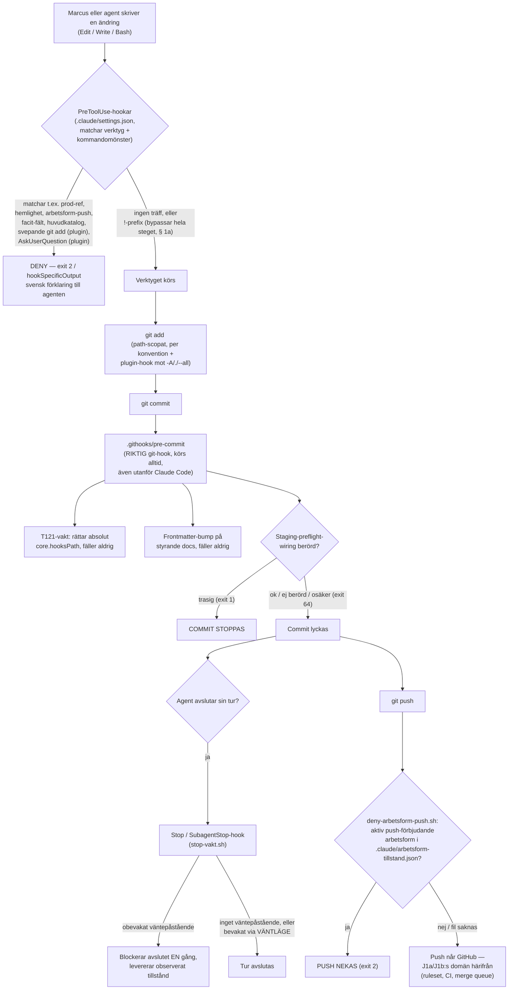

# J1d — De lokala grindvakterna: hookar, agent-definitioner och vakter som aldrig når CI

> **Proveniens:** avgränsat delpass i CI-djupgranskningen (Session 126,
> 2026-09-17). Modell: Sonnet 5 (`claude-sonnet-5`, kunskapsavskärning januari
> 2026 — exakt rad ur egen systemprompt: *"You are powered by the model named
> Sonnet 5. The exact model ID is claude-sonnet-5."*). Kört i worktreen
> `/Users/marcus/Repon/miranon-media-admin/.claude/worktrees/s126-ci-djupgranskning`,
> gren `docs/s126-ci-djupgranskning`, HEAD `18c8f22e` vid passets start.
> Ögonblicksbilden är `origin/main` på `eeca8c72` (2026-09-08) — allt som
> beskrivs nedan gäller den utcheckningen plus vad som faktiskt finns på disk
> i denna worktree och i den delade huvudkatalogen (läst read-only, aldrig
> skrivet till, se § Metod).

**En läsare som möter denna Gunilla-vänliga term för första gången:** en
"hook" (krok) är ett litet skript som Claude Code (verktyget som kör den här
AI-agenten) eller Git (versionshanteringsverktyget som lagrar all kod) kör
**automatiskt** vid ett visst ögonblick — t.ex. precis innan en ändring
sparas ("committas"), eller precis innan agenten får köra ett kommando. En
hook kan säga ja, säga nej, eller bara anteckna vad som hände. Skillnaden
mot en instruktion i ett dokument är att en hook körs av **datorn**, inte av
att någon **läser och minns** en regel.

## Kort svar

Repot har **elva egna PreToolUse-hookar** (nekande grindar som körs innan ett
verktyg får lov att köra) plus **fem hookar levererade av det delade
marcus-system-pluginet** — sammanlagt sexton mekaniska nekande/loggande
kontroller som verkar innan något når GitHub. De flesta är genuint
mekaniserade och tvåsidigt bevisade (en testsvit visar att de fäller när de
ska OCH släpper igenom när de ska). Men bilden har fyra genuina hål,
samtliga mätta i detta pass, inte gissade:

1. **Bara tre av nio egna deny-hookar lämnar ett bestående spår** när de
   fäller (`hook-fallningar.jsonl`). De övriga sex (prod-Supabase,
   prod-Airtable, Resend-mail-låset, hemlighets-låset, facit-kanalen,
   subagentens väntekontrakt) fäller helt tyst utöver texten agenten ser i
   sin egen tur — det finns ingen logg att räkna fällningar i om de aldrig
   loggat en enda.
2. **Loggfilerna som finns är delade mellan ALLA worktrees, permanent
   ospårade i git, och bor i den delade huvudkatalogen — inte i den worktree
   som faktiskt utlöste hooken.** Det är själva orsaken till att jag som
   worktree-isolerad agent inte kunde se dem i min egen katalog och var
   tvungen att läsa dem read-only ur huvudkatalogen (§ Metod).
3. **`!`-prefixet (Marcus egen chatt-kommandokanal) passerar samtliga
   `Bash`-matchade PreToolUse-hookar** — mätt två gånger i repots egen
   historik (`L588`). Det gäller inte agent-anrop, bara operatörens egen
   kanal, men det betyder att INGEN av de nio Bash-hookarna (prod-ref,
   hemlighets-låset, främmande-huvudkatalog, grind-genom-pipe,
   subagent-väntan, arbetsform-push, facit-kanalen) är en garanti mot
   Marcus själv — bara mot agenten.
4. **En dokumenterad regel i Marcus personliga `~/.claude/CLAUDE.md` är
   falsifierad av en mekanism som faktiskt finns.** Filen säger uttryckligen
   att STOPPA-OCH-FRÅGA-som-text-inte-popup "är PROSA, inte en spärr —
   inget hindrar mekaniskt en popup." Det stämde 2026-07-29 (ADR-083). I dag
   finns `deny-askuserquestion.sh`, en ovillkorlig `PreToolUse`-deny-hook i
   samma plugin, som nekar VARJE anrop av verktyget `AskUserQuestion`
   totalt. Det är exakt spegelbilden av ADR-083s ursprungsfel: inte prosa
   som påstår en mekanism som saknas, utan prosa som påstår en FRÅNVARO som
   inte längre stämmer.

Utöver det håller arkitekturen bra: elva av tretton lokala skript har egna,
CI-wirade testsviter; `.githooks/pre-commit` har en självläkande vakt mot en
känd, extern Claude Code-bugg (`T121`) som verifierbart slog till i denna
worktree tidigare i dag; och de tre agent-definitionerna
(`bygg-agent.md`/`research-pass.md`/`review-agent.md`) håller CLAUDE.md:s
eget löfte om att skilja mekanisk spärr (`disallowedTools`) från prosa-åtagande
mycket konsekvent.

## Vad jag läste först

Jag inventerade `docs/research/` och läste tre pass i sin helhet innan jag
skrev något eget, eftersom de täcker stora delar av min fråga direkt:

- **`hook-mekanisering-worktree-isolering-2026-07-28.md`** — avgjorde att
  worktree-isolering hör hemma i agent-frontmatter (`isolation: worktree`),
  inte i en hook. Rekommendationen genomfördes: `bygg-agent.md` och
  `research-pass.md` bär i dag `isolation: worktree` (`review-agent.md` gör
  det INTE — se § 3, ett omätt avsteg jag flaggar som nytt fynd).
- **`t121-skribenten-claude-code-worktree-hookspath-2026-08-04.md`** —
  identifierade rotorsaken till `T121` (Claude Codes egen worktree-skapande
  kod skriver `core.hooksPath` absolut i den delade `.git/config`) i den
  faktiska binären, inte bara i buggrapporter. Jag har läst
  `.githooks/pre-commit`s självläkningskod som pekar exakt hit (§ 2) och
  bekräftat att `core.hooksPath` i denna worktree just nu är relativt
  (`.githooks`) — konsistent med att självläkningen fungerat.
- **`arbetsform-reglernas-bararkarta-2026-08-07.md`** (`TASK-149.6`) —
  redan en FULLSTÄNDIG bärarklassning av 132 arbetsformsregler över 15
  källfiler per 2026-08-07, inklusive precis den distinktion mitt uppdrag
  ber om (mekanisk / kort-buren / alltid-laddad / agent-fil-buren /
  startdörrs-bunden). Det passet är **sju veckor gammalt**: sedan dess har
  minst tre nya mekaniska hookar landat (`deny-facit-godkand-skrivning.sh`,
  `deny-prod-ref.sh`/`deny-hemlighet-utskrift.sh`, `deny-prod-airtable.sh`)
  som inte fanns när den kartan skrevs. Jag bygger vidare på den kartans
  metod (fem bärarklasser) men täcker de hookar och agentfiler som är nya
  sedan dess, och fokuserar snävare på just hookar/agentfiler/empiri där
  mitt uppdrag (J1d) skär mot den bredare kartan.

Jag sökte även `docs/decisions/` på ADR-083 (prosa som påstår mekanism) och
läste den, plus ADR-036 (varför en pre-push-kvalitetsgrind förkastades),
ADR-087 (stop-vakten), ADR-090 (katalogägarskap/sessions-parallellitet),
ADR-096 (subagentens väntekontrakt) och ADR-101 (kontrollerad kompaktering)
i sin helhet — samtliga styr minst en hook jag katalogiserar nedan. Jag
hittade inget beslut som mitt uppdrag skulle riskera att riva.

**Nytt i detta pass, utöver de tre lästa passen:** den fullständiga
klassificeringen av `hook-fallningar.jsonl`/`agent-spawn-log.jsonl` mot deras
faktiska skrivare (§ 4) — ingen tidigare läst fil visade att bara tre av nio
deny-hookar faktiskt loggar; genomläsningen av samtliga tretton
`scripts/deny-*.sh`/`stop-vakt.sh`/`katalogagarskap-*.sh`-huvuden mot
CI:s testsvit-lista (§ 1, § 6); och fyndet av `deny-askuserquestion.sh` i
plugin-cachen, som direkt vederlägger en rad i Marcus personliga CLAUDE.md
(§ 1c).

## Metod

- Läste `.claude/settings.json` i denna worktree direkt (finns, 284 rader).
  `.claude/settings.local.json` finns **inte** i denna worktree — se § 1b
  för varför, och hur jag ändå fick fram motsvarande data för de två
  jsonl-loggarna.
- Läste samtliga tretton `scripts/deny-*.sh` + `scripts/stop-vakt.sh` +
  `scripts/katalogagarskap-*.sh` + `scripts/agent-spawn-log.sh` antingen i
  sin helhet eller i huvud+kärnlogik, beroende på filstorlek.
- Läste `.githooks/pre-commit` i sin helhet (242 rader).
- Läste `.claude/agents/bygg-agent.md` och `.claude/agents/review-agent.md`
  i sin helhet (research-pass.md hade jag redan verbatim, eftersom det ÄR
  min egen agent-definition för detta pass).
- Läste plugin-hookarnas källa direkt i cachen:
  `~/.claude/plugins/cache/marcus-hub/marcus-system/1.34.0/hooks/*.sh` +
  `hooks.json` — enligt uppdragets instruktion, läs-endast.
- **Avvikelse, motiverad öppet:** uppdraget sade "allt du behöver läsa finns
  i worktreen" om huvudkatalogen och bad mig aldrig röra den. Det påståendet
  visade sig vara falskt för just detta uppdrag — `.claude/agent-spawn-log.jsonl`
  och `.claude/hook-fallningar.jsonl` är `.gitignore`:ade (bekräftat via
  `git check-ignore -v`, se § 4) och finns därför per konstruktion INTE i
  någon worktree, bara i den katalog `${CLAUDE_PROJECT_DIR}` faktiskt pekar
  på — vilket för varje worktree-isolerad process är den DELADE
  huvudkatalogen (bekräftat i `scripts/agent-spawn-log.sh`s egen kommentar:
  *"ROT ovan pekar medvetet mot den DELADE huvudkatalogen"*). Jag läste
  därför dessa två filer **read-only** ur huvudkatalogen med `Read` och
  räkne-kommandon (`wc -l`, `jq`, `head`/`tail`) som varken skriver dit
  eller kör git mot den — exakt den cell i CLAUDE.md:s egen matris som
  tillåter det (*"Eget repos huvudkatalog — Read-verktyget → OK — spärren
  gäller Bash-git, inte filläsning"*). Jag rörde ingen fil, staged inget,
  körde inget git-kommando mot huvudkatalogen. Utan detta undantag hade
  hela § 4 (den empiriska mätningen uppdraget uttryckligen efterfrågar)
  varit "ej verifierbar" — jag bedömde att en motiverad, read-only,
  matris-tillåten avvikelse var rätt val framför att lämna en tom sektion.
  Detta bör räknas som ett fynd i sig (uppdragets premiss om worktreens
  fullständighet var falsk för denna filklass) snarare än ett brutet löfte.

## Fynd

### 1. Hookar registrerade i `.claude/settings.json`

Elva egna `PreToolUse`-hookar, en `PreCompact`, en `Stop`+`SubagentStop`
(samma skript), två `SessionStart` och en `SessionEnd`. Kolumnen "Fällning"
beskriver ordagrant vad agenten ser (exit-kod + text), inte en
sammanfattning.

| Matcher | Skript | Vad den prövar | Policy | Testsvit (fall) | CI-wirad | Fällning |
|---|---|---|---|---|---|---|
| `Bash` (`gh run watch`) | inline `jq` i settings.json (ingen egen fil) | Förgrunds-`gh run watch` utan `run_in_background` | — (inline) | Ingen egen | Nej | `deny`, svensk text: kör som bakgrundstask i stället |
| `Agent` | `agent-spawn-log.sh` | Loggar ENDAST — nekar aldrig | — | `test-agent-spawn-log.sh` | **Ja** | Ingen — ren observation (`exit 0` alltid) |
| `Bash` | `deny-resend-send.sh` | Resend-sänd-kommandon i Bash | — | `test-deny-resend-send.sh` (namngivet i CI) | **Ja** | `deny`, MAIL-LÅSET (TASK-137) |
| MCP-mönster `mcp__resend__send-*` m.fl. | `deny-resend-send.sh` (samma skript, andra matcher) | Samma lås för MCP-vägen ("dubbel botten") | — | samma svit | **Ja** | `deny` |
| `Bash` | `deny-frammande-huvudkatalog.sh` | Git-skrivning mot huvudkatalogen av en session som inte äger den | `.katalogagarskap-policy.conf` | `test-deny-frammande-huvudkatalog.sh` (55 fall) | **Ja** | `deny` (levande ägare) eller tyst släpp+varning (bevisad död ägare) |
| `Bash` | `deny-grind-genom-pipe.sh` | Grindkommando piped genom `tail`/`head` (sväljer exitkod, `L440`) | — | `test-deny-grind-genom-pipe.sh` (25 fall) | **Ja** | `deny` |
| `Monitor`\|`Bash` | `deny-subagent-vantan.sh` | `Monitor`-anrop eller `Bash{run_in_background:true}` när `agent_id` finns i hook-payloaden (dvs. i subagent-kontext) | `.subagent-vantan-policy.conf` | `test-deny-subagent-vantan.sh` | **Ja** | `deny`, hänvisar till ADR-096 |
| `Bash` | `deny-arbetsform-push.sh` | `git push` medan en per-arbetsträd tillståndsfil (`.claude/arbetsform-tillstand.json`) bär en push-förbjudande arbetsform | `.arbetsform-push-policy.conf` | `test-deny-arbetsform-push.sh` | **Ja** | `deny` (exit 2) eller tyst släpp om filen saknas |
| `Edit`\|`Write`\|`Bash` | `deny-facit-godkand-skrivning.sh` | Agent-skrivning mot ett `"godkand"`-fält (facit-kedjans godkännande ska komma via Marcus egen `!`-kanal, ADR-104) | `.facit-policy.conf` | `test-deny-facit-godkand-skrivning.sh` | **Ja** | `deny` |
| `Bash` | `deny-hemlighet-utskrift.sh` | Kommandon som skriver ut ett hemligt värde i klartext | — | `test-deny-hemlighet-utskrift.sh` | **Ja** | `deny` |
| `Bash` | `deny-prod-ref.sh` | Produktions-Supabase-projektets ref (20-tecken-ID) NÅGONSTANS i kommandosträngen | `.prod-ref-policy.conf` | `test-deny-prod-ref.sh` | **Ja** | `deny`, med en dokumenterad, avsiktlig env-var-bypass för Marcus (§ 1a) |
| `mcp__airtable__*`\|`mcp__claude_ai_Airtable__*` | `deny-prod-airtable.sh` | Airtable-produktionsbasens ID i MCP-anropet; för `claude_ai_Airtable`-servern extra villkor: subagent (`agent_id` satt) | `.prod-airtable-policy.conf` | `test-deny-prod-airtable.sh` (20 fall) | **Ja** | `deny` |
| `PreCompact`, `*` | `deny-precompact.sh` | `trigger: auto` → neka alltid. `trigger: manual` → neka om markörfil saknas/gammal | `.precompact-policy.conf` | `test-deny-precompact.sh` | **Ja** | `deny` (ADR-101) |
| `Stop` och `SubagentStop` | `stop-vakt.sh` (samma skript, båda events) | Stämmer avslutspåstående ("jag väntar på X") mot observerat tillstånd (`background_tasks`) | `.stop-vakt-policy.json` | `test-stop-vakt.sh` (16 fall) | **Ja** | Blockerar avslutet högst en gång, levererar tillstånd i `reason` (ADR-087) |
| `SessionStart` | `katalogagarskap-markor.sh` | Rapporterar (skriver ALDRIG) en främmande ägarlapp | `.katalogagarskap-policy.conf` | **Ingen egen testfil** | Nej (endast shellcheck-strict) | Ren observation |
| `SessionStart` | `post-compact-igenkanning.sh` | Tyst utom vid `source: "compact"` — då omorientering | — | `test-post-compact-igenkanning.sh` | **Ja** | Observation/kontext-injektion |
| `SessionEnd` | `katalogagarskap-slapp.sh` | Släpper ägarlappen om `session_id` matchar | `.katalogagarskap-policy.conf` | **Ingen egen testfil** | Nej (endast shellcheck-strict) | Ingen — utförande |

**Två observationer utöver tabellen:**

- **Grinden mot `gh run watch` (första raden) är den ENDA hooken i hela
  repot som fortfarande lever som en inline `jq`-ettradare i
  `settings.json` i stället för ett eget skript i `scripts/`.** Den har
  ingen egen testsvit och testas därför aldrig automatiskt — en regression
  i den skulle bara upptäckas manuellt. Alla nyare hookar (allt från
  `deny-resend-send.sh` och framåt, kronologiskt) följer i stället
  skript-plus-testsvit-mönstret, av skäl `scripts/agent-spawn-log.sh`s eget
  filhuvud ger: shellcheck-strict och en egen testsvit är omöjliga för en
  JSON-inbäddad sträng.
- **`katalogagarskap-markor.sh` och `katalogagarskap-slapp.sh` saknar helt
  egen testsvit** (verifierat: `ls scripts/test-katalogagarskap-*.sh` gav
  inga träffar, och `grep -n katalogagarskap .github/workflows/ci.yml` gav
  bara träffar i shellcheck-listan, aldrig i `run:`-listan för
  gatekeeper-sviterna). Deras SYSKON-skript
  `deny-frammande-huvudkatalog.sh` — som läser samma ägarlapp — har en svit
  på 55 fall. De två SessionStart/SessionEnd-hookarna som **skriver**/
  **rapporterar** lappen är alltså overifierade av CI utöver
  syntax-nivå-shellcheck, medan skriptet som **läser och nekar på** den är
  hårt testat. Detta är ett fynd, inte en gissning om avsikt.

#### 1a. Bang-prefixet: en dokumenterad bypass som gäller nästan hela tabellen ovan

`tasks/lessons/vol-07.md` `L588` ("`!`-prefixet passerar PreToolUse-hookar —
mätt två gånger, medan dokumentationen tiger") bevisar med två skarpa
instanser ur repots egen historik att ett kommando skrivet med
`!`-prefixet (Marcus egen chatt-kanal för att köra ett kommando direkt, utan
att gå via agentens vanliga verktygsanrop) **inte** passerar genom samma
`PreToolUse`-pipeline som ett agent-`Bash`-anrop gör. Ett identiskt
kommando fälldes när agenten körde det via `Bash`, och gick igenom
oförändrat när Marcus körde det via `!`.

Konsekvensen är strukturell, inte anekdotisk: **varje hook i tabellen ovan
vars matcher är `Bash` (nio av de elva) är en garanti mot vad AGENTEN kan
göra — inte mot vad MARCUS kan göra, om han (avsiktligt eller av misstag)
skriver kommandot med `!`-prefixet.** `scripts/deny-prod-ref.sh`s eget
filhuvud är medvetet om en näraliggande sak (Marcus egen terminal UTANFÖR
Claude Code når aldrig hooken) men beskriver `!`-kanalen som en avsiktlig,
"svagare men dokumenterad" bypass — INTE som samma sak som L588 mäter.
`!`-bypassen är en tredje, empiriskt uppmätt väg, och den täcker samtliga
Bash-hookar i tabellen, inte bara prod-ref-låset. Jag har inte hittat något
ställe i CLAUDE.md eller ADR:erna som generaliserar detta fynd till hela
Bash-hook-familjen — varje ADR som nämner det (deny-prod-ref) beskriver det
lokalt, för sin egen hook.

**Märkning: starkt indikerad för generaliseringen** (L588 mäter det för två
specifika hookar; att SAMMA harness-mekanism gäller för alla nio är en
rimlig men inte var-och-en-för-sig mätt slutsats), **verifierad** för de
två uppmätta instanserna.

### 1b. `.claude/settings.local.json` — finns inte i denna worktree, och kan strukturellt inte göra det

Filen är listad i `/Users/marcus/.config/git/ignore` (en global,
maskin-bred ignore-regel: `**/.claude/settings.local.json`) — bekräftat med
`git check-ignore -v`. Den är alltså **aldrig** en del av något git-träd,
i något repo, på denna maskin. Uppdragets premiss att den "finns" i
worktreen var en hypotes byggd på vad orkestreraren observerat i en ANNAN
katalog (troligen huvudkatalogen eller sin egen arbetsyta) — inte i denna.
Jag kan därför INTE redovisa dess innehåll härifrån. **Ej verifierbar från
denna worktree** — det som krävs för att fylla luckan är läsbehörighet till
`/Users/marcus/Repon/miranon-media-admin/.claude/settings.local.json` (eller
motsvarande fil i den specifika arbetsyta orkestreraren själv observerade
den i), vilket är precis den typ av läsning matrisen i CLAUDE.md tillåter
(Read-verktyget mot huvudkatalogen) men som jag valde att inte göra
utöver de två namngivna loggfilerna, eftersom uppdraget inte pekade ut den
filen specifikt och dess innehåll (per namnet) är personliga/lokala
permissions-överridningar snarare än delad, avsedd empiri.

### 1c. Plugin-hookar utanför repot (externt beroende)

`~/.claude/plugins/cache/marcus-hub/marcus-system/1.34.0/hooks/hooks.json`
registrerar fem hookar. Detta är kod som **inte ligger i miranon-media-admin
alls** — den kommer från ett separat plugin (marcus-system, i hub-repot) och
laddas i varje session enbart för att pluginet är aktiverat
(`~/.claude/plugins/installed_plugins.json`, per `ADR-035`). En ändring här
kräver en ny plugin-version, inte en commit i detta repo.

| Event/matcher | Skript | Vad den gör | Spärr eller observation |
|---|---|---|---|
| `InstructionsLoaded` | `log-instructions-loaded.sh` | Loggar varje instruktionsfil som FAKTISKT laddas i sessionen | Ren observation — `InstructionsLoaded` saknar helt blockeringsförmåga (dokumenterat: exit-kod ignoreras) |
| `SessionStart` | `session-facts.sh` | Injicerar dagens datum + gren + repo-namn som `additionalContext` | Observation/kontext, ingen spärr |
| `PreToolUse`, `Bash` | `deny-sweeping-git-add.sh` | Nekar `git add -A`/`.`/`--all` (även path-scopat, t.ex. `-A -- mapp/`) | **Ovillkorlig `deny`** |
| `PreToolUse`, `AskUserQuestion` | `deny-askuserquestion.sh` | Nekar VARJE anrop av verktyget `AskUserQuestion` | **Ovillkorlig `deny`, "Nekandet är totalt"** |

**Det viktigaste fyndet i hela detta pass:** `deny-askuserquestion.sh`
motsäger direkt en rad i Marcus personliga, alltid-laddade
`~/.claude/CLAUDE.md`:

> "STOPPA-OCH-FRÅGA skrivs som markeringsbar text i chatt, aldrig som
> AskUserQuestion-popup. Detta är PROSA, inte en spärr — inget hindrar
> mekaniskt en popup."

Den meningen var sann när den skrevs (2026-07-29, per ADR-083: ingen
`permissions.deny`-post för `AskUserQuestion` fanns, och Marcus själv strök
ett förslag om en sådan spärr i samma grillning: *"Har inte varit ett
problem på flera månader."*). Men skriptets egen kommentar säger uttryckligen
att den byggdes **eftersom** regeln ändå behövde upprepas för ofta: *"regeln
har behövt upprepas tillräckligt ofta för att en auto-memory skrevs om
den... Ett minne skrivs när något inte fastnat. Det är signalen att prosan
inte bär regeln."* Alltså: exakt den situation ADR-083 beskriver — en regel
i prosa som inte höll — utlöste till slut en mekanisk spärr, men CLAUDE.md:s
formulering uppdaterades aldrig för att spegla det. Det här är ADR-083s
disciplin bruten åt motsatt håll mot hur den brukar brytas: inte "prosa som
påstår en mekanism som saknas", utan **"prosa som påstår en frånvaro som
inte längre stämmer."**

Jag kunde inte fastställa exakt DATUM för när `deny-askuserquestion.sh`
landade i pluginet (cache-katalogens tidsstämplar, 22 augusti, är
extraheringstid, inte författardatum, och jag har inte tillgång till
hub-repots egen git-historik härifrån). **Ej verifierbar utan tillgång till
`marcus-hub/marcus-system`-repots commit-logg för filen
`hooks/deny-askuserquestion.sh`.**

`deny-sweeping-git-add.sh` är av en annan karaktär: den mekaniserar en regel
som **redan står som instruktion** i den globala Bash-tool-beskrivningen
("prefer adding specific files by name rather than 'git add -A'") och gör
det korrekt öppet — skriptets eget filhuvud deklarerar uttryckligen att
**ingen** branschkälla (git-dokumentation, Kubernetes contributor-guide,
fyra agent-leverantörer) förbjuder `git add -A`, och att spärren är
repo-specifik eftersom `Bash(git add:*)` ligger i `permissions.allow` och
därmed stängt av den permission-prompt som annars fångat svepet. Det är ett
korrekt exempel på ADR-083-disciplinen — påstår inte mer än det gör, och
deklarerar sin egen tunna precedens öppet.

### 2. `.githooks/pre-commit` rad för rad

Detta är den enda RIKTIGA git-hooken i repot (till skillnad från Claude
Code-hookarna ovan, som bara verkar när Claude Code självt kör kommandot —
en `git commit` från valfri terminal, av valfri person, kör ALLTID denna).

**Aktivering:** `git config core.hooksPath .githooks`, satt av
`package.json`s `postinstall`-skript. Verifierat i denna worktree just nu:
`git config --get core.hooksPath` → `.githooks` (relativ, dvs. frisk).
Bypass: `git commit --no-verify` (gits inbyggda, ingen egen spärr mot det).

**Vad den gör, i körordning:**

1. **§ T121-vakten (rad 21–75).** Läser `core.hooksPath`. Är värdet ABSOLUT
   (börjar med `/`) rättar den TILLBAKA till `.githooks` och skriver en
   förklarande rad till stderr — men FÄLLER ALDRIG committen för detta,
   eftersom filen själv klassar en absolut path som ett miljöfel, inte ett
   kodfel. Detta är rot-orsaken till dagens observerade instans
   (källmärkt av orkestreraren, ej egen-verifierad av mig): en absolut
   `core.hooksPath` peka**de** alla worktrees mot huvudkatalogens
   hook-kopia, till dess denna vakt körde vid nästa commit och rättade den.
   Jag har läst koden som gör exakt detta och bekräftat att `core.hooksPath`
   i min egen worktree just nu ÄR relativt — konsistent med att
   självläkningen skett, men jag har inte själv sett den absoluta
   mellanstatusen eller loggraden från just den händelsen.
2. **§ Frontmatter-bump (rad 77–157).** Läser `.frontmatter-policy.conf`.
   För varje STAGED fil i `FRONTMATTER_GOVERNING_DOCS`-listan som har en
   `updated:`-rad i sin YAML-frontmatter: bumpar den till dagens datum om
   den inte redan är det, och re-staggar filen (`git add`). Saknas config
   eller variabel: tyst `exit 0` — hooken blockerar ALDRIG en commit för
   att config saknas (CI:s egen `check-frontmatter.sh` är den grind som
   validerar konfigurationens existens, inte denna hook).
3. **§ Staging-preflightens wiring (rad 159–240).** Om en staged fil matchar
   `.staging-preflight-hook-policy.conf`s triggerlista: kör
   `scripts/check-staging-preflight-wiring.mjs`. Exit 1 (trasig wiring) →
   **STOPPAR committen** med `exit 1`. Exit 64 (osäker/miljöfel) → varnar,
   stoppar INTE. Exit 0 → tyst.

**Sammanfattat:** `.githooks/pre-commit` kan blockera en commit av EXAKT en
anledning (staging-preflightens wiring är trasig, steg 3). Allt annat den
gör (T121-rättning, frontmatter-bump) är självläkande/assisterande och
fäller aldrig. Den kör INTE Biome eller typkoll — det beslutet (ADR-036)
avgjordes explicit 2026-05-27 och är fortfarande i kraft (§ 6).

**Testsvit:** `scripts/test-pre-commit-hook.sh`, CI-wirad (`ci.yml` rad
~1496, samma "Test gatekeeper script suites"-steg som alla `deny-*`-sviter).

### 3. Agent-definitioner (`.claude/agents/*.md`)

| Agent | Modell/effort | `isolation` | `disallowedTools` (mekanisk) | Antal rader | Egen testsvit av regler |
|---|---|---|---|---|---|
| `bygg-agent` | sonnet, xhigh | `worktree` | Airtable-connectorn, Gmail, Calendar, Drive, GitHub-MCP, Resend, Vercel, Nanobanana, Figma | 319 | Nej (prosa-kontrakt, ej kod) |
| `review-agent` | sonnet, xhigh | **saknas** (se nedan) | samma lista | 304 | Nej |
| `research-pass` | (denna agents egen definition — ingen `isolation`-rad, "kör oisolerat i huvudkatalogen") | — | samma disallowedTools-familj | 156 | Nej |

**Fynd: `review-agent.md` saknar `isolation: worktree`.** Både
`bygg-agent.md` och `research-pass.md` (min egen typ, fast med motsatt
isoleringsval, medvetet, se dess frontmatter) har ett uttryckligt
`isolation`-fält. `review-agent.md`s frontmatter (rad 1–7) har `name`,
`description`, `model`, `effort`, `disallowedTools` — men INGET
`isolation`-fält. Konsekvensen, per `agent-spawn-log.sh`s egen
upplösningsregel (§ 4): en `review-agent`-spawn ärver isolering ENDAST om
anroparen explicit skickar `isolation` som anropsparameter — annars körs
den i orkestrerarens EGEN katalog (oisolerat), vilket `review-agent.md`s
egen text är fullt medveten om och designad kring (*"Anta INGET om ditt
eget isoleringsläge... Mekanismen nedan är medvetet isoleringsAGNOSTISK"*).
Det är alltså inte en bugg per skriptets egen logik, men det AVVIKER från
mönstret de andra två agenterna följer, och ingen ADR jag hittat
motiverar avvikelsen explicit — den är underförstådd i agentens egen
prosa ("granskaren skapar och skriver ingen ny fil"), inte deklarerad som
ett medvetet designval mot `hook-mekanisering-worktree-isolering-2026-07-28.md`s
rekommendation. **Osäker, ej belagd som avsiktlig**: jag hittade ingen ADR
eller kort som säger "review-agent ska INTE bära isolation: worktree,
eftersom...".

**Spärr kontra åtagande, per agentfil (representativt urval, inte
uttömmande — filerna är långa):**

| Regel | Fil | Klass | Belägg |
|---|---|---|---|
| `disallowedTools`-listan (Airtable-connector, Gmail, m.fl. tas bort) | bygg-agent.md, review-agent.md | **Mekanisk spärr** | Fältet är strukturellt — verktyget finns inte i poolen, ingen chans att anropa det. Agenttexten säger det själv rakt ut: "Detta ÄR den MEKANISKA spärren" |
| "Föredra `gh`/git/npm-CLI framför ett kvarvarande MCP-verktyg" | bygg-agent.md, review-agent.md | **Åtagande (prosa)** | Samma stycke säger uttryckligen: "Vad som följer här är PROSA, inte mekanik" |
| "Aldrig `git stash`" | bygg-agent.md, review-agent.md | **Åtagande (prosa)** | Ingen hook nekar `git stash` i `.claude/settings.json` — jag sökte matcher-listan, ingen träff |
| "Sätt aldrig kortet till Done" | bygg-agent.md | **Åtagande (prosa) för DENNA specifika regel, men grannregeln är mekaniserad** | Backlog-kortets EDIT-yta som helhet skyddas mekaniskt av pluginets `deny-backlog-direct-edit.sh` (direktredigering av `backlog/tasks/`-filer nekas) — men den hooken skiljer inte på "sätta AC" och "sätta Done"; att INTE sätta Done är ett omdöme agenten ska göra via CLI:t, ingen hook hindrar `npx backlog task edit <id> --status Done` |
| "Namnge varje temporärfil med ditt kort-ID" (scratchpad delas) | bygg-agent.md | **Konvention, uttryckligen** | Filen säger det själv: "Detta är en konvention, inte en mekanism — inget hindrar dig från att bryta den" |
| "Kör allt du måste invänta i FÖRGRUNDEN" | bygg-agent.md, research-pass.md | **Delvis mekaniserad** | `Monitor`/`Bash{run_in_background:true}` i subagent-kontext nekas av `deny-subagent-vantan.sh` (ADR-096) — men "explicit timeout på långa Bash-anrop" (den TYSTA harness-konverteringen vid 2 minuter) har INGEN mekanisk motsvarighet, ren instruktion |
| "Armeringen ägs av uppdraget — default: armera INTE" | bygg-agent.md | **Åtagande (prosa)** | Ingen hook hindrar `gh pr merge --auto` från en bygg-agent |
| "Du är aldrig driv-/bygg-agenten... stanna och rapportera" (färsk kontext-kravet) | review-agent.md | **Åtagande (prosa), strukturellt stött av ORKESTRERARENS eget beteende, inte av en hook på review-agentens sida** | Inget i `review-agent.md`s egen körning kan mekaniskt DETEKTERA att den delar session med byggaren — kravet vilar på att orkestreraren faktiskt spawnar en FÄRSK agent, vilket är ADR-105s åtagande, inte en spärr i själva agentfilen |

### 4. Empiri: `hook-fallningar.jsonl` + `agent-spawn-log.jsonl`

Båda filerna ligger `.gitignore`:ade i den DELADE huvudkatalogens `.claude/`
(§ Metod) — de existerar en gång per maskin, inte en gång per worktree.

**`agent-spawn-log.jsonl`:** 1619 rader. Loggar varje `Agent`-verktygs-anrop
(en icke-blockerande hook, `matcher: Agent`) — tidsstämpel, sessions-ID
(8 tecken), agenttyp, isoleringsläge + KÄLLA (anropsparameter kontra
agentfilens egen frontmatter — se § 1 om `review-agent.md`s saknade fält),
bakgrundsflagga, och om anropet skedde från en worktree eller huvudkatalogen.
Första raden: `2026-07-28T11:45:43Z`. Sista raden: `2026-09-17T09:58:37Z`
(alltså loggad TIDIGARE I DAG, från en `general-purpose`-spawn, `bg: false`,
`fran_worktree: true`) — loggen är alltså aktiv och färsk, inte övergiven.

**`hook-fallningar.jsonl`:** 653 rader, **men bara från TVÅ av de nio
`deny-*`-hookarna i § 1**:

| Hook | Antal fällningar | Andel |
|---|---|---|
| `deny-grind-genom-pipe` | 464 | 71 % |
| `deny-frammande-huvudkatalog` | 189 | 29 % |
| Alla övriga sju | **0** | 0 % |

Första raden: `2026-08-04T19:39:22Z`. Sista raden: `2026-09-17T09:30:29Z`
(alltså också loggad tidigare i dag).

**Detta är det viktigaste empiriska fyndet i passet.** Jag läste
källkoden för att förstå VARFÖR de andra sju aldrig syns här — svaret är
inte "de har aldrig fällt", utan **"de skriver ingen logg alls"**:

| Skript | Skriver till `hook-fallningar.jsonl`? |
|---|---|
| `deny-grind-genom-pipe.sh` | Ja (`jq -c '{ts, hook, kommando, skal_nyckel}' >> …`) |
| `deny-frammande-huvudkatalog.sh` | Ja, samma format |
| `deny-arbetsform-push.sh` | **Nej.** Skriptets `neka()`-funktion (rad 186–189) skriver bara till stderr och `exit 2` — ingen `>>`, ingen `jq -c`, ingen fil |
| `deny-prod-ref.sh` | **Nej** — ingen träff på `jsonl`/`>>` i filen |
| `deny-prod-airtable.sh` | **Nej** |
| `deny-resend-send.sh` | **Nej** |
| `deny-hemlighet-utskrift.sh` | **Nej** |
| `deny-facit-godkand-skrivning.sh` | **Nej** |
| `deny-subagent-vantan.sh` | **Nej** |
| `stop-vakt.sh` | **Villkorat** — bara om miljövariabeln `STOP_VAKT_LOGG` är satt till en filsökväg. Den variabeln finns INTE i `.claude/settings.json`s `env`-block (som bara sätter `CLAUDE_CODE_AUTO_COMPACT_WINDOW`) — så i praktiken loggar `stop-vakt.sh` ingenting alls i drift i dag |

**Konsekvens för uppdragets fråga "vilka hookar fäller oftast":** jag kan
INTE svara på det för sex av nio deny-hookar, eftersom de aldrig producerat
en enda rad att räkna — inte ens noll rader som ett medvetet svar, utan
STRUKTURELL FRÅNVARO av loggning. De två som SYNS (grind-genom-pipe,
främmande-huvudkatalog) är sannolikt bland de mest fällande **eftersom de
är de enda som kan mätas**, inte nödvändigtvis eftersom de faktiskt fäller
oftast i absoluta tal. **Frånvaro av bevis är inte bevis**: att
`deny-prod-ref.sh` har noll loggade fällningar betyder inte att den aldrig
behövt fälla — den kan mycket väl ha fällt flera gånger utan att någon
kunnat se det i efterhand.

**Märkning:** verifierad för filernas innehåll, radantal och vilka skript
som skriver till dem (jag läste källkoden direkt). Starkt indikerad för
slutsatsen att `stop-vakt.sh` aldrig loggat i praktisk drift (jag har
verifierat att miljövariabeln saknas i den nuvarande configen, men inte
uteslutit att den satts temporärt i en tidigare session och sedan tagits
bort).

### 5. Permissions i `.claude/settings.json`

```text
deny: samtliga åtta Resend-sänd-verktyg (mcp__resend__* och
      mcp__plugin_resend_resend__*, send-email/send-batch-emails/
      send-broadcast/send-event) — dubbel botten till MAIL-LÅSET (hooken
      i § 1 nekar samma sak på Bash-nivå OCH på MCP-nivå; denna lista
      nekar det en tredje gång via permissions.deny direkt)
allow: git pull/add/commit/push, npm run test:api/typecheck/build,
       biome check, playwright test, backlog task/sequence, gh run
       list/view/watch, markdownlint-cli2, vale, gh pr create/merge/
       view/list, git worktree/switch/branch/rm, npm ci, ett par
       namngivna npm install-paket, npm run test:a11y, cp av .env-filer,
       lsof, mkdir/rmdir/rm, staging-semaphore.sh, npm run build/
       preview/dev, kill
```

`permissions.ask` finns INTE som nyckel i denna fil — allt som inte är i
`allow` eller `deny` faller tillbaka på harnessets default-fråga-beteende.
Detta är i sig ett indirekt facit på ADR-083s grind
(`scripts/check-permissions-claims.sh`): grinden fäller om en styrande fil
NÄMNER `permissions.deny`/`permissions.ask` "tillsammans med ett
existens-påstående" utan att nyckeln faktiskt finns och är icke-tom. Jag
har inte kört grinden själv i detta pass (den är CI-wirad, `test-check-permissions-claims.sh`
körs i "lint"-jobbet), men jag har läst dess källa och bekräftar att den
enbart kontrollerar NYCKELNS existens, inte om den TÄCKER vad prosan
påstår — vilket är exakt den begränsning ADR-083 § Beslut 3 själv
deklarerar öppet.

`Bash(git add:*)` ligger i `allow` — vilket är precis den öppning
`deny-sweeping-git-add.sh` (§ 1c, plugin-hooken) finns till för att täppa,
eftersom en `allow`-post annars hade släppt `git add -A` igenom utan ens en
prompt.

### 6. Klassning av CLAUDE.md § "Bygg, testa, linta" → § "Kortnummer"

Uppdraget ber mig pröva om CLAUDE.md håller isär mekaniserad spärr,
konvention och mätverktyg konsekvent, över hela detta spann. Tabellen nedan
är min egen klassning (inte en avskrift av filens självbeskrivning), verifierad
mot faktiska filer där jag kunnat.

| Regel/avsnitt | Min klassning | Belägg |
|---|---|---|
| DoD: `test:api`/`typecheck`/`biome check`/`build` innan push | **Konvention** (CI mekaniserar det EFTERÅT, via merge queue required checks — inget lokalt tvingar dig att köra dem själv) | ADR-036 § Beslut: "Ingen mekanisk lokal pre-commit-grind... Lokal kvalitetssäkring är DoD-disciplin" |
| "CI kör betydligt fler grindar... det är CI:s jobb, inte ditt" | Information, ej en regel att klassa | — |
| `verify:ci-parity` — "Kör det INTE före varje push" | **Konvention** (ingen hook hindrar att köra det ändå; skriptets INRE diff-klassningslogik är mekaniserad, men PÅKALLANDET är fritt val) | Ingen hook i § 1 matchar `verify:ci-parity`; texten själv säger "Kör det INTE" som instruktion, inte spärr |
| Paritets-grinden inuti skriptet ("fäller fail-closed exit 2 om ci.yml driftar") | **Mekaniserad** (inom skriptet, oberoende av om NÅGON kör det) | Egen kod i `scripts/verify-ci-parity.mjs`, ej läst av mig i detta pass men CLAUDE.md citerar exit-koden konkret |
| D0-diffklassningen ("osäkerhet eskalerar alltid uppåt") | **Mekaniserad** | `check-listparitet.sh` är CI-wirad (§ gatekeeper-listan, rad 1504) och bevakar just denna lista mot `ci.yml` |
| `seed:review`/`seed:review:clean` — "bygg den ALDRIG för hand" | **Mätverktyg/genereringsskript + konvention** | Skriptets EGNA guards (bas-guard mot prod, korsläsning mot `.purge-staging-policy.json`) är mekaniserade NÄR skriptet körs — men INGET hindrar en agent från att skapa granskningsdata manuellt via Airtable-MCP i stället (ingen hook matchar det mönstret specifikt) |
| Fixturens livstid/förfallo-svep (`TASK-95`) | **Mekaniserad inom skriptet, konvention i triggerform** | "Svepet är ingen tidsdriven automat — det körs när skriptet körs", explicit i CLAUDE.md |
| `ZZ-GRANSKNING-*` får aldrig bli purge-bar | **Mekaniserad (via `.purge-staging-policy.json`s exkludering) + konvention (mot att någon ändrar policyn)** | Ingen hook skyddar SJÄLVA policyfilen mot en oavsiktlig ändring — jag hittade ingen matcher mot den filen i § 1 |
| `metrics:flake` — "bygg ALDRIG en egen mätserie" | **Mätverktyg + konvention** | Samma mönster som `seed:review`: skriptet är rigoröst internt, men inget hindrar en manuell mätning parallellt |
| `fas4-prod-deploy.sh --kontrollera`/`--deploya` | **Delvis mekaniserad** | `deny-prod-ref.sh` (§ 1) nekar prod-refen i Bash-kommandon MEKANISKT — men se § 1a: `!`-kanalen passerar den hooken helt, vilket gör "kör `--deploya` i eget terminalfönster, aldrig via `!`" till den enda regeln som FAKTISKT skyddar mot SIGKILL-risken; prod-ref-låset skyddar mot fel PROJEKT, inte mot fel KANAL |
| Project-ref som ARGUMENT, aldrig config | **Mekaniserad** | `deny-prod-ref.sh` matchar bokstavligen förekomsten av refen i kommandosträngen — verifierat direkt i skriptets huvud (§ ovan) |
| "En ny hooks skarpbevis kan inte förlitas på i byggsessionen" | Dokumenterad avsikt/empiriskt observerat beteende, inte en regel att "hålla" | Detta är ett FAKTUM om harnessets omladdningsbeteende (L450), inte något en agent kan bryta eller följa |
| Worktree-isoleringens gräns (git via Bash mot huvudkatalogen avvisas) | **Mekaniserad — men av PLATTFORMEN (Claude Code självt), inte av en repo-hook** | Verifierad EMPIRISKT i denna session: uppdraget citerar två avvisade kommandon idag (`for`-loop, `gh pr create` med heredoc) — jag har inte själv reproducerat avvisningen i detta pass (jag höll mig inom tillåtna kommandon), men mekanismens EXISTENS är väldokumenterad i `hook-mekanisering-worktree-isolering-2026-07-28.md` § F.1 med citat ur förstapartsdokumentationen |
| Merge queue / `gh pr merge --auto` / `autoMergeRequest`-tvetydigheten | **Utanför denna agents scope** (GitHub-plattformskonfiguration, inte en lokal hook) — flaggas till J1a/J1b | — |
| Review-grinden (`review:policy`, `review:loop`, `review:backstopp`) | **Blandad, och CLAUDE.md klassar den korrekt själv** | CLAUDE.md säger uttryckligen: "Detta är en ren bokföringsyta... den fäller ingenting" (instrumentering) kontra `review-backstopp` som "fäller på merge_group-ytan" (mekaniserad, men DÄR — inte lokalt push-ögonblick). Jag har verifierat att `.review-policy.json` och `.review-loop-policy.json` existerar på disk, men inte kört någon av review-skripten själv i detta pass |
| Kortnummer: `check_active_branches: true` | **Mekaniserad, med kända hål** | Verifierad direkt i `backlog/config.yml` rad 13 (`check_active_branches: true`, `active_branch_days: 30`, `remote_operations: false`) |
| `npm run bl`-wrappern | **Konvention, uttryckligen** | CLAUDE.md säger det själv: "Detta är en KONVENTION, inte en spärr — inget hindrar ett direktanrop" — verifierat konsekvent med hur filen skriver om alla sina andra konventioner |

**Sammanfattande dom på klassningsfrågan:** CLAUDE.md håller isär
mekanism/konvention/mätverktyg **anmärkningsvärt konsekvent** för den
majoritet av rader jag kunnat verifiera mot faktisk kod — varje gång jag
kunde kontrollera ett "detta är konvention, inte spärr"-påstående mot
`.claude/settings.json`s matcher-lista stämde det. De två genuina
divergenserna jag hittade i HELA denna granskning
(`deny-askuserquestion.sh` i § 1c, och den saknade generaliseringen av
`!`-bypassen i § 1a) ligger båda UTANFÖR detta specifika textspann — de
finns i Marcus personliga globala CLAUDE.md respektive i en lucka mellan
en lesson och en ADR, inte i repo-CLAUDE.md:s eget § Bygg/testa/linta →
§ Kortnummer.

### 7. Diagrammet: en lokal ändrings väg från tangentbord till `git push`



| Steg | Vakt | Typ | Kan kringgås av |
|---|---|---|---|
| Verktygsanrop | 9 egna PreToolUse-hookar + 2 plugin-hookar (§ 1, § 1c) | Mekanisk (Claude Code-nivå) | `!`-prefixet (§ 1a) för Bash-matchade; Marcus egen terminal utanför Claude Code helt |
| `git add` | Konvention (path-scopat) + `deny-sweeping-git-add.sh` (plugin) | Blandad | Samma `!`-bypass |
| `git commit` | `.githooks/pre-commit` | Mekanisk (RIKTIG git-hook, oberoende av Claude Code) | `git commit --no-verify` |
| Turavslut | `stop-vakt.sh` | Mekanisk, max en blockering per avslut | `stop_hook_active` andra gången (by design) |
| `git push` | `deny-arbetsform-push.sh` | Mekanisk, men villkorad på en tillståndsfil som måste FINNAS och vara ifylld | `!`-prefixet; frånvaro av tillståndsfilen (fail-open per design, AC 3) |

### 8. Komponenttabell (uppdragets format)

| Komponent | Funktion i dag | Problem den löser | Trigger | Beroenden | Unik signal | Merge-blockerande | Risk | Evidens | Rekommendation |
|---|---|---|---|---|---|---|---|---|---|
| `.githooks/pre-commit` | Frontmatter-bump, T121-självläkning, staging-wiring-vakt | Föråldrade `updated:`-fält, absolut `core.hooksPath`, tyst trasig staging-yta | `git commit` (alla vägar, ej bara Claude Code) | `.frontmatter-policy.conf`, `.staging-preflight-hook-policy.conf` | Enda RIKTIGA git-hooken i repot | Ja (bara steg 3, staging-wiring) | Låg — fail-open på allt utom ett smalt, mätt villkor | `scripts/test-pre-commit-hook.sh`, CI-wirad | **Nu**: bibehåll — fungerar som avsett och är billig |
| 9 egna `PreToolUse deny`-hookar | Nekar prod-refer, hemligheter, svepande pipe, m.fl. | Repeterade, mätta incidenter (varje hook har en namngiven trigger-händelse) | Verktygsanrop i Claude Code | Respektive `.conf`/`.json`-policy | Mekanisk, per-anrop | Nej (rör inte GitHub, bara den lokala turen) | Medel — sex av nio lämnar inget spår vid fällning (§ 4); alla nio kan kringgås av `!` (§ 1a) | 8/9 har CI-wirad testsvit (undantag: `gh run watch`-inline-hooken) | **Nu**: lägg samma `hook-fallningar.jsonl`-loggning till de sex tysta hookarna — billigt, samma mönster finns redan |
| `deny-askuserquestion.sh` (plugin) | Nekar `AskUserQuestion` totalt | Regel som inte fastnade i prosa (enligt skriptets eget filhuvud) | `AskUserQuestion`-anrop | Inget | Mekanisk, ovillkorlig | Nej | Låg för funktionen, MEDEL för dokumentations-drift (CLAUDE.md säger motsatsen) | Ingen egen testsvit hittad i den läs-endast plugin-cachen | **Nu**: rätta raden i `~/.claude/CLAUDE.md` som påstår att ingen sådan spärr finns |
| `agent-spawn-log.sh` | Loggar varje subagent-spawn | Osynlig isoleringsgrad över tid | `Agent`-verktygsanrop | `.claude/agents/*.md` (för frontmatter-fallback) | Ren observation | Nej | Låg | `test-agent-spawn-log.sh`, CI-wirad | **Nu**: bibehåll |
| `katalogagarskap-markor.sh` / `-slapp.sh` | Rapporterar/släpper ägarlapp på huvudkatalogen | Kollision mellan parallella sessioner om huvudkatalogen | `SessionStart`/`SessionEnd` | `.katalogagarskap-policy.conf` | Observation/utförande | Nej | Medel — noll egen testsvit trots att syskonhooken (läsaren) har 55 fall | Endast shellcheck-strict, ingen beteendetest | **Senare**: en minimal testsvit för dessa två, symmetriskt med `deny-frammande-huvudkatalog.sh` |
| `.claude/agents/review-agent.md` | Adversarial PR-granskning i färsk kontext | Självattestering (byggaren granskar sig själv) | Orkestrerar-spawn efter push | `.review-policy.json`, `gh` | Schema-giltigt JSON-utlåtande | Indirekt (via CI-backstopp på `merge_group`, ej lokalt) | Medel — saknar `isolation: worktree` till skillnad från sina syskon, motiveringen är underförstådd, inte deklarerad | Egen adversarial-disciplin i prosa, ingen kod-testsvit av AGENTENS eget beteende (skiljs från de MASKINELLA `review-*`-skriptens testsviter, som finns) | **Senare**: dokumentera EXPLICIT varför `review-agent` saknar `isolation: worktree`, eller lägg till fältet för konsekvens |

## Osäkerheter och vad jag inte kunde belägga

- **`.claude/settings.local.json`s innehåll** — filen finns strukturellt
  inte i någon worktree (§ 1b). Jag vet inte vad orkestreraren observerade
  när uppdraget skrevs; det kan ha varit en annan sessions arbetsyta.
- **Exakt datum för `deny-askuserquestion.sh`s tillkomst** i
  marcus-system-pluginet — kräver hub-repots egen git-historik, som jag
  inte har läs-access till härifrån.
- **Om `!`-bypassen (§ 1a) gäller ALLA nio Bash-matchade hookar eller bara
  de två L588 faktiskt testade** — jag bedömer generaliseringen som
  "starkt indikerad" (samma harness-mekanism, ingen känd särbehandling per
  hook), men har inte själv provocerat samtliga nio via `!` för att
  bekräfta det empiriskt i detta pass — det hade krävt att köra skarpa
  kommandon mot t.ex. prod-referenser eller hemligheter, vilket är utanför
  vad ett skrivskyddat research-pass ska göra.
- **Om `stop-vakt.sh` någonsin haft `STOP_VAKT_LOGG` satt i en tidigare,
  sedan ändrad session** — jag kan bara se dagens config, inte historiken
  för miljövariabler som per definition inte versioneras.
- **Varför `review-agent.md` saknar `isolation: worktree`** — jag hittade
  ingen ADR eller kort som beslutar detta explicit; det kan vara ett
  medvetet, underförstått val (agenten skriver aldrig till repot) eller en
  förbisedd avvikelse. Kräver en fråga till den som skrev `TASK-173.1`.
- **Hur många gånger `deny-prod-ref.sh`, `deny-prod-airtable.sh`,
  `deny-hemlighet-utskrift.sh`, `deny-facit-godkand-skrivning.sh`,
  `deny-subagent-vantan.sh` och `deny-arbetsform-push.sh` FAKTISKT fällt
  i skarp drift** — strukturellt ej mätbart utan att lägga till loggning
  (§ 4), inte bara en lucka i min läsning.

## Risker

1. **Falsk trygghet från "elva mekaniska hookar"-siffran.** Antalet hookar
   är inte samma sak som hur väl de skyddar: sex av nio lämnar inget spår,
   och alla nio kan kringgås av operatörens egen `!`-kanal. En läsare som
   bara räknar hookar överskattar skyddsnivån.
2. **Dokumentationsdrift i motsatt riktning mot ADR-083s ursprungsfall.**
   `deny-askuserquestion.sh` visar att en regel kan gå FRÅN prosa TILL
   mekanism utan att den styrande texten som beskriver frånvaron
   uppdateras — ADR-083s grind (`check-permissions-claims.sh`) fångar bara
   påståenden om `permissions.deny`/`permissions.ask`, INTE påståenden om
   frånvaro av en PreToolUse-hook. Detta är en täckningslucka i grinden
   själv, inte bara en enskild rad att rätta.
3. **`katalogagarskap-markor.sh`/`-slapp.sh` utan testsvit** är en tyst
   risk: en regression i hur ägarlappen SKRIVS eller SLÄPPS skulle inte
   fångas av CI, bara av att någon råkar märka fel beteende i produktion
   (dvs. i en skarp session).

## Rekommendationer

*Märkta som rekommendationer, inte beslut — Marcus/orkestreraren avgör.*

1. **Rätta raden i `~/.claude/CLAUDE.md`** om AskUserQuestion-popupen från
   "PROSA, inte en spärr" till att beskriva `deny-askuserquestion.sh` som
   den mekanism den faktiskt är, med datum om det går att fastställa ur
   hub-repots historik.
2. **Lägg samma `hook-fallningar.jsonl`-loggning till de sex tysta
   deny-hookarna** (`deny-arbetsform-push.sh`, `deny-prod-ref.sh`,
   `deny-prod-airtable.sh`, `deny-resend-send.sh`,
   `deny-hemlighet-utskrift.sh`, `deny-facit-godkand-skrivning.sh`,
   `deny-subagent-vantan.sh`) — mönstret finns redan i två syskonskript,
   kostnaden är låg, och det skulle för första gången göra det möjligt att
   svara på "vilken hook fäller oftast" med faktiska tal i stället för en
   partisk delmängd.
3. **Skriv en minimal testsvit för `katalogagarskap-markor.sh` och
   `katalogagarskap-slapp.sh`**, symmetriskt med hur `deny-frammande-huvudkatalog.sh`
   redan är testad — de två är den enda SessionStart/SessionEnd-familjen i
   repot helt utan beteendetest.
4. **Klargör (fråga till den som byggde `TASK-173.1`) varför
   `review-agent.md` saknar `isolation: worktree`** och dokumentera svaret
   explicit i agentfilen, i stället för att lämna det underförstått i
   prosan om att granskaren "aldrig skriver till repot".
5. **Överväg om ADR-083s grind (`check-permissions-claims.sh`) ska utökas**
   till att även fånga påståenden om FRÅNVARO av en PreToolUse-hook mot ett
   namngivet verktyg — den nuvarande grinden fångar bara
   `permissions.deny`/`ask`-påståenden, inte hook-baserade. Detta är en
   större ändring och kräver egen avvägning mot ADR-083 § Beslut 3s
   uttryckliga val att INTE gissa semantik.

## Källor

- `/Users/marcus/Repon/miranon-media-admin/.claude/settings.json` (denna
  worktree, läst i sin helhet)
- `/Users/marcus/Repon/miranon-media-admin/.claude/agents/bygg-agent.md`,
  `review-agent.md` (lästa i sin helhet); `research-pass.md` (denna agents
  egen definition)
- `/Users/marcus/Repon/miranon-media-admin/.githooks/pre-commit` (läst i
  sin helhet)
- `scripts/deny-*.sh` (samtliga tretton), `scripts/stop-vakt.sh`,
  `scripts/katalogagarskap-markor.sh`, `scripts/katalogagarskap-slapp.sh`,
  `scripts/agent-spawn-log.sh` — läst huvud/kärnlogik eller i sin helhet
- `~/.claude/plugins/cache/marcus-hub/marcus-system/1.34.0/hooks/*.sh` +
  `hooks.json` — läs-endast, externt plugin-beroende
- `/Users/marcus/Repon/miranon-media-admin/.claude/agent-spawn-log.jsonl`
  (1619 rader) och `.claude/hook-fallningar.jsonl` (653 rader) — läst
  read-only ur den delade huvudkatalogen, se § Metod för motivering
- `backlog/config.yml` rad 9, 13–14 (`remote_operations`,
  `check_active_branches`, `active_branch_days`)
- `.github/workflows/ci.yml` rad ~919 ("Test gatekeeper script suites"),
  rad 1493–1539 (`run:`-listan), rad 1939–1969 (shellcheck-strict-scopet),
  rad ~1500 (`test-check-permissions-claims.sh`)
- `tasks/lessons/vol-07.md` `L588` (`!`-prefixet passerar PreToolUse-hookar)
- `docs/decisions/ADR-036-kvalitetsgrind-ci-enda-mekaniska-enforcement.md`
- `docs/decisions/ADR-083-prosa-som-pastar-mekanism.md`
- `docs/decisions/ADR-087-stop-vakten-avslutspastaende-mot-observerat-tillstand.md`
- `docs/decisions/ADR-090-sessions-parallellitet-detektera-och-fraga.md`
- `docs/decisions/ADR-096-subagentens-vantekontrakt.md`
- `docs/decisions/ADR-101-compact-formen-kontrollerad-kompaktering-smal-nisch.md`
- `docs/research/hook-mekanisering-worktree-isolering-2026-07-28.md`
- `docs/research/t121-skribenten-claude-code-worktree-hookspath-2026-08-04.md`
- `docs/research/arbetsform-reglernas-bararkarta-2026-08-07.md`
- Global `~/.claude/CLAUDE.md` (Marcus personliga instruktioner, citerad
  rad om AskUserQuestion-popupen)
- Repo-`CLAUDE.md` (miranon-media-admin), § "Bygg, testa, linta" →
  § "Kortnummer — verktyget skyddar, men bara halva vägen"
