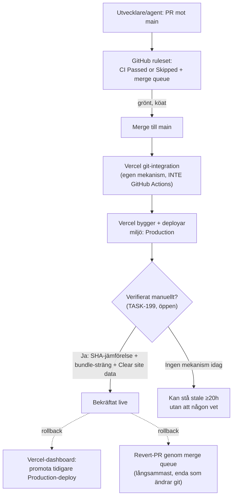
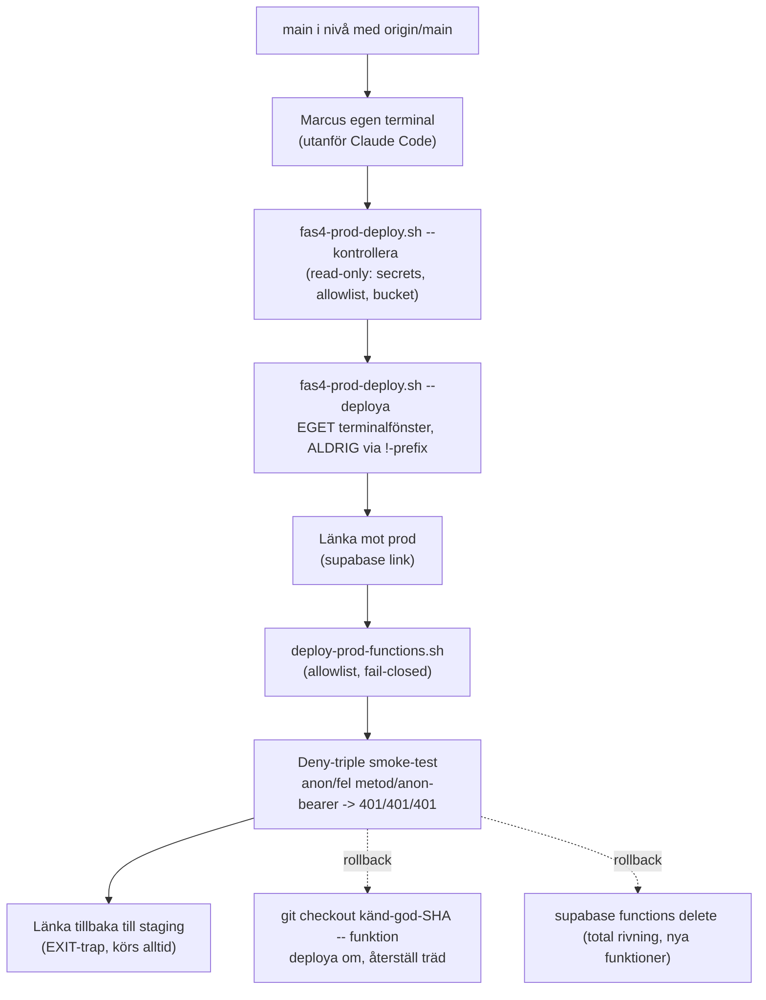
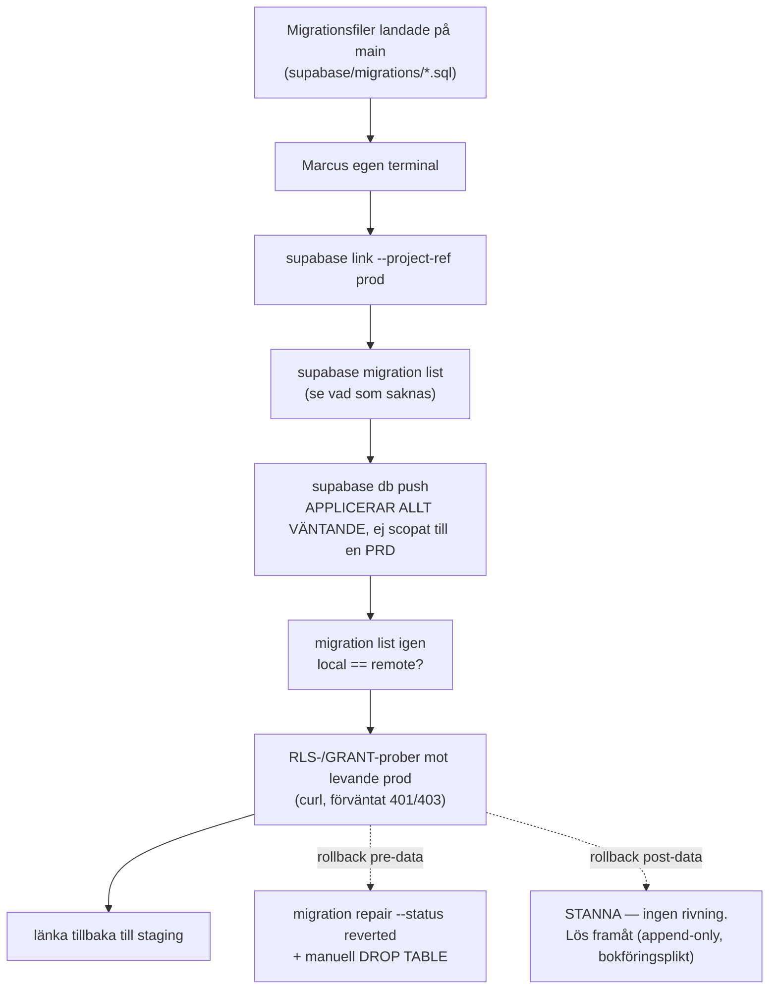
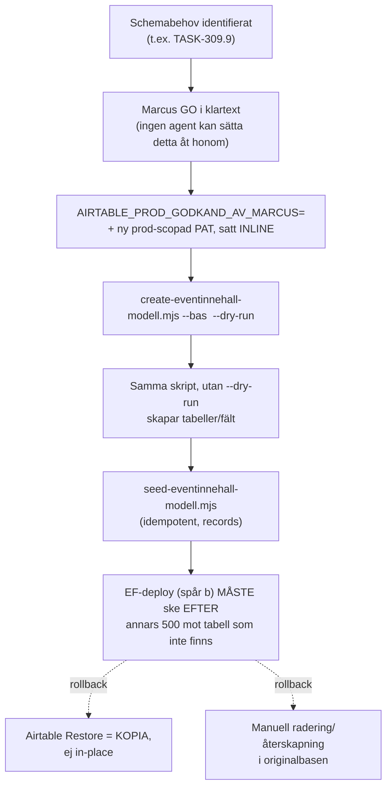

# J1e — Externa inställningar och deployvägar (GitHub, Vercel, Supabase, Airtable)

> **Proveniens:** skrivet av en `research-pass`-agent (modell: se § Rapport till
> orkestreraren) för Session 126:s CI-djupgranskning, 2026-09-17, som svar på
> Jobb 1e (uppdraget rad 50–104 i
> `tasks/sessions/bilagor/s126-uppdrag/uppdraget-verbatim.md`). Läste
> `00-agentkontrakt.md` i sin helhet före arbetet — metodkontraktet där gäller
> fullt ut. Ögonblicksbilden för repo-filer är `origin/main` på `eeca8c72`
> (2026-09-08). GitHub-, Dependabot- och Actions-mätningarna nedan är **live**,
> körda 2026-09-17 mellan ca 09:55–10:10 UTC, och gäller alltså ett senare
> ögonblick än filsnapshotten — det är avsiktligt: externa inställningar kan
> ha ändrats sedan `eeca8c72`, och den här filens uppdrag är att beskriva DEM,
> inte filträdet.

## Kort svar

**GitHub-grinden (ruleset + merge queue) är den bäst mekaniserade av de fyra
externa ytorna, och den stämmer i dag exakt med vad `CLAUDE.md`/`ADR-076`
påstår** — noll drift funnet vid en live-avläsning. Vercel (frontend) och
Airtable-schemaändringar har **ingen mekaniserad deploy-pipeline alls**: båda
är manuella handlingar utanför CI, och frontend-sidan bär en känd, öppen,
hög-prioriterad lucka (`TASK-199`, oförändrad sedan 2026-08-28) i att ens
VETA om en deploy faktiskt gick igenom. Supabase (databasmigrationer, Edge
Functions) har det bästa PROCESS-dokumentet av de fyra (två fullständiga
runbooks) men **noll mekanisk rollback var som helst i kedjan** — "rulla
tillbaka" betyder alltid en ny framåtriktad handling, aldrig ett CLI-kommando,
och detta är verifierat som en plattformsbegränsning (Supabase CLI:t saknar
subkommandot), inte en lucka i vår dokumentation.

Den avgörande skillnaden mellan ytorna är **var komplexiteten bor**: hos
GitHub bor den i en deklarativ, API-läsbar konfiguration (rulesets) som går
att verifiera mekaniskt på sekunder. Hos Vercel, Supabase och Airtable bor
motsvarande komplexitet i **lång, välskriven prosa** (runbooks, `.conf`-filer,
en agents minne av att köra rätt sekvens) — inget av det är fel i sig
(`ADR-050` avvisar uttryckligen automatiserad deploy "utan ett eget beslut"),
men det betyder att en läsare som bara frågar GitHub:s API får hela svaret på
sekunder, medan samma fråga till Vercel/Supabase/Airtable kräver att läsa
tusentals rader dokumentation och lita på att den hölls uppdaterad.

Ett fjärde fynd, utanför frågans ursprungliga ram men bärande: **`ADR-132`
(demoläget, "staging som maskinrum bakom en dörr i prod-appen") är Accepted
men INTE byggt.** `TASK-414` och samtliga sju skivor står `To Do`; inga
`demo-inloggning`/`aterstall-demo`-Edge Functions finns på disk. Den tredje
Vercel-adressen ADR:n beskriver existerar alltså inte i dag — det är en plan,
inte en driftsatt komponent, och ska inte läsas som nuläge.

## Vad jag läste först

**Läst i sin helhet innan mätning:**

- `docs/decisions/ADR-050-isolerad-staging-miljo.md` (isolerad
  Supabase-/Airtable-staging, beslutet att INTE bygga deploy-automatik "utan
  ett eget beslut" — direkt styrande för hela denna frågas dom).
- `docs/decisions/ADR-076-merge-grinden-ruleset-pr-flode.md` med samtliga tre
  amenderingsblock (2026-07-23, 2026-07-27, 2026-08-05) — den styrande
  merge-grinden, inklusive den redan dokumenterade historiken om
  `strict_required_status_checks_policy` och varför den stängdes av när
  merge queue aktiverades.
- `docs/decisions/ADR-091-hosting-deploy-vercel-pro.md` (Vercel-valet,
  Pro-kravet, CSP-falsifieringen) inklusive Updates-blocken.
- `docs/decisions/ADR-132-demolaget-staging-som-maskinrum-bakom-dorr-i-prod-appen.md`
  i sin helhet (352 rader) — visade sig vara en PLAN, inte en byggd komponent
  (se § Kort svar).
- `docs/reference/atkomst-och-nycklar.md` (591 rader) — Vercel CLI-identitet,
  Supabase-nyckelklasser, prod-provisioneringsvägen för Storage-bucketen,
  full historik för `INVITE_REDIRECT_URL`.
- `docs/reference/prod-driftsattning-runbook.md` (686 rader, aktivitetsloggen)
  och `docs/reference/prod-driftsattning-betalningsflodet-runbook.md`
  (1240 rader, betalningsflödet) — de två enda fullständigt genomförda
  prod-driftsättnings-runbooksen som finns i repot i dag, båda med explicita
  §-Rullbakåt-avsnitt.
- `docs/reference/staging-verifiering-runbook.md` (browser-QA mot staging,
  de sex fällorna).
- `scripts/fas4-prod-deploy.sh`, `.prod-functions-allowlist.conf`,
  `.prod-ref-policy.conf`, `.supabase-cli-policy.conf`,
  `.hemlighets-namn-policy.conf` — läst källkod, inte bara refererad prosa.
- `docs/research/prodbas-synk-staging-till-prod-2026-08-11.md` (618 rader,
  Airtable-schemadiff staging↔prod) — § Kort svar och § Delfråga 4.
- `tasks/go-live-plan.md`.

**Vad jag INTE hittade i `docs/research/` som redan besvarade denna exakta
fråga:** ingen befintlig fil kartlägger GitHub-rulesets, Vercel-miljöer och
Supabase-projekt SAMLAT som en enda extern-beroende-inventering — de
närliggande passen (`merge-queue-mot-staging-mutex-2026-07-26.md`,
`t95-r1-hosting-vercel-2026-08-02.md`, `fas4-ef-deploy-underlag-2026-08-17.md`,
`task-99-dequeue-enqueue-live-test-2026-08-01.md`) besvarar var sin
DELFRÅGA punktvis (bör vi aktivera merge queue, vilken hosting-plattform,
hur bygger vi deploy-skriptet, hur fungerar dequeue). Denna fil är alltså
en KOMPLETTERING och SAMMANSTÄLLNING, inte en duplicering — men flera av de
enskilda fakta jag citerar (t.ex. `strict`-avstängningen, allowlist-formen)
är redan grundligt dokumenterade där och återges här i destillerad form med
pekare till originalet, inte omskrivna från grunden.

**Ålder på det jag byggde vidare på:** `merge-queue-mot-staging-mutex-2026-07-26.md`
och `t95-r1-hosting-vercel-2026-08-02.md` är 6–7 veckor gamla vid denna
lednings datum. Jag har INTE läst dem i sin helhet (tidsbudget), men de
platsspecifika sakuppgifterna jag bygger vidare på (ruleset-ID, merge queue-
aktivering, Vercel Pro-beslutet) är alla omätta ANDRA GÅNGEN här, live, mot
dagens GitHub-API — ålder på ursprungsforskningen spelar därför mindre roll
för DENNA fils sanningshalt än för en fil som bara citerade dem.

## Metod

Alla GitHub-mätningar är **läsande `gh api`-anrop**, körda direkt mot
`api.github.com`, 2026-09-17. Kommandona och den destillerade utdatan står
inline i § Fynd. Jag har INTE kört några `vercel`- eller `supabase`-CLI-
kommandon i denna session: `mcp__vercel` är exkluderat ur `research-pass`-
agentens verktygslista (bekräftat mot min egen verktygslista vid start), och
Supabase-CLI:t kräver antingen prod-referensen (mekaniskt nekad för en agent
av `scripts/deny-prod-ref.sh`) eller en nyckelrings-inloggning vars närvaro i
DENNA färska worktree-session jag inte har verifierat och därför inte antar.
Vercel/Supabase-avsnitten nedan vilar därför på repots egen dokumentation
(runbooks, ADR:er, `atkomst-och-nycklar.md`) plus de GitHub-`deployments`-
poster som indirekt röjer Vercels beteende (creator `vercel[bot]`,
miljönamn, commit-SHA) — det är den enda Vercel-signal jag kunnat mäta
oberoende.

Jag har hållit mig till läsande anrop och undvikit att upprepa samma
GitHub-endpoint flera gånger (kontraktets sparsamhetskrav).

## Fynd

### 1. Fullständig komponentinventering

| Komponent | Funktion i dag | Problem den löser | Trigger | Beroenden | Unik signal | Merge-blockerande | Risk | Evidens | Rekommendation |
|---|---|---|---|---|---|---|---|---|---|
| GitHub ruleset `main-skydd` (id `19627609`) | Enda mekaniska grinden på `main`: PR-krav, required check, merge queue | Solo-repo utan klassisk branch protection (`ADR-076` § Kontext) | Varje push mot/PR mot `main` | `CI Passed or Skipped`-jobbet i `ci.yml:2538` måste finnas och matcha namn+app-ID | `enforcement: active`, `bypass_actors: []`, `current_user_can_bypass: never` | **Ja** — hela merge-vägen | Låg (verifierad live, oförändrad sedan 2026-08-05) | `gh api repos/high-five-group/miranon-media-admin/rulesets/19627609`, 2026-09-17 | Ingen — matchar avsikt exakt |
| — required check `CI Passed or Skipped` | Enda required status check | Skydda mot att en delmängd jobb glöms | Varje PR/kö-körning | `ci.yml`-aggregatorns jobbnamn + app-ID `15368` (GitHub Actions) | `integration_id: 15368` låser bort andra appar/tokens | Ja | Låg | `grep -n "CI Passed or Skipped" .github/workflows/ci.yml` → rad 2538 matchar; `gh api apps/github-actions` → id `15368` matchar | Ingen |
| — `merge_queue`-regeln | Sekvenserar landningar mot `main` + ersätter `strict` | Parallella PR:er som blir `BEHIND` innan de köas (`#747`/`#748`-incidenten) | När en PR armeras (`gh pr merge --auto`) | `grouping_strategy: ALLGREEN` kräver att varje köad post bygger grönt EGEN | `max_entries_to_merge: 3`, `min_entries_to_merge_wait_minutes: 5`, `check_response_timeout_minutes: 60` | Ja (styr ORDNINGEN, blockerar inte i sig) | Medel — en `HEADGREEN`-strategiändring skulle bryta `173.4`:s antagande om "en PR per kö-grupp" (se `CLAUDE.md` § Review-grinden) | Samma live-läsning | Bevaka strategifältet om rulesetet någonsin redigeras |
| — `required_status_checks.strict…: false` | Tillåter köning utan att branchen är up-to-date FÖRST | Deadlock: `strict` + kö = en PR som blir `BEHIND` innan kön hinner ta den kom aldrig in | — | Kön bär SAMMA garanti (`docs.github.com`-citatet i `ADR-076`) | `false`, ändrad 2026-08-05, oförändrad sedan dess (ruleset-historik, 8 versioner, senaste `version_id 45414903`) | — | Låg, men **återinförs manuellt om `merge_queue`-regeln någonsin tas bort** (`ADR-076` säger det explicit) | `.../rulesets/19627609/history` | Ingen nu; kom ihåg kopplingen vid framtida ruleset-redigering |
| Klassisk branch protection på `main` | Finns INTE | — | — | — | HTTP 404 `"Branch not protected"` | Nej (rulesets äger skyddet helt) | Ingen — avsiktligt, `ADR-076` § Alternativ avvisade klassisk branch protection | `gh api .../branches/main/protection` → 404, 2026-09-17 | Ingen |
| Org-rulesets (`high-five-group`) | Finns INTE (tom lista, inte ett åtkomstfel) | — | — | — | `[]`, HTTP 200 | Nej | Ingen | `gh api orgs/high-five-group/rulesets` → `[]` | Ingen — repo-rulesetet är den enda källan, vilket är enklare att resonera om |
| Repo-inställning `allow_auto_merge` | Tillåter `gh pr merge --auto` | Krav för hela landningsflödet | — | — | `true` | Indirekt (utan den fungerar inte armerings-flödet) | Ingen | `gh api repos/high-five-group/miranon-media-admin` | Ingen |
| Repo-inställning `delete_branch_on_merge` | Städar gren efter merge | Grenskuld (`TASK-310`s 289-gren-incident) | Varje merge | — | `true` | Nej | Ingen | Samma anrop | Ingen |
| Repo-inställning `allow_merge_commit`/`allow_squash_merge`/`allow_rebase_merge` | Alla TRE är `true` på repo-nivå | — | — | Rulesetets `allowed_merge_methods: ["merge"]` VINNER vid faktisk merge | Repo-nivån tillåter fler metoder än rulesetet faktiskt släpper igenom | Nej i praktiken (ruleset vinner) | **Latent drift, se § 2** | Samma anrop | Lås repo-nivån till bara `merge` för att undvika ett förvirrande GitHub-UI som erbjuder knappar som ändå fälls |
| Repo-inställning `allow_update_branch` | `false` | — | — | Overlappar delvis med `strict`-avstängningen | `false` | Nej | Låg — styr bara UI-knappen "Update branch", inte `gh pr update-branch`-kommandots funktion (**osäker**, ej djupverifierad denna session) | Samma anrop | Ingen — kräver inte akut åtgärd |
| Actions — `actions/permissions` | Actions PÅ, alla actions tillåtna | — | — | — | `allowed_actions: "all"`, `sha_pinning_required: false` | Nej | **Medel** — plattformen TVINGAR inte SHA-pinning; disciplinen är frivillig (se § 2) | Samma familj av anrop | Överväg `sha_pinning_required: true` som platt­forms-golv ovanpå den frivilliga konventionen |
| Actions — default workflow-behörighet | `GITHUB_TOKEN` default `read`, kan godkänna PR-reviews | Minsta-privilegium-golv | Varje workflow-körning som inte begär mer | Varje jobb som behöver skriva (t.ex. release, kommentarer) måste deklarera `permissions:` själv | `default_workflow_permissions: "read"` | Nej | Ingen — detta är branschgolvet | `gh api .../actions/permissions/workflow` | Ingen |
| Actions repo-secrets (8 st) | CI-testautentisering | — | Varje CI-körning som läser dem | `ci.yml`/`ci-suite.yml`s test-jobb | Namn: `STAGING_AIRTABLE_TOKEN`, `TEST_ADMIN_EMAIL`, `TEST_ADMIN_PASSWORD`, `TEST_REGISTRATION_RECORD_ID`, `TEST_SUPABASE_ANON_KEY`, `TEST_SUPABASE_URL`, `TEST_USER_EMAIL`, `TEST_USER_PASSWORD` | Nej direkt (men CI-jobb som saknar dem faller) | Ingen — räkningen matchar `ADR-077`s "8 Actions-secreterna" exakt | `gh api .../actions/secrets` | Ingen |
| Actions repo-variabler | Finns INTE (tom lista) | — | — | — | `{}` | Nej | Ingen | Samma familj | Ingen |
| Dependabot repo-secrets | Finns INTE | — | — | — | Tom lista | Nej | Ingen | `gh api .../dependabot/secrets` | Ingen |
| GitHub-miljöer `Preview`/`Production` | Deployment-bokföring, INGA skyddsregler | Vercel-integrationens egen spårning | Varje Vercel-bygge | — | `protection_rules: []`, `deployment_branch_policy: null`, båda skapade 2026-08-05T12:49:01Z | Nej — rena etiketter, ingen gate | **Låg risk men bör noteras:** vem som helst med push-rätt kan trigga en `Production`-deploy-etikett utan mänskligt godkännande — det är Vercels egen modell, inte en GitHub-miljö-approval-gate | `gh api .../environments`, `gh api .../environments/Production/secrets` → 0 | Överväg `required_reviewers` på `Production`-miljön OM man vill ha ett andra mänskligt steg mellan merge och prod-deploy (i dag finns inget) |
| Dependabot alerts | PÅ (`vulnerability-alerts` 204) | Sårbarhets-upptäckt | Beroendescan | — | **2 open, båda `high`**: `sharp` (libheif, GHSA-g89c-p67h-r497/GHSA-2jg2-4ch7-h545), `smol-toml` (DoS, öppnad 2026-09-11) | Nej (ingen mekanisk merge-koppling) | **Medel** — 6 dagar obesvarade vid mättillfället | `gh api .../dependabot/alerts?state=open` | Triagera de två `high`-larmen (se § Rekommendationer) |
| Dependabot security updates (auto-PR) | AV (`automated_security_fixes.enabled: false`) | — | — | — | `disabled` | Nej | Låg-medel — ingen auto-PR skapas för alerts ovan; åtgärd kräver manuellt Dependabot-PR eller `npm audit fix` | `gh api .../automated-security-fixes` + `security_and_analysis` | Bekräfta att detta är ett medvetet val (matchar repots manuella `t118-npm-advisory-remediering-praxis`-mönster) snarare än en glömd toggel |
| Secret scanning + push protection | PÅ (`enabled`, `enabled`) | Läckta nycklar i commits/pushar | Varje push | — | `secret_scanning_validity_checks: enabled`, `secret_scanning_non_provider_patterns: enabled` | Ja (push protection kan blockera en push) | Ingen | `security_and_analysis`-fältet | Ingen |
| CodeQL (`code-scanning/default-setup`) | PÅ via GitHubs EGET default-setup-läge, INTE via en fil i `.github/workflows/` | Statisk säkerhetsanalys | Veckovis (`schedule: weekly`) + push (`dynamic`-eventet Marcus mätning nämner) | Ingen fil i repot — ren plattformsinställning | `state: configured`, `languages: [actions, javascript, javascript-typescript, typescript]`, `threat_model: remote` | Nej (informativ, ingen required check kopplad) | **Medel** — en CI-läsare som bara grep:ar `.github/workflows/` kommer ALDRIG hitta CodeQL, eftersom den inte bor där | `gh api .../code-scanning/default-setup` | Dokumentera CodeQL:s existens i CI-kartan (Jobb 1) explicit — den är annars osynlig för alla som bara läser filträdet |
| Vercel-projektet `miranon-media-admin` | Bygger `main` → Production, varje PR/branch → Preview | Frontend-hosting (`ADR-091`) | Varje push (git-integration, INTE GitHub Actions) | `vercel.json` (rewrites, headers); `.vercel/project.json` lokalt (gitignorerat) | Team `marcus-johanssons-projects-1d6d2a3a`, projekt `miranon-media-admin` (källa: `atkomst-och-nycklar.md`, ej omätt av mig denna session) | **Nej i GitHub-mening** — parallell mekanism, ingen GitHub-check | **Hög** — `TASK-199` (öppen, High, senast rörd 2026-08-28): prod-fronten var mätt stale ≥20 h TROTS grön git-integration, ingen mekanism upptäckte det | `gh api .../deployments` visar `vercel[bot]` som creator för både `Preview` och `Production`, senaste `Production`-post SHA `eeca8c72` (matchar `origin/main`) | Se § Rekommendationer — bygg det verifikationskommando `TASK-199` redan efterfrågar |
| Supabase-projekt **staging** (`pqtshyierkdgwdnxuirz`) | Isolerad staging-databas + Airtable-spegel | `ADR-050` | CI-tester, manuella runbooks | `.env.staging`, CI-secrets | Skapat 2026-06-13, Postgres 17.6 (senast mätt 2026-08-30) | Nej (CI kör aldrig `supabase`-CLI:t mot den skarpt — verifierat noll träffar i workflow-filer, `.supabase-cli-policy.conf`) | Låg | `docs/reference/prod-driftsattning-runbook.md` § Projekt-referenserna; `.supabase-cli-policy.conf` | Ingen |
| Supabase-projekt **prod** (`lvjsfnphlauldxqlncpl`) | Skarp databas för Lottas data | — | Manuella runbooks, ALDRIG CI | `.env.production`, `.prod-ref-policy.conf` | Skapat 2026-03-30 (2,5 månader äldre än staging — explicit flaggat i betalningsflödets runbook som skäl att inte anta Postgres-paritet) | **Nej för agenter — mekaniskt omöjligt** (`scripts/deny-prod-ref.sh`) | Hanteras via processdisciplin, inte mekanik för den mänskliga operatören | Samma källor | Ingen ny — redan hårt reglerad |
| `.prod-functions-allowlist.conf` | Fail-closed allowlist för vilka Edge Functions som FÅR nå prod | Förhindra att en `test-*`-funktion av misstag hamnar i prod | Läses av `scripts/deploy-prod-functions.sh` | Varje ny EF måste läggas till MEDVETET | 60 rader kommentarer/historik, funktionsraderna själva ogrupperade i botten | Ja (för prod-EF-deploy) | Låg — väl beprövad, flera dokumenterade missar redan rättade (t.ex. `update-attachment-scope`) | Filen läst i sin helhet | Ingen |
| `.prod-ref-policy.conf` + `scripts/deny-prod-ref.sh` | Mekaniskt hindrar en agent från att rikta NÅGOT Bash-kommando mot Supabase prod-refen | Prod-driftsättning "är ett Marcus-beslut" (citat i runbooken) | Varje Bash-anrop en agent gör | Substräng-matchning på HELA kommandosträngen | `PROD_REF_PROD="lvjsfnphlauldxqlncpl"`, bypass kräver att skriva ut refen SJÄLV som miljövariabel-prefix | Ja (för agenter) | Låg | Filen läst i sin helhet + `scripts/fas4-prod-deploy.sh` läst i sin helhet | Ingen |
| Supabase Vault-hemligheter (betalningsflödet, prod) | Delad hemlighet cron→`jobb-konsument`, funktions-URL, anon-nyckel | `ADR-129` beslut 7 | Varje cron-tick (`pg_cron`, 10 s-intervall) | Namnen är LÅSTA av migrationens läsning av `vault.decrypted_secrets` | `jobbmotor_funktions_url`, `jobbmotor_anon_nyckel`, `jobbmotor_delad_hemlighet` | Ja — utan alla tre gör cron "fail-quiet" (tickar men gör ingenting) | Medel — kan bara verifieras via SHA-256-digest-jämförelse, aldrig läsas tillbaka | `docs/reference/prod-driftsattning-betalningsflodet-runbook.md` § Steg 4 | Ingen |
| Airtable-bas **staging** (`apphjj8Q7lkXCMsL4`) | Isolerad testdata + fixturer | `ADR-050` | CI-tester, `seed:review` | `STAGING_AIRTABLE_TOKEN` | 115 rader Eventplanering (111 `ZZ-`-fixturer), mätt 2026-09-06 | Nej | Låg | `ADR-132` § Kontext (mätning b) | Ingen |
| Airtable-bas **prod** (`app8uGPrVCVOm6LfD`) | Lottas skarpa data | — | Manuella skript, Marcus-GO | `AIRTABLE_PROD_GODKAND_AV_MARCUS`-miljövariabel (SKRIPT-INTERN gate, INGEN hook) | — | **Mekaniskt SPÄRRAD för agenter sedan `TASK-419`** (`scripts/deny-prod-airtable.sh`) — se § 3d | Låg för denna specifika bas TACK VARE den nya hooken; historiskt medel (skript-intern gate utan mekanik för schemaskript) | `CLAUDE.md` § Verktygsfakta, `atkomst-och-nycklar.md` § (a)/(b) | Ingen ny |

### 2. Drift mellan dokumentation och verklighet

**Ingen drift funnen på GitHub-rulesetets sakinnehåll.** Live-avläsningen av
`19627609` matchar `ADR-076`s VERBATIM-block rad för rad: fyra regler
(`deletion`, `non_fast_forward`, `pull_request`, `required_status_checks`)
plus `merge_queue`-regeln, `strict_required_status_checks_policy: false`,
`bypass_actors: []`, `required_approving_review_count: 0`,
`allowed_merge_methods: ["merge"]`. Ruleset-historiken visar ingen ändring
sedan 2026-08-05 (42 dagar innan denna mätning) — **starkast möjliga
bekräftelse att en dokumenterad ADR-amendering faktiskt är den sista som
skett**, verifierad **verifierad**, inte bara **starkt indikerad**.

**Latent, ej akut drift: repo-nivåns merge-metoder är bredare än vad som
faktiskt går igenom.** `allow_squash_merge: true` och `allow_rebase_merge:
true` står på repo-nivå trots att `ADR-076` beslut 6 (2026-07-25) uttryckligen
låste `allowed_merge_methods` till `["merge"]` på RULESET-nivå "eftersom
squash och rebase är inte längre valbara". Sakligt är beslutet ändå
verkställt — rulesetet vinner vid en faktisk merge, och `allowed_merge_methods`
är den mekanism som faktiskt filtrerar knapparna i GitHub:s PR-gränssnitt när
en ruleset gäller (GitHub applicerar skärningen mellan repo-inställning och
ruleset). Men repo-inställningen SJÄLV är aldrig ändrad, vilket betyder att
en framtida ändring eller borttagning av rulesetet tyst återaktiverar
squash/rebase som VALBARA metoder, utan att någon rört en repo-inställning
för att åstadkomma det. `ADR-076` nämner aldrig repo-nivåns eget
`allow_squash_merge`/`allow_rebase_merge`-fält.

**CodeQL är osynlig för en läsare som bara grep:ar filträdet.** Orkestrerarens
egen mätfakta i uppdraget ("workflow `CodeQL` med event `dynamic`") stämmer:
`code-scanning/default-setup` visar `state: configured`. Men detta är
GitHubs EGET, plattforms-hanterade default-setup-läge — det finns INGEN
`.github/workflows/codeql*.yml`-fil i repot (bekräftat: `ls .github/workflows/`
listar åtta filer, ingen av dem CodeQL-namngiven). En komplett CI-arkitektur-
karta (Jobb 1) som bara läser workflow-filer missar alltså denna grind helt —
det är precis den typ av "extern inställning som styr flödet men inte ligger
i repot" uppdraget efterfrågar.

**`ADR-132` beskriver en INTE byggd komponent, och det är lätt att läsa fel.**
ADR:n är `Status: Accepted` med Marcus-kvittens 2026-09-06, men "Accepted"
betyder här "vi ska bygga det så här", inte "det är byggt". `TASK-414`
(PRD:t) och samtliga sju döttrar (`414.1`–`414.7`) står `To Do`; `ls
supabase/functions/ | grep -iE "demo|aterstall"` gav noll träffar. En läsare
av `ADR-132` utan denna kontroll skulle kunna tro att en tredje Vercel-adress,
en `demo-inloggning`-EF i prod och en `aterstall-demo`-EF i staging redan
existerar. De gör inte det.

**`TASK-199` är fortfarande öppen och `High`, senast rörd 2026-08-28 —
19 dagar innan denna mätning.** `docs/reference/prod-driftsattning-
runbook.md` § Steg 6 kallar sitt eget verifikationssteg för "PRELIMINÄRT" i
väntan på just detta kort. Ingen mekanism i CI, Vercel eller GitHub upptäcker
i dag en stale prod-frontend automatiskt — den ENDA gången det hänt (mätt
≥20 timmar) upptäcktes av en människa som råkade jämföra bundlar för hand.

**`sha_pinning_required: false` på plattformsnivå, men repot pinnar ändå
manuellt.** Ett stickprov mot `ci.yml` (`actions/checkout`,
`actions/setup-node`, `lycheeverse/lychee-action`, `tj-actions/changed-files`)
visar samtliga fyra pinnade till fullständiga 40-tecken-SHA:er, inte
versionstaggar. Detta är alltså **ett FRIVILLIGT arbetssätt** (troligen
framtvingat av `actionlint` i CI — jag har inte djupverifierat den mekanismen,
det ligger i Jobb 1:s scope), inte en plattforms-framtvingad regel. Skillnaden
spelar roll: en ny bidragsgivare som lägger till ett nionde `uses:`-steg utan
SHA riskerar inte att fällas av GitHub självt, bara av den lokala
`actionlint`-konfigurationen (om den faktiskt kontrollerar detta — overifierat
av mig).

**Dependabot-larmen är sex dagar gamla vid mättillfället, utan synlig
åtgärd.** Orkestrerarens fakta ("2 vulnerabilities … 2 high") stämmer exakt
och är nu artnamngivna: `sharp` (libheif-CVE:er) och `smol-toml` (DoS).
`automated_security_fixes.enabled: false` betyder att GitHub inte
självmant öppnar en fix-PR för dessa — någon måste agera manuellt eller
uppdatera paketen för hand. Jag kan inte avgöra OM detta redan är triagerat
i en session jag inte sett (t.ex. ett beslut att vänta ut en cooldown, samma
mönster som `docs/research/t118-npm-advisory-remediering-praxis-2026-08-04.md`
beskriver för tidigare fall) — flaggat som osäkert, inte som ett fel.

### 3. Vägen till staging och produktion — fyra spår

Gemensamt för samtliga fyra: **`main`-grinden (GitHub-rulesetet) är den enda
mekaniska spärren som är gemensam för alla.** Vad som händer EFTER en merge
skiljer sig helt åt per spår — ingen av de tre andra (frontend, EF,
migrationer, Airtable) har en egen mekanisk merge-till-prod-grind.

#### (a) Frontend — Vercel, automatiskt men obevisat

**Automatiskt:** bygge och deploy triggas av Vercels git-integration direkt
på push till `main` — helt parallellt med, och oberoende av, GitHub Actions
CI. En grön `ci.yml`-körning säger ingenting om Vercel-byggets status.

**Manuellt:** ALL verifiering att deployen faktiskt gick igenom och är
FÄRSK. Interimsmetoden (`prod-driftsattning-runbook.md` § Steg 6): (1)
jämför senaste Production-deployens commit-SHA mot `origin/main`, (2) hämta
bundlens `index-*.js` och sök efter en sträng bara ny kod bär, (3) `Clear
site data` i en färsk browserkontext för att utesluta klient-cache.
**Smoke-test:** ingen automatiserad — röktestet är en människa som klickar
igenom en specifik ny funktion i prod.

**Rollback:** ingen kommandoväg. Tre alternativ i stigande ingrepp:
klientlokal cache-rensning (löser inte en verklig stale deploy), Vercel-
dashboardens "promota tidigare deploy" (rör bara fronten), eller en
revert-PR genom samma merge queue som allt annat (enda vägen som ändrar
sanningen i git). `TASK-199` är öppen just för att väg 2 och 3 saknar
DOKUMENTERAD kontroll — ingen av dem är någonsin körd och verifierad i en
runbook.

#### (b) Edge Functions — helt manuellt, mekaniskt låst för agenter

**Automatiskt:** ingenting. `ADR-050` beslutar uttryckligen att ingen
deploy-automatik ska byggas för Edge Functions "utan ett eget beslut", och
det beslutet är aldrig fattat.

**Manuellt, och mekaniskt SPÄRRAT för agenter:** `scripts/deny-prod-ref.sh`
matchar prod-referensen (`lvjsfnphlauldxqlncpl`) som en RÅ SUBSTRÄNG i HELA
Bash-kommandosträngen, oavsett subkommando — en agent kan alltså inte ens
KÖRA `--kontrollera` (read-only) mot prod. `fas4-prod-deploy.sh` kräver
dessutom rent träd, `main`-gren och nivå med `origin/main` som EGNA
preflight-kontroller, oberoende av låset.

**Smoke-test:** deny-triple (anon → 401, fel metod → 401, anon-bearer → 401)
per funktion — dokumenterad, återanvänd form (`T39` §6) men körd MANUELLT
efter varje deploy, ingen CI-koppling.

**Rollback:** **verifierat att Supabase CLI:t saknar en
rollback-till-föregående-version helt** (`prod-driftsattning-runbook.md`:
`functions`-subkommandot har bara `list`, `delete`, `download`, `deploy`,
`new`, `serve` — ingen `rollback`/`revert`). De två enda vägarna är att
checka ut en känd god commit och deploya om den koden, eller att radera
funktionen helt (bara säkert för funktioner som är NYA i den aktuella
driftsättningen — betalningsflödets runbook flaggar explicit att radering
av `jobb-konsument` är mer riskabelt än vid aktivitetsloggen, eftersom cron
då ringer en 404:a var 10:e sekund).

#### (c) Databasmigrationer — `db push`, applicerar allt väntande

**Automatiskt:** ingenting — samma `ADR-050`-beslut som (b).

**Manuellt, och en dokumenterad fälla:** `db push` är INTE scopad till en
enskild PRD/skiva — den applicerar VARJE migration som ännu inte är
registrerad som körd mot det länkade projektet (`Fälla #4` i
betalningsflödets runbook). En operatör som tror sig driftsätta EN feature
kan alltså av misstag applicera flera väntande migrationer på samma gång.

**Smoke-test:** direkta `curl`-anrop mot PostgREST med anon-nyckeln,
förväntade svar 401 (ingen identitet) och 403 (identitet utan rättighet) —
en `200`/`201` STOPPAR driftsättningen omedelbart per runbookens egen regel.

**Rollback:** **mekaniskt möjlig ENDAST före verklig data finns.**
`migration repair --status reverted` (uppdaterar historiktabellen) plus
manuell `DROP TABLE` är väl beprövat (två fullständiga exempel, båda
runbooks). Men EFTER att en verklig rad finns — särskilt kvitton, som är
append-only av bokföringsskäl (SFL 39 kap. 5 §, citerat i runbooken) —
**är regeln uttryckligen "STANNA, riv ingenting reflexmässigt".** Det finns
alltså inget scenario där en prod-databas med verklig data "rullas
tillbaka" i vanlig mening; åtgärder sker alltid framåt (makulera, korrigera).
`supabase migration down --linked --last N` EXISTERAR men är enligt
runbooken "oprövad mot vårt prod-projekt och betydligt trubbigare" och
används därför inte.

#### (d) Airtable-schemaändringar — skript-intern gate, ingen mekanisk hook för schemat självt

**Automatiskt:** ingenting.

**Manuellt, med en gate som är SKRIPT-INTERN, inte en hook.**
`AIRTABLE_PROD_GODKAND_AV_MARCUS` är en miljövariabel-kontroll SOM SKRIPTEN
`create-eventinnehall-modell.mjs`/`seed-eventinnehall-modell.mjs` själva
läser — `atkomst-och-nycklar.md` säger det uttryckligen: "ingen hook, inget
deny-skript (grep-verifierat)". Det betyder att skyddet mot en OAVSIKTLIG
skrivning till prod-Airtable via DESSA skript vilar helt på att skriptet
läser rätt kod, inte på ett harness-lager. **UNDANTAGET är EF-vägen till
prod-Airtable-BASEN som DATA-källa** (inte schema): `scripts/deny-prod-
airtable.sh` (`TASK-419`, 2026-09-07) nekar mekaniskt varje
`mcp__airtable__*`-anrop mot prod-bas-ID:t oavsett anropare, och varje
`mcp__claude_ai_Airtable__*`-anrop från en SUBAGENT. Det är en ANNAN yta än
schema-skripten ovan.

**Smoke-test:** research-passet `prodbas-synk-staging-till-prod-2026-08-11.md`
etablerade en "read-probe per ny yta"-metod (§ Verifikationsplan) —
men det är ett ENGÅNGS-forskningspass, inte ett återanvändbart skript i
`scripts/`.

**Rollback:** **verifierat att Airtables egen Restore-funktion skapar en
KOPIA, aldrig en in-place-återställning** (`data-model.md` punkt 20,
`airtable-constraints.md` punkt 400, båda oberoende källor som säger samma
sak). Rollback av en delvis skriven schemaändring kräver alltså MANUELL
radering/återskapning i ORIGINALBASEN — det finns ingen "ångra"-knapp.

### 4. Hemligheter och beroenden

| Namn | Var den bor | Vilka jobb/funktioner använder den |
|---|---|---|
| `STAGING_AIRTABLE_TOKEN` | GitHub repo-secret | CI-tester mot staging-Airtable |
| `TEST_ADMIN_EMAIL` / `TEST_ADMIN_PASSWORD` | GitHub repo-secret | Acceptance-/E2E-inloggning som admin |
| `TEST_USER_EMAIL` / `TEST_USER_PASSWORD` | GitHub repo-secret | Acceptance-/E2E-inloggning som vanlig användare |
| `TEST_REGISTRATION_RECORD_ID` | GitHub repo-secret | Fixturreferens i tester |
| `TEST_SUPABASE_URL` / `TEST_SUPABASE_ANON_KEY` | GitHub repo-secret | CI:s Supabase-anrop mot staging |
| `INVITE_REDIRECT_URL` | Supabase secrets, BÅDA projekten | `invite-user`-EF (redirectTo vid inbjudan) |
| `CORS_ALLOWED_ORIGINS` | Supabase secrets, BÅDA projekten | `_shared/cors.ts`, alla EF:er med webbläsaranrop |
| `DOCRAPTOR_API_KEY` | Supabase secrets, BÅDA projekten | 4 EF:er i PDF-mallmotorn (kvitto/bilaga) |
| `JOBBMOTOR_DELAD_HEMLIGHET` | Supabase secrets + `vault.decrypted_secrets`, prod | `jobb-konsument`, `koa-kvitton` (jobbmotorns HMAC-liknande handskakning) |
| `RESEND_API_KEY` / `RESEND_FROM` | Supabase secrets, BÅDA projekten | 6 mail-utskicksfunktioner |
| `ADMIN_EMAILS` | Supabase secrets, BÅDA projekten | 3 EF:er (adminmail-mottagare) |
| `AIRTABLE_TOKEN` / `AIRTABLE_BASE_ID` | Supabase secrets, BÅDA projekten | `_shared/airtable-client.ts` (9 anropsställen) |
| `ENVIRONMENT` | Supabase secrets, BÅDA projekten | 9 EF:er (miljömedveten gren, t.ex. vattenstämpel/testkvitto) |
| `SUPABASE_URL` / `SUPABASE_ANON_KEY` / `SUPABASE_SERVICE_ROLE_KEY` | Injiceras av PLATTFORMEN, syns aldrig i `secrets list` | Alla EF:er (runtime-given) |
| `VITE_SUPABASE_URL` / `VITE_SUPABASE_ANON_KEY` | Committade mode-filer (`.env.staging`/`.env.production`) — publika per design | Klientbygget, per miljö |
| `VITE_FEATURE_BETALNINGAR` | Vercel env-var, satt per miljö (frånvarande i produktion tills GO) | `src/lib/funktionsflaggor.ts` — kräver ny `vercel --prod` för att slå igenom (Vite bakar in vid byggtid) |
| Vercel CLI-inloggning | Vercel CLI:ts egen auth-lagring | `vercel`-kommandon, Marcus egen körning |
| Supabase CLI-inloggning | macOS-nyckelring (`Supabase CLI`) | `npx supabase …` i alla runbooks |
| `jobbmotor_funktions_url` / `jobbmotor_anon_nyckel` / `jobbmotor_delad_hemlighet` | Postgres Vault, PER miljö | `jobb_cron_tick()` (cron→EF-anrop) |

**Ingen av dessa värden är läst eller citerad i klartext i denna fil** —
tabellen ovan bär namn, plats och konsument, aldrig ett värde, per
agentkontraktets regel.

## Osäkerheter och vad jag inte kunde belägga

- **Vercel-projektets exakta nuvarande miljövariabel-lista, byggkonfiguration
  och plan-status** — **ej verifierbar av mig i denna session**:
  `mcp__vercel` är exkluderat ur `research-pass`-agentens verktygslista, och
  jag har ingen lokal `vercel`-CLI-inloggning att förlita mig på i denna
  worktree. Det som krävs för att fylla luckan: antingen en agent med
  `mcp__vercel` tillgängligt, eller Marcus egen `npx vercel env ls
  production`/`npx vercel project ls`-körning.
- **Om GitHub-miljöerna `Preview`/`Production` verkligen ägs helt av Vercels
  integration** är **starkt indikerad**, inte **verifierad** — jag härleder
  det ur att `creator.login` för samtliga senaste 20 deployments är
  `vercel[bot]` och att miljönamnen matchar Vercels egen konvention, men jag
  har inte sett Vercel-sidans egen konfiguration som bekräftar bindningen.
- **Huruvida `actionlint` (eller något annat CI-jobb) FAKTISKT framtvingar
  SHA-pinning** av `uses:`-rader är **osäker** — jag har bara stickprovat
  att fyra rader RÅKAR vara pinnade, inte läst grindens regel-konfiguration
  (det ligger i Jobb 1:s CI-arkitektur-scope).
- **Om GitHub-appen med `checks:write` som `ADR-076` nämner ("repot har en
  andra app … installerad") fortfarande är installerad** är **ej
  verifierbar av mig** i detta pass — jag bekräftade bara att app `15368`
  (GitHub Actions) är den bundna checken; jag frågade inte
  `/installations`-listan (kräver troligen bredare behörighet än
  `gh api` gav mig sparsamt utrymme att pröva, och kontraktet ber om
  sparsamhet).
- **Airtable-basernas LIVE schema- och automationsstatus per 2026-09-17** —
  jag har byggt på `prodbas-synk-staging-till-prod-2026-08-11.md` (37 dagar
  gammal) och `ADR-132`s mätning från 2026-09-06 (11 dagar gammal), men har
  inte själv kört en ny live-diff. Airtable MCP-verktygen finns inte i min
  verktygslista denna körning heller.
- **Om Dependabot-larmen `#3`/`#4` redan är medvetet triagerade** (väntar på
  cooldown, blockerade av en uppströms-fix, etc.) — **ej verifierbar**, jag
  hittade ingen backlog-post eller sessionsanteckning som nämner `sharp`
  eller `smol-toml` vid namn i mitt sökfönster.
- **`allow_update_branch: false`s faktiska effekt på `gh pr update-branch`**
  (om kommandot ändå fungerar, eller om repo-inställningen blockerar det) —
  **osäker**, inte djuptestad i detta pass.

## Risker

1. **Frontend-driftens osynlighet (`TASK-199`) är den enskilt största
   risken i hela denna inventering.** Vercel-deployen sker HELT utanför
   GitHub Actions CI:s synfält. En trasig eller stale prod-bygge upptäcks i
   dag bara av en människa som råkar leta efter symptomet.
2. **Skript-intern gate (Airtable-schema) är svagare än en hook.** Så länge
   `AIRTABLE_PROD_GODKAND_AV_MARCUS` bara existerar i skriptens egen kod och
   inte som en `PreToolUse`-hook, skyddar den bara mot MISSTAG via DESSA
   specifika skript — ett nytt, framtida skript som skriver mot Airtable-
   schemat utan att implementera samma kontroll ärver inget skydd
   automatiskt.
3. **Repo-nivåns bredare merge-metoder är en tyst enkelpunkts-risk.** Skulle
   `main-skydd`-rulesetet någonsin tas bort (nödvägen `CONTRIBUTING.md`
   redan dokumenterar för andra skäl) återgår merge-knapparna omedelbart
   till att erbjuda squash/rebase, eftersom repo-nivån aldrig själv låstes.
4. **Dependabots två `high`-larm är obesvarade sex dagar in.** Ingen
   auto-fix-PR skapas (`automated_security_fixes: false`), så åtgärden
   kräver en medveten handling som inte syns ha skett än.
5. **CodeQL:s osynlighet i filträdet är en dokumentationsrisk, inte en
   säkerhetsrisk.** Den kör redan; risken är att en framtida
   arkitektur-genomgång (som denna) missar att nämna den om ingen aktivt
   letar utanför `.github/workflows/`.

## Rekommendationer

Markerat som rekommendation, inte beslut — Marcus väger.

1. **Lås repo-nivåns `allow_squash_merge`/`allow_rebase_merge` till `false`**
   så att GitHub:s egen konfiguration matchar `ADR-076` beslut 6 på BÅDA
   nivåer, inte bara den som råkar vinna i dag. Litet, reversibelt,
   verifierbart med samma `gh api`-anrop som denna fil redan använder.
2. **Bygg det verifikationskommando `TASK-199` redan efterfrågar** — en
   mekanisk jämförelse mellan senaste `Production`-deployens SHA (redan
   läsbar via `gh api .../deployments`) och `origin/main`, körbar t.ex. som
   en nightly-vakt. Detta är den högst prioriterade luckan i hela denna
   inventering.
3. **Triagera Dependabot-larmen `#3` (`smol-toml`) och `#4` (`sharp`)**
   explicit — antingen uppdatera, dokumentera en medveten väntan (cooldown,
   uppströms-fix), eller avfärda med skäl, i linje med repots egen
   `t118-npm-advisory-remediering-praxis`.
4. **Dokumentera CodeQL:s existens i Jobb 1:s CI-arkitekturkarta explicit**,
   med en rad om att den styrs via GitHubs eget UI/API och inte via en fil i
   `.github/workflows/` — annars förblir den en systematisk blind fläck för
   varje framtida läsare som bara grep:ar workflow-filer.
5. **Överväg en `required_reviewers`-regel på GitHub-miljön `Production`**
   om ett andra mänskligt godkännande mellan merge och prod-frontend-deploy
   någonsin blir önskvärt — i dag finns noll gate där, vilket är en medveten
   Vercel-modell (kontinuerlig deploy), inte ett misstag, men värt att
   ha synligt som ett ALTERNATIV snarare än ett outtalat nuläge.

## Rapport till orkestreraren

- **Modell:** enligt egen systemprompt: *"You are powered by the model
  named Sonnet 5. The exact model ID is claude-sonnet-5."*
- **Gren och commit:** `docs/s126-ci-djupgranskning`-worktreen, filträdets
  ögonblicksbild `origin/main @ eeca8c72` (2026-09-08); GitHub-mätningarna i
  denna fil är LIVE, 2026-09-17.
- **Grindar:** `npx markdownlint-cli2` och `vale` körda riktat mot denna
  fil (se nedan för resultat) — `npm run check:docs` MEDVETET INTE körd,
  per kontraktet.

## Källor

- Live GitHub API-mätningar, `gh api` mot `api.github.com`, samtliga körda
  2026-09-17 (kommandona står inline i § Fynd; endpoints:
  `repos/high-five-group/miranon-media-admin/rulesets[/19627609[/history]]`,
  `.../branches/main/protection`, `orgs/high-five-group/rulesets`,
  `orgs/high-five-group`, `repos/.../actions/permissions[/workflow]`,
  `repos/.../actions/secrets`, `repos/.../actions/variables`,
  `repos/.../dependabot/secrets`, `repos/.../environments[/…/secrets]`,
  `repos/.../code-scanning/default-setup`, `repos/.../vulnerability-alerts`,
  `repos/.../automated-security-fixes`, `repos/.../dependabot/alerts`,
  `repos/.../deployments`, `apps/github-actions`).
- `docs/decisions/ADR-050-isolerad-staging-miljo.md`
- `docs/decisions/ADR-076-merge-grinden-ruleset-pr-flode.md`
- `docs/decisions/ADR-091-hosting-deploy-vercel-pro.md`
- `docs/decisions/ADR-132-demolaget-staging-som-maskinrum-bakom-dorr-i-prod-appen.md`
- `docs/reference/atkomst-och-nycklar.md`
- `docs/reference/prod-driftsattning-runbook.md`
- `docs/reference/prod-driftsattning-betalningsflodet-runbook.md`
- `docs/reference/staging-verifiering-runbook.md`
- `docs/research/prodbas-synk-staging-till-prod-2026-08-11.md`
- `tasks/go-live-plan.md`
- `scripts/fas4-prod-deploy.sh`, `.prod-functions-allowlist.conf`,
  `.prod-ref-policy.conf`, `.supabase-cli-policy.conf`,
  `.hemlighets-namn-policy.conf`
- `backlog/tasks/task-199…`, `backlog/tasks/task-414…` (status läst via
  `npx backlog task <id> --plain`, 2026-09-17)
- `.github/workflows/ci.yml` (radnummer citerade: 2538 aggregator-jobbnamn)
- `CLAUDE.md` (projektets, § Prod-EF-deploy, § Landning, § Verktygsfakta)
